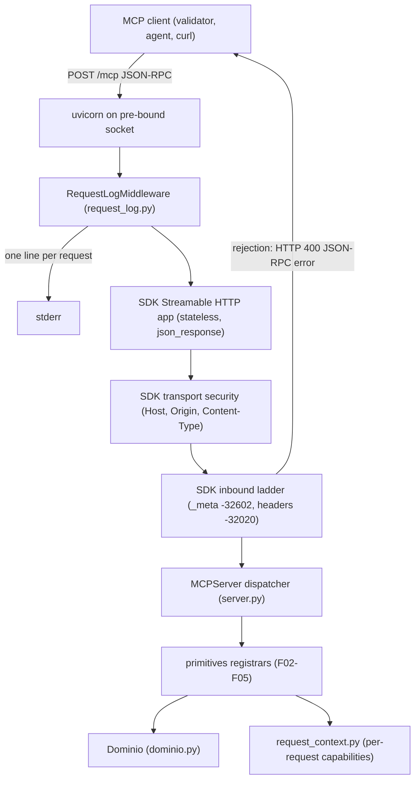
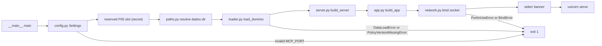

# Technical Specification: MCP Server Foundation

**Complexity:** medium

## 1. Technical Overview

### What

F01 bootstraps the `servidor-mcp/` Python project and delivers a running MCP server process, `central-de-salas` `1.0.0`, built on the official `mcp` Python SDK v2 (`MCPServer`) and aligned with spec revision `2026-07-28`. The process serves one Streamable HTTP endpoint, `POST /mcp`, on `127.0.0.1:7301` (overridable through `MCP_HOST` / `MCP_PORT`), in stateless mode with plain `application/json` bodies. It loads `dados/salas.json`, `dados/reservas.json` and `dados/politica-de-uso.md` once at startup into in-memory domain objects, writes one stderr line per received request (including rejected and unparseable ones), and exits with code `1` and an exact Portuguese message on any startup failure.

F01 registers no tool and no resource itself. It defines the extension point where F02–F05 register their primitives, and the accessors through which they reach the domain objects and the per-request client capabilities.

### Why

- Every later server feature (F02–F05) needs the same transport, the same envelope validation and the same in-memory domain. Building them once, behind explicit module boundaries, prevents four features from each re-deciding how the domain is reached or how a request is validated.
- The `2026-07-28` per-request envelope (`_meta` with `io.modelcontextprotocol/protocolVersion` and `io.modelcontextprotocol/clientCapabilities`), the header mirroring (`MCP-Protocol-Version`, `Mcp-Method`, `Mcp-Name`) and the HTTP status mapping are already enforced by the SDK's inbound validation ladder. F01's job is to configure the SDK so that ladder is active and the responses are JSON (not SSE), and to keep it enabled — not to re-implement it.
- The validator and the evaluator observe the server through two channels only: the JSON body and stderr. The request log must therefore see every request, including those the SDK rejects before dispatch, which is why it lives outside the SDK.

### Scope

**Included (PRD F01 Capabilities, Experience and Error Handling — full scope, no Core/Full split):**
- `servidor-mcp/` project: `pyproject.toml` with every direct dependency pinned with `==`, src-layout package `servidor_mcp`, entry points `python -m servidor_mcp` and console script `servidor-mcp`, development extras for tests
- Runtime configuration from environment: `MCP_HOST`, `MCP_PORT`, optional `MCP_DADOS_DIR`, and a reserved raw slot for `REQUEST_STATE_SECRET` (read, never validated nor used by F01)
- Resolution of the `dados/` directory relative to the repository root, independent of the current working directory
- Read-only loading of the three domain files into: room catalog, reservation ledger (seeded, in memory, append-capable), policy text (verbatim) and policy version (parsed from the first line)
- `MCPServer` factory with `serverInfo` `{"name": "central-de-salas", "version": "1.0.0"}`, `tools` and `resources` capabilities, and a registration hook (`primitives` registry) for F02–F05
- Streamable HTTP ASGI app on `/mcp`: `stateless_http=True`, `json_response=True`, SDK inbound ladder (`-32602` + HTTP `400` for missing `_meta` keys, `-32020` for header mismatch) kept enabled
- Request log ASGI middleware writing `mcp method=<method> id=<id> name=<tool or uri or -> traceparent=<value or ->` to stderr before each request is processed
- Per-request client-capability accessors for F05
- Startup sequence: pre-bound listening socket, port-in-use detection, startup banner on stderr, exit codes
- Root `.gitignore` additions for build and test artifacts produced by the new project

**Output contracts (PRD F01 Provides):**

| PRD Provides item | Exposed as | Module | Consumers |
|---|---|---|---|
| MCP endpoint `/mcp` answering `tools/list` with every registered tool | SDK `tools/list` over the app built by `build_app`; tools come from the registrars in `REGISTRARS` | `server.py`, `app.py`, `primitives/__init__.py` | F06 |
| Room catalog (id, nome, capacidade, recursos) | `Dominio.catalogo` (`CatalogoDeSalas` of `Sala`, file order, lookup by id) | `dominio.py` | F02, F03, F05 |
| Reservation ledger (id, sala, inicio, fim, responsavel) | `Dominio.reservas` (`LivroDeReservas` of `Reserva`, seeded, append-only) | `dominio.py` | F03, F04 |
| Policy document text, verbatim | `Dominio.politica.texto` | `dominio.py` | F02 |
| Declared policy version | `Dominio.politica.versao` (e.g. `2026-11-01`) | `dominio.py` | F04 |
| Validated per-request client capabilities | `client_capabilities(ctx)` and `declares_form_elicitation(ctx)` | `request_context.py` | F05 |

**Input contracts (PRD F01 Consumes):** none. F01 depends on no other feature. Its only inputs are the three read-only files in `dados/` and environment variables.

**Excluded / deferred to other features:**
- Tools `listar_salas`, `consultar_disponibilidade`, `reservar_sala` and resource `politica://uso` (F02–F05). Until F02 lands, `tools/list` returns an empty `tools` array.
- `REQUEST_STATE_SECRET` validation, the startup abort on a short or missing secret, and construction of the SDK `RequestStateSecurity` (F05). F01 only reserves the configuration slot and a pass-through parameter.
- Timestamp parsing, policy rules and conflict detection (F03); reservation id generation (F04).
- The delivery README and the documented install command (F10). F01 records the install requirement F10 must document (editable install, Section 3.2 item A6).

### Requirements (from PRD Capabilities and Experience)

| ID | Requirement | PRD source |
|---|---|---|
| R1 | Python ≥ 3.10; official `mcp` SDK v2; all direct dependencies pinned with `==` in `servidor-mcp/pyproject.toml`; installable with `pip` in a `venv` | Capabilities 1 |
| R2 | Single Streamable HTTP endpoint `/mcp`; port `7301` (env `MCP_PORT`); bind host `127.0.0.1` (env `MCP_HOST`) | Capabilities 2 |
| R3 | No `initialize` required, no `Mcp-Session-Id`, no server-initiated requests; each request processed only from its own body and headers | Capabilities 3 |
| R4 | Responses are plain `application/json` (no SSE framing); every successful result carries `resultType` | Capabilities 4 |
| R5 | `tools` and `resources` capabilities declared; `serverInfo` `{"name": "central-de-salas", "version": "1.0.0"}` | Capabilities 5 |
| R6 | Missing `io.modelcontextprotocol/protocolVersion` or `io.modelcontextprotocol/clientCapabilities` in `_meta` → `-32602` with HTTP `400`; never inferred from earlier requests | Capabilities 6 |
| R7 | `MCP-Protocol-Version`, `Mcp-Method` and (for `tools/call`, `resources/read`) `Mcp-Name` must match the body; mismatch → `-32020` (SDK behavior kept enabled) | Capabilities 7 |
| R8 | One stderr line per received request, including rejected ones, `mcp method=<method> id=<id> name=<tool or uri or -> traceparent=<value or ->`, written before processing; never via the MCP logging notification | Capabilities 8, Experience 3 |
| R9 | Domain data read once at startup from `dados/`, never written; ledger in memory, lost on restart | Capabilities 9 |
| R10 | `dados/` resolved relative to the repository root, independent of the current working directory | Capabilities 10 |
| R11 | Startup prints to stderr the listening URL, the number of rooms (5), of seeded reservations (2) and the policy version (`2026-11-01`) | Experience 2 |

**Request flow (Experience 3–4):** client `POST /mcp` → request log line on stderr → SDK transport security (Host, Origin, Content-Type) → SDK inbound ladder (`_meta` keys, then headers, then protocol version) → SDK dispatch to the registered handler → JSON body. A ladder rejection short-circuits with HTTP `400` and a JSON-RPC error; the log line was already written.

**Startup flow (Experience 1–2):** load configuration → (reserved F05 slot: secret validation) → resolve `dados/` → load domain → build server and app → bind socket → print banner → serve until SIGINT/SIGTERM.

## 2. Architecture Impact

### Affected components

| Path | Role |
|---|---|
| `servidor-mcp/pyproject.toml` | Project manifest, pinned dependencies, entry points, pytest configuration |
| `servidor-mcp/src/servidor_mcp/__init__.py` | Package marker and version |
| `servidor-mcp/src/servidor_mcp/__main__.py` | Process entry point and startup sequence |
| `servidor-mcp/src/servidor_mcp/config.py` | Environment configuration |
| `servidor-mcp/src/servidor_mcp/paths.py` | Repository root and `dados/` resolution |
| `servidor-mcp/src/servidor_mcp/mensagens.py` | Exact user-facing strings (startup errors, banner) |
| `servidor-mcp/src/servidor_mcp/dominio.py` | In-memory domain types |
| `servidor-mcp/src/servidor_mcp/loader.py` | Reading and validating the three domain files |
| `servidor-mcp/src/servidor_mcp/server.py` | `MCPServer` factory and identity constants |
| `servidor-mcp/src/servidor_mcp/primitives/__init__.py` | Registration hook for F02–F05 |
| `servidor-mcp/src/servidor_mcp/request_context.py` | Per-request client-capability accessors |
| `servidor-mcp/src/servidor_mcp/request_log.py` | Request log ASGI middleware |
| `servidor-mcp/src/servidor_mcp/app.py` | ASGI app assembly (SDK app + middleware) |
| `servidor-mcp/src/servidor_mcp/network.py` | Listening socket creation and port-in-use detection |
| `servidor-mcp/tests/**` | Unit and integration tests (Section 7) |
| `.gitignore` (repo root) | Ignore `*.egg-info/` and `.pytest_cache/` |
| `servidor-mcp/.gitkeep` | Removed (folder no longer empty) |

### Request path



### Startup path



## 3. Technical Decisions

| Decision | Chosen Approach | Alternative Considered | Trade-off |
|---|---|---|---|
| Server API | High-level `MCPServer` (`from mcp.server.mcpserver import MCPServer`), name `central-de-salas`, `version="1.0.0"` | Low-level `mcp.server.Server` with `on_*` handlers | High-level server also advertises `prompts` (with zero prompts) by default; accepted because it gives decorators, `outputSchema` generation and resolver-based MRTR that F02–F05 need |
| Transport mode | `streamable_http_app(streamable_http_path="/mcp", stateless_http=True, json_response=True, host=MCP_HOST)` | SSE responses (`json_response=False`) | No progress or back-channel per request; required anyway because the validator parses raw JSON and MRTR replaces server-initiated requests |
| Envelope and header validation | Rely on the SDK inbound ladder (`classify_inbound_request`) and its `ERROR_CODE_HTTP_STATUS` mapping | Custom pre-validation middleware | F01 inherits the SDK's exact messages and ordering (`_meta` checked before headers); the id echoed in ladder errors is SDK-defined (A16) |
| Request logging | Pure ASGI middleware wrapping the SDK app, buffering the body and replaying it | SDK `server.middleware` (provisional API, runs on decoded messages after the transport) | Middleware must buffer the body once; in exchange it sees parse errors and ladder rejections that never reach the SDK dispatcher |
| Domain access for F02–F05 | Explicit dependency injection: each feature module exposes `register(server, dominio)`; `primitives.REGISTRARS` lists them in order | Module-level singleton / global state | One more parameter per registrar; no hidden globals, each test builds an isolated server with a fresh domain |
| Listening socket | Bind the socket in `network.py`, then hand it to uvicorn (`sockets=[sock]`) | Let uvicorn bind (`host`/`port`) | Slightly more code; gives the exact `Porta <port> em uso...` message and exit code `1` instead of uvicorn's generic error |
| `dados/` location | `MCP_DADOS_DIR` override → first ancestor of the package file containing `dados/` and `servidor-mcp/` → same search from the current working directory → `<cwd>/dados` | `Path(__file__)` fixed parent count | Works for editable installs and source runs from any cwd; a non-editable install only works when launched from inside the repository (F10 documents editable install) |
| Process noise on stderr | `MCPServer(log_level="WARNING")`; uvicorn `log_level="warning"`, `access_log=False` | Defaults (INFO + access log) | Only F01's banner, F01's request lines and genuine warnings reach stderr; uvicorn's startup info line is suppressed |

### 3.1 SDK facts relied upon

Confirmed through the SDK v2 documentation (py.sdk.modelcontextprotocol.io/v2) during spec writing:

| Fact | Evidence |
|---|---|
| `streamable_http_app(*, streamable_http_path="/mcp", json_response=False, stateless_http=False, ..., transport_security=None, host="127.0.0.1")` returns a Starlette app with its own lifespan | `mcp/server/mcpserver/server` API page |
| `json_response=True` answers each POST with a single JSON body instead of SSE | "Run → Streamable HTTP" page |
| `2026-07-28` is in `MODERN_PROTOCOL_VERSIONS`; modern requests carry protocol version, client info and capabilities in `params._meta`; no `initialize`; server-initiated requests are denied | `mcp_types/version`, `mcp/server/runner` (`modern_on_request`) |
| Inbound ladder order: `_meta` must be an object with both required keys (`-32602`); then `MCP-Protocol-Version` header must equal the body version, `Mcp-Method` must equal `method`, `Mcp-Name` must equal the name-bearing param (`-32020`); then version support (`-32022`) | `mcp/shared/inbound` source |
| HTTP mapping: `-32700`, `-32600`, `-32602`, `-32020`, `-32021`, `-32022` → `400`; `-32601` → `404`; others → `200` | `ERROR_CODE_HTTP_STATUS` in `mcp/shared/inbound` |
| `HEADER_MISMATCH = -32020` | `mcp_types` |
| Capabilities are derived from registered handlers; `server/discover` returns `supported_versions`, `capabilities`, `instructions`; `MCPServer` always advertises tools, resources and prompts | `lowlevel/server` (`_handle_discover`, `get_capabilities`), "Low-level server" page |
| Localhost hosts auto-enable DNS-rebinding protection with allowed hosts `127.0.0.1:*`, `localhost:*`, `[::1]:*` (421 for a bad Host, 403 for a bad Origin, 400 for a non-JSON Content-Type) | `lowlevel/server.streamable_http_app`, `transport_security` |
| `mcp.server.mcpserver.Context.client_capabilities: ClientCapabilities | None`; `ElicitationCapability.form: FormElicitationCapability | None` | `mcpserver/context`, `mcp_types` |
| `MCPServer(..., request_state_security=RequestStateSecurity(keys=[...]))`; default TTL 600 s; audience defaults to the server name | "Run → Deploy" and `request_state` pages |
| MRTR is expressed with `InputRequiredResult` / `Resolve` + `Elicit` resolvers; `-32021` is produced by the SDK for resolvers when form elicitation is undeclared | "Multi-round-trip" page, troubleshooting page |
| `mcp==2.3.0` requires Python ≥ 3.10 and `uvicorn>=0.31.1`; v2 dropped `httpx` in favor of `httpx2` | PyPI metadata, migration guide |
| uvicorn `Server.serve(sockets=[...])` serves pre-bound sockets; a self-bind failure logs and exits `1` | uvicorn programmatic API docs |

Not confirmed by documentation — the implementer verifies each against the installed SDK source (`pip show mcp`, then reading the package) in plan step 2, and adjusts only the named component if it differs:

| # | Item to verify | Component affected | Fallback if it differs |
|---|---|---|---|
| V1 | `MCPServer.__init__` accepts `request_state_security` (and its default) | `server.py` | Pass the kwarg only when a value is provided (already the design) |
| V2 | Every successful result is stamped with `resultType` and `_meta["io.modelcontextprotocol/serverInfo"]` automatically (evidence today: the captured wire examples in `exemplos/wire/`) | `server.py`, tests | Document as an SDK limitation in the F10 README per the README rule; never rewrite responses |
| V3 | Ladder rejections echo the request `id` or return `null` | tests only | Tests accept either (A16) |
| V4 | An unparseable body yields `-32700` with HTTP `400` | tests only | Accept the SDK's status; the code must be `-32700` |
| V5 | `server/discover` is served by `MCPServer` and its result's exact key casing (`capabilities`, `_meta` serverInfo) | tests only | Assert capabilities through whichever discover shape the SDK emits |
| V6 | Whether `server.middleware` observes ladder rejections | none (informational) | Design already independent of it |
| V7 | `mcp-types` 2.3.0 lists `2026-07-28` in `MODERN_PROTOCOL_VERSIONS` | `pyproject.toml` pin | Move the pin to the newest 2.x release that does |
| V8 | Whether synchronous tool functions run on the event loop or a worker thread | `dominio.py` | None needed: the ledger is lock-protected either way |
| V9 | `ClientCapabilities` parsing of `{"elicitation": {}}` leaves `form` as `None` (no normalization to form) | `request_context.py` | Read the raw `_meta` capabilities mapping from the request context instead of the typed model |

### 3.2 Assumptions and Auto-Accept Decisions

Every row below is a decision the PRD did not answer. Each names the Auto-Accept Policy row that produced it, so the user can review and override it later.

| # | Decision | Choice | Auto-Accept policy row |
|---|---|---|---|
| A1 | Package layout and names | src layout; distribution `servidor-mcp`; import package `servidor_mcp` | Empty codebase bootstrap |
| A2 | Build backend | `setuptools==84.0.0` (latest at spec time, requires Python ≥ 3.10) declared in `[build-system]` | Empty codebase bootstrap |
| A3 | Runtime dependency pins | `mcp==2.3.0`, `uvicorn==0.54.0` (latest releases at spec time; `mcp` 2.3.0 requires `uvicorn>=0.31.1`). `uvicorn` is pinned directly because F01 imports it | New technology not in the codebase |
| A4 | Transitive dependencies | Only direct dependencies are pinned in `pyproject.toml`; transitive versions are resolved by pip within the SDK's declared ranges | Partial PRD specification |
| A5 | Entry points | `python -m servidor_mcp` (the single documented command) plus console script `servidor-mcp`; nothing written to stdout | Partial PRD specification |
| A6 | Install mode for F10 | F10 must document an editable install (`pip install -e ./servidor-mcp`), so `dados/` resolution from the package location always works | Partial PRD specification |
| A7 | New env var `MCP_DADOS_DIR` | Optional absolute or relative path to a `dados/`-shaped directory; used by tests (temporary copies) and as an escape hatch; never documented as required | Technical decision with a clear recommendation |
| A8 | Data-file error wording | `<arquivo>` is the bare file name (`salas.json`); `<motivo>` is the OS `strerror` (e.g. `Permission denied`), `JSON invalido: <detalhe>`, `formato invalido: <detalhe>` or `nao esta em UTF-8`; files load in the order salas → reservas → politica and the first failure wins | Partial PRD specification |
| A9 | Data-file shape validation | `salas.json`: list of objects with `id` (non-empty str, unique), `nome` (str), `capacidade` (int ≥ 1, booleans rejected), `recursos` (list of str). `reservas.json`: list of objects with non-empty str `id` (unique), `sala`, `inicio`, `fim`, `responsavel`. No timestamp parsing and no referential check in F01 (F03 owns time semantics) | Partial PRD specification |
| A10 | Policy reading | Bytes decoded as strict UTF-8 with no newline translation (byte-for-byte fidelity for F02); version = text after `versao:` on the first line (first line ends at `\n`, a trailing `\r` is ignored), trimmed, non-empty; keyword is lowercase `versao:` at column 0 | Technical decision with a clear recommendation |
| A11 | Banner format | Four stderr lines: `central-de-salas ouvindo em http://<host>:<port>/mcp`, `salas carregadas: <n>`, `reservas iniciais: <n>`, `politica de uso: versao <v>` | Partial PRD specification |
| A12 | Port-in-use wording when `MCP_PORT` is set | The message interpolates the configured port: `Porta <port> em uso: defina MCP_PORT ou encerre o processo anterior` (identical to the PRD text for the default port) | Partial PRD specification |
| A13 | Other startup failures | Invalid `MCP_PORT` (not an integer in 1–65535) → `MCP_PORT invalida: <valor>`, exit `1`; any other bind `OSError` → `Falha ao abrir <host>:<port>: <motivo>`, exit `1`; an unexpected exception during startup → traceback on stderr, exit `1`; SIGINT/SIGTERM after startup → graceful shutdown, exit `0` | Partial PRD specification |
| A14 | Socket options | POSIX: `SO_REUSEADDR` set (a restart right after a kill does not trip on `TIME_WAIT`, needed by evaluator step 12). Windows: `SO_REUSEADDR` not set and `SO_EXCLUSIVEADDRUSE` set, so a second server cannot share the port | Technical decision with a clear recommendation |
| A15 | Log line rendering | `traceparent` read from `params._meta.traceparent` only (the HTTP header is ignored); `id` absent or `null` → `-`; `name` only for `tools/call` (`params.name`) and `resources/read` (`params.uri`); a value containing whitespace, control characters or nothing is rendered JSON-quoted so a line can never be split or forged; integer and string ids render without quotes; a JSON array body logs one line per element; only `POST` to `/mcp` is logged (other verbs carry no JSON-RPC request) | Partial PRD specification |
| A16 | Ladder error `id` | The SDK decides whether ladder rejections echo the request id or `null`; F01 never rewrites SDK responses. The PRD Experience example (`"id":<id>`) is satisfied when the SDK echoes it; the validator does not inspect it | Technical decision with a clear recommendation |
| A17 | Prompts capability | `MCPServer` advertises `prompts` by default with zero prompts; accepted rather than replacing the discover handler, since the PRD only requires `tools` and `resources` to be present | Multiple conflicting patterns (PRD out-of-scope list vs SDK default) — keep the SDK default and document |
| A18 | Request-state hook | `Settings.request_state_secret` holds the raw `REQUEST_STATE_SECRET` (or `None`) and is ignored by F01; `build_server` accepts an optional `request_state_security` and forwards it to `MCPServer` only when given; F05 owns validation, the abort message and the `RequestStateSecurity` construction | Technical decision with a clear recommendation (orchestrator instruction) |
| A19 | Server name stability | `central-de-salas` is a constant: the SDK uses the server name as the default `requestState` audience, so renaming it would invalidate states across restarts (F05) | Technical decision with a clear recommendation |
| A20 | Ledger concurrency | `LivroDeReservas` guards reads and appends with a `threading.Lock`; append is atomic (single list append) and rejects duplicate ids, leaving the ledger unchanged; next-id computation stays in F04 | Technical decision with a clear recommendation |
| A21 | Capability check strictness | `declares_form_elicitation` is true only when `elicitation.form` is present in that request's capabilities; `{"elicitation": {}}` counts as not declared (README: form mode must be declared, not elicitation in general) | Technical decision with a clear recommendation |
| A22 | Naming convention | Infrastructure modules and functions in English (`config`, `loader`, `request_log`); domain types and every user-facing string in Portuguese without accents, matching `dados/` and the wire contract (`Sala`, `Reserva`, `Politica`); exact strings centralized in `mensagens.py` | Empty codebase bootstrap |
| A23 | Test stack | `pytest==9.1.1`; Starlette `TestClient` for in-process tests, which needs `httpx==0.28.1` (dropped from `mcp` v2 dependencies); both in the `dev` extra; `TestClient` base URL `http://127.0.0.1:7301` so the SDK's Host allowlist accepts it; subprocess tests for process behavior; tests never touch the repository `dados/` (temporary copies through `MCP_DADOS_DIR`) | Empty codebase bootstrap |
| A24 | Request body size in the log middleware | The middleware buffers the whole body before replaying it; the SDK keeps enforcing its own 4 MiB limit (413). Acceptable for a localhost-only process | Partial PRD specification |
| A25 | Non-localhost `MCP_HOST` | Binding to a non-localhost host disables the SDK's automatic DNS-rebinding protection; no custom allowlist is configured (deployment is out of scope) | Technical decision with a clear recommendation |
| A26 | Registration order | `REGISTRARS` order defines `tools/list` order; planned order F02 (`listar_salas`), F03 (`consultar_disponibilidade`), F04/F05 (`reservar_sala`), matching `exemplos/wire/01-tools-list.json` | Technical decision with a clear recommendation |

### 3.3 PRD traceability

| PRD block | Spec destination |
|---|---|
| F01 Provides | Section 1 Output contracts; Section 4 boundary table; Section 6 |
| F01 Consumes | Section 1 Input contracts (none) |
| F01 Capabilities | Section 1 Requirements R1–R10; Section 3; Section 5 |
| F01 Experience | Section 1 Requirements R8, R11 and flows; Section 5.6 |
| F01 Error Handling | Section 5.7 |
| Section 9 F01 acceptance criteria | Section 7 acceptance tests and traceability matrix |
| Section 9 Cross-Feature Integration (criteria naming F01) | Section 7 `test_cross_feature_f01.py` |

## 4. Component Overview

**Packaging and configuration:**

| File Path | New/Modified | Purpose | Key Responsibilities |
|---|---|---|---|
| `servidor-mcp/pyproject.toml` | New | Project manifest | `[build-system]` setuptools pinned; `[project]` name `servidor-mcp`, version `1.0.0`, `requires-python >=3.10`, dependencies `mcp==2.3.0`, `uvicorn==0.54.0`; optional `dev` extra `pytest==9.1.1`, `httpx==0.28.1`; console script `servidor-mcp` → `servidor_mcp.__main__:main`; package discovery under `src`; pytest `testpaths = ["tests"]` |
| `.gitignore` | Modified | Ignore generated artifacts | Add `*.egg-info/` and `.pytest_cache/` (existing `.env`, `.venv/`, `__pycache__/` entries kept) |
| `servidor-mcp/.gitkeep` | Removed | Placeholder no longer needed | — |

**Backend:**

| File Path | New/Modified | Purpose | Key Responsibilities |
|---|---|---|---|
| `servidor-mcp/src/servidor_mcp/__init__.py` | New | Package marker | Exposes `__version__ = "1.0.0"` |
| `servidor-mcp/src/servidor_mcp/__main__.py` | New | Entry point | `main() -> int`: runs the startup sequence (Section 1); maps `ConfigError`, `DataLoadError`, `PolicyVersionMissingError`, `PortInUseError`, `BindError` to their `mensagens` text on stderr and exit code `1`; reserved, clearly marked slot after configuration loading where F05 inserts secret validation; prints the banner after the socket is bound; runs uvicorn with the pre-bound socket, `lifespan="on"`, `log_level="warning"`, `access_log=False`; returns `0` on graceful shutdown |
| `servidor-mcp/src/servidor_mcp/config.py` | New | Environment configuration | Frozen `Settings` (`host`, `port`, `dados_dir`, `request_state_secret`); `load_settings(environ)` with defaults `127.0.0.1` / `7301`; raises `ConfigError` for an invalid `MCP_PORT`; reads `REQUEST_STATE_SECRET` raw without validation (A18) |
| `servidor-mcp/src/servidor_mcp/paths.py` | New | `dados/` resolution | `find_repo_root(start)` walks ancestors for a directory holding both `dados/` and `servidor-mcp/`; `resolve_dados_dir(override)` applies the order in Section 3 (override → package location → cwd → `<cwd>/dados`); never raises — missing files are reported by the loader |
| `servidor-mcp/src/servidor_mcp/mensagens.py` | New | Exact strings | Templates for `Falha ao carregar dados/: {arquivo} {motivo}`, `Politica de uso sem versao declarada`, `Porta {port} em uso: defina MCP_PORT ou encerre o processo anterior`, `MCP_PORT invalida: {valor}`, `Falha ao abrir {host}:{port}: {motivo}` and the four banner lines (A11); F02–F05 may add their own constants here |
| `servidor-mcp/src/servidor_mcp/dominio.py` | New | In-memory domain | Frozen `Sala`, `Reserva`, `Politica`; `CatalogoDeSalas` (ordered, lookup by id, membership, length); `LivroDeReservas` (lock-protected, seeded, snapshot reads, filtered read by room, atomic append rejecting duplicate ids); `Dominio` aggregate; `as_dict()` on `Sala` and `Reserva` with the JSON key order of `dados/` |
| `servidor-mcp/src/servidor_mcp/loader.py` | New | File loading | `load_dominio(dados_dir) -> Dominio`; reads only, in order salas → reservas → politica; raises `DataLoadError(arquivo, motivo)` (message from `mensagens`) for missing, unreadable, non-UTF-8, invalid JSON or wrongly shaped files (A8, A9); raises `PolicyVersionMissingError` when the first line is not `versao: <value>` (A10) |
| `servidor-mcp/src/servidor_mcp/server.py` | New | Server factory | Constants `SERVER_NAME = "central-de-salas"`, `SERVER_VERSION = "1.0.0"`; `build_server(dominio, *, request_state_security=None, registrars=REGISTRARS) -> MCPServer` constructs the server with `log_level="WARNING"`, forwards `request_state_security` only when not `None`, then calls each registrar with `(server, dominio)` in order |
| `servidor-mcp/src/servidor_mcp/primitives/__init__.py` | New | Registration hook | Type alias `Registrar` (callable taking the server and the `Dominio`, returning nothing); `REGISTRARS`, an ordered tuple, empty in F01; module docstring states the contract: each of F02–F05 adds a module in this package exposing `register(server, dominio)` and appends it here (A26) |
| `servidor-mcp/src/servidor_mcp/request_context.py` | New | Per-request capabilities | `client_capabilities(ctx) -> ClientCapabilities | None` returns the SDK's per-request value from the tool `Context` (built from that request's `_meta`, never from earlier requests); `declares_form_elicitation(ctx) -> bool` applies A21 |
| `servidor-mcp/src/servidor_mcp/request_log.py` | New | Request log | `RequestLogMiddleware(app, *, path="/mcp", stream=sys.stderr)`: pure ASGI; for `http` + `POST` + path `/mcp` (or `/mcp/`) collects the full body, writes and flushes the log line(s) before invoking the wrapped app, then replays the body unchanged; forwards `lifespan` and every other scope untouched; never lets a logging failure break a request (falls back to an all-dash line). `format_log_lines(body: bytes) -> list[str]` holds the pure formatting rules (Section 5.5) |
| `servidor-mcp/src/servidor_mcp/app.py` | New | ASGI assembly | `MCP_PATH = "/mcp"`; `build_app(server, settings, *, log_stream=sys.stderr)` obtains `server.streamable_http_app(streamable_http_path=MCP_PATH, stateless_http=True, json_response=True, host=settings.host)` and wraps it in `RequestLogMiddleware` (wrapping, not mounting, so the SDK app keeps its own lifespan) |
| `servidor-mcp/src/servidor_mcp/network.py` | New | Socket binding | `bind_listening_socket(host, port) -> socket` creates a TCP socket for the address family of `host`, applies A14 options, binds and listens; raises `PortInUseError(port)` on `EADDRINUSE` / `WSAEADDRINUSE` and `BindError(host, port, motivo)` on any other `OSError` |

**Module boundaries for consumers (F02–F05):**

| Consumer need | Import from | Rule |
|---|---|---|
| Register a tool or resource | `servidor_mcp.primitives` (add a module + append to `REGISTRARS`) | Registrars receive the `MCPServer` and the `Dominio`; no module-level state |
| Read rooms | `Dominio.catalogo` | Read-only; file order preserved |
| Read / append reservations | `Dominio.reservas` | Append-only through `LivroDeReservas`; F04 owns id generation |
| Policy text and version | `Dominio.politica` | Read-only |
| Client capabilities of the current request | `servidor_mcp.request_context` | Call inside the handler with the request `Context`; never cache across requests |
| Exact messages | `servidor_mcp.mensagens` | Add new constants; never inline user-facing strings |
| Pure domain rules (F03 validation, F05 alternatives) | Recommended in a non-MCP module beside `dominio.py` (e.g. `servidor_mcp/regras.py`) | Guidance only; final placement is the consumer's decision |

**Database:** none. No migration; nothing is ever written to disk (R9).

## 5. API Contracts

All MCP operations share one HTTP endpoint. The tables below describe the JSON-RPC methods whose behavior F01 owns or configures, followed by the two non-HTTP contracts F01 introduces (the stderr request log and the startup output).

### 5.1 Common envelope (every request)

- **Method:** POST
- **Path:** `/mcp` (default URL `http://127.0.0.1:7301/mcp`)
- **Authentication:** none (out of scope)

**Headers:**

| Header | Required | Validation | Description |
|---|---|---|---|
| `Content-Type` | Yes | starts with `application/json` | Else SDK answers `400` (plain text) |
| `Accept` | Yes | `application/json, text/event-stream` (as the validator sends) | Response is always `application/json` |
| `MCP-Protocol-Version` | Yes | equals `params._meta["io.modelcontextprotocol/protocolVersion"]` | Absent or different → `-32020` |
| `Mcp-Method` | Yes | equals body `method` | Different → `-32020` |
| `Mcp-Name` | For `tools/call`, `resources/read` | equals `params.name` / `params.uri` | Different or absent → `-32020` |
| `Host` | Yes | `127.0.0.1:*`, `localhost:*` or `[::1]:*` when bound to localhost | Else `421` (SDK) |

**Body (`params._meta`):**

| Field | Type | Required | Validation | Description |
|---|---|---|---|---|
| `io.modelcontextprotocol/protocolVersion` | `string` | Yes | supported modern version (`2026-07-28`) | Missing → `-32602`; unsupported → `-32022` |
| `io.modelcontextprotocol/clientCapabilities` | `object` | Yes | any object, `{}` allowed | Missing → `-32602`; exposed per request to F05 |
| `io.modelcontextprotocol/clientInfo` | `object` | No | — | Display only |
| `traceparent` | `string` | No | none (logged verbatim) | Copied into the stderr line |

### 5.2 `tools/list` (first request, no `initialize`)

**Request Example** (headers: `Content-Type: application/json`, `Accept: application/json, text/event-stream`, `MCP-Protocol-Version: 2026-07-28`, `Mcp-Method: tools/list`):
```json
{
  "jsonrpc": "2.0",
  "id": 1,
  "method": "tools/list",
  "params": {
    "_meta": {
      "io.modelcontextprotocol/protocolVersion": "2026-07-28",
      "io.modelcontextprotocol/clientInfo": {"name": "agente-central-de-salas", "version": "1.0.0"},
      "io.modelcontextprotocol/clientCapabilities": {"elicitation": {"form": {}}},
      "traceparent": "00-4bf92f3577b34da6a3ce929d0e0e4736-00f067aa0ba902b7-01"
    }
  }
}
```

**Response (Success - 200, `Content-Type: application/json`, no `Mcp-Session-Id`):**

| Field | Type | Description |
|---|---|---|
| `result.tools` | `Tool[]` | Every registered tool; empty in F01 alone; after F02–F05 identical to `exemplos/wire/01-tools-list.json` |
| `result.resultType` | `string` | `complete` |
| `result.cacheScope`, `result.ttlMs` | `string`, `integer` | Emitted by the SDK (seen in the wire capture); not asserted |
| `result._meta["io.modelcontextprotocol/serverInfo"]` | `object` | `{"name": "central-de-salas", "version": "1.0.0"}` |

**Response Example (F01 state, no primitive registered yet):**
```json
{
  "jsonrpc": "2.0",
  "id": 1,
  "result": {
    "cacheScope": "private",
    "resultType": "complete",
    "tools": [],
    "ttlMs": 0,
    "_meta": {
      "io.modelcontextprotocol/serverInfo": {"name": "central-de-salas", "version": "1.0.0"}
    }
  }
}
```

### 5.3 `server/discover` (capability declaration)

**Request Example** (headers as 5.2 with `Mcp-Method: server/discover`):
```json
{
  "jsonrpc": "2.0",
  "id": "a1b2c3d4e5f6",
  "method": "server/discover",
  "params": {
    "_meta": {
      "io.modelcontextprotocol/protocolVersion": "2026-07-28",
      "io.modelcontextprotocol/clientCapabilities": {}
    }
  }
}
```

**Response (Success - 200):**

| Field | Type | Description |
|---|---|---|
| `result.supportedVersions` | `string[]` | Contains `2026-07-28` |
| `result.capabilities.tools` | `object` | Present (R5) |
| `result.capabilities.resources` | `object` | Present (R5) |
| `result.capabilities.prompts` | `object` | Present by SDK default, zero prompts (A17) |
| `result._meta["io.modelcontextprotocol/serverInfo"]` | `object` | `central-de-salas` / `1.0.0` |

**Response Example (illustrative; exact flag values are SDK-derived, V5):**
```json
{
  "jsonrpc": "2.0",
  "id": "a1b2c3d4e5f6",
  "result": {
    "supportedVersions": ["2026-07-28"],
    "capabilities": {
      "tools": {"listChanged": false},
      "resources": {"subscribe": false, "listChanged": false},
      "prompts": {"listChanged": false}
    },
    "_meta": {
      "io.modelcontextprotocol/serverInfo": {"name": "central-de-salas", "version": "1.0.0"}
    }
  }
}
```

### 5.4 Envelope and header rejections (SDK ladder, kept enabled)

**Missing `_meta` key — Request Example** (headers as the validator sends, `Mcp-Method: tools/call`, `Mcp-Name: listar_salas`):
```json
{
  "jsonrpc": "2.0",
  "id": "3f1a9c0b2d4e",
  "method": "tools/call",
  "params": {
    "name": "listar_salas",
    "arguments": {},
    "_meta": {
      "io.modelcontextprotocol/clientCapabilities": {"elicitation": {"form": {}}}
    }
  }
}
```

**Response (HTTP 400):**
```json
{
  "jsonrpc": "2.0",
  "id": "3f1a9c0b2d4e",
  "error": {
    "code": -32602,
    "message": "params._meta is missing the required envelope key(s): io.modelcontextprotocol/protocolVersion"
  }
}
```
(`id` may be `null` if the SDK does not echo it — A16, V3.) Stderr: `mcp method=tools/call id=3f1a9c0b2d4e name=listar_salas traceparent=-`

**Header mismatch — Request Example:** a valid `tools/list` body sent with `Mcp-Method: tools/call`.

**Response (HTTP 400):**
```json
{
  "jsonrpc": "2.0",
  "id": 7,
  "error": {
    "code": -32020,
    "message": "Mcp-Method header does not match the request body's method"
  }
}
```

**Parse error — Request Example:** body `{"jsonrpc": "2.0", "id": 9, "method": ` (truncated).

**Response (HTTP 400, V4):**
```json
{"jsonrpc": "2.0", "id": null, "error": {"code": -32700, "message": "Parse error"}}
```
Stderr: `mcp method=- id=- name=- traceparent=-`

**Error Codes (all requests):**

| Code | HTTP Status | Description | Source |
|---|---|---|---|
| `-32700` | 400 | Body is not valid JSON | SDK transport |
| `-32602` | 400 | `params._meta` missing or missing a required envelope key; protocol version not a string | SDK ladder (R6) |
| `-32020` | 400 | `MCP-Protocol-Version`, `Mcp-Method` or `Mcp-Name` disagrees with the body | SDK ladder (R7) |
| `-32022` | 400 | Protocol version not supported | SDK ladder (not required by the PRD) |
| `-32601` | 404 | Method not served | SDK dispatcher |
| (plain text) | 421 / 403 / 400 | Host not allowed / Origin not allowed / non-JSON Content-Type | SDK transport security |

### 5.5 Stderr request log contract

Exactly one line per JSON-RPC request in a `POST /mcp` body, written and flushed before the SDK processes the request:

`mcp method=<METHOD> id=<ID> name=<NAME> traceparent=<TRACEPARENT>`

| Field | Value | When absent / not applicable |
|---|---|---|
| `METHOD` | body `method` (string) | `-` (also for unparseable bodies) |
| `ID` | body `id`, integer or string, unquoted | `-` (notification, `null`, unparseable) |
| `NAME` | `params.name` for `tools/call`; `params.uri` for `resources/read` | `-` for every other method or non-string value |
| `TRACEPARENT` | `params._meta.traceparent`, verbatim | `-` |

Rendering rules (A15): any value that is empty or contains whitespace or control characters is written JSON-quoted; a JSON array body yields one line per element; an empty array or a non-object JSON value yields one all-dash line. Examples:
- `mcp method=tools/call id=3 name=reservar_sala traceparent=00-4bf92f3577b34da6a3ce929d0e0e4736-00f067aa0ba902b7-01`
- `mcp method=resources/read id=5 name=politica://uso traceparent=-`
- `mcp method=tools/list id=9c1e04aa77b2 name=- traceparent=-`

### 5.6 Startup contract

| Item | Contract |
|---|---|
| Command | `python -m servidor_mcp` (or `servidor-mcp`) with the repo-root venv active |
| Environment | `MCP_PORT` (default `7301`), `MCP_HOST` (default `127.0.0.1`), `MCP_DADOS_DIR` (optional, A7), `REQUEST_STATE_SECRET` (read raw, used from F05 on) |
| Success output (stderr, in order, after bind) | `central-de-salas ouvindo em http://127.0.0.1:7301/mcp` / `salas carregadas: 5` / `reservas iniciais: 2` / `politica de uso: versao 2026-11-01` |
| stdout | Nothing |
| Exit codes | `1` for every startup failure (5.7); `0` after SIGINT/SIGTERM |

### 5.7 Error Handling (PRD F01 Error Handling plus A13)

| Condition | Detection | Outcome |
|---|---|---|
| `dados/salas.json`, `dados/reservas.json` or `dados/politica-de-uso.md` missing, unreadable, not UTF-8, invalid JSON or wrong shape | `loader.py` | stderr `Falha ao carregar dados/: <arquivo> <motivo>`, exit `1`, nothing bound |
| Policy without a `versao: <value>` first line | `loader.py` | stderr `Politica de uso sem versao declarada`, exit `1` |
| Port already in use | `network.py` | stderr `Porta <port> em uso: defina MCP_PORT ou encerre o processo anterior`, exit `1` |
| `MCP_PORT` not an integer in 1–65535 | `config.py` | stderr `MCP_PORT invalida: <valor>`, exit `1` |
| Other bind failure (e.g. unknown host) | `network.py` | stderr `Falha ao abrir <host>:<port>: <motivo>`, exit `1` |
| `REQUEST_STATE_SECRET` missing or short | Reserved for F05 | Not checked by F01 |
| Request body not valid JSON | SDK | `-32700`; logged `method=- id=- name=- traceparent=-` |
| Request missing `_meta` fields | SDK ladder | `-32602`, HTTP `400`; logged with the method, id and name it carried |
| Header mismatch | SDK ladder | `-32020`, HTTP `400`; logged |
| Logging failure inside the middleware | `request_log.py` | All-dash fallback line; request still served |

## 6. Data Model

In-memory only; no database, no migration, no file writes. All objects are created once by `load_dominio` and shared by every request in the process.

**Entity: `Sala`** (from `dados/salas.json`, immutable)

| Field | Type | Nullable | Default | Description |
|---|---|---|---|---|
| `id` | `str` | No | - | Room id, e.g. `sala-aquario`; unique |
| `nome` | `str` | No | - | Display name |
| `capacidade` | `int` | No | - | Seats, ≥ 1 (booleans rejected) |
| `recursos` | `tuple[str, ...]` | No | - | Resources in file order |

**Entity: `Reserva`** (seeded from `dados/reservas.json`, later appended by F04; immutable)

| Field | Type | Nullable | Default | Description |
|---|---|---|---|---|
| `id` | `str` | No | - | e.g. `res-0001`; unique in the ledger |
| `sala` | `str` | No | - | Room id |
| `inicio` | `str` | No | - | ISO 8601 with offset, stored exactly as received |
| `fim` | `str` | No | - | ISO 8601 with offset, stored exactly as received |
| `responsavel` | `str` | No | - | Stored exactly as received |

**Entity: `Politica`** (from `dados/politica-de-uso.md`, immutable)

| Field | Type | Nullable | Default | Description |
|---|---|---|---|---|
| `texto` | `str` | No | - | Whole file, strict UTF-8, no newline translation |
| `versao` | `str` | No | - | Trimmed value after `versao:` on the first line (`2026-11-01`) |

**Containers:**

| Container | Holds | Operations exposed |
|---|---|---|
| `CatalogoDeSalas` | Ordered `Sala` tuple + id index | all rooms in file order, lookup by id (`None` when unknown), membership, count |
| `LivroDeReservas` | List of `Reserva` + lock | snapshot of all (insertion order), snapshot filtered by room, atomic append, count |
| `Dominio` | `catalogo`, `reservas`, `politica` | Aggregate handed to every registrar |

**Lookup structures (index equivalents):**

| Name | Key | Type | Purpose |
|---|---|---|---|
| Catalog id index | `Sala.id` | dict | O(1) room lookup for F03/F05 |
| Ledger room filter | `Reserva.sala` | linear scan under lock | Conflict lookups (ledger stays small: seeded 2 plus run-time bookings) |

**Constraints / invariants:**

| Constraint | Type | Definition | Purpose |
|---|---|---|---|
| Unique room id | Load-time check | no two `Sala.id` equal | Unambiguous lookup |
| Unique reservation id | Load-time and append-time check | duplicate append raises and leaves the ledger unchanged | Supports F04's `res-NNNN` sequence |
| Policy version line | Load-time check | first line matches `versao: <non-empty value>` | F04 `politica` field |
| Append-only ledger | API surface | no update or delete operation exists | Out-of-scope editing (PRD Section 7) |
| Read-only files | Loader behavior | files opened for reading only | R9; `dados/` byte-identical to upstream |

**Per-request envelope (not stored):** `protocolVersion`, `clientCapabilities`, optional `clientInfo` and `traceparent` live only for the duration of one request; the SDK builds a fresh per-request connection from them (Section 3.1), and `request_context.py` reads that request's value only.

## 7. Testing Strategy

**Test File Structure** (run with the `dev` extra installed):

| Test File | Test Type | Target | Coverage Goal |
|---|---|---|---|
| `servidor-mcp/tests/conftest.py` | Fixtures | Shared helpers | — |
| `servidor-mcp/tests/unit/test_config.py` | Unit | `config.py` | 100% |
| `servidor-mcp/tests/unit/test_paths.py` | Unit | `paths.py` | 100% |
| `servidor-mcp/tests/unit/test_loader.py` | Unit | `loader.py` | 95% |
| `servidor-mcp/tests/unit/test_dominio.py` | Unit | `dominio.py` | 95% |
| `servidor-mcp/tests/unit/test_request_log.py` | Unit | `request_log.py` | 95% |
| `servidor-mcp/tests/unit/test_request_context.py` | Unit | `request_context.py` | 100% |
| `servidor-mcp/tests/unit/test_network.py` | Unit | `network.py` | 90% |
| `servidor-mcp/tests/integration/test_transport.py` | Integration (in-process ASGI) | `app.py`, `server.py`, SDK configuration | 90% |
| `servidor-mcp/tests/integration/test_process.py` | Integration (subprocess) | `__main__.py`, startup and stderr contracts | 85% |
| `servidor-mcp/tests/integration/test_cross_feature_f01.py` | Integration (in-process, gated) | F01 contracts consumed by F02–F06 | n/a |

**Fixtures (`conftest.py`):**

| Fixture | Description |
|---|---|
| `repo_root` | Repository root resolved with `paths.find_repo_root` |
| `dados_tmp` | Copy of the repository `dados/` into `tmp_path/dados` (tests that break files only touch this copy) |
| `fresh_app` | Builds a new `Dominio` from the repository `dados/` (read-only), a server (optionally with extra test-only registrars), and the app with an in-memory log stream; yields a Starlette `TestClient` entered as a context manager (lifespan running) with base URL `http://127.0.0.1:7301`, plus the captured log lines |
| `mcp_post` | Helper mirroring the validator's `mcp()` function: builds the envelope and headers, with options to omit a `_meta` key, override a header, set capabilities, set `traceparent`, and choose an int or hex-string id |
| `start_server` | Factory launching `sys.executable -m servidor_mcp` with an env overlay (`MCP_PORT` = free port unless stated, `REQUEST_STATE_SECRET` generated at runtime with `secrets.token_hex(32)`, optional `MCP_DADOS_DIR`, optional cwd); a reader thread collects stderr lines; waits for the `ouvindo em` line or process exit; `stop()` terminates and returns the exit code |
| `free_port` | Returns an unused TCP port on `127.0.0.1` |

**`unit/test_config.py`:**

| Test Function | Description | Assertions |
|---|---|---|
| `test_defaults_when_env_empty` | No variables set | host `127.0.0.1`, port `7301`, `dados_dir` and `request_state_secret` `None` |
| `test_reads_mcp_port_and_mcp_host` | Both variables set | Values honored, port as int |
| `test_invalid_mcp_port_raises_config_error` | Parametrized `abc`, `0`, `70000`, `""` | `ConfigError` with `MCP_PORT invalida: <valor>` |
| `test_request_state_secret_is_read_raw` | Short secret `abc` | Stored verbatim, no error (F05 validates) |
| `test_mcp_dados_dir_override_is_read` | Variable set | `dados_dir` equals the given path |

**`unit/test_paths.py`:**

| Test Function | Description | Assertions |
|---|---|---|
| `test_override_is_used_verbatim` | Override given | Returned unchanged |
| `test_finds_repo_root_from_package_location` | Real package location | Result is `<repo>/dados` containing `salas.json` |
| `test_falls_back_to_cwd_ancestors` | Package start point outside any repo (temp dir), cwd inside a fake repo with `dados/` and `servidor-mcp/` | Result is the fake repo's `dados` |
| `test_last_resort_is_cwd_dados` | No marker anywhere | `<cwd>/dados`, no exception |

**`unit/test_loader.py`:**

| Test Function | Description | Assertions |
|---|---|---|
| `test_loads_five_rooms_in_file_order` | Repository `dados/` | ids `sala-aquario, sala-porao, sala-garagem, sala-fusca, sala-mirante`; capacities `4, 6, 12, 12, 20`; recursos preserved |
| `test_loads_two_seeded_reservations_verbatim` | Repository `dados/` | `res-0001` and `res-0002` with strings identical to the file |
| `test_policy_text_is_byte_identical_to_file` | Repository `dados/` | `texto.encode("utf-8")` equals the file bytes |
| `test_policy_version_parsed_from_first_line` | Repository `dados/` | `versao == "2026-11-01"` |
| `test_missing_file_reports_file_and_reason` | Parametrized over the three files deleted in `dados_tmp` | `DataLoadError`; message starts `Falha ao carregar dados/: <file>` |
| `test_unreadable_file_reports_reason` | `chmod 000` on `dados_tmp/salas.json`; skipped on Windows and when running as root | Message starts `Falha ao carregar dados/: salas.json ` and contains the OS reason |
| `test_invalid_json_reports_reason` | Truncated `reservas.json` in `dados_tmp` | Message starts `Falha ao carregar dados/: reservas.json JSON invalido` |
| `test_wrong_shape_reports_reason` | Parametrized: `capacidade` as string, boolean capacity, duplicate room id, duplicate reservation id, top-level object instead of list | Message contains `formato invalido` and the file name |
| `test_policy_without_version_raises` | Parametrized: empty file, blank first line, `Versao: x`, `versao:` with empty value, version on line 2 | `PolicyVersionMissingError` with `Politica de uso sem versao declarada` |
| `test_policy_version_is_trimmed_and_crlf_tolerant` | First line `versao:   2026-11-01  \r` | `versao == "2026-11-01"`; `texto` keeps the `\r` |
| `test_load_order_first_failure_wins` | Both `salas.json` and `politica-de-uso.md` broken | Error names `salas.json` |
| `test_loader_does_not_modify_files` | SHA-256 and mtime of the three files before and after loading | Unchanged |

**`unit/test_dominio.py`:**

| Test Function | Description | Assertions |
|---|---|---|
| `test_catalog_lookup_and_order` | Catalog from loaded data | lookup by id returns the room; iteration keeps file order; count 5 |
| `test_catalog_unknown_id_returns_none` | `sala-delorean` | `None`, not an exception |
| `test_ledger_append_is_visible_in_later_snapshots` | Append `res-0003` | Present in full snapshot and in its room's snapshot; count 3 |
| `test_ledger_rejects_duplicate_id_and_stays_unchanged` | Append `res-0001` again | Raises; snapshot identical to before |
| `test_ledger_snapshot_is_detached` | Mutate a returned snapshot container | Ledger unaffected |
| `test_ledger_filter_by_room_keeps_insertion_order` | Several appends across rooms | Filtered result ordered by insertion |
| `test_ledger_concurrent_appends_are_all_kept` | 50 threads append distinct ids | Count is seeded + 50, no duplicates |
| `test_as_dict_key_order_matches_data_files` | `Sala` and `Reserva` | Keys in `dados/` order |

**`unit/test_request_log.py`:**

| Test Function | Description | Assertions |
|---|---|---|
| `test_tools_call_line_matches_prd_example` | Body of `exemplos/wire/02` with id `3` | Exactly `mcp method=tools/call id=3 name=reservar_sala traceparent=00-4bf92f3577b34da6a3ce929d0e0e4736-00f067aa0ba902b7-01` |
| `test_resources_read_uses_uri_as_name` | Body of `exemplos/wire/05` | `name=politica://uso` |
| `test_other_methods_have_dash_name` | `tools/list`, `server/discover` | `name=-` |
| `test_missing_traceparent_renders_dash` | No `traceparent` in `_meta` | `traceparent=-` |
| `test_missing_meta_still_logs_method_and_id` | Body without `_meta` | method, id and name present |
| `test_string_and_integer_ids_render_unquoted` | ids `7` and `3f1a9c0b2d4e` | `id=7`, `id=3f1a9c0b2d4e` |
| `test_notification_and_null_id_render_dash` | No `id`; `"id": null` | `id=-` |
| `test_invalid_json_logs_all_dashes` | Truncated body; non-UTF-8 bytes | `mcp method=- id=- name=- traceparent=-` |
| `test_array_body_logs_one_line_per_element` | Array of two requests; empty array | Two lines; one all-dash line |
| `test_values_with_whitespace_are_json_quoted` | `traceparent` containing a newline and spaces | Single physical line; value JSON-quoted |
| `test_line_written_before_inner_app_runs` | Inner ASGI app inspects the stream when called | Line already present |
| `test_body_replayed_unchanged` | Inner app reads the body | Bytes identical to the sent body |
| `test_only_post_to_mcp_path_is_logged` | `GET /mcp`, `POST /other` | No line |
| `test_lifespan_scope_passes_through` | Lifespan startup/shutdown messages | Forwarded to inner app unchanged |
| `test_formatting_failure_falls_back_and_request_is_served` | Formatter forced to raise | All-dash line; inner app still invoked |

**`unit/test_request_context.py`:**

| Test Function | Description | Assertions |
|---|---|---|
| `test_client_capabilities_returns_request_value` | Stub context carrying a `ClientCapabilities` | Same object returned |
| `test_declares_form_elicitation_true_for_form` | `{"elicitation": {"form": {}}}` | `True` |
| `test_declares_form_elicitation_false_for_empty_capabilities` | `{}` | `False` |
| `test_declares_form_elicitation_false_without_form_mode` | `{"elicitation": {}}` and `{"elicitation": {"url": {}}}` | `False` |
| `test_declares_form_elicitation_false_when_capabilities_absent` | `None` | `False` |

**`unit/test_network.py`:**

| Test Function | Description | Assertions |
|---|---|---|
| `test_binds_free_port_and_listens` | Free port on `127.0.0.1` | Socket listening; connect succeeds |
| `test_port_in_use_raises_port_in_use_error` | Port held by another listening socket | `PortInUseError` carrying the port |
| `test_unknown_host_raises_bind_error` | Host `nao-existe.invalid` | `BindError` with host, port and reason |

**`integration/test_transport.py`** (in-process, `fresh_app`):

| Test Function | Description | Assertions |
|---|---|---|
| `test_tools_list_first_request_succeeds_without_initialize` | First request is `tools/list` | 200; `resultType == "complete"`; `tools` is a list; no `Mcp-Session-Id` header |
| `test_responses_are_plain_json` | One success and one rejected request | `Content-Type` starts with `application/json`; `json.loads` succeeds; body has no `event:` / `data:` framing |
| `test_missing_protocol_version_returns_32602_http_400` | `_meta` without protocolVersion (validator check 4 shape) | 400; `error.code == -32602` |
| `test_missing_client_capabilities_after_valid_request_returns_32602_http_400` | Valid `tools/list`, then the same client omits clientCapabilities | Second: 400, `-32602` |
| `test_missing_meta_object_returns_32602_http_400` | No `_meta`; `_meta` as a string | 400, `-32602` |
| `test_meta_is_checked_before_headers` | Missing `_meta` key and wrong `Mcp-Method` together | `-32602` (ladder order) |
| `test_mcp_method_header_mismatch_returns_32020` | Body `tools/list`, header `Mcp-Method: tools/call` | 400, `-32020` |
| `test_protocol_version_header_mismatch_or_absent_returns_32020` | Header `2025-11-25`; header absent | 400, `-32020` |
| `test_mcp_name_header_mismatch_returns_32020` | Parametrized `tools/call` (`Mcp-Name: outra`) and `resources/read` (`Mcp-Name: politica://outra`) | 400, `-32020` |
| `test_invalid_json_returns_32700` | Truncated body | `error.code == -32700`; HTTP status 400 (V4) |
| `test_discover_declares_tools_and_resources` | `server/discover` | `capabilities.tools` and `capabilities.resources` present |
| `test_results_carry_server_info_stamp` | `tools/list` | `result._meta["io.modelcontextprotocol/serverInfo"] == {"name": "central-de-salas", "version": "1.0.0"}` |
| `test_capabilities_are_taken_from_each_request` | Test-only registrar adds a probe tool returning `declares_form_elicitation`; calls alternate form / `{}` / form | Each result reflects only its own request |
| `test_tools_list_reflects_registrars` | Test-only registrar adds a dummy tool | `tools/list` contains it with an object `inputSchema` |
| `test_every_request_produces_one_log_line_in_process` | Valid, missing-meta, header-mismatch, invalid-JSON requests | Four lines in order with the expected fields |

**`integration/test_process.py`** (subprocess, `start_server`):

| Test Function | Description | Assertions |
|---|---|---|
| `test_starts_on_default_port_and_answers_tools_list` | `MCP_PORT` unset, `REQUEST_STATE_SECRET` exported (runtime-generated); skipped if 7301 is busy | Banner URL `http://127.0.0.1:7301/mcp`; `POST /mcp tools/list` → 200, `resultType == "complete"` |
| `test_startup_banner_reports_counts_and_policy_version` | Normal start | Banner lines exactly per Section 5.6 (with the chosen port); nothing on stdout |
| `test_respects_mcp_port_and_mcp_host` | `MCP_PORT=<free>`, `MCP_HOST=127.0.0.1` | Reachable at that port; banner shows it |
| `test_every_request_logs_one_stderr_line` | Sends validator-shaped requests: valid `tools/list` with `traceparent`, valid without `traceparent`, missing `protocolVersion`, `Mcp-Method` mismatch, invalid JSON | One `mcp ...` line per request, in order; rejected ones carry their method and id; invalid JSON logs `method=- id=- name=- traceparent=-`; traceparent logged verbatim |
| `test_traceparent_trace_id_is_greppable` | Validator-style random trace-id | The 32-hex trace-id appears in exactly one stderr line |
| `test_unreadable_salas_json_exits_1` | `dados_tmp/salas.json` with read access removed, `MCP_DADOS_DIR` pointing to it; skipped on Windows and as root | Exit code `1`; stderr contains `Falha ao carregar dados/: salas.json`; port never bound |
| `test_missing_data_file_exits_1` | Parametrized over the three files removed in `dados_tmp` | Exit `1`; message names the file |
| `test_policy_without_version_exits_1` | `dados_tmp` policy first line replaced | Exit `1`; stderr `Politica de uso sem versao declarada` |
| `test_port_in_use_exits_1` | Port held by a listening socket | Exit `1`; stderr `Porta <port> em uso: defina MCP_PORT ou encerre o processo anterior` |
| `test_invalid_mcp_port_exits_1` | `MCP_PORT=abc` | Exit `1`; stderr `MCP_PORT invalida: abc` |
| `test_starts_from_unrelated_working_directory` | cwd = `tmp_path`, no `MCP_DADOS_DIR` | Starts; `salas carregadas: 5` |
| `test_dados_files_unchanged_after_session` | SHA-256 of repository `dados/*` before start and after several requests and stop | Identical |
| `test_sigterm_shuts_down_with_exit_code_0` | Terminate a running server (POSIX only) | Exit `0` |

**`integration/test_cross_feature_f01.py`** — one test per Section 9 Cross-Feature Integration criterion that names F01. Each test builds a fresh in-process app (equivalent to a freshly started process) and is skipped with the reason "consumer feature not registered yet" while the required tool or resource is absent from `tools/list` / `resources/list`; it becomes active automatically as F02–F06 land.

| Test Function | Cross-Feature criterion | Assertions |
|---|---|---|
| `test_listar_salas_returns_rooms_loaded_by_foundation` | `listar_salas` (F02) returns exactly the rooms F01 loaded | `structuredContent.salas` equals `[s.as_dict() for s in dominio.catalogo]` in order |
| `test_politica_resource_returns_policy_text_loaded_by_foundation` | `politica://uso` (F02) returns the policy text F01 loaded | `contents[0].text == dominio.politica.texto` |
| `test_consultar_disponibilidade_reports_seeded_reservations` | F03 reports `res-0001` and `res-0002` from the ledger seeded by F01 | `sala-garagem` 14:00–15:00 → conflict `res-0001`; `sala-fusca` 16:00–17:00 → conflict `res-0002` |
| `test_first_reservation_continues_ledger_with_parsed_policy_version` | F04's first booking is `res-0003` and its `politica` equals the version F01 parsed | `reserva == "res-0003"`; `politica == dominio.politica.versao`; ledger count 3 |
| `test_alternatives_never_smaller_than_requested_room` | F05 alternatives respect F01 catalog capacities | Every enum id has `capacidade` ≥ the requested room's in `dominio.catalogo` |
| `test_32021_exactly_when_request_capabilities_lack_form_elicitation` | F05 emits `-32021` exactly when the per-request capabilities F01 validated lack `elicitation.form` | Conflicting call: form → `input_required`; `{}` → `-32021` HTTP 400; `{"elicitation": {}}` → `-32021`; form again → `input_required` (no inference from previous requests) |
| `test_agent_style_tools_list_is_logged_and_lists_registered_tools` | The agent's `tools/list` (F06) in MCP stderr lists the tools registered on F01, including `reservar_sala` | Request and headers of `exemplos/wire/01-tools-list.json` sent verbatim → log line `mcp method=tools/list id=1 name=- traceparent=00-4bf92f3577b34da6a3ce929d0e0e4736-00f067aa0ba902b7-01`; result tool names include `listar_salas`, `consultar_disponibilidade`, `reservar_sala` |

**Acceptance criteria traceability (PRD Section 9, F01):**

| # | Acceptance criterion | Test(s) |
|---|---|---|
| 1 | With `REQUEST_STATE_SECRET` exported, starts on 7301 and answers `tools/list` with 200 and `resultType: complete` | `test_starts_on_default_port_and_answers_tools_list` |
| 2 | `tools/list` as the very first request (no `initialize`) succeeds | `test_tools_list_first_request_succeeds_without_initialize` |
| 3 | Responses are `application/json` and parse with `json.loads` | `test_responses_are_plain_json` |
| 4 | Missing `protocolVersion` → `-32602`, HTTP 400 | `test_missing_protocol_version_returns_32602_http_400` |
| 5 | Missing `clientCapabilities` → `-32602`, HTTP 400, even right after a valid request | `test_missing_client_capabilities_after_valid_request_returns_32602_http_400` |
| 6 | `Mcp-Method` different from body `method` → `-32020` | `test_mcp_method_header_mismatch_returns_32020` (plus the version and name variants) |
| 7 | Declares `tools` and `resources`; `serverInfo.name` `central-de-salas` | `test_discover_declares_tools_and_resources`, `test_results_carry_server_info_stamp` |
| 8 | Every request, including rejected ones, produces one stderr line with method, id and `traceparent` (or `-`) | `test_every_request_logs_one_stderr_line`, `test_every_request_produces_one_log_line_in_process`, `unit/test_request_log.py` |
| 9 | Removing read access to `dados/salas.json` → exit 1 and `Falha ao carregar dados/` | `test_unreadable_salas_json_exits_1` (POSIX), `test_missing_data_file_exits_1` (portable companion) |
