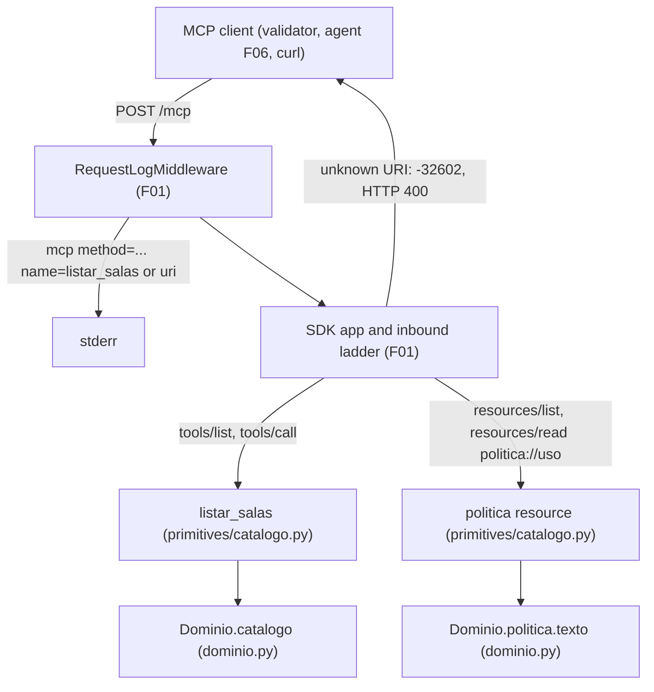
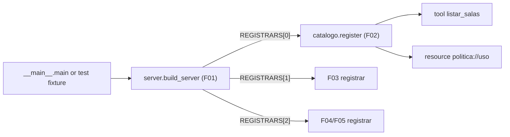

# Technical Specification: Room Catalog and Policy Resource

**Complexity:** simple

## 1. Technical Overview

### What

F02 adds the first two MCP primitives to the `central-de-salas` server built by F01: the tool `listar_salas` and the static resource `politica://uso`. Both live in one new module, `servidor_mcp/primitives/catalogo.py`, which exposes the F01 registrar contract `register(server, dominio)` and is placed first in `primitives.REGISTRARS`, so `listar_salas` leads `tools/list`.

`listar_salas` takes no arguments and returns the five rooms of the F01 room catalog in file order, both as `structuredContent` (validated against an `outputSchema` named `ListaDeSalas`) and as exactly one text block holding the same JSON. `politica://uso` is listed by `resources/list` and returned by `resources/read` as one `text/markdown` content whose text is the policy document F01 loaded, byte for byte. Reading any other URI fails with JSON-RPC `-32602`.

### Why

- The tool definition and the resource read are compared by the validator (checks 1–3, 7, 8) and by the agent (F06) against the shapes captured in `exemplos/wire/01-tools-list.json` and `exemplos/wire/05-resources-read-politica.json`. The SDK generates both the schemas and the result envelope from Python declarations, so F02's job is to declare the primitives so that the generated output equals those captures, not to hand-build JSON.
- F01's implementation log records a trap: a tool annotated `-> dict` silently loses `structuredContent`. F02 declares typed output models and asks the SDK for structured output explicitly, so a wrong annotation fails at registration instead of on the wire.
- F06 extracts the policy version from the first line of `politica://uso` and F08 stamps it into every `reserva` artifact. Serving the text exactly as F01 loaded it keeps the agent-side version identical to the version F04 stamps server-side.

### Scope

**Included (PRD F02 Capabilities and Experience; full scope, no Core/Full split):**
- Tool `listar_salas`: empty object `inputSchema`, `outputSchema` `ListaDeSalas` / `SalaOut`, structured result plus one JSON text block, rooms in `dados/salas.json` order
- Resource `politica://uso`: listed by `resources/list`; `resources/read` returns one content with `uri`, `mimeType` `text/markdown` and the verbatim policy text
- `-32602` for `resources/read` of any URI other than `politica://uso` (SDK not-found path), never an empty `contents`
- Registration of the F02 registrar as the first entry of `primitives.REGISTRARS`
- F02 wire-visible strings added to `mensagens.py`
- Test-harness change so the in-process app fixture uses the production registry by default, which activates the F01 cross-feature tests that wait for F02

**Input contracts (PRD F02 Consumes):**

| PRD Consumes item | Read through | Rule |
|---|---|---|
| F01 room catalog (id, nome, capacidade, recursos) | `Dominio.catalogo` iterated in file order; each `Sala.as_dict()` | Read-only; never re-read from disk; no hardcoded room |
| F01 policy document text | `Dominio.politica.texto` | Read-only; returned unchanged (no newline translation, no trimming) |

**Output contracts (PRD F02 Provides):**

| PRD Provides item | Exposed as | Consumer |
|---|---|---|
| Resource `politica://uso` returning the policy text with `mimeType` `text/markdown`, first line `versao: <value>` | `resources/read` over `POST /mcp` (Section 5.4) | F06 (reads it at the start of every Task and extracts the version) |
| (Capability, not a Provides item) tool `listar_salas` | `tools/list` entry and `tools/call` result (Sections 5.1, 5.2) | Direct MCP clients, validator checks 1–3 |

**Excluded / deferred:**
- `consultar_disponibilidade` (F03) and `reservar_sala` (F04/F05); F02 only fixes its own position in `REGISTRARS`
- Resource templates, resource subscriptions and `notifications/resources/*` (PRD Section 7)
- Per-resource filtering of rooms (PRD Section 7)
- Policy version extraction on the agent side (F06); version parsing on the server side already exists in F01

### Requirements (from PRD Capabilities and Experience)

| ID | Requirement | PRD source |
|---|---|---|
| R1 | `listar_salas` advertises `inputSchema` `{"type": "object", "properties": {}}` and an `outputSchema` titled `ListaDeSalas` with required `salas: SalaOut[]`, where `SalaOut` requires `id` (string), `nome` (string), `capacidade` (integer), `recursos` (string[]) | Capabilities 1 |
| R2 | `listar_salas` result: `structuredContent = {"salas": [...]}` with the 5 rooms in `dados/salas.json` order, plus exactly one text block with `json.loads(text) == structuredContent` | Capabilities 2, Experience 1 |
| R3 | `politica://uso` appears in `resources/list` | Capabilities 3 |
| R4 | `resources/read` of `politica://uso` returns exactly one `contents` entry with `uri` `politica://uso`, `mimeType` `text/markdown` and `text` equal byte for byte to `dados/politica-de-uso.md` | Capabilities 3, Experience 2, Provides |
| R5 | `resources/read` of any other URI returns JSON-RPC `-32602`; an empty `contents` array is never returned | Capabilities 4, Experience 3 |
| R6 | The stderr line for every read, including a rejected one, records method, id and URI (`name=<uri>`) | Experience 3 (behavior inherited from F01's request log) |
| R7 | `listar_salas` is the first entry of `tools/list`; the full list follows the order of `exemplos/wire/01-tools-list.json` once F03–F05 register | F01 registrar contract (F01 A26) |
| R8 | Both primitives read only the injected `Dominio`; nothing is read from disk at request time | Consumes; F01 R9 |

**Request flows:**
- `tools/call listar_salas`: F01 request log line → F01 inbound ladder (`_meta`, headers) → SDK argument validation (no parameters) → tool function builds `ListaDeSalas` from `dominio.catalogo` → SDK validates it against the output model, dumps `structuredContent`, serializes the same object into one text block → JSON body.
- `resources/read politica://uso`: request log line → ladder (including `Mcp-Name == uri`) → SDK exact-URI lookup → resource function returns `dominio.politica.texto` → one `TextResourceContents` with the request URI and `text/markdown`.
- `resources/read <other>`: request log line → ladder → SDK lookup fails → `ResourceNotFoundError` → `-32602`, HTTP `400`, no `result`.

## 2. Architecture Impact

### Affected components

| Path | Change |
|---|---|
| `servidor-mcp/src/servidor_mcp/primitives/catalogo.py` | New: output models, constants and the F02 registrar |
| `servidor-mcp/src/servidor_mcp/primitives/__init__.py` | Modified: F02 registrar becomes `REGISTRARS[0]` |
| `servidor-mcp/src/servidor_mcp/mensagens.py` | Modified: F02 wire-visible strings appended |
| `servidor-mcp/tests/conftest.py` | Modified: `fresh_app` defaults to the production `REGISTRARS` |
| `servidor-mcp/tests/unit/test_catalogo.py` | New |
| `servidor-mcp/tests/integration/test_catalogo_transport.py` | New |
| `servidor-mcp/tests/integration/test_catalogo_process.py` | New |
| `servidor-mcp/tests/integration/test_cross_feature_f02.py` | New |

No change to `server.py`, `app.py`, `dominio.py`, `loader.py`, `request_log.py`, `request_context.py`, `__main__.py` or `pyproject.toml`.

### Request path



### Registration path



## 3. Technical Decisions

| Decision | Chosen Approach | Alternative Considered | Trade-off |
|---|---|---|---|
| Structured result | Tool function annotated with the Pydantic model `ListaDeSalas`, registered with `structured_output=True`; the SDK produces `outputSchema`, `structuredContent` and the text block | Build a `CallToolResult` by hand with an explicit schema | Text block is the SDK's pretty-printed JSON (indent 2) rather than a format F02 controls; in exchange the generated tool entry equals wire example 01 exactly and output validation is automatic |
| Tool identity on the wire | Python function named `listar_salas` (the SDK derives `inputSchema.title` `listar_salasArguments` from it), explicit description, no title, no annotations | Add `readOnlyHint` annotations and a title | Loses useful hints for generic clients; keeps the `tools/list` entry identical to the captured contract |
| Resource registration | Static resource through the SDK resource decorator with `mime_type="text/markdown"`, returning `dominio.politica.texto` | `TextResource` instance added with `add_resource`; resource template | Function hop on each read (runs in a worker thread); symmetric with the tool registration and closes over the injected domain like every registrar |
| Unknown URI | SDK not-found path (`ResourceNotFoundError` → `-32602`, HTTP `400`, message `Unknown resource: <uri>`, `data.uri`) | Catch-all template raising a Portuguese `MCPError` | Message stays in English (SDK-owned, like the F01 ladder messages); no custom routing code |
| Module layout | One module per feature (`primitives/catalogo.py`) holding models, constants and `register`; one `REGISTRARS` entry | Separate modules for tool and resource; shared models module | Tool and resource share a file; no file is edited concurrently with F03 |

### 3.1 SDK facts relied upon (confirmed against the installed `mcp==2.3.0`)

Each fact was verified while writing this spec with throwaway probes in the scratchpad (nothing written to the repository), building the server through F01's `build_server` / `build_app` and the repository `dados/`.

| # | Fact | Evidence |
|---|---|---|
| S1 | A tool whose function is named `listar_salas`, takes no parameters, returns `ListaDeSalas` (field `salas: list[SalaOut]`; `SalaOut` fields `id: str`, `nome: str`, `capacidade: int`, `recursos: list[str]` in that order) and has description `Lista todas as salas com capacidade e recursos.` produces a `tools/list` entry equal to the first tool of `exemplos/wire/01-tools-list.json` (dict equality, `by_alias`, `exclude_none`) | Probe: `equal wire: True` with both the docstring and the explicit `description=` forms, with and without `structured_output=True` |
| S2 | For a Pydantic-model return, `convert_result` returns `structuredContent = model_dump(mode="json", by_alias=True)` and one `TextContent` from `pydantic_core.to_json(result, indent=2)`; `isError: false`; no `cacheScope`/`ttlMs` on `tools/call` results | `mcp/server/mcpserver/utilities/func_metadata.py` (`convert_result`, `_convert_to_content`); probe response (Section 5.2) |
| S3 | A function returning `dict` gets no `outputSchema` and no `structuredContent`; with `structured_output=True` the same registration raises `InvalidSignature` | Probe; F01 progress Stage 3 observation |
| S4 | Tool arguments: extra keys are ignored and an omitted `arguments` is treated as `{}`; both return the normal result | Probe (`arguments: {"x": 1}` and no `arguments`) |
| S5 | `tools/list` order is registration order (`ToolManager.list_tools` returns dict insertion order); a duplicate registration logs a WARNING and keeps the first | `mcp/server/mcpserver/tools/tool_manager.py` |
| S6 | The resource decorator on a static URI creates a `FunctionResource`; `resources/list` emits `uri`, `name`, `title`, `description`, `mimeType`; without an explicit description the SDK emits `"description": ""` | Probe; `resources/types.py`, `server.py` (`list_resources`) |
| S7 | `ReadResourceRequestParams.uri` is a plain `str` (no URL normalization); lookup is an exact dictionary match on the string; the content `uri` echoes the request URI | `mcp_types/_types.py`; `resources/resource_manager.py` (`get_resource`) |
| S8 | Unknown URI → `ResourceNotFoundError("Unknown resource: <uri>")` → `MCPError(code=-32602, data={"uri": <uri>})`; the logger call is INFO, so nothing reaches stderr at F01's WARNING level | `server.py` (`_handle_read_resource`); probe stderr capture |
| S9 | `-32602` raised by a handler is mapped to HTTP `400` (the same table as ladder rejections) | `mcp/shared/inbound.py` (`ERROR_CODE_HTTP_STATUS`), `_streamable_http_modern.py` (`_write`) |
| S10 | `resources/read` without `uri` → `-32602` `Invalid request parameters`, HTTP `400` | Probe |
| S11 | Static resources cannot take a `Context` parameter (registration raises), so the resource function reads only the closed-over domain | `server.py` (`resource` decorator) |
| S12 | Synchronous tool and resource functions run on a worker thread (`anyio.to_thread.run_sync`) | `func_metadata.call_fn`, `FunctionResource.read` |
| S13 | Unknown tool name (validator check 6) returns `isError: true` with `Unknown tool: <name>`; not F02 behavior, recorded because the validator exercises it in the same block as F02's checks | Probe |

No "verify at implementation" item remains for F02.

### 3.2 Assumptions and Auto-Accept Decisions

Every row is a decision the PRD did not answer. Each names the Auto-Accept Policy row that produced it so the user can review and override it.

| # | Decision | Choice | Auto-Accept policy row |
|---|---|---|---|
| A1 | Module placement | One module `servidor_mcp/primitives/catalogo.py` exposing `register(server, dominio)`, registering both F02 primitives; it does not import from the `servidor_mcp.primitives` package itself (avoids an import cycle with `primitives/__init__.py`) | Technical decision with a clear recommendation (F01 registrar contract) |
| A2 | Output model placement | `SalaOut` and `ListaDeSalas` live in the F02 module; no shared models module is introduced, so F02 and F03 never create or edit the same new file in parallel. If a shared models module already exists when F02 is implemented, the two models may move there unchanged (the wire contract depends only on model and field names) | Technical decision with a clear recommendation |
| A3 | Exact tool entry | The `tools/list` entry must equal the first tool of `exemplos/wire/01-tools-list.json`: description `Lista todas as salas com capacidade e recursos.`, no `title`, no `annotations`, no `_meta`, model titles `ListaDeSalas` / `SalaOut`, field order `id, nome, capacidade, recursos`. The PRD names the schemas but not the description or titles; the wire capture is the reference | Partial PRD specification |
| A4 | Structured output flag | `structured_output=True` passed explicitly so a non-serializable return annotation fails at registration (S3) | Technical decision with a clear recommendation |
| A5 | Text block format | The SDK's automatic serialization (pretty-printed JSON, indent 2, same key order as `structuredContent`); the PRD only requires `json.loads(text) == structuredContent` | Technical decision with a clear recommendation |
| A6 | Argument strictness | SDK defaults: extra argument keys ignored, omitted `arguments` treated as `{}`; no `additionalProperties: false` (it would diverge from the wire capture) | Partial PRD specification |
| A7 | Resource metadata | `name` `politica-de-uso`, `title` `Politica de uso das salas`, `description` `Politica de uso das salas. A primeira linha declara a versao no formato versao: <valor>.`; ASCII Portuguese like every other user-facing string (F01 A22) | Partial PRD specification |
| A8 | URI matching | Exact string match on `politica://uso`; `politica://uso/`, `politica://USO`, `POLITICA://uso` and any other spelling are unknown (`-32602`) | Partial PRD specification |
| A9 | Unknown-URI error body | Kept as produced by the SDK: message `Unknown resource: <uri>`, `data: {"uri": <uri>}`, HTTP `400`; F02 never rewrites SDK responses (mirrors F01 A16). The PRD and the validator only fix the code | Technical decision with a clear recommendation |
| A10 | Line endings | The resource serves exactly the string F01 loaded. On a Windows clone with `core.autocrlf=true` (this host: `git ls-files --eol` shows `i/lf w/crlf` for `dados/politica-de-uso.md`) the text contains `\r\n`; on Linux/macOS it contains `\n`. Tests compare against the file bytes on disk, never against the text in wire example 05 | Technical decision with a clear recommendation |
| A11 | Request-time data source | Both functions read the injected `Dominio` at call time; the disk is never touched after startup (F01 R9) | Technical decision with a clear recommendation |
| A12 | String placement | Wire-visible prose (tool description, resource name, title, description) goes into `mensagens.py` in a block marked for F02 (F01 rule "never inline user-facing strings"); protocol constants (`politica://uso`, `text/markdown`) stay as named constants in the F02 module | Technical decision with a clear recommendation |
| A13 | Test fixture default | `fresh_app` in `tests/conftest.py` builds the server with the production `REGISTRARS` when no registrars are given; explicit tuples (test-only probes) keep working. Without it the F01 cross-feature tests that wait for F02 stay skipped forever, because the current default is an empty tuple | Technical decision with a clear recommendation |
| A14 | Schema conformance in tests | Checked structurally (required keys and JSON types of `structuredContent`) without importing `jsonschema`, which is only a transitive dependency of `mcp`; the SDK already validates every result against the output model | New technology not in the codebase (avoided) |
| A15 | Advertised resource capability flags | Left exactly as the SDK derives them (the probe shows `resources.subscribe` and `listChanged` advertised); subscriptions stay unimplemented as PRD Section 7 excludes them. Same stance as F01 A17 for prompts | Multiple conflicting patterns (PRD out-of-scope list vs SDK default): keep the SDK default and document |
| A16 | Resource templates | None registered; `resources/templates/list` returns an empty list | Partial PRD specification |
| A17 | Function style | Plain synchronous functions (S12); the catalog and policy are immutable, so no locking | Technical decision with a clear recommendation |

### 3.3 Coordination with F03 (spec written in parallel)

| Shared touch point | Rule |
|---|---|
| `primitives/__init__.py` `REGISTRARS` | F02's registrar is always element 0. If F03 is implemented first, F02 inserts its entry ahead of F03's instead of appending. Final order: F02, F03, F04/F05 |
| `tests/conftest.py` `fresh_app` default | Whichever feature lands first switches the default to the production `REGISTRARS` (A13); the other finds it done |
| `mensagens.py` | Append-only; each feature adds its own clearly labelled block and edits no existing constant |
| Output models | Each feature keeps its own models in its own primitives module (A2) |
| `tools/list` order test | `test_tools_list_order_matches_wire_example_for_registered_tools` (Section 7) checks the relative order of whatever tools are registered, so it passes before and after F03 lands |

### 3.4 PRD traceability

| PRD block | Spec destination |
|---|---|
| F02 Consumes | Section 1 Input contracts; Section 6 mapping |
| F02 Provides | Section 1 Output contracts; Section 5.4 |
| F02 Capabilities | Section 1 Requirements R1–R5; Sections 5.1–5.5; Section 6 |
| F02 Experience | Section 1 Requirements R2, R4–R6 and request flows; Section 5 examples |
| F02 Error Handling (no block in the PRD; error behavior comes from Capabilities 4 and Experience 3) | Section 5.6 |
| Section 9 F02 acceptance criteria | Section 7 acceptance traceability |
| Section 9 Cross-Feature Integration criteria naming F02 | Section 7 cross-feature tests |

## 4. Component Overview

**Backend:**

| File Path | New/Modified | Purpose | Key Responsibilities |
|---|---|---|---|
| `servidor-mcp/src/servidor_mcp/primitives/catalogo.py` | New | F02 primitives | Constants `POLITICA_URI = "politica://uso"` and `POLITICA_MIME_TYPE = "text/markdown"`; Pydantic models `SalaOut` and `ListaDeSalas` (Section 6); `register(server, dominio)` registers (1) the tool function named `listar_salas`, no parameters, return annotation `ListaDeSalas`, description `mensagens.DESCRICAO_LISTAR_SALAS`, `structured_output=True`, which builds one `SalaOut` per `Sala` of `dominio.catalogo` in iteration order from `Sala.as_dict()`; (2) the static resource `POLITICA_URI` with `name`, `title`, `description` from `mensagens` and `mime_type=POLITICA_MIME_TYPE`, whose function returns `dominio.politica.texto`. No module-level mutable state; no disk access; no import from `servidor_mcp.primitives` |
| `servidor-mcp/src/servidor_mcp/primitives/__init__.py` | Modified | Registry | Imports `catalogo` and makes `catalogo.register` the first element of `REGISTRARS`; `Registrar` alias and docstring unchanged |
| `servidor-mcp/src/servidor_mcp/mensagens.py` | Modified | Exact strings | Appends an F02 block: `DESCRICAO_LISTAR_SALAS = "Lista todas as salas com capacidade e recursos."`, `POLITICA_NOME = "politica-de-uso"`, `POLITICA_TITULO = "Politica de uso das salas"`, `POLITICA_DESCRICAO` (A7); module docstring widened to cover wire-visible primitive strings |

**Tests (harness):**

| File Path | New/Modified | Purpose | Key Responsibilities |
|---|---|---|---|
| `servidor-mcp/tests/conftest.py` | Modified | Shared fixtures | `fresh_app`'s `make(registrars=...)` defaults to `servidor_mcp.primitives.REGISTRARS` (A13); explicit tuples unchanged; no other fixture changes |

**Effect on existing F01 tests:** `test_listar_salas_returns_rooms_loaded_by_foundation` and `test_politica_resource_returns_policy_text_loaded_by_foundation` in `test_cross_feature_f01.py` stop skipping and must pass. Every other F01 test is unaffected: no F01 test asserts an empty `tools` list, the probe and dummy tests pass explicit registrars, and `test_mcp_name_header_mismatch_returns_32020` is rejected by the ladder before dispatch.

**Module boundaries for consumers:**

| Consumer | Contract | Rule |
|---|---|---|
| F06 (agent) | `resources/read politica://uso` over HTTP only (Section 5.4) | Must not import server code; extracts the version from the first line, trimmed (handles a trailing `\r`, A10) |
| F03, F04/F05 | `REGISTRARS` order (Section 3.3) | Insert their registrars after F02's |
| Direct MCP clients / validator | Sections 5.1–5.5 | Wire shapes as captured in `exemplos/wire/01` and `05` |

**Database:** none. No migration; no file is written.

## 5. API Contracts

All operations use F01's envelope: `POST /mcp`, headers `Content-Type: application/json`, `Accept: application/json, text/event-stream`, `MCP-Protocol-Version: 2026-07-28`, `Mcp-Method: <method>` and, for `tools/call` / `resources/read`, `Mcp-Name: <tool name or uri>`; `params._meta` with `io.modelcontextprotocol/protocolVersion` and `io.modelcontextprotocol/clientCapabilities` (F01 spec Section 5.1). Authentication: none. Every success carries `resultType: "complete"` and the `io.modelcontextprotocol/serverInfo` stamp (SDK).

### 5.1 `tools/list` — `listar_salas` entry

**Request:** as `exemplos/wire/01-tools-list.json` (no params besides `_meta`).

**Response (Success - 200):** `result.tools[0]` is the `listar_salas` entry.

| Field | Type | Description |
|---|---|---|
| `name` | `string` | `listar_salas` |
| `description` | `string` | `Lista todas as salas com capacidade e recursos.` |
| `inputSchema` | `object` | `{"type": "object", "properties": {}, "title": "listar_salasArguments"}` |
| `outputSchema` | `object` | `ListaDeSalas` schema with `$defs.SalaOut` (Section 6) |

**Response Example (the entry, identical to the wire capture):**
```json
{
  "description": "Lista todas as salas com capacidade e recursos.",
  "inputSchema": {"type": "object", "properties": {}, "title": "listar_salasArguments"},
  "name": "listar_salas",
  "outputSchema": {
    "$defs": {
      "SalaOut": {
        "properties": {
          "id": {"title": "Id", "type": "string"},
          "nome": {"title": "Nome", "type": "string"},
          "capacidade": {"title": "Capacidade", "type": "integer"},
          "recursos": {"items": {"type": "string"}, "title": "Recursos", "type": "array"}
        },
        "required": ["id", "nome", "capacidade", "recursos"],
        "title": "SalaOut",
        "type": "object"
      }
    },
    "properties": {
      "salas": {"items": {"$ref": "#/$defs/SalaOut"}, "title": "Salas", "type": "array"}
    },
    "required": ["salas"],
    "title": "ListaDeSalas",
    "type": "object"
  }
}
```

### 5.2 `tools/call` — `listar_salas`

- **Method:** POST `/mcp`, `Mcp-Method: tools/call`, `Mcp-Name: listar_salas`
- **Authentication:** none

**Request (`params`):**

| Field | Type | Required | Validation | Description |
|---|---|---|---|---|
| `name` | `string` | Yes | equals `Mcp-Name` (F01 ladder) | `listar_salas` |
| `arguments` | `object` | No | no properties; extra keys ignored (A6) | `{}` |
| `_meta` | `object` | Yes | F01 envelope | Any `clientCapabilities` object, `{}` included |

**Request Example** (validator shape):
```json
{
  "jsonrpc": "2.0",
  "id": "9c1e04aa77b2",
  "method": "tools/call",
  "params": {
    "name": "listar_salas",
    "arguments": {},
    "_meta": {
      "io.modelcontextprotocol/protocolVersion": "2026-07-28",
      "io.modelcontextprotocol/clientCapabilities": {"elicitation": {"form": {}}}
    }
  }
}
```

**Response (Success - 200):**

| Field | Type | Description |
|---|---|---|
| `result.resultType` | `string` | `complete` |
| `result.isError` | `boolean` | `false` |
| `result.structuredContent.salas` | `SalaOut[]` | The 5 rooms in `dados/salas.json` order |
| `result.content` | `ContentBlock[]` | Exactly one `{"type": "text", "text": <JSON of structuredContent>}` |
| `result._meta["io.modelcontextprotocol/serverInfo"]` | `object` | SDK stamp |

**Response Example** (captured; the text value is the indent-2 JSON of `structuredContent`):
```json
{
  "jsonrpc": "2.0",
  "id": "9c1e04aa77b2",
  "result": {
    "content": [
      {
        "type": "text",
        "text": "{\n  \"salas\": [\n    {\n      \"id\": \"sala-aquario\",\n      \"nome\": \"Aquario\",\n      \"capacidade\": 4,\n      \"recursos\": [\n        \"tv\"\n      ]\n    },\n    {\n      \"id\": \"sala-porao\",\n      \"nome\": \"Porao\",\n      \"capacidade\": 6,\n      \"recursos\": [\n        \"quadro\"\n      ]\n    },\n    {\n      \"id\": \"sala-garagem\",\n      \"nome\": \"Garagem\",\n      \"capacidade\": 12,\n      \"recursos\": [\n        \"tv\",\n        \"quadro\"\n      ]\n    },\n    {\n      \"id\": \"sala-fusca\",\n      \"nome\": \"Fusca\",\n      \"capacidade\": 12,\n      \"recursos\": [\n        \"tv\"\n      ]\n    },\n    {\n      \"id\": \"sala-mirante\",\n      \"nome\": \"Mirante\",\n      \"capacidade\": 20,\n      \"recursos\": [\n        \"tv\",\n        \"quadro\",\n        \"camera\"\n      ]\n    }\n  ]\n}"
      }
    ],
    "isError": false,
    "resultType": "complete",
    "structuredContent": {
      "salas": [
        {"id": "sala-aquario", "nome": "Aquario", "capacidade": 4, "recursos": ["tv"]},
        {"id": "sala-porao", "nome": "Porao", "capacidade": 6, "recursos": ["quadro"]},
        {"id": "sala-garagem", "nome": "Garagem", "capacidade": 12, "recursos": ["tv", "quadro"]},
        {"id": "sala-fusca", "nome": "Fusca", "capacidade": 12, "recursos": ["tv"]},
        {"id": "sala-mirante", "nome": "Mirante", "capacidade": 20, "recursos": ["tv", "quadro", "camera"]}
      ]
    },
    "_meta": {"io.modelcontextprotocol/serverInfo": {"name": "central-de-salas", "version": "1.0.0"}}
  }
}
```
Stderr: `mcp method=tools/call id=9c1e04aa77b2 name=listar_salas traceparent=-`

### 5.3 `resources/list`

**Request Example:** `{"jsonrpc": "2.0", "id": 4, "method": "resources/list", "params": {"_meta": {...envelope...}}}` with `Mcp-Method: resources/list`.

**Response (Success - 200):**

| Field | Type | Description |
|---|---|---|
| `result.resources[].uri` | `string` | `politica://uso` |
| `result.resources[].name` | `string` | `politica-de-uso` |
| `result.resources[].title` | `string` | `Politica de uso das salas` |
| `result.resources[].description` | `string` | A7 text |
| `result.resources[].mimeType` | `string` | `text/markdown` |

**Response Example** (captured):
```json
{
  "jsonrpc": "2.0",
  "id": 4,
  "result": {
    "cacheScope": "private",
    "resources": [
      {
        "description": "Politica de uso das salas. A primeira linha declara a versao no formato versao: <valor>.",
        "mimeType": "text/markdown",
        "name": "politica-de-uso",
        "title": "Politica de uso das salas",
        "uri": "politica://uso"
      }
    ],
    "resultType": "complete",
    "ttlMs": 0,
    "_meta": {"io.modelcontextprotocol/serverInfo": {"name": "central-de-salas", "version": "1.0.0"}}
  }
}
```

### 5.4 `resources/read` — `politica://uso` (PRD Provides, consumed by F06)

- **Method:** POST `/mcp`, `Mcp-Method: resources/read`, `Mcp-Name: politica://uso`

**Request (`params`):**

| Field | Type | Required | Validation | Description |
|---|---|---|---|---|
| `uri` | `string` | Yes | exact match `politica://uso` (A8); equals `Mcp-Name` (F01 ladder) | Resource URI |
| `_meta` | `object` | Yes | F01 envelope | — |

**Request Example:** the body and headers of `exemplos/wire/05-resources-read-politica.json` (id `5`, `traceparent` `00-4bf92f3577b34da6a3ce929d0e0e4736-00f067aa0ba902b7-01`).

**Response (Success - 200):**

| Field | Type | Description |
|---|---|---|
| `result.contents` | `array` | Exactly one entry |
| `result.contents[0].uri` | `string` | `politica://uso` |
| `result.contents[0].mimeType` | `string` | `text/markdown` |
| `result.contents[0].text` | `string` | `Dominio.politica.texto`: UTF-8 encoding equals the bytes of `dados/politica-de-uso.md`; first line `versao: 2026-11-01` |
| `result.resultType` | `string` | `complete` |

**Response Example** (LF checkout, as in the wire capture; a CRLF checkout carries `\r\n` instead, A10):
```json
{
  "jsonrpc": "2.0",
  "id": 5,
  "result": {
    "cacheScope": "private",
    "contents": [
      {
        "mimeType": "text/markdown",
        "text": "versao: 2026-11-01\n\n- Reservas somente entre 08:00 e 20:00, horario de Sao Paulo (-03:00).\n- Duracao maxima de 2 horas por reserva.\n- Uma sala nao pode ter duas reservas sobrepostas.\n",
        "uri": "politica://uso"
      }
    ],
    "resultType": "complete",
    "ttlMs": 0,
    "_meta": {"io.modelcontextprotocol/serverInfo": {"name": "central-de-salas", "version": "1.0.0"}}
  }
}
```
Stderr: `mcp method=resources/read id=5 name=politica://uso traceparent=00-4bf92f3577b34da6a3ce929d0e0e4736-00f067aa0ba902b7-01`

### 5.5 `resources/read` — unknown URI

**Request Example:** `params.uri` `politica://inexistente`, header `Mcp-Name: politica://inexistente`, id `6`.

**Response (HTTP 400, `application/json`, no `result`):**
```json
{
  "jsonrpc": "2.0",
  "id": 6,
  "error": {
    "code": -32602,
    "message": "Unknown resource: politica://inexistente",
    "data": {"uri": "politica://inexistente"}
  }
}
```
Stderr: exactly one line, `mcp method=resources/read id=6 name=politica://inexistente traceparent=-`; no SDK log line (S8).

### 5.6 Error Handling

| Condition | Code | HTTP Status | Outcome | Source |
|---|---|---|---|---|
| `resources/read` of any URI other than exactly `politica://uso` | `-32602` | 400 | `Unknown resource: <uri>`, `data.uri`; never an empty `contents` | SDK not-found path (S8, S9; A8, A9) |
| `resources/read` without `uri` | `-32602` | 400 | `Invalid request parameters` | SDK params validation (S10) |
| `Mcp-Name` different from `params.uri` / `params.name` | `-32020` | 400 | Rejected before dispatch | F01 ladder |
| `_meta` missing `protocolVersion` or `clientCapabilities` on `listar_salas` or `resources/read` (validator checks 4, 5 use `listar_salas`) | `-32602` | 400 | Rejected before dispatch | F01 ladder |
| `listar_salas` with extra argument keys or without `arguments` | — | 200 | Normal result (A6) | SDK argument model (S4) |
| `listar_salas` called with `clientCapabilities: {}` | — | 200 | Normal result; no capability is required | Per-request capabilities (F01) |
| Unexpected exception inside the tool (cannot occur with loader-validated data) | — | 200 | `isError: true` with the SDK message; traceback logged on stderr by the SDK at ERROR | SDK `_handle_call_tool` |
| Unexpected exception inside the resource function (cannot occur: returns an in-memory string) | `-32603` | 200 | `Error reading resource politica://uso`; traceback on stderr | SDK `UnexpectedResourceError` |

### 5.7 Stderr log lines (contract owned by F01, values produced by F02 traffic)

| Request | Line |
|---|---|
| `tools/call listar_salas`, id `3`, no trace | `mcp method=tools/call id=3 name=listar_salas traceparent=-` |
| Wire 05 | `mcp method=resources/read id=5 name=politica://uso traceparent=00-4bf92f3577b34da6a3ce929d0e0e4736-00f067aa0ba902b7-01` |
| Unknown URI, id `6` | `mcp method=resources/read id=6 name=politica://inexistente traceparent=-` |
| `resources/list`, id `4` | `mcp method=resources/list id=4 name=- traceparent=-` |

## 6. Data Model

No database and no persistence. F02 adds two immutable output models and one resource descriptor, all derived from F01's in-memory `Dominio`.

**Model: `SalaOut`** (one per `Sala`, built from `Sala.as_dict()`)

| Field | Type | Required | Source | Description |
|---|---|---|---|---|
| `id` | `str` | Yes | `Sala.id` | Room id, e.g. `sala-aquario` |
| `nome` | `str` | Yes | `Sala.nome` | Display name |
| `capacidade` | `int` | Yes | `Sala.capacidade` | Seats |
| `recursos` | `list[str]` | Yes | `Sala.recursos` (tuple converted to list) | Resources in file order |

Field declaration order is fixed (`id`, `nome`, `capacidade`, `recursos`): it determines the `outputSchema` property order and the key order of `structuredContent` and the text block.

**Model: `ListaDeSalas`** (the tool's return type)

| Field | Type | Required | Source | Description |
|---|---|---|---|---|
| `salas` | `list[SalaOut]` | Yes | `dominio.catalogo` iteration | All rooms, file order, no filtering |

No defaults, no aliases, no extra configuration: the SDK-generated JSON Schema (Section 5.1) must stay identical to the wire capture.

**Resource descriptor: `politica://uso`**

| Attribute | Value |
|---|---|
| URI | `politica://uso` (constant `POLITICA_URI`) |
| Kind | Static (`FunctionResource`), no template variables |
| `name` / `title` / `description` | `mensagens.POLITICA_NOME` / `POLITICA_TITULO` / `POLITICA_DESCRICAO` |
| MIME type | `text/markdown` (constant `POLITICA_MIME_TYPE`) |
| Content | `dominio.politica.texto`, returned as `str` (text content, never blob) |

**Invariants:**

| Invariant | Definition | Purpose |
|---|---|---|
| Catalog fidelity | `structuredContent.salas == [s.as_dict() for s in dominio.catalogo]` | Cross-feature criterion with F01 |
| Single text block | `len(content) == 1`, `content[0].type == "text"`, `json.loads(content[0].text) == structuredContent` | PRD Capabilities 2, validator check 3 |
| Policy fidelity | `contents[0].text.encode("utf-8") == bytes of dados/politica-de-uso.md` | PRD Capabilities 3 |
| Single content | `len(contents) == 1` for `politica://uso`; error (never empty list) otherwise | PRD Capabilities 4 |
| Registry position | `REGISTRARS[0] is catalogo.register` | `tools/list` order |

## 7. Testing Strategy

Tests run in `servidor-mcp/` with the `dev` extra in the repo-root venv. No new test dependency: unit tests drive the SDK's async server API with `asyncio.run` (no async pytest plugin is pinned). Test file names are unique across `tests/unit` and `tests/integration` because the test directories have no `__init__.py`.

**Test File Structure:**

| Test File | Test Type | Target | Coverage Goal |
|---|---|---|---|
| `servidor-mcp/tests/unit/test_catalogo.py` | Unit (server API, no HTTP) | `primitives/catalogo.py` | 100% |
| `servidor-mcp/tests/integration/test_catalogo_transport.py` | Integration (in-process ASGI, `fresh_app` + `mcp_post`) | Wire shapes over `POST /mcp` | 100% of F02 paths |
| `servidor-mcp/tests/integration/test_catalogo_process.py` | Integration (subprocess, `start_server`) | Real process, stderr | n/a |
| `servidor-mcp/tests/integration/test_cross_feature_f02.py` | Integration (in-process, some tests gated) | F02 contracts consumed by F04/F06/F08 | n/a |
| `servidor-mcp/tests/integration/test_cross_feature_f01.py` | Integration (existing, activated) | F01 → F02 criterion | n/a |

**Fixture changes (`conftest.py`):**

| Fixture | Change |
|---|---|
| `fresh_app` | `make()` without arguments uses `servidor_mcp.primitives.REGISTRARS` (A13); `make(registrars=(...))` unchanged |

Unit tests build their server with `build_server(dominio, registrars=(catalogo.register,))`, so they are independent of whichever F03–F05 registrars exist.

**`unit/test_catalogo.py`:**

| Test Function | Description | Assertions |
|---|---|---|
| `test_register_adds_one_tool_and_one_resource` | Server built with only the F02 registrar | Tool names `["listar_salas"]`; resource URIs `["politica://uso"]`; no resource templates |
| `test_output_schema_shape` | Advertised `output_schema` | Title `ListaDeSalas`; `required == ["salas"]`; `$defs.SalaOut.required == ["id", "nome", "capacidade", "recursos"]`; property types string, string, integer, array of string |
| `test_listar_salas_returns_rooms_in_file_order` | Call with `{}` | ids `sala-aquario, sala-porao, sala-garagem, sala-fusca, sala-mirante`; capacities `4, 6, 12, 12, 20`; `recursos` preserved |
| `test_listar_salas_has_single_text_block_equal_to_structured_content` | Call with `{}` | `is_error` false; one content block of type text; `json.loads(text) == structured_content` |
| `test_listar_salas_reflects_the_injected_dominio` | `dados_tmp` with `salas.json` rewritten to three rooms in a different order | Result equals exactly those three rooms in the new order (no hardcoding) |
| `test_register_keeps_no_module_level_state` | Two servers built from two different domains (repository `dados/` and a modified `dados_tmp`) | Each returns its own rooms and its own policy text |
| `test_listar_salas_does_not_mutate_dominio` | Call twice | Catalog unchanged; ledger count still 2 |
| `test_politica_resource_returns_dominio_text_as_markdown` | `read_resource("politica://uso")` | One item; content `== dominio.politica.texto`; MIME type `text/markdown` |
| `test_politica_text_is_byte_identical_for_lf_and_crlf_files` | Parametrized: `dados_tmp` policy rewritten with LF and with CRLF line endings | Served text encoded as UTF-8 equals the rewritten file bytes |
| `test_unknown_uri_raises_resource_not_found` | Parametrized `politica://inexistente`, `politica://uso/`, `politica://USO`, `POLITICA://uso`, `politica:uso` | `ResourceNotFoundError` |
| `test_registry_places_catalogo_first` | Production registry | `REGISTRARS[0] is catalogo.register` |

**`integration/test_catalogo_transport.py`** (in-process, `fresh_app()` with the production registry):

| Test Function | Description | Assertions |
|---|---|---|
| `test_tools_list_includes_listar_salas_with_object_input_and_output_schema` | `tools/list` (AC 1) | Entry present; `inputSchema.type == "object"`; `outputSchema` present |
| `test_listar_salas_definition_matches_wire_example` | Compare with the first tool of `exemplos/wire/01-tools-list.json` | Dict equality |
| `test_listar_salas_is_first_in_tools_list` | `tools/list` | `tools[0].name == "listar_salas"` |
| `test_tools_list_order_matches_wire_example_for_registered_tools` | Registered names vs wire order | Wire names filtered to the registered ones equal registered names filtered to the wire ones (passes before and after F03–F05) |
| `test_listar_salas_returns_five_rooms_in_file_order` | `tools/call` with `arguments: {}` (AC 2, Experience 1) | 200; `resultType == "complete"`; `isError` false; ids and capacities as in Experience 1 |
| `test_listar_salas_text_block_equals_structured_content` | Same call (AC 2, validator check 3) | Exactly one content block, type text; `json.loads(text) == structuredContent` |
| `test_listar_salas_structured_content_matches_output_schema` | Structural check against the advertised schema (A14) | `structuredContent` keys `{"salas"}`; every item has exactly `id`, `nome`, `capacidade`, `recursos` with types str, str, int (not bool), list of str |
| `test_listar_salas_ignores_extra_and_missing_arguments` | `arguments: {"x": 1}` and no `arguments` | Both results equal the `{}` result |
| `test_listar_salas_needs_no_client_capability` | `clientCapabilities: {}` | 200, normal result |
| `test_listar_salas_without_envelope_keys_returns_32602_http_400` | Parametrized: omit `protocolVersion`, omit `clientCapabilities` (validator checks 4, 5 shapes) | 400; `error.code == -32602` |
| `test_resources_list_contains_politica_uso` | `resources/list` | One entry with `uri` `politica://uso`, `name` `politica-de-uso`, `mimeType` `text/markdown`, non-empty `description` |
| `test_read_politica_returns_file_bytes_as_markdown` | `resources/read politica://uso` (AC 3, Experience 2, validator check 7) | 200; exactly one content; `uri == "politica://uso"`; `mimeType == "text/markdown"`; `text.encode("utf-8")` equals the bytes of `dados/politica-de-uso.md`; contains `2026-11-01`; first line minus a trailing `\r` is `versao: 2026-11-01` |
| `test_read_unknown_uri_returns_32602_never_empty_contents` | Parametrized `politica://inexistente`, `politica://uso/`, `politica://USO`, `arquivo://politica` (AC 4, validator check 8) | 400; `error.code == -32602`; `error.data.uri` equals the requested URI; no `result` key |
| `test_unknown_uri_is_logged_with_method_id_and_uri` | Unknown read with id `6` (Experience 3) | Captured log lines equal `["mcp method=resources/read id=6 name=politica://inexistente traceparent=-"]` |
| `test_read_without_uri_returns_32602` | `resources/read` with no `uri` | 400; `-32602` |

**`integration/test_catalogo_process.py`** (subprocess, `start_server`):

| Test Function | Description | Assertions |
|---|---|---|
| `test_real_process_serves_catalog_and_policy` | Validator-shaped requests against `python -m servidor_mcp`: `tools/list`, `tools/call listar_salas`, `resources/read politica://uso`, `resources/read politica://inexistente` | `listar_salas` listed with object `inputSchema`; structured equals text JSON; policy text contains `2026-11-01` and equals the file bytes; unknown → `-32602`; stderr holds one `mcp ...` line per request with `name=listar_salas`, `name=politica://uso`, `name=politica://inexistente`; no stderr line other than the banner and `mcp ...` lines (no SDK log, no traceback) |

**`integration/test_cross_feature_f02.py`** — Section 9 Cross-Feature Integration criteria that name F02, server side. Gated tests skip with "consumer feature not registered yet" while the needed tool is absent.

| Test Function | Cross-Feature criterion | Assertions |
|---|---|---|
| `test_policy_version_read_from_resource_equals_foundation_version` | "The `politica` field of every `reserva` artifact (F08/F09) equals the version F06 extracted from the F02 resource" (server half) | Text after `versao:` on the first line of the `politica://uso` text, trimmed (the F06 rule), equals `dominio.politica.versao` (`2026-11-01`) |
| `test_reservation_politica_equals_version_read_from_resource` | Same criterion, through F04 (gated on `reservar_sala`) | On a fresh app, the version extracted from the resource equals `structuredContent.politica` of `reservar_sala` `sala-aquario` 09:00–10:00 `Doc` |
| `test_agent_style_policy_read_is_accepted_and_logged` | F06 consumes `politica://uso` with mirrored headers (PRD F06 Consumes) | Request of `exemplos/wire/05-resources-read-politica.json` sent verbatim (headers and body) → 200, not `-32020`; content `uri` and `mimeType` equal the wire capture; text equals the file bytes; log line `mcp method=resources/read id=5 name=politica://uso traceparent=00-4bf92f3577b34da6a3ce929d0e0e4736-00f067aa0ba902b7-01` |

**Existing cross-feature tests activated by F02 (`test_cross_feature_f01.py`, no edit needed beyond A13):**

| Test Function | Cross-Feature criterion |
|---|---|
| `test_listar_salas_returns_rooms_loaded_by_foundation` | "`listar_salas` (F02) returns exactly the rooms loaded by F01 from `dados/salas.json`" |
| `test_politica_resource_returns_policy_text_loaded_by_foundation` | "`politica://uso` (F02) returns the policy text F01 loaded" |

The agent-side end of the policy-version criterion (artifact `politica` equals the version F06 extracted) is verified by the F06/F08/F09 specs; F02 covers the server side above.

**Acceptance criteria traceability (PRD Section 9, F02):**

| # | Acceptance criterion | Test(s) |
|---|---|---|
| 1 | `tools/list` includes `listar_salas` with `inputSchema.type == "object"` and an `outputSchema` | `test_tools_list_includes_listar_salas_with_object_input_and_output_schema`, `test_listar_salas_definition_matches_wire_example` |
| 2 | `listar_salas` returns `structuredContent.salas` with the 5 rooms in file order, and exactly one text block whose `json.loads` equals `structuredContent` | `test_listar_salas_returns_five_rooms_in_file_order`, `test_listar_salas_text_block_equals_structured_content`, `test_listar_salas_has_single_text_block_equal_to_structured_content` |
| 3 | `resources/read` of `politica://uso` returns one content with `mimeType` `text/markdown` and text equal to `dados/politica-de-uso.md`, containing `2026-11-01` | `test_read_politica_returns_file_bytes_as_markdown`, `test_politica_text_is_byte_identical_for_lf_and_crlf_files` |
| 4 | `resources/read` of `politica://inexistente` returns `-32602` and never an empty `contents` | `test_read_unknown_uri_returns_32602_never_empty_contents`, `test_unknown_uri_raises_resource_not_found` |

**Validator checks exercised by F02:** 1 (`listar_salas` part of the three tools), 2 (object `inputSchema`), 3, 4 and 5 (envelope rejections sent to `listar_salas`), 7, 8. Check 1 passes only once F03 and F04 register their tools.
