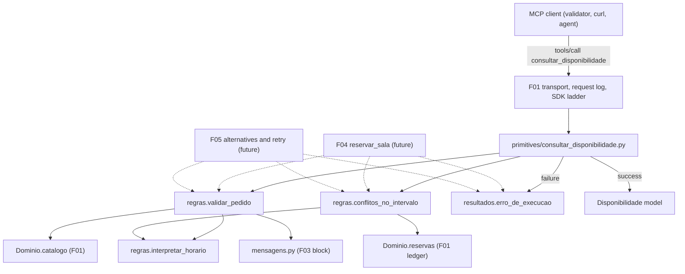
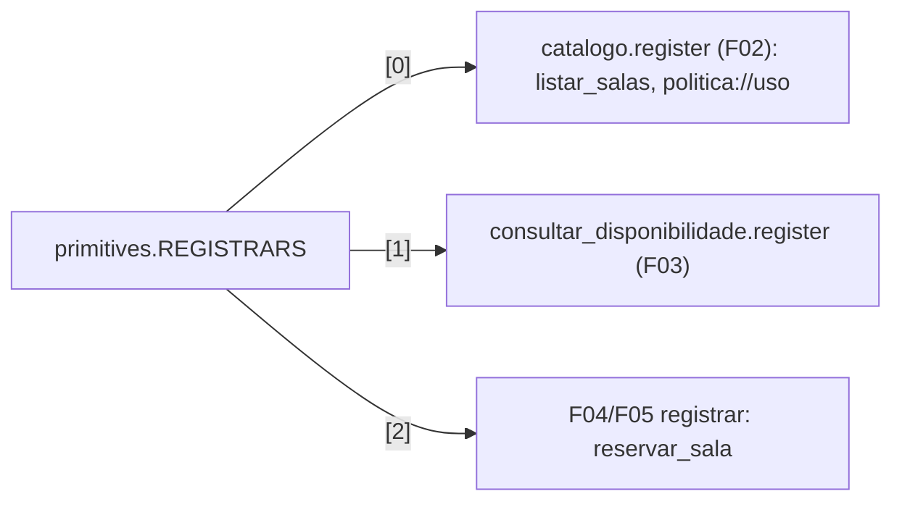

# Technical Specification: Availability and Policy Validation

**Complexity:** simple

## 1. Technical Overview

### What

F03 adds the MCP tool `consultar_disponibilidade` to the `central-de-salas` server built by F01. It also adds the shared, MCP-independent policy rules that every booking path in the server reuses. The rules live in a new pure module, `servidor_mcp/regras.py`, which provides:

- timestamp interpretation: ISO 8601 with an explicit offset, converted to the policy time zone `-03:00`;
- the **shared validation routine**: room existence, timestamp parsing, interval validity, usage window and maximum duration, in the PRD order, returning either a validated request or the first failure with its exact Portuguese message;
- **conflict detection**: the reservations of the F01 ledger that overlap a given room and interval, as half-open intervals, sorted by start instant then id.

F03 also adds `servidor_mcp/resultados.py`, a one-function builder that turns a failure message into a `complete` execution-error tool result (`isError: true`, exactly one text block, text equal to the message). Then it adds the tool module `servidor_mcp/primitives/consultar_disponibilidade.py`, which connects the three pieces and registers in `primitives.REGISTRARS` right after F02's registrar.

### Why

- F03, F04 (`reservar_sala`) and F05 (MRTR alternatives and retry) must give the same answer for the same input: the same messages, the same rule order, the same overlap semantics. The PRD (F03 user story 4, F04 Consumes, F05 Consumes) asks for one validation routine. Keeping it pure (no MCP types, no I/O, no clock) means a tool body or an SDK resolver can call it. F05 resolvers can re-run on every MRTR round, and the routine supports that too.
- The SDK has two ways to end a tool call with `isError: true`. Raising `ToolError` adds the prefix `Error executing tool <tool name>: `, so the text then differs between `consultar_disponibilidade` and `reservar_sala`. Returning an explicit `CallToolResult` keeps the text byte-identical to the PRD message (Section 3.1, verified). F03 owns the builder so that F04 and F05 produce the same bytes.
- `datetime.fromisoformat` accepts different inputs on Python 3.10 and on 3.11+ (`Z`, basic format, 1-digit fractions). The evaluator runs on any Python ≥ 3.10, so the same request could pass on one machine and fail on another. F03 therefore defines its own explicit timestamp grammar (Section 5.4).

### Scope

**Included (PRD F03 Capabilities and Experience; full scope, the PRD has no Core/Full split for F03):**
- Tool `consultar_disponibilidade` with required string arguments `sala`, `inicio`, `fim` and `outputSchema` `Disponibilidade` (`sala`, `livre`, `conflitos: ConflitoOut[]`). The `tools/list` entry is identical to the one captured in `exemplos/wire/01-tools-list.json`.
- The pure rules module: timestamp interpretation, the shared validation routine, the interval value with half-open overlap, and conflict detection over the F01 ledger.
- The execution-error result builder, shared by F03, F04 and F05.
- Five exact validation messages and the tool description, added to `mensagens.py` in an F03 block.
- Registration of the F03 registrar as `REGISTRARS[1]`, after F02's `catalogo.register`.
- The test-fixture default switch that activates the gated cross-feature tests (Section 7; identical to F02's A13).

**Output contracts (PRD F03 Provides):**

| PRD Provides item | Exposed as | Module | Consumers |
|---|---|---|---|
| Shared validation routine (room existence, timestamp parsing, interval validity, usage window, maximum duration) returning the exact execution-error message | `validar_pedido(catalogo, sala, inicio, fim)` → `PedidoValidado` or `FalhaDeValidacao` (`regra`, `mensagem`); `interpretar_horario(valor)` | `regras.py` | F04, F05 |
| Conflict detection returning the conflicting reservations (id, inicio, fim, responsavel) for a room and interval | `conflitos_no_intervalo(reservas, sala_id, intervalo)` → ordered tuple of F01 `Reserva`; `Intervalo.sobrepoe(outro)` | `regras.py` | F04, F05 |
| (Added by F03, A2) Execution-error result carrying exactly the failure text | `erro_de_execucao(mensagem)` → SDK `CallToolResult` with `isError: true` | `resultados.py` | F04, F05 |
| Tool `consultar_disponibilidade` over MCP | `tools/list` entry and `tools/call` contract (Section 5) | `primitives/consultar_disponibilidade.py` | Direct MCP clients, validator checks 1, 2, 10–12 |

**Input contracts (PRD F03 Consumes):**

| PRD Consumes item | Provided by F01 as | Used for |
|---|---|---|
| F01: room catalog (id) | `Dominio.catalogo` (`CatalogoDeSalas`: exact-id lookup returning `Sala` or `None`) | Rule 1; the validated request carries the `Sala` (its `capacidade` is what F05 needs) |
| F01: reservation ledger (id, sala, inicio, fim, responsavel) | `Dominio.reservas` (`LivroDeReservas.da_sala(id)`: lock-protected snapshot in insertion order) | Conflict detection; entries returned verbatim |

**Excluded / deferred:**
- Reservation creation, `res-NNNN` id generation and `politica` in the result (F04)
- Alternatives, elicitation, `requestState` and `-32021` (F05). F03 supplies the routine F05 calls per candidate room. The capacity filter, sort order and cap of 3 belong to F05
- `listar_salas` and `politica://uso` (F02)
- Reading per-request client capabilities: `consultar_disponibilidade` never needs elicitation (A25)
- Any agent-side behavior (F06–F09)

### Requirements (from PRD Capabilities and Experience)

| ID | Requirement | PRD source |
|---|---|---|
| R1 | Tool `consultar_disponibilidade` with required string arguments `sala`, `inicio`, `fim`. `outputSchema` `Disponibilidade` requires `sala` (string), `livre` (boolean) and `conflitos` (`ConflitoOut[]` with `id`, `inicio`, `fim`, `responsavel`) | Capabilities 1 |
| R2 | Timestamps are ISO 8601 with an explicit UTC offset and are converted to `-03:00` for policy checks | Capabilities 2 |
| R3 | Validation order, first failure wins: (1) room, (2) timestamp, (3) `fim` ≤ `inicio`, (4) usage window, (5) duration > 120 min. Each failure is returned as `isError: true` inside a `complete` result with one text block carrying the exact message | Capabilities 3 |
| R4 | Boundaries are inclusive: `08:00–10:00`, `18:00–20:00` and exactly 120 minutes are valid | Capabilities 4 |
| R5 | Overlap uses half-open intervals: two intervals conflict iff `a.inicio < b.fim` and `b.inicio < a.fim`. Back-to-back bookings do not conflict | Capabilities 5 |
| R6 | A success returns `structuredContent = {"sala", "livre", "conflitos"}`, with conflicts sorted by `inicio` then `id`, plus one text block holding the same JSON | Capabilities 6 |
| R7 | No rule depends on the current date; past dates are valid | Capabilities 7 |
| R8 | Availability and booking share one validation routine and one conflict detection, so both tools always return the same errors for the same input | User story 4; F03 Provides; F04/F05 Consumes |

**UX flows (PRD Experience 1–4), all on `2026-11-03` in `-03:00`:**

| # | Request | Response |
|---|---|---|
| 1 | `sala-garagem` 14:00–15:00 | `complete`, `isError: false`, `{"sala": "sala-garagem", "livre": false, "conflitos": [res-0001 … "responsavel": "Marty"]}` |
| 2 | `sala-aquario` 07:00–08:00 | `isError: true`, `Fora da janela de uso: a politica permite reservas entre 08:00 e 20:00` |
| 3 | `sala-aquario` 09:00–12:00 | `isError: true`, `Duracao acima do limite: a politica permite no maximo 2 horas` |
| 4 | `sala-aquario` 10:00–09:00 | `isError: true`, `Intervalo invalido: fim deve ser posterior a inicio` |

**Request flow:** client `POST /mcp` `tools/call consultar_disponibilidade` → F01 request log line → SDK inbound ladder → SDK argument validation (missing or non-string argument → SDK `isError`, A17) → tool body → `validar_pedido` → on failure, `erro_de_execucao(mensagem)` → on success, `conflitos_no_intervalo(sala, intervalo)` → `Disponibilidade` model → SDK builds `structuredContent` plus one indented-JSON text block.

## 2. Architecture Impact

### Affected components

| Path | Change |
|---|---|
| `servidor-mcp/src/servidor_mcp/regras.py` | New: pure policy rules and conflict detection (shared with F04/F05) |
| `servidor-mcp/src/servidor_mcp/resultados.py` | New: execution-error result builder (shared with F04/F05) |
| `servidor-mcp/src/servidor_mcp/primitives/consultar_disponibilidade.py` | New: output models and `register(server, dominio)` |
| `servidor-mcp/src/servidor_mcp/primitives/__init__.py` | Modified: F03 registrar inserted as `REGISTRARS[1]` |
| `servidor-mcp/src/servidor_mcp/mensagens.py` | Modified: F03 block appended (five messages and the tool description) |
| `servidor-mcp/pyproject.toml` | Modified: direct dependency `pydantic==2.13.5` (A21) |
| `servidor-mcp/tests/conftest.py` | Modified: `fresh_app` defaults to the production `REGISTRARS` (A24) |
| `servidor-mcp/tests/**` | New test files (Section 7) |

### Component and data flow



### Registry position



## 3. Technical Decisions

| Decision | Chosen Approach | Alternative Considered | Trade-off |
|---|---|---|---|
| Where the rules live | Pure module `servidor_mcp/regras.py` beside `dominio.py` (F01's recommended placement). It imports only F01 domain types, `mensagens` and the standard library | Rules inside the tool module | One more module. In exchange F04/F05 import the rules without importing an MCP primitive, and unit tests run without a server |
| Shape of the routine's outcome | Returns a value: `PedidoValidado` or `FalhaDeValidacao` (A3) | Raise a validation exception | Callers branch with a type check instead of try/except. Resolvers that re-run per round stay simple, and the routine never raises for any string input |
| Surfacing a failure | Tool return annotation `Annotated[CallToolResult, Disponibilidade]`. A failure returns `erro_de_execucao(mensagem)`; a success returns a `Disponibilidade` instance | Raise `ToolError(mensagem)` | The text is exactly the PRD message, with no `Error executing tool …:` prefix, and `outputSchema` is still derived from `Disponibilidade` (verified, Section 3.1). The tool needs the `Annotated` form instead of a plain model annotation |
| Timestamp parsing | Explicit grammar with ASCII digits and calendar validation, independent of the Python version (Section 5.4, A4) | `datetime.fromisoformat` | A little more code. Results are identical on Python 3.10–3.14 |
| Policy time zone | Fixed offset `-03:00` (A10) | IANA zone `America/Sao_Paulo` via `zoneinfo` | No DST rules apply (the PRD states `-03:00`). No `tzdata` dependency on Windows |
| Output models | Pydantic models `ConflitoOut` and `Disponibilidade` inside the F03 tool module, field order as in the wire capture | A shared models module | No file is edited at the same time as F02 or F04. The generated `outputSchema` equals the captured one byte for byte (verified) |
| Registration flags | `name="consultar_disponibilidade"`, description from `mensagens`, `structured_output=True`; no `title`, no `annotations` (A19, A20) | Add `readOnlyHint` annotations | `tools/list` stays identical to `exemplos/wire/01`. A schema-derivation regression fails at startup instead of silently dropping `outputSchema` |

### 3.1 SDK facts relied upon

Verified during spec writing against the installed `mcp==2.3.0` in the repo-root `.venv`, by reading `mcp/server/mcpserver/{server.py,tools/base.py,utilities/func_metadata.py,exceptions.py}` and running an in-process probe registered through `build_server` and called with `fresh_app`-style requests:

| # | Fact | Evidence |
|---|---|---|
| S1 | A tool whose return annotation is `Annotated[CallToolResult, Model]` publishes `outputSchema` derived from `Model`. At runtime a returned `Model` instance is converted normally (structured content plus a text block), and a returned `CallToolResult` passes through unchanged. Its structured content is validated only when `is_error` is false | `func_metadata.py` (`func_metadata` CallToolResult branch, `convert_result`); probe |
| S2 | A registered function `consultar_disponibilidade(sala: str, inicio: str, fim: str)` with description `Diz se uma sala esta livre no intervalo, e quais reservas conflitam.` and models `ConflitoOut`/`Disponibilidade` (fields in R1 order) yields a `tools/list` entry **equal** to the `consultar_disponibilidade` entry of `exemplos/wire/01-tools-list.json` (`inputSchema.title` `consultar_disponibilidadeArguments`, `outputSchema.title` `Disponibilidade`, `$defs.ConflitoOut`). This holds with and without `structured_output=True` | probe (dict equality) |
| S3 | A success returns `structuredContent = model_dump(mode="json")` and exactly one `TextContent` whose text is `pydantic_core.to_json(model, indent=2)`, so `json.loads(text) == structuredContent`. `isError: false`, `resultType: complete`, HTTP 200 | `convert_result`, `_convert_to_content`; probe |
| S4 | A returned `CallToolResult(is_error=True, content=[TextContent(text=m)])` arrives as `{"content": [{"type": "text", "text": m}], "isError": true, "resultType": "complete"}` with no `structuredContent`, HTTP 200 | probe |
| S5 | A raised `ToolError(m)` arrives as text `Error executing tool consultar_disponibilidade: m` | `tools/base.py` `Tool.run`; probe |
| S6 | Missing or non-string arguments fail the SDK argument model before the body runs. The result is `isError: true`, HTTP 200, with text `Error executing tool consultar_disponibilidade: <n> validation error(s) for consultar_disponibilidadeArguments …` (pydantic does not coerce `5` to a string) | `Tool.run` (`ValidationError` branch); probe |
| S7 | An unexpected exception in the body becomes `UnexpectedToolError`: `isError: true` with the text `Error executing tool consultar_disponibilidade` only, and the traceback logged at ERROR on stderr | `exceptions.py`, `server.py` `_handle_call_tool` |
| S8 | A synchronous tool function runs on a worker thread (`anyio.to_thread.run_sync`), which resolves F01's open item V8 | `func_metadata.py` `call_fn` |
| S9 | `mcp.types` re-exports the same `CallToolResult` and `TextContent` objects as `mcp_types` | probe (`is` identity) |
| S10 | `mcp==2.3.0` declares `pydantic>=2.12.0`; the venv resolved `pydantic 2.13.5` | `mcp-2.3.0.dist-info/METADATA`, `pydantic.VERSION` |

### 3.2 Assumptions and Auto-Accept Decisions

Every row is a decision the PRD did not answer. Each names the Auto-Accept Policy row that produced it, so the user can review and override it.

| # | Decision | Choice | Auto-Accept policy row |
|---|---|---|---|
| A1 | Module placement | Rules in `servidor_mcp/regras.py` (F01 recommendation); result builder in `servidor_mcp/resultados.py` at package level, next to `request_context.py`, so `primitives/` holds only registrars; tool in `servidor_mcp/primitives/consultar_disponibilidade.py` | Technical decision with a clear recommendation |
| A2 | Failure surfacing | Policy failures return an explicit `CallToolResult` built by `erro_de_execucao`, with text exactly the message and no SDK prefix. `ToolError` is never raised for policy failures. F04/F05 are expected to reuse the builder (Section 3.3) | Technical decision with a clear recommendation |
| A3 | Outcome of the routine | Returns `PedidoValidado` or `FalhaDeValidacao` instead of raising. The codebase has both styles (`loader.py` raises startup errors; `CatalogoDeSalas.get` returns `None`); a value fits an expected domain outcome and resolvers better | Multiple conflicting patterns in the codebase |
| A4 | Timestamp grammar | `YYYY-MM-DD` `T` `HH:MM` [`:SS` [`.` 1–6 digits]] followed by `Z` or `±HH:MM`. ASCII digits only, uppercase `T` and `Z`, no surrounding whitespace, whole string must match (Section 5.4) | Partial PRD specification |
| A5 | Offset spellings | `Z` is accepted as an explicit UTC offset; `-00:00` is treated as UTC. Rejected: lowercase `t`/`z`, a space separator, basic-format offsets (`-0300`), hour-only offsets (`-03`) and offset-less values | Partial PRD specification |
| A6 | Calendar validity | Impossible dates or times (month 13, `02-30`, `02-29` in a non-leap year, hour 24, minute or second 60, offset ≥ 24 h or offset minutes ≥ 60, year 0000) → `Horario invalido: <valor>` | Partial PRD specification |
| A7 | Representable range | A timestamp whose conversion to `-03:00` leaves the `datetime` range (e.g. `0001-01-01T00:30:00+01:00`) → `Horario invalido: <valor>` | Partial PRD specification |
| A8 | Rule 2 details | `inicio` is checked before `fim`; the message carries the value exactly as received (no trimming, no normalization) | Partial PRD specification |
| A9 | Room matching | Exact, case-sensitive id match with no trimming. `Sala-Aquario` and `" sala-aquario"` are unknown; an empty id yields `Sala inexistente: ` | Partial PRD specification |
| A10 | Policy time zone | Fixed `-03:00` offset (`timezone(timedelta(hours=-3))`), never an IANA zone | Technical decision with a clear recommendation |
| A11 | Window rule | Valid only when `inicio` and `fim`, converted to `-03:00`, fall on the **same** calendar date, `inicio` ≥ `08:00:00` and `fim` ≤ `20:00:00`. Fractions count: `20:00:00.000001` is after 20:00. An interval spanning two `-03:00` dates is a window violation, even when duration is also exceeded | Partial PRD specification |
| A12 | Duration rule | Computed on instants: exactly 120 minutes is valid; anything longer, even by 1 µs, → `Duracao acima do limite: …` | Partial PRD specification |
| A13 | Conflict ordering | Sorted by the **instant** of `inicio` (not its string), ties by `id` ascending as a string (ids are zero-padded `res-NNNN`) | Partial PRD specification |
| A14 | Conflict content | Conflicts are returned exactly as stored in the ledger (strings verbatim, original offsets kept), matching F04's verbatim storage | Partial PRD specification |
| A15 | Malformed ledger entries | A ledger entry whose `inicio` or `fim` fails the grammar is ignored by conflict detection. This cannot happen with the shipped `dados/` or with F04-created entries (F04 stores only validated values) | Partial PRD specification |
| A16 | Concurrency | Conflict detection works on the ledger's lock-protected room snapshot. Atomic check-then-append for bookings belongs to F04; same-millisecond races are out of scope (PRD Section 7) | Technical decision with a clear recommendation |
| A17 | Argument-shape errors | Missing or non-string arguments are left to SDK argument validation (S6): `isError: true` with the SDK's prefixed text, HTTP 200, no F03 message. Mirrors PRD F04 Error Handling ("rejected by inputSchema validation (SDK error)") | Partial PRD specification |
| A18 | Internal failure | The PRD defines no message for F03 internal failures, and the tool is read-only. An unexpected exception is left to the SDK (S7): generic `isError` text plus a traceback on stderr | Partial PRD specification |
| A19 | Descriptor extras | No `title` and no tool `annotations` (e.g. `readOnlyHint`), so the descriptor equals the wire capture | Technical decision with a clear recommendation |
| A20 | `structured_output=True` | Set on registration (same as F02) so an underivable output schema fails at startup | Technical decision with a clear recommendation |
| A21 | Dependencies | F03 imports `pydantic` directly, so `pydantic==2.13.5` is pinned as a direct dependency (already installed transitively, inside `mcp`'s `>=2.12.0`; same precedent as F01 A3 for `uvicorn`). SDK result types are imported from `mcp.types` (S9), so `mcp` remains the only MCP distribution imported directly. No package is newly installed | Feature requires new technology not present in the codebase |
| A22 | String placement | The five messages and the tool description go into `mensagens.py` in an F03-labelled block, following F01 A22 and the F02 convention | Technical decision with a clear recommendation |
| A23 | Tool function kind | Synchronous function (S8). Ledger reads are lock-protected, and the rules are CPU-trivial | Technical decision with a clear recommendation |
| A24 | Test fixture default | `fresh_app()` without arguments builds the server with the production `REGISTRARS`; explicit `registrars=(...)` callers are unchanged. The current default is an empty tuple, so the F01 gated cross-feature tests can never activate. This is the same change as F02 A13; whichever feature lands first makes it | Technical decision with a clear recommendation |
| A25 | Capabilities | The tool never reads client capabilities and behaves the same with `clientCapabilities: {}` | Technical decision with a clear recommendation |
| A26 | Failure identifiers | `FalhaDeValidacao.regra` is one of `sala_inexistente`, `horario_invalido`, `intervalo_invalido`, `fora_da_janela`, `duracao_acima_do_limite`, so consumers and tests can branch without matching strings | Technical decision with a clear recommendation |

### 3.3 Coordination points

| Shared artifact | Rule |
|---|---|
| `primitives/__init__.py` `REGISTRARS` (F02 is written in parallel) | Final order is `catalogo.register` (F02), then `consultar_disponibilidade.register` (F03), then the F04/F05 registrar, matching `exemplos/wire/01`. If F03 lands before F02, F03's entry is the only element and F02 inserts its own ahead of it. On a merge conflict on the tuple, keep both entries in this order |
| `mensagens.py` | Append-only. F03 adds its own labelled block and edits no existing constant |
| `tests/conftest.py` `fresh_app` default | Same change as F02 A13 (A24); the second feature to land finds it done |
| F04 / F05 error texts | To keep "same exact message" byte-identical (Cross-Feature criterion, F04 AC 5), F04 and F05 surface validation failures from the tool body through `erro_de_execucao`. A failure raised as `ToolError` from a resolver would add the SDK prefix (S5). The validator would still pass (it checks containment), but `test_reservar_sala_returns_same_messages_as_consultar_disponibilidade` would fail. F05 can run the routine inside a resolver to decide whether to ask, and leave the failure result to the body |
| F05 resolvers | The routine and conflict detection are deterministic, side-effect free and thread-safe, so they can re-run on every MRTR round |

### 3.4 PRD traceability

| PRD block | Spec destination |
|---|---|
| F03 Consumes | Section 1 Input contracts; Section 5.3 |
| F03 Provides | Section 1 Output contracts; Section 5.3 |
| F03 Capabilities | Section 1 R1–R7; Sections 5.2, 5.4, 6 |
| F03 Experience | Section 1 UX flows; Section 5.2 examples |
| F03 user stories | R8 (shared routine) |
| F03 Error Handling | No such block in the PRD; the Capabilities validation list plus A17/A18 form Section 5.5 |
| Section 9 F03 acceptance criteria | Section 7 acceptance tests and traceability matrix |
| Section 9 Cross-Feature Integration criteria naming F03 | Section 7 `test_cross_feature_f03.py` |

## 4. Component Overview

**Backend:**

| File Path | New/Modified | Purpose | Key Responsibilities |
|---|---|---|---|
| `servidor-mcp/src/servidor_mcp/regras.py` | New | Pure policy rules shared by F03/F04/F05 | Constants: policy offset `-03:00`, window `08:00`–`20:00`, maximum duration 120 min. `interpretar_horario(valor) -> datetime \| None` (Section 5.4; the result is aware and expressed in `-03:00`; returns `None`, never raises, on any grammar, calendar or range failure). Frozen `Intervalo` (`inicio`, `fim` aware datetimes) with `sobrepoe(outro) -> bool` (half-open, offset-independent). Frozen `PedidoValidado` and `FalhaDeValidacao` (Section 6). `validar_pedido(catalogo, sala, inicio, fim)` applies rules 1–5 in order and returns the first failure, built from `mensagens`, or the validated request. `conflitos_no_intervalo(reservas, sala_id, intervalo) -> tuple[Reserva, ...]` reads `reservas.da_sala(sala_id)`, ignores entries that cannot be interpreted (A15), keeps those overlapping `intervalo` and sorts them by (`inicio` instant, `id`). No I/O, no clock, no randomness, no MCP imports |
| `servidor-mcp/src/servidor_mcp/resultados.py` | New | Shared execution-error result | `erro_de_execucao(mensagem: str) -> CallToolResult` with `is_error=True`, exactly one `TextContent(type="text", text=mensagem)` and no structured content. Types imported from `mcp.types` |
| `servidor-mcp/src/servidor_mcp/primitives/consultar_disponibilidade.py` | New | F03 tool | Pydantic `ConflitoOut` (`id`, `inicio`, `fim`, `responsavel`: str, in this order) and `Disponibilidade` (`sala`: str, `livre`: bool, `conflitos`: list of `ConflitoOut`, in this order). `register(server, dominio)` registers one synchronous tool with `name="consultar_disponibilidade"`, `description=mensagens.DESCRICAO_CONSULTAR_DISPONIBILIDADE`, `structured_output=True`, parameters `sala: str, inicio: str, fim: str` (names fixed: they produce the schema titles), return annotation `Annotated[CallToolResult, Disponibilidade]`. The body calls `validar_pedido(dominio.catalogo, …)`. On failure it returns `erro_de_execucao(falha.mensagem)`; on success it returns `Disponibilidade(sala=pedido.sala.id, livre=not conflitos, conflitos=[ConflitoOut from each Reserva])`. The closure holds only `dominio`; no module-level mutable state |
| `servidor-mcp/src/servidor_mcp/primitives/__init__.py` | Modified | Registry | Imports the F03 module and places `consultar_disponibilidade.register` right after F02's entry (Section 3.3). `Registrar` alias and docstring unchanged |
| `servidor-mcp/src/servidor_mcp/mensagens.py` | Modified | Exact strings | Appends an F03 block: `SALA_INEXISTENTE = "Sala inexistente: {sala}"`, `HORARIO_INVALIDO = "Horario invalido: {valor}"`, `INTERVALO_INVALIDO = "Intervalo invalido: fim deve ser posterior a inicio"`, `FORA_DA_JANELA = "Fora da janela de uso: a politica permite reservas entre 08:00 e 20:00"`, `DURACAO_ACIMA_DO_LIMITE = "Duracao acima do limite: a politica permite no maximo 2 horas"`, `DESCRICAO_CONSULTAR_DISPONIBILIDADE = "Diz se uma sala esta livre no intervalo, e quais reservas conflitam."`. Templates are filled with `str.format`, so braces inside user values are copied literally |
| `servidor-mcp/pyproject.toml` | Modified | Manifest | Adds `pydantic==2.13.5` to `[project].dependencies` (A21); nothing else changes |

**Module boundaries for consumers (F04, F05):**

| Consumer need | Use | Rule |
|---|---|---|
| Validate a booking request | `regras.validar_pedido(dominio.catalogo, sala, inicio, fim)` | Call before any ledger write; a `FalhaDeValidacao` means no reservation |
| Surface a validation failure | `resultados.erro_de_execucao(falha.mensagem)` returned from the tool body | Do not raise `ToolError` for policy failures (Section 3.3) |
| Is the requested room free? | `regras.conflitos_no_intervalo(dominio.reservas, pedido.sala.id, pedido.intervalo)` is empty | Store `pedido.inicio` / `pedido.fim` (verbatim strings), never re-serialized datetimes |
| Requested room capacity (F05) | `pedido.sala.capacidade` | Capacity filter, ordering and cap of 3 are F05's |
| Is candidate room X free (F05)? | `conflitos_no_intervalo(dominio.reservas, x.id, pedido.intervalo)` is empty | Same interval instance for every candidate |
| Retry with sealed values (F05) | `validar_pedido(catalogo, chosen_room_id, sealed_inicio, sealed_fim)`, then conflict detection for the chosen room | Re-validation is cheap and deterministic |

**Database:** none. Nothing is written to disk; F03 only reads the F01 in-memory ledger.

## 5. API Contracts

All calls go to F01's single endpoint `POST /mcp` with the common envelope and headers defined in F01 spec Section 5.1 (`_meta` protocol version and client capabilities, `MCP-Protocol-Version`, `Mcp-Method`, `Mcp-Name: consultar_disponibilidade`). Authentication: none.

### 5.1 `tools/list` entry

**Response fragment (element of `result.tools`, position after `listar_salas` and before `reservar_sala`; equal to `exemplos/wire/01-tools-list.json`):**
```json
{
  "description": "Diz se uma sala esta livre no intervalo, e quais reservas conflitam.",
  "inputSchema": {
    "type": "object",
    "properties": {
      "sala": {"title": "Sala", "type": "string"},
      "inicio": {"title": "Inicio", "type": "string"},
      "fim": {"title": "Fim", "type": "string"}
    },
    "required": ["sala", "inicio", "fim"],
    "title": "consultar_disponibilidadeArguments"
  },
  "name": "consultar_disponibilidade",
  "outputSchema": {
    "$defs": {
      "ConflitoOut": {
        "properties": {
          "id": {"title": "Id", "type": "string"},
          "inicio": {"title": "Inicio", "type": "string"},
          "fim": {"title": "Fim", "type": "string"},
          "responsavel": {"title": "Responsavel", "type": "string"}
        },
        "required": ["id", "inicio", "fim", "responsavel"],
        "title": "ConflitoOut",
        "type": "object"
      }
    },
    "properties": {
      "sala": {"title": "Sala", "type": "string"},
      "livre": {"title": "Livre", "type": "boolean"},
      "conflitos": {"items": {"$ref": "#/$defs/ConflitoOut"}, "title": "Conflitos", "type": "array"}
    },
    "required": ["sala", "livre", "conflitos"],
    "title": "Disponibilidade",
    "type": "object"
  }
}
```

### 5.2 `tools/call consultar_disponibilidade`

- **Method:** POST
- **Path:** `/mcp` (`Mcp-Method: tools/call`, `Mcp-Name: consultar_disponibilidade`)
- **Authentication:** none

**Request (`params`):**

| Field | Type | Required | Validation | Description |
|---|---|---|---|---|
| `name` | `string` | Yes | `consultar_disponibilidade` | Tool name |
| `arguments.sala` | `string` | Yes | SDK: must be a string. F03 rule 1: exact id in `dados/salas.json` | Room id |
| `arguments.inicio` | `string` | Yes | SDK: string. F03 rule 2: grammar of Section 5.4 | Interval start, ISO 8601 with explicit offset |
| `arguments.fim` | `string` | Yes | SDK: string. F03 rules 2–5 | Interval end, ISO 8601 with explicit offset |
| `_meta` | `object` | Yes | F01 envelope | Capabilities are not read by F03 (A25) |

**Request Example** (headers: `Content-Type: application/json`, `Accept: application/json, text/event-stream`, `MCP-Protocol-Version: 2026-07-28`, `Mcp-Method: tools/call`, `Mcp-Name: consultar_disponibilidade`):
```json
{
  "jsonrpc": "2.0",
  "id": "5c0e9a1b7d3f",
  "method": "tools/call",
  "params": {
    "name": "consultar_disponibilidade",
    "arguments": {
      "sala": "sala-garagem",
      "inicio": "2026-11-03T14:00:00-03:00",
      "fim": "2026-11-03T15:00:00-03:00"
    },
    "_meta": {
      "io.modelcontextprotocol/protocolVersion": "2026-07-28",
      "io.modelcontextprotocol/clientCapabilities": {"elicitation": {"form": {}}},
      "traceparent": "00-4bf92f3577b34da6a3ce929d0e0e4736-00f067aa0ba902b7-01"
    }
  }
}
```
Stderr (F01): `mcp method=tools/call id=5c0e9a1b7d3f name=consultar_disponibilidade traceparent=00-4bf92f3577b34da6a3ce929d0e0e4736-00f067aa0ba902b7-01`

**Response (Success - 200):**

| Field | Type | Description |
|---|---|---|
| `result.resultType` | `string` | `complete` |
| `result.isError` | `boolean` | `false` |
| `result.structuredContent.sala` | `string` | Requested room id (as received; it matched the catalog exactly) |
| `result.structuredContent.livre` | `boolean` | `true` iff `conflitos` is empty |
| `result.structuredContent.conflitos[]` | `ConflitoOut[]` | Overlapping reservations of that room, sorted by `inicio` instant then `id`; each has `id`, `inicio`, `fim`, `responsavel` verbatim from the ledger |
| `result.content` | `TextContent[]` | Exactly one text block; `json.loads(text) == structuredContent` (indented JSON, SDK-produced) |
| `result._meta["io.modelcontextprotocol/serverInfo"]` | `object` | SDK stamp (F01) |

**Response Example (Experience 1, conflict):**
```json
{
  "jsonrpc": "2.0",
  "id": "5c0e9a1b7d3f",
  "result": {
    "content": [
      {
        "text": "{\n  \"sala\": \"sala-garagem\",\n  \"livre\": false,\n  \"conflitos\": [\n    {\n      \"id\": \"res-0001\",\n      \"inicio\": \"2026-11-03T14:00:00-03:00\",\n      \"fim\": \"2026-11-03T15:00:00-03:00\",\n      \"responsavel\": \"Marty\"\n    }\n  ]\n}",
        "type": "text"
      }
    ],
    "isError": false,
    "resultType": "complete",
    "structuredContent": {
      "sala": "sala-garagem",
      "livre": false,
      "conflitos": [
        {"id": "res-0001", "inicio": "2026-11-03T14:00:00-03:00", "fim": "2026-11-03T15:00:00-03:00", "responsavel": "Marty"}
      ]
    },
    "_meta": {"io.modelcontextprotocol/serverInfo": {"name": "central-de-salas", "version": "1.0.0"}}
  }
}
```

**Response Example (free: `sala-garagem` 15:00–16:00, back-to-back with `res-0001`):**
```json
{
  "jsonrpc": "2.0",
  "id": 8,
  "result": {
    "content": [{"text": "{\n  \"sala\": \"sala-garagem\",\n  \"livre\": true,\n  \"conflitos\": []\n}", "type": "text"}],
    "isError": false,
    "resultType": "complete",
    "structuredContent": {"sala": "sala-garagem", "livre": true, "conflitos": []},
    "_meta": {"io.modelcontextprotocol/serverInfo": {"name": "central-de-salas", "version": "1.0.0"}}
  }
}
```

**Response (Execution error - 200):**

| Field | Type | Description |
|---|---|---|
| `result.resultType` | `string` | `complete` |
| `result.isError` | `boolean` | `true` |
| `result.content` | `TextContent[]` | Exactly one text block whose text **equals** the message in the error table below |
| `result.structuredContent` | — | Absent |

**Response Example (Experience 2, `sala-aquario` 07:00–08:00):**
```json
{
  "jsonrpc": "2.0",
  "id": "a3f9c2e1b0d4",
  "result": {
    "content": [{"text": "Fora da janela de uso: a politica permite reservas entre 08:00 e 20:00", "type": "text"}],
    "isError": true,
    "resultType": "complete",
    "_meta": {"io.modelcontextprotocol/serverInfo": {"name": "central-de-salas", "version": "1.0.0"}}
  }
}
```

**Error Codes** (first failing rule wins, checked in this order; MCP execution errors, not JSON-RPC errors):

| Code (`regra`) | HTTP Status | Description (exact `content[0].text`) |
|---|---|---|
| `sala_inexistente` | 200 (`isError: true`) | `Sala inexistente: <sala as received>` |
| `horario_invalido` | 200 (`isError: true`) | `Horario invalido: <inicio or fim as received>` (`inicio` checked first) |
| `intervalo_invalido` | 200 (`isError: true`) | `Intervalo invalido: fim deve ser posterior a inicio` (`fim` ≤ `inicio` as instants) |
| `fora_da_janela` | 200 (`isError: true`) | `Fora da janela de uso: a politica permite reservas entre 08:00 e 20:00` |
| `duracao_acima_do_limite` | 200 (`isError: true`) | `Duracao acima do limite: a politica permite no maximo 2 horas` |
| SDK argument validation | 200 (`isError: true`) | `Error executing tool consultar_disponibilidade: …` for a missing or non-string argument (A17) |
| SDK unexpected error | 200 (`isError: true`) | `Error executing tool consultar_disponibilidade` (A18) |
| `-32602` / `-32020` | 400 | Envelope or header errors from the F01 ladder; unchanged by F03 |

### 5.3 Shared routine contract (in-process interface for F04 and F05)

| Element | Module | Input | Output | Guarantees |
|---|---|---|---|---|
| `interpretar_horario` | `regras` | raw `str` | aware `datetime` in `-03:00`, or `None` | Section 5.4 grammar; never raises; result does not depend on the Python version |
| `Intervalo` | `regras` | `inicio`, `fim` aware datetimes | value with `sobrepoe(outro) -> bool` | `True` iff `self.inicio < outro.fim` and `outro.inicio < self.fim`; independent of offsets |
| `validar_pedido` | `regras` | `CatalogoDeSalas`; `sala`, `inicio`, `fim` raw strings | `PedidoValidado` or `FalhaDeValidacao` | Rules 1–5 in order, first failure wins; pure and deterministic; never raises for any string input |
| `conflitos_no_intervalo` | `regras` | `LivroDeReservas`, room id, `Intervalo` | `tuple[Reserva, ...]`, possibly empty | Room filter by exact id; half-open overlap; sorted by (`inicio` instant, `id`); entries verbatim; uninterpretable entries skipped; reads a lock-protected snapshot |
| `erro_de_execucao` | `resultados` | message `str` | SDK `CallToolResult` | `is_error=True`, one text block equal to the message, no structured content |

### 5.4 Timestamp grammar (rule 2)

A value is valid iff the **entire** string matches the grammar below, its fields form a real calendar date and time, and its conversion to `-03:00` stays within the `datetime` range. Digits are ASCII `0`–`9` only.

| Part | Form | Constraint |
|---|---|---|
| date | `YYYY-MM-DD` | year 0001–9999, month 01–12, day valid for the month (leap years honored) |
| separator | `T` | uppercase only |
| time | `HH:MM` or `HH:MM:SS` or `HH:MM:SS.f` | hour 00–23, minute 00–59, second 00–59; fraction of 1–6 digits, right-padded to microseconds |
| offset | `Z` or `+HH:MM` or `-HH:MM` | hours 00–23, minutes 00–59; `Z` and `±00:00` mean UTC |

| Value | Result |
|---|---|
| `2026-11-03T14:00:00-03:00` | valid |
| `2026-11-03T17:00:00Z` | valid (= 14:00 in `-03:00`) |
| `2026-11-03T14:00-03:00` | valid |
| `2026-11-03T14:00:00.5-03:00` | valid |
| `2026-11-03T14:00:00` | `Horario invalido: 2026-11-03T14:00:00` (no offset) |
| `2026-11-03 14:00:00-03:00`, `2026-11-03t14:00:00-03:00`, `2026-11-03T14:00:00-0300`, `2026-11-03T14:00:00-03` | invalid |
| `2026-02-30T10:00:00-03:00`, `2026-11-03T24:00:00-03:00`, `2026-11-03T14:00:00+24:00` | invalid |
| `" 2026-11-03T14:00:00-03:00"` (leading space) | invalid; the message keeps the space |

### 5.5 Error Handling

The PRD has no Error Handling block for F03. This table consolidates the Capabilities validation list with A15, A17 and A18.

| Condition | Detection | Outcome |
|---|---|---|
| Unknown room (exact match) | `validar_pedido` rule 1 | `isError: true`, `Sala inexistente: <sala>` |
| Unparseable, offset-less or impossible timestamp | rule 2 (`inicio` first) | `isError: true`, `Horario invalido: <valor>` |
| `fim` ≤ `inicio` | rule 3 | `isError: true`, `Intervalo invalido: fim deve ser posterior a inicio` |
| Start before 08:00, end after 20:00, or the interval spans two `-03:00` dates | rule 4 | `isError: true`, `Fora da janela de uso: a politica permite reservas entre 08:00 e 20:00` |
| Longer than 120 minutes | rule 5 | `isError: true`, `Duracao acima do limite: a politica permite no maximo 2 horas` |
| Missing or non-string argument | SDK argument model | `isError: true`, SDK-prefixed text; the body is not run |
| Unexpected exception in the body | SDK | Generic `isError` text; traceback on stderr |
| Ledger entry with an uninterpretable timestamp | `conflitos_no_intervalo` | Entry ignored; the call succeeds |
| Envelope or header problems | F01 ladder | `-32602` / `-32020`, HTTP 400; logged by F01 |

No path writes to the ledger or to disk.

## 6. Data Model

In-memory only; no database, no migration. F03 adds value objects; F01's `Sala`, `Reserva`, `CatalogoDeSalas` and `LivroDeReservas` are reused unchanged.

**Value: `Intervalo`** (`regras.py`, frozen)

| Field | Type | Nullable | Default | Description |
|---|---|---|---|---|
| `inicio` | `datetime` (aware, `-03:00`) | No | - | Start instant |
| `fim` | `datetime` (aware, `-03:00`) | No | - | End instant; the interval is half-open `[inicio, fim)` |

**Value: `PedidoValidado`** (`regras.py`, frozen)

| Field | Type | Nullable | Default | Description |
|---|---|---|---|---|
| `sala` | `Sala` (F01) | No | - | Catalog room (gives `id` and `capacidade`) |
| `inicio` | `str` | No | - | Start exactly as received (F04 stores it verbatim) |
| `fim` | `str` | No | - | End exactly as received |
| `intervalo` | `Intervalo` | No | - | Parsed instants; satisfies rules 3–5 |

**Value: `FalhaDeValidacao`** (`regras.py`, frozen)

| Field | Type | Nullable | Default | Description |
|---|---|---|---|---|
| `regra` | `str` | No | - | One of the five codes in Section 5.2 (A26) |
| `mensagem` | `str` | No | - | Exact text from `mensagens`, already filled |

**Output model: `Disponibilidade` / `ConflitoOut`** (`primitives/consultar_disponibilidade.py`, Pydantic; field order is part of the contract because it drives `outputSchema` and the text block)

| Model | Field | Type | Description |
|---|---|---|---|
| `Disponibilidade` | `sala` | `str` | Requested room id |
| `Disponibilidade` | `livre` | `bool` | No conflicts |
| `Disponibilidade` | `conflitos` | `list[ConflitoOut]` | Sorted conflicts |
| `ConflitoOut` | `id` | `str` | Reservation id |
| `ConflitoOut` | `inicio` | `str` | Verbatim start |
| `ConflitoOut` | `fim` | `str` | Verbatim end |
| `ConflitoOut` | `responsavel` | `str` | Verbatim responsible person |

**Constants (`regras.py`):**

| Constant | Value | Purpose |
|---|---|---|
| Policy offset | `-03:00` (fixed) | Rules 4 and 5 |
| Window start / end | `08:00:00` / `20:00:00`, inclusive | Rule 4 |
| Maximum duration | 120 minutes, inclusive | Rule 5 |

**Invariants:**

| Invariant | Definition | Purpose |
|---|---|---|
| Rule order | 1 → 2 (`inicio`, `fim`) → 3 → 4 → 5, first failure returned | Same error for the same input in every tool |
| Read-only | F03 never appends to or mutates the ledger | Availability queries have no side effects |
| Determinism | No clock, randomness or environment in the rules; the output depends only on the inputs and the ledger snapshot | Byte-identical repeated answers (R7) |

## 7. Testing Strategy

**Test File Structure** (run from `servidor-mcp/` with the `dev` extra installed):

| Test File | Test Type | Target | Coverage Goal |
|---|---|---|---|
| `servidor-mcp/tests/unit/test_regras.py` | Unit | `regras.py` | 100% |
| `servidor-mcp/tests/unit/test_resultados.py` | Unit | `resultados.py` | 100% |
| `servidor-mcp/tests/integration/test_consultar_disponibilidade.py` | Integration (in-process ASGI via `fresh_app` + `mcp_post`; one subprocess test via `start_server`) | Tool module, registry wiring, wire contract | 95% |
| `servidor-mcp/tests/integration/test_cross_feature_f03.py` | Integration (in-process, partly gated) | F03 contracts consumed by F04/F05 and provided by F01 | n/a |

**Fixture changes (`tests/conftest.py`):**

| Fixture | Change |
|---|---|
| `fresh_app` | `make()` without arguments builds the server with `servidor_mcp.primitives.REGISTRARS` (A24); `make(registrars=(...))` is unchanged; docstring updated. This activates `test_cross_feature_f01.py::test_consultar_disponibilidade_reports_seeded_reservations` |

Helpers local to the F03 test files: `h(hora, dia="2026-11-03", offset="-03:00")` builds a timestamp; `consultar(client, mcp_post, sala, inicio, fim, **options)` sends the call with a validator-style random 12-hex id and returns the parsed `result`.

**`unit/test_regras.py`** (catalog and ledger from the repository `dados/`, loaded read-only; custom `LivroDeReservas` instances for ordering and malformed-entry cases):

| Test Function | Description | Assertions |
|---|---|---|
| `test_interpretar_horario_accepts_explicit_offset_forms` | Parametrized: `-03:00`, `Z`, `+00:00`, `-05:00`, no seconds, 1-digit and 6-digit fractions | Aware datetime in `-03:00` equal to the expected instant |
| `test_interpretar_horario_rejects_invalid_forms` | Parametrized: no offset, date only, space separator, lowercase `t`/`z`, `-0300`, `-03`, 7-digit fraction, basic format `20261103T140000-0300`, leading or trailing space, empty, `amanha`, non-ASCII digits | `None`, no exception |
| `test_interpretar_horario_rejects_impossible_calendar_values` | Month 13, `2026-02-30`, `2026-02-29`, hour 24, minute 60, second 60, offset `+24:00`, offset `-03:60`, year `0000` | `None` |
| `test_interpretar_horario_accepts_leap_day` | `2028-02-29T10:00:00-03:00` | Valid |
| `test_interpretar_horario_out_of_range_after_conversion_is_none` | `0001-01-01T00:30:00+01:00` | `None` (A7) |
| `test_valid_request_returns_validated_request` | `sala-aquario` 09:00–10:00 | `PedidoValidado`; `sala.capacidade == 4`; `inicio` and `fim` identical strings; `intervalo` instants correct |
| `test_unknown_room_returns_exact_message` | `sala-delorean` | `regra == "sala_inexistente"`, `mensagem == "Sala inexistente: sala-delorean"` |
| `test_room_match_is_exact` | `Sala-Aquario`, `" sala-aquario"`, `""` | `Sala inexistente: <raw value>` |
| `test_timestamp_without_offset_returns_exact_message` | `inicio = 2026-11-03T14:00:00` | `Horario invalido: 2026-11-03T14:00:00` |
| `test_inicio_is_checked_before_fim` | Both invalid; only `fim` invalid | Message carries `inicio`; then carries `fim` |
| `test_inverted_or_empty_interval` | 10:00–09:00; 10:00–10:00 | `Intervalo invalido: fim deve ser posterior a inicio` |
| `test_interval_compares_instants_not_strings` | `inicio 2026-11-03T10:00:00-03:00`, `fim 2026-11-03T12:30:00Z` (= 09:30 local) | `intervalo_invalido` |
| `test_window_violations` | Parametrized: 07:00–08:00, 07:59:59.999999–08:30, 19:30–20:01, 19:00–`20:00:00.000001` | `fora_da_janela` |
| `test_window_boundaries_are_inclusive` | 08:00–10:00; 18:00–20:00 | Valid |
| `test_window_is_evaluated_in_policy_offset` | `10:00Z`–`12:00Z` (07:00–09:00 local) → violation; `11:00Z`–`13:00Z` → valid; `22:00Z`–`23:00Z` (19:00–20:00 local) → valid | As stated |
| `test_interval_spanning_two_policy_days_is_window_violation` | `2026-11-03T19:00:00-03:00` – `2026-11-04T09:00:00-03:00` | `fora_da_janela` (not duration) |
| `test_duration_limit` | 09:00–11:00 valid; 09:00–11:00:01, 09:00–`11:00:00.000001`, 09:00–12:00 → violation | `duracao_acima_do_limite` for the violations |
| `test_first_failure_wins` | Parametrized: unknown room plus bad timestamp → room; bad `inicio` plus inverted → timestamp; inverted plus outside window (07:00–06:00) → interval; outside window plus too long (07:00–10:00) → window | Expected `regra` |
| `test_past_and_future_dates_are_valid` | 2001-01-02 and 2099-12-30, 09:00–10:00 | `PedidoValidado` |
| `test_validation_is_deterministic` | Same inputs twice, valid and invalid | Equal results |
| `test_messages_match_prd_text` | The five rendered messages | Equal to the PRD strings and to the validator constants `ERRO_SALA`, `ERRO_JANELA`, `ERRO_DURACAO`, `ERRO_INTERVALO` |
| `test_intervalo_sobrepoe_is_half_open` | Table: back-to-back (both orders), identical, partial overlap, containment, contained, disjoint, same instant in different offsets | Expected booleans |
| `test_back_to_back_is_not_a_conflict` | `sala-garagem` 15:00–16:00 and 13:00–14:00 | Empty tuple |
| `test_overlaps_with_seeded_reservation` | `sala-garagem` 14:00–15:00, 14:30–15:30, 13:30–14:01, 13:00–15:00, 14:15–14:45 | `(res-0001,)` |
| `test_only_the_requested_room_is_considered` | `sala-porao` 14:00–15:00 | Empty |
| `test_overlap_detected_across_offsets` | `sala-garagem` `17:30Z`–`18:30Z` → `res-0001`; `18:00Z`–`19:00Z` → empty | As stated |
| `test_conflicts_sorted_by_instant_then_id` | Ledger extended with entries whose string order differs from instant order (`…T16:30:00Z` vs `…T14:00:00-03:00`) and two entries with the same start instant (`res-0007`, `res-0004`) | Ordered by instant, ties `res-0004` before `res-0007` |
| `test_conflicts_are_ledger_entries_verbatim` | Seeded conflict | Returned object equals the ledger's `Reserva`; strings identical to `dados/reservas.json` |
| `test_appended_reservation_becomes_a_conflict` | Append `res-0003` `sala-aquario` 09:00–10:00, query 09:30–10:30 | `(res-0003,)` |
| `test_uninterpretable_ledger_entry_is_ignored` | Custom ledger with `inicio = "ontem"` in the queried room | Ignored; no exception (A15) |
| `test_conflict_detection_does_not_modify_ledger` | Snapshot before and after | Identical |

**`unit/test_resultados.py`:**

| Test Function | Description | Assertions |
|---|---|---|
| `test_erro_de_execucao_builds_single_text_block` | `Sala inexistente: x` | `is_error` true; exactly one `TextContent` with that text; no structured content |
| `test_erro_de_execucao_keeps_text_verbatim` | Text with braces, newline and accents | Unchanged |

**`integration/test_consultar_disponibilidade.py`** (in-process `fresh_app()` with the production registry unless stated; requests shaped like the validator's: random 12-hex id, `Mcp-Name` header):

| Test Function | Description | Assertions |
|---|---|---|
| `test_tool_listed_with_object_input_schema_requiring_sala_inicio_fim` | `tools/list` | Entry present; `inputSchema.type == "object"`; `required == ["sala", "inicio", "fim"]` |
| `test_tool_descriptor_matches_wire_capture` | `tools/list` vs the `consultar_disponibilidade` entry of `exemplos/wire/01-tools-list.json` | Dict equality |
| `test_registry_order_places_tool_between_listar_salas_and_reservar_sala` | Production `tools/list` | `consultar_disponibilidade` comes after `listar_salas` and before `reservar_sala` whenever those are present |
| `test_outside_window_returns_exact_message` | `sala-aquario` 07:00–08:00 | `isError` true; text equals the window message |
| `test_duration_over_limit_returns_exact_message` | `sala-aquario` 09:00–12:00 | Duration message |
| `test_inverted_interval_returns_exact_message` | `sala-aquario` 10:00–09:00 | Interval message |
| `test_unknown_room_returns_exact_message` | `sala-delorean` 09:00–10:00 | `Sala inexistente: sala-delorean` |
| `test_two_hours_ending_at_20_is_free` | `sala-aquario` 18:00–20:00 | `livre` true, `conflitos == []` |
| `test_back_to_back_with_seeded_reservation_is_free` | `sala-garagem` 15:00–16:00 | `livre` true |
| `test_seeded_conflict_reported` | `sala-garagem` 14:00–15:00 | `structuredContent` equals the Section 5.2 example exactly |
| `test_timestamp_without_offset_returns_exact_message` | `inicio = 2026-11-03T14:00:00` | `Horario invalido: 2026-11-03T14:00:00` |
| `test_success_has_structured_content_and_one_equal_text_block` | Free and conflicting queries | `resultType` complete; `isError` false; exactly one content item of type text; `json.loads(text) == structuredContent` |
| `test_error_results_are_complete_with_single_exact_text_block` | Parametrized over the five failures | `resultType` complete; `isError` true; one content item; text **equals** the message (no prefix); no `structuredContent` |
| `test_missing_argument_is_rejected_by_sdk_validation` | `arguments: {"sala": "sala-aquario"}` | HTTP 200; `isError` true; text starts with `Error executing tool consultar_disponibilidade`; ledger length unchanged |
| `test_non_string_argument_is_rejected_by_sdk_validation` | `sala: 5` | HTTP 200; `isError` true |
| `test_result_does_not_depend_on_client_capabilities` | Same query with `{"elicitation": {"form": {}}}` and `{}` | Identical `result` bodies |
| `test_reservation_appended_to_ledger_becomes_visible` | `dominio.reservas.adicionar(res-0003 sala-aquario 09:00–10:00)` (simulates F04), then query 09:00–10:00 | `livre` false; conflict equals the appended entry's fields |
| `test_conflicts_sorted_at_tool_level` | Appended entries as in the unit ordering test | `conflitos` ids in the expected order |
| `test_query_does_not_modify_ledger` | Several queries | `len(dominio.reservas)` unchanged (2) |
| `test_identical_requests_produce_identical_results` | Same query twice with different ids | `result` objects byte-identical once serialized |
| `test_request_is_logged_with_tool_name` | Query with `traceparent` | Captured log line `mcp method=tools/call id=<id> name=consultar_disponibilidade traceparent=<tp>` |
| `test_real_process_serves_consultar_disponibilidade` | `start_server()`; `tools/list`, then `sala-garagem` 14:00–15:00 over HTTP | Tool listed; `res-0001` reported; stderr has a line with `name=consultar_disponibilidade` |

**`integration/test_cross_feature_f03.py`** has one test per Section 9 Cross-Feature Integration criterion that names F03, plus one supporting test for F04 AC 4. Tests that need `reservar_sala` skip with the reason "consumer feature not registered yet" while it is absent from `tools/list`. They activate automatically when F04/F05 land.

| Test Function | Cross-Feature criterion | Assertions |
|---|---|---|
| `test_consultar_disponibilidade_reports_seeded_reservations_from_foundation_ledger` | F03 reports `res-0001` and `res-0002` from the ledger seeded by F01 on a fresh process (active now) | `sala-garagem` 14:00–15:00 → `[res-0001]` and `sala-fusca` 16:00–17:00 → `[res-0002]`, each conflict equal field by field to its `dados/reservas.json` entry |
| `test_reservar_sala_returns_same_messages_as_consultar_disponibilidade` | `reservar_sala` (F04) returns the same exact messages as F03 for room, timestamp, interval, window and duration failures (gated) | For each failing input, both tools return `isError` true with **equal** text; ledger length unchanged |
| `test_alternatives_offered_only_when_conflict_detected` | F05 offers alternatives only when F03 conflict detection reports at least one conflict (gated on `reservar_sala`) | Fresh app per case (`sala-garagem` 15:00–16:00, `sala-garagem` 14:00–15:00, `sala-aquario` 09:00–10:00). If `consultar_disponibilidade` says `livre: true`, `reservar_sala` returns `complete` with `reservado` true. If `reservar_sala` returns `input_required`, the preceding query reported ≥ 1 conflict |
| `test_reservation_completed_through_retry_is_visible_to_consultar_disponibilidade` | A reservation completed through an F05 retry is created by the F04 routine, gets the next `res-NNNN` and is visible to a following `consultar_disponibilidade` (gated; also skipped if the first call does not return `input_required`) | `sala-garagem` 14:00–15:00 → `input_required`. Retry with a new id, the same key, `accept` `sala-fusca` and the untouched `requestState` → `complete`, `reserva == "res-0003"`. `consultar_disponibilidade` `sala-fusca` 14:00–15:00 → `livre` false with that id. Uses whatever request-state configuration F05 adds to `fresh_app` |
| `test_booking_by_reservar_sala_is_visible_to_consultar_disponibilidade` | Supporting: F04 AC 4 / F04 Experience 2 (gated) | `reservar_sala` `sala-aquario` 09:00–10:00 `Doc` → `complete`. `consultar_disponibilidade` with the same interval → `livre` false; conflict `id` equals `reserva`; `inicio`, `fim`, `responsavel` verbatim |

**Acceptance criteria traceability (PRD Section 9, F03):**

| # | Acceptance criterion | Test(s) |
|---|---|---|
| 1 | `inputSchema` of type object requiring `sala`, `inicio`, `fim` | `test_tool_listed_with_object_input_schema_requiring_sala_inicio_fim`, `test_tool_descriptor_matches_wire_capture` |
| 2 | `sala-aquario` 07:00–08:00 → `isError` with the window message | `test_outside_window_returns_exact_message`, `test_window_violations` |
| 3 | `sala-aquario` 09:00–12:00 → `isError` with the duration message | `test_duration_over_limit_returns_exact_message`, `test_duration_limit` |
| 4 | `sala-aquario` 10:00–09:00 → `isError` with the interval message | `test_inverted_interval_returns_exact_message`, `test_inverted_or_empty_interval` |
| 5 | `sala-delorean` → `isError` with `Sala inexistente: sala-delorean` | `test_unknown_room_returns_exact_message` (unit and integration) |
| 6 | `sala-aquario` 18:00–20:00 → `livre: true` | `test_two_hours_ending_at_20_is_free`, `test_window_boundaries_are_inclusive` |
| 7 | `sala-garagem` 15:00–16:00 → `livre: true` | `test_back_to_back_with_seeded_reservation_is_free`, `test_back_to_back_is_not_a_conflict` |
| 8 | `sala-garagem` 14:00–15:00 → `livre: false` with `res-0001` | `test_seeded_conflict_reported`, `test_overlaps_with_seeded_reservation` |
| 9 | `2026-11-03T14:00:00` → `Horario invalido: 2026-11-03T14:00:00` | `test_timestamp_without_offset_returns_exact_message` (unit and integration) |

**Validator checks exercised by F03 (`validador/validar.py`):** check 2 (every tool has an object `inputSchema`), checks 10–12 (window, duration, inverted interval on `consultar_disponibilidade`, matched by containment), and F03's share of check 1 (`consultar_disponibilidade` listed). They are reproduced in-process by the acceptance tests above, using the validator's request shape.
