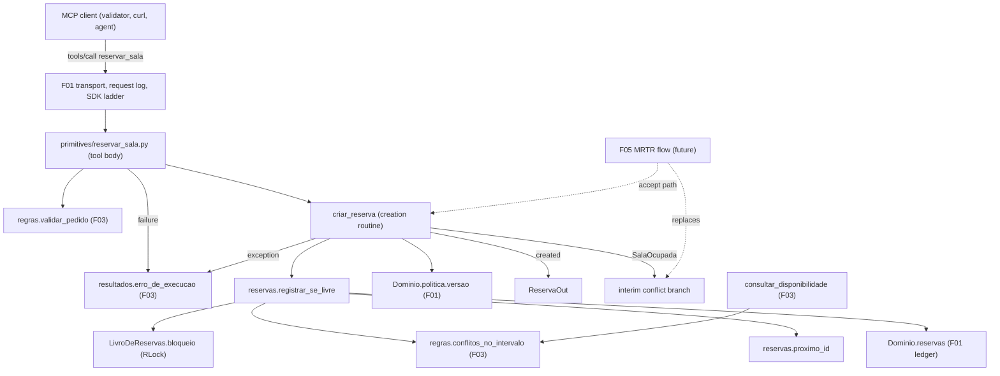
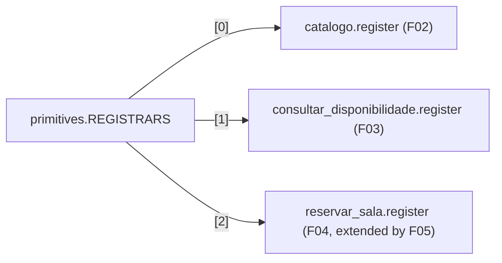

# Technical Specification: Room Reservation

**Complexity:** simple

## 1. Technical Overview

### What

F04 adds the MCP tool `reservar_sala` to the `central-de-salas` server. When the requested interval is valid and free, the tool creates a reservation in the F01 in-memory ledger and returns a complete receipt (`ReservaOut`). It is built from three pieces:

- a new MCP-independent module, `servidor_mcp/reservas.py`. It holds the `res-NNNN` id generator and the **atomic check-then-append**: under the ledger's lock it runs F03 conflict detection, computes the next id and appends the record;
- a small change to F01's `LivroDeReservas` in `dominio.py`. The lock becomes re-entrant, and an exclusive-section context manager is exposed so that `reservas.py` can make the check, the id computation and the append one atomic step;
- the tool module `servidor_mcp/primitives/reservar_sala.py`. It holds the `ReservaOut` output model and the **reservation creation routine** `criar_reserva`, which F05 reuses, plus `register(server, dominio)`. The registrar becomes `REGISTRARS[2]`, after F03.

The tool body applies F03's `validar_pedido` first and surfaces any failure through F03's `erro_de_execucao`, so the error text is byte-identical to `consultar_disponibilidade`. Then it calls `criar_reserva`. On a conflict, F04 only provides a clearly marked **interim** branch that returns an execution error. F05 replaces that branch with the MRTR flow (`input_required`, alternatives, `-32021`).

### Why

- F05's accept path and F04's direct path must create reservations the same way: same id sequence, same verbatim storage, same `politica` (PRD F05 Consumes, Cross-Feature criterion "created by the F04 routine"). So creation is one routine that F05 calls, not logic inside the tool body.
- F01's ledger lock covers each single read and each append, but not a read followed by an append. Without one exclusive section, two concurrent requests for the same slot could both pass the conflict check, and two concurrent bookings could compute the same next id. Sync tool functions run on worker threads (F03 S8), so this race is real, even if rare. A re-entrant lock lets the existing `da_sala`/`todas`/`adicionar` calls run inside the section without deadlocking, and F03's `conflitos_no_intervalo` needs no change.
- The `tools/list` entry must equal `exemplos/wire/01-tools-list.json`, and the success body must equal `exemplos/wire/02-tools-call-livre.json`. Both were verified with an in-process probe (Section 3.1).

### Scope

**Included (PRD F04 Capabilities, Experience and Error Handling; full scope, because the PRD has no Core/Full split for F04):**
- Tool `reservar_sala` with required string arguments `sala`, `inicio`, `fim`, `responsavel` and `outputSchema` `ReservaOut` (nullable `reserva`, `sala`, `inicio`, `fim`, `responsavel`, `politica`, `motivo`; boolean `reservado`). The descriptor is identical to the wire capture.
- F03 validation first, with the same exact messages.
- Atomic creation of `res-NNNN` (highest numeric suffix + 1, zero-padded to 4 digits), storing `inicio`, `fim` and `responsavel` verbatim.
- Success result: `structuredContent` (`ReservaOut`, with `reservado: true`, `politica` = declared policy version, `motivo: null`) plus exactly one text block holding the same JSON.
- Internal failure while appending → `isError: true`, `Falha interna ao registrar a reserva`, ledger unchanged.
- New reservations are immediately visible to `consultar_disponibilidade` and `reservar_sala`; nothing is written to disk.
- The interim conflict branch (A6), replaced by F05.
- Adjustment of two F05-gated cross-feature tests in `test_cross_feature_f01.py`, so that registering `reservar_sala` does not turn them red before F05 lands (A15).

**Output contracts (PRD F04 Provides):**

| PRD Provides item | Exposed as | Module | Consumers |
|---|---|---|---|
| Reservation creation routine that appends a record to the ledger and returns the `ReservaOut` result | `criar_reserva(dominio, pedido, responsavel)` → `ReservaOut` (created) or `SalaOcupada` (conflicts; nothing appended) or `CallToolResult` (internal failure). The atomic core is `reservas.registrar_se_livre(livro, pedido, responsavel)` | `primitives/reservar_sala.py`, `reservas.py` | F05 (accept path, and the first-call free path once F05 owns the body) |
| `ReservaOut` result | Pydantic model `ReservaOut` (field order and defaults fixed by the wire capture). F05 builds its decline/cancel result as `ReservaOut(reservado=False, motivo=...)` | `primitives/reservar_sala.py` | F05, and F08 through MCP |
| Tool `reservar_sala` over MCP | `tools/list` entry and `tools/call` contract (Section 5) | `primitives/reservar_sala.py` | F06/F08 (agent), validator checks 1, 2, 9 |

**Input contracts (PRD F04 Consumes):**

| PRD Consumes item | Provided as | Used for |
|---|---|---|
| F01: reservation ledger | `Dominio.reservas` (`LivroDeReservas`: `todas()`, `da_sala()`, `adicionar()`; lock-protected) | Id computation, conflict check, append |
| F01: declared policy version | `Dominio.politica.versao` (`2026-11-01`) | `ReservaOut.politica` |
| F03: shared validation routine and conflict detection | `regras.validar_pedido`, `regras.conflitos_no_intervalo`, `resultados.erro_de_execucao` | Rule 1–5 failures; the free/occupied decision inside the exclusive section |

**Excluded / deferred:**
- `input_required`, alternatives, elicitation, `requestState`, `-32021`, decline/cancel results and `Sem alternativas disponiveis no intervalo` (F05). F04 leaves only the interim conflict branch (A6)
- Reading per-request client capabilities: a conflict-free booking behaves the same with `clientCapabilities: {}` (F05 AC 4)
- Editing, cancelling or listing reservations; persistence (PRD Out of Scope)
- Any agent-side behavior (F06–F09)

### Requirements (from PRD Capabilities and Experience)

| ID | Requirement | PRD source |
|---|---|---|
| R1 | Tool `reservar_sala` with required string arguments `sala`, `inicio`, `fim`, `responsavel`. `outputSchema` `ReservaOut` has nullable `reserva`, `sala`, `inicio`, `fim`, `responsavel`, `politica`, `motivo` and boolean `reservado` | Capabilities 1 |
| R2 | The F03 validation routine runs first; any failure returns the same exact message as `consultar_disponibilidade` | Capabilities 2 |
| R3 | A free interval creates `res-NNNN`, where NNNN is the highest numeric suffix in the ledger + 1, zero-padded to 4 digits. The first booking in a fresh process is `res-0003` | Capabilities 3 |
| R4 | `inicio`, `fim` and `responsavel` are stored and returned exactly as received | Capabilities 4 |
| R5 | `politica` = declared policy version; `reservado: true`; `motivo: null` | Capabilities 5 |
| R6 | New reservations are immediately visible to `consultar_disponibilidade` and `reservar_sala` in the same process; nothing is written to disk | Capabilities 6 |
| R7 | A conflicting interval is handed to the MRTR flow (F05). Until F05 lands, the interim branch applies (A6) | Capabilities 7 |
| R8 | The success result has `structuredContent` plus exactly one text block with the same JSON | F04 Provides; AC 3 |

**UX flows (PRD Experience 1–2), on `2026-11-03` in `-03:00`, fresh process:**

| # | Request | Response |
|---|---|---|
| 1 | `reservar_sala` `sala-aquario` 09:00–10:00, `responsavel` `Doc` | `resultType: complete`, `isError: false`, `structuredContent.reserva = "res-0003"` (body equals `exemplos/wire/02`) |
| 2 | then `consultar_disponibilidade` `sala-aquario` 09:00–10:00 | `livre: false`, conflict `res-0003` with `inicio`, `fim`, `responsavel` verbatim |

**Request flow:** client `POST /mcp` `tools/call reservar_sala` → F01 request log line → SDK inbound ladder → SDK argument validation (missing or non-string argument → SDK `isError`, body not run) → tool body → `validar_pedido` → on failure `erro_de_execucao(mensagem)` → else `criar_reserva` → inside `livro.bloqueio()`: `conflitos_no_intervalo` → if empty: `proximo_id` + `adicionar` → `ReservaOut` → SDK builds `structuredContent` + one indented-JSON text block. A non-empty conflict list → `SalaOcupada` → interim conflict branch (F05 later). An exception → `erro_de_execucao(FALHA_INTERNA_RESERVA)`.

## 2. Architecture Impact

### Affected components

| Path | Change |
|---|---|
| `servidor-mcp/src/servidor_mcp/reservas.py` | New: id generator, `SalaOcupada`, atomic `registrar_se_livre` |
| `servidor-mcp/src/servidor_mcp/dominio.py` | Modified: `LivroDeReservas` lock becomes `threading.RLock`; new `bloqueio()` context manager |
| `servidor-mcp/src/servidor_mcp/primitives/reservar_sala.py` | New: `ReservaOut`, `reserva_confirmada`, `criar_reserva`, interim conflict branch, `register` |
| `servidor-mcp/src/servidor_mcp/primitives/__init__.py` | Modified: F04 registrar appended as `REGISTRARS[2]` |
| `servidor-mcp/src/servidor_mcp/mensagens.py` | Modified: F04 block appended (tool description, internal-failure message, interim conflict message) |
| `servidor-mcp/tests/**` | New test files; `test_dominio.py` extended; two F05 gates in `test_cross_feature_f01.py` tightened (Section 7) |

### Component and data flow



### Registry position



## 3. Technical Decisions

| Decision | Chosen Approach | Alternative Considered | Trade-off |
|---|---|---|---|
| Atomicity of check, id and append | Re-entrant ledger lock plus `LivroDeReservas.bloqueio()`. `reservas.registrar_se_livre` holds it across `conflitos_no_intervalo`, `proximo_id` and `adicionar` (A3) | Module-level lock in `reservas.py`; or a new ledger method that takes a predicate | Touches an F01 file (two small edits). In return the F03 rules stay unchanged and lock-agnostic, there is no global state, and each ledger instance (each `fresh_app`) has its own lock |
| Where the creation logic lives | Domain core in `reservas.py` (no MCP or pydantic types). The MCP-facing `criar_reserva` returns `ReservaOut` and sits in the tool module (A1) | Everything in the tool module | One more module. The id and atomicity logic gets unit tests without a server, matching F03's `regras.py`/tool split |
| Outcome shape of the creation routine | Returns a value for each outcome: `ReservaOut`, `SalaOcupada` or `CallToolResult` (internal failure) (A4) | Raise on conflict or failure | Same style as F03 A3. The tool body (and later F05) branches with `isinstance`, and two of the three values can be returned directly from the tool body |
| Surfacing errors | Validation failures and the internal failure go through `erro_de_execucao`; `ToolError` is never raised (A5) | `ToolError` | No `Error executing tool reservar_sala:` prefix, so the text matches `consultar_disponibilidade` byte for byte (F03 Section 3.3) |
| Return annotation | `Annotated[CallToolResult, ReservaOut]`. A success returns the model; errors return `CallToolResult` | Plain `ReservaOut` annotation | Same pattern as F03. `outputSchema` is derived from `ReservaOut` (verified). F05 may widen the annotation for `InputRequiredResult` |
| Conflict before F05 exists | Interim execution error `Sala ocupada no intervalo: <sala>` in one isolated function that F05 replaces (A6) | Return `Sem alternativas disponiveis no intervalo`; or raise | The text is wrong-on-purpose and short-lived. Inventing F05 semantics is worse, and the branch exists only between the F04 and F05 merges |

### 3.1 SDK and contract facts relied upon

Verified during spec writing against the installed `mcp==2.3.0` in the repo-root `.venv`, with an in-process probe that registers the planned signature and model:

| # | Fact | Evidence |
|---|---|---|
| S1 | `reservar_sala(sala: str, inicio: str, fim: str, responsavel: str) -> Annotated[CallToolResult, ReservaOut]`, with description `Reserva uma sala. Se o intervalo estiver ocupado, pergunta qual alternativa usar.` and `structured_output=True`, yields `inputSchema` and `outputSchema` **equal** to the `reservar_sala` entry of `exemplos/wire/01-tools-list.json` (no `required` in `outputSchema`, `reservado` default `true`, the others `anyOf [string, null]` default `null`) | probe (dict equality) |
| S2 | `pydantic_core.to_json(ReservaOut(...), indent=2)` for the Experience 1 values is **byte-identical** to the text block of `exemplos/wire/02-tools-call-livre.json`, including `"motivo": null` (so no `exclude_none`) | probe |
| S3 | A success returns `structuredContent = model_dump(mode="json")` plus exactly one text block with `json.loads(text) == structuredContent`; a returned `CallToolResult(is_error=True)` passes through unchanged | F03 spec S1, S3, S4 |
| S4 | Missing or non-string arguments are rejected by the SDK argument model before the body runs: `isError: true`, HTTP 200, text `Error executing tool reservar_sala: … validation error(s) for reservar_salaArguments …` | F03 spec S6 |
| S5 | Synchronous tool functions run on a worker thread, so concurrent `tools/call` requests can run the body at the same time | F03 spec S8 |
| S6 | `MCPServer` calls the SDK's `configure_logging(log_level)`, which installs a stderr handler. A `logging` ERROR record from the server package reaches stderr | `mcp/server/mcpserver/server.py`, `utilities/logging.py` |
| S7 | `LivroDeReservas.adicionar` appends atomically and raises `ValueError` on a duplicate id, leaving the ledger unchanged (F01 A20) | `dominio.py` |

### 3.2 Assumptions and Auto-Accept Decisions

Each row is a decision the PRD did not answer, labeled with the Auto-Accept Policy row that produced it so the user can review and override it.

| # | Decision | Choice | Auto-Accept policy row |
|---|---|---|---|
| A1 | Module placement | Domain core in `servidor_mcp/reservas.py` (next to `regras.py`). `ReservaOut`, `criar_reserva` and the registrar in `servidor_mcp/primitives/reservar_sala.py`. The output model stays in the tool module, as F03 did with `Disponibilidade` | Multiple conflicting patterns in the codebase (F03 split, rules outside and models inside the tool module, is the most recent) |
| A2 | Id generation | `proximo_id`: consider every ledger id that fully matches `res-` followed by ASCII digits, take the highest integer value, add 1, format with at least 4 digits (`res-0003`; past 9999 the number simply widens, e.g. `res-10000`). Ids that do not match are ignored; an empty ledger or no matching id gives `res-0001`. Ids are never reused within a process | Partial PRD specification |
| A3 | Atomic section | `LivroDeReservas._lock` becomes `threading.RLock`. New `bloqueio()` context manager holds it. `registrar_se_livre` runs conflict detection, id computation and append inside one `bloqueio()`. Existing method semantics are unchanged | Technical decision with a clear recommendation |
| A4 | Creation routine contract | `criar_reserva(dominio, pedido: PedidoValidado, responsavel: str)` takes an **already validated** request, so the caller (F04 body, F05 retry) validates first. It returns `ReservaOut` when created, `SalaOcupada` (conflicts tuple, nothing appended) when the room is taken, or the internal-failure `CallToolResult` | Technical decision with a clear recommendation |
| A5 | Error surfacing | Explicit `CallToolResult` through `erro_de_execucao` for validation and internal failures; never `ToolError` (F03 A2 / Section 3.3) | Technical decision with a clear recommendation |
| A6 | Interim conflict behavior (before F05) | `isError: true`, one text block `Sala ocupada no intervalo: <sala>`, no reservation created. Implemented in one private function in the tool module, which F05 replaces with the MRTR decision order (alternatives, `-32021`, `input_required`). The message constant is labeled "interim, removed by F05" | Description too vague (PRD defers the conflict path to F05 without an interim contract) |
| A7 | Internal failure | Any exception raised inside `registrar_se_livre` (id computation or append) is caught in `criar_reserva`. It is logged with traceback at ERROR via `logging.getLogger(__name__)` (reaches stderr, S6), and the routine returns `erro_de_execucao("Falha interna ao registrar a reserva")`. The ledger is unchanged because the append is the last, atomic step | Partial PRD specification |
| A8 | Argument content | No checks beyond the SDK string type and F03 rules. `responsavel` is accepted verbatim, including empty or whitespace-only values, because the PRD forbids normalization and F08 already guarantees a non-empty name | Partial PRD specification |
| A9 | `sala` in the result | `pedido.sala.id`, which equals the received value because F03 matches ids exactly | Technical decision with a clear recommendation |
| A10 | `inicio`/`fim` stored | `pedido.inicio` / `pedido.fim`, the raw received strings, never re-serialized datetimes (F03 consumer rule) | Technical decision with a clear recommendation |
| A11 | Capabilities | `reservar_sala` never reads client capabilities in F04, so a free booking with `clientCapabilities: {}` succeeds (F05 AC 4 holds by construction) | Technical decision with a clear recommendation |
| A12 | Registration flags | `name="reservar_sala"`, description from `mensagens`, `structured_output=True`; no `title`, no tool `annotations`, so the descriptor equals the wire capture (same as F03 A19/A20) | Technical decision with a clear recommendation |
| A13 | String placement | `DESCRICAO_RESERVAR_SALA`, `FALHA_INTERNA_RESERVA` and the interim `SALA_OCUPADA` go into an F04 block appended to `mensagens.py`; existing constants are not edited | Technical decision with a clear recommendation |
| A14 | Tool function kind | Synchronous function (same as F03 A23). The exclusive section uses a `threading` lock, which is correct for worker-thread execution (S5) | Technical decision with a clear recommendation |
| A15 | F05-gated tests that F04 would activate | `test_alternatives_never_smaller_than_requested_room` and `test_32021_exactly_when_request_capabilities_lack_form_elicitation` in `test_cross_feature_f01.py` gate only on `reservar_sala` being listed, so they would fail once F04 registers it. F04 adds a `need_mrtr` helper there: it sends the conflicting call with form capabilities and skips with "F05 MRTR flow not implemented yet" unless `resultType` is `input_required`. Other tests that need F05 already self-skip | Technical decision with a clear recommendation |
| A16 | Dependencies | None added; `pydantic` and `mcp` are already pinned | Feature requires new technology not present in the codebase (not triggered) |
| A17 | Concurrency scope | Two concurrent requests for the same free slot: exactly one gets a reservation, and the other takes the conflict branch. Concurrent bookings of different slots get distinct consecutive ids | Partial PRD specification |

### 3.3 Coordination points

| Shared artifact | Rule |
|---|---|
| `primitives/__init__.py` `REGISTRARS` | F04 appends `reservar_sala.register` as the third entry. F05 does **not** add a registrar; it extends `primitives/reservar_sala.py` (the docstring already says "F04/F05 reservar_sala") |
| `primitives/reservar_sala.py` conflict branch | F05 replaces the interim function and removes `SALA_OCUPADA` from `mensagens.py`. The free path and the validation-first order stay as they are (PRD F05 decision order: validation → conflict check → if free, create via F04 → else alternatives) |
| `criar_reserva` for F05's accept path | F05 validates the sealed values for the chosen room with `validar_pedido`, then calls `criar_reserva`. `SalaOcupada` means "chosen alternative was booked meanwhile", so a new `input_required` round follows |
| `ReservaOut` for F05 decline/cancel | `ReservaOut(reservado=False, motivo="recusado" or "cancelado")`, all other fields default `null`; byte-identical to `exemplos/wire/11` (same model, S2) |
| `dominio.py` (F01 file) | Only the lock type and the new `bloqueio()` change. Public method semantics stay the same |
| `test_cross_feature_f01.py` (F01 file) | Only the two F05 gates change (A15). F05 may remove `need_mrtr` once it lands |

### 3.4 PRD traceability

| PRD block | Spec destination |
|---|---|
| F04 Consumes | Section 1 Input contracts |
| F04 Provides | Section 1 Output contracts; Sections 5.3, 6 |
| F04 Capabilities | Section 1 R1–R8; Sections 5.2, 6 |
| F04 Experience | Section 1 UX flows; Section 5.2 examples |
| F04 user stories (receipt, visibility) | R5, R6 |
| F04 Error Handling | Section 5.4 |
| Section 9 F04 acceptance criteria | Section 7 traceability matrix |
| Section 9 Cross-Feature Integration criteria naming F04 | Section 7 `test_cross_feature_f04.py` |

## 4. Component Overview

**Backend:**

| File Path | New/Modified | Purpose | Key Responsibilities |
|---|---|---|---|
| `servidor-mcp/src/servidor_mcp/reservas.py` | New | Reservation domain core (no MCP, no pydantic, no I/O, no clock) | Frozen `SalaOcupada` (`conflitos: tuple[Reserva, ...]`, non-empty). `proximo_id(reservas: Iterable[Reserva]) -> str` (A2). `registrar_se_livre(livro: LivroDeReservas, pedido: PedidoValidado, responsavel: str) -> Reserva \| SalaOcupada`: inside `livro.bloqueio()` it calls `regras.conflitos_no_intervalo(livro, pedido.sala.id, pedido.intervalo)`. When that is non-empty it returns `SalaOcupada` without writing. Otherwise it builds `Reserva(id=proximo_id(livro.todas()), sala=pedido.sala.id, inicio=pedido.inicio, fim=pedido.fim, responsavel=responsavel)`, calls `livro.adicionar(...)` and returns the new `Reserva`. Exceptions propagate to the caller |
| `servidor-mcp/src/servidor_mcp/dominio.py` | Modified | Ledger exclusive section | `LivroDeReservas.__init__` creates a `threading.RLock`. New `bloqueio()` (context manager) acquires and releases it, so that nested `todas`/`da_sala`/`adicionar` calls from the same thread re-enter. Nothing else changes |
| `servidor-mcp/src/servidor_mcp/primitives/reservar_sala.py` | New | F04 tool and creation routine | Pydantic `ReservaOut` with fields in this order: `reserva: str \| None = None`, `reservado: bool = True`, `sala`, `inicio`, `fim`, `responsavel`, `politica`, `motivo` (all `str \| None = None`). `reserva_confirmada(reserva: Reserva, versao: str) -> ReservaOut` (`reservado` true, `motivo` None). `criar_reserva(dominio, pedido, responsavel) -> ReservaOut \| SalaOcupada \| CallToolResult` (A4, A7). Private `_responder_conflito(pedido, ocupada) -> CallToolResult` (interim, A6). `register(server, dominio)` registers one synchronous tool, `name="reservar_sala"`, `description=mensagens.DESCRICAO_RESERVAR_SALA`, `structured_output=True`, parameters `sala: str, inicio: str, fim: str, responsavel: str` (names fixed: they produce the schema), return `Annotated[CallToolResult, ReservaOut]`. Body: `validar_pedido` → failure → `erro_de_execucao`; else `criar_reserva` → `SalaOcupada` → `_responder_conflito`; any other value returned as is. The closure holds only `dominio`; no module-level mutable state |
| `servidor-mcp/src/servidor_mcp/primitives/__init__.py` | Modified | Registry | Imports `reservar_sala` and sets `REGISTRARS = (catalogo.register, consultar_disponibilidade.register, reservar_sala.register)` |
| `servidor-mcp/src/servidor_mcp/mensagens.py` | Modified | Exact strings | Appends an F04 block: `DESCRICAO_RESERVAR_SALA = "Reserva uma sala. Se o intervalo estiver ocupado, pergunta qual alternativa usar."`, `FALHA_INTERNA_RESERVA = "Falha interna ao registrar a reserva"`, `SALA_OCUPADA = "Sala ocupada no intervalo: {sala}"` (commented as interim, removed by F05) |

**Database:** none. The ledger is in memory (F01); nothing is written to disk.

## 5. API Contracts

All calls go to F01's single endpoint `POST /mcp` with the common envelope and headers (F01 spec Section 5.1: `_meta` protocol version and client capabilities, `MCP-Protocol-Version`, `Mcp-Method: tools/call`, `Mcp-Name: reservar_sala`). Authentication: none.

### 5.1 `tools/list` entry

The entry is the third element of `result.tools`, after `consultar_disponibilidade`. It is **equal** to the `reservar_sala` entry of `exemplos/wire/01-tools-list.json` (S1):

```json
{
  "description": "Reserva uma sala. Se o intervalo estiver ocupado, pergunta qual alternativa usar.",
  "inputSchema": {
    "type": "object",
    "properties": {
      "sala": {"title": "Sala", "type": "string"},
      "inicio": {"title": "Inicio", "type": "string"},
      "fim": {"title": "Fim", "type": "string"},
      "responsavel": {"title": "Responsavel", "type": "string"}
    },
    "required": ["sala", "inicio", "fim", "responsavel"],
    "title": "reservar_salaArguments"
  },
  "name": "reservar_sala",
  "outputSchema": {
    "properties": {
      "reserva": {"anyOf": [{"type": "string"}, {"type": "null"}], "default": null, "title": "Reserva"},
      "reservado": {"default": true, "title": "Reservado", "type": "boolean"},
      "sala": {"anyOf": [{"type": "string"}, {"type": "null"}], "default": null, "title": "Sala"},
      "inicio": {"anyOf": [{"type": "string"}, {"type": "null"}], "default": null, "title": "Inicio"},
      "fim": {"anyOf": [{"type": "string"}, {"type": "null"}], "default": null, "title": "Fim"},
      "responsavel": {"anyOf": [{"type": "string"}, {"type": "null"}], "default": null, "title": "Responsavel"},
      "politica": {"anyOf": [{"type": "string"}, {"type": "null"}], "default": null, "title": "Politica"},
      "motivo": {"anyOf": [{"type": "string"}, {"type": "null"}], "default": null, "title": "Motivo"}
    },
    "title": "ReservaOut",
    "type": "object"
  }
}
```

### 5.2 `tools/call reservar_sala`

- **Method:** POST
- **Path:** `/mcp` (`Mcp-Method: tools/call`, `Mcp-Name: reservar_sala`)
- **Authentication:** none

**Request (`params`):**

| Field | Type | Required | Validation | Description |
|---|---|---|---|---|
| `name` | `string` | Yes | `reservar_sala` | Tool name |
| `arguments.sala` | `string` | Yes | SDK: string. F03 rule 1 (exact id) | Room id |
| `arguments.inicio` | `string` | Yes | SDK: string. F03 rules 2–5 | Start, ISO 8601 with explicit offset; stored verbatim |
| `arguments.fim` | `string` | Yes | SDK: string. F03 rules 2–5 | End, ISO 8601 with explicit offset; stored verbatim |
| `arguments.responsavel` | `string` | Yes | SDK: string only (A8) | Person responsible; stored verbatim |
| `_meta` | `object` | Yes | F01 envelope | Capabilities not read by F04 (A11) |

**Request Example** (equal to `exemplos/wire/02-tools-call-livre.json`):
```json
{
  "jsonrpc": "2.0",
  "id": 2,
  "method": "tools/call",
  "params": {
    "name": "reservar_sala",
    "arguments": {
      "sala": "sala-aquario",
      "inicio": "2026-11-03T09:00:00-03:00",
      "fim": "2026-11-03T10:00:00-03:00",
      "responsavel": "Doc"
    },
    "_meta": {
      "io.modelcontextprotocol/protocolVersion": "2026-07-28",
      "io.modelcontextprotocol/clientCapabilities": {"elicitation": {"form": {}}},
      "traceparent": "00-4bf92f3577b34da6a3ce929d0e0e4736-00f067aa0ba902b7-01"
    }
  }
}
```
Stderr (F01): `mcp method=tools/call id=2 name=reservar_sala traceparent=00-4bf92f3577b34da6a3ce929d0e0e4736-00f067aa0ba902b7-01`

**Response (Success - 200):**

| Field | Type | Description |
|---|---|---|
| `result.resultType` | `string` | `complete` |
| `result.isError` | `boolean` | `false` |
| `result.structuredContent.reserva` | `string` | New id `res-NNNN` |
| `result.structuredContent.reservado` | `boolean` | `true` |
| `result.structuredContent.sala` | `string` | Room id |
| `result.structuredContent.inicio` / `fim` / `responsavel` | `string` | Identical to the request strings |
| `result.structuredContent.politica` | `string` | Declared policy version (`2026-11-01`) |
| `result.structuredContent.motivo` | `null` | Always `null` on success |
| `result.content` | `TextContent[]` | Exactly one text block; `json.loads(text) == structuredContent` |

**Response Example** (equal to `exemplos/wire/02-tools-call-livre.json`):
```json
{
  "jsonrpc": "2.0",
  "id": 2,
  "result": {
    "content": [
      {
        "text": "{\n  \"reserva\": \"res-0003\",\n  \"reservado\": true,\n  \"sala\": \"sala-aquario\",\n  \"inicio\": \"2026-11-03T09:00:00-03:00\",\n  \"fim\": \"2026-11-03T10:00:00-03:00\",\n  \"responsavel\": \"Doc\",\n  \"politica\": \"2026-11-01\",\n  \"motivo\": null\n}",
        "type": "text"
      }
    ],
    "isError": false,
    "resultType": "complete",
    "structuredContent": {
      "reserva": "res-0003",
      "reservado": true,
      "sala": "sala-aquario",
      "inicio": "2026-11-03T09:00:00-03:00",
      "fim": "2026-11-03T10:00:00-03:00",
      "responsavel": "Doc",
      "politica": "2026-11-01",
      "motivo": null
    },
    "_meta": {"io.modelcontextprotocol/serverInfo": {"name": "central-de-salas", "version": "1.0.0"}}
  }
}
```

**Response Example (execution error, `sala-delorean`, validator check 9):**
```json
{
  "jsonrpc": "2.0",
  "id": "9b1c2d3e4f50",
  "result": {
    "content": [{"text": "Sala inexistente: sala-delorean", "type": "text"}],
    "isError": true,
    "resultType": "complete",
    "_meta": {"io.modelcontextprotocol/serverInfo": {"name": "central-de-salas", "version": "1.0.0"}}
  }
}
```

**Error Codes** (MCP execution errors inside a `complete` result unless stated; in every case no reservation is created):

| Code | HTTP Status | Description (exact `content[0].text`) |
|---|---|---|
| `sala_inexistente` | 200 (`isError: true`) | `Sala inexistente: <sala>` |
| `horario_invalido` | 200 (`isError: true`) | `Horario invalido: <inicio or fim>` |
| `intervalo_invalido` | 200 (`isError: true`) | `Intervalo invalido: fim deve ser posterior a inicio` |
| `fora_da_janela` | 200 (`isError: true`) | `Fora da janela de uso: a politica permite reservas entre 08:00 e 20:00` |
| `duracao_acima_do_limite` | 200 (`isError: true`) | `Duracao acima do limite: a politica permite no maximo 2 horas` |
| `falha_interna` | 200 (`isError: true`) | `Falha interna ao registrar a reserva` |
| `sala_ocupada` (interim, until F05) | 200 (`isError: true`) | `Sala ocupada no intervalo: <sala>` |
| SDK argument validation | 200 (`isError: true`) | `Error executing tool reservar_sala: …` (missing or non-string argument) |
| `-32602` / `-32020` | 400 | Envelope or header errors from the F01 ladder; unchanged |

### 5.3 Creation routine contract (in-process interface for F05)

| Element | Module | Input | Output | Guarantees |
|---|---|---|---|---|
| `proximo_id` | `reservas` | iterable of `Reserva` | `str` | Rule A2; pure |
| `SalaOcupada` | `reservas` | — | frozen value with `conflitos` | Ordered as F03 returns them; non-empty |
| `registrar_se_livre` | `reservas` | `LivroDeReservas`, `PedidoValidado`, `responsavel` | `Reserva` or `SalaOcupada` | Check, id and append run in one exclusive section; on `SalaOcupada` or an exception the ledger is unchanged |
| `ReservaOut` | `primitives.reservar_sala` | — | Pydantic model | Field order and defaults equal the wire `outputSchema` (S1) |
| `reserva_confirmada` | `primitives.reservar_sala` | `Reserva`, version | `ReservaOut` | `reservado` true, `motivo` None, strings copied from the `Reserva` |
| `criar_reserva` | `primitives.reservar_sala` | `Dominio`, `PedidoValidado`, `responsavel` | `ReservaOut` \| `SalaOcupada` \| `CallToolResult` | Never raises; `politica = dominio.politica.versao`; the internal failure is logged and returned as `FALHA_INTERNA_RESERVA` |

### 5.4 Error Handling (PRD F04 Error Handling)

| Condition | Detection | Outcome |
|---|---|---|
| Unknown room | `validar_pedido` rule 1 | `isError: true`, `Sala inexistente: <id>`; nothing appended |
| Policy violation (timestamp, inverted interval, window, duration) | rules 2–5 | `isError: true` with the exact F03 message; nothing appended |
| Missing or non-string argument | SDK argument model | SDK `isError` text; body not run; nothing appended |
| Unexpected exception while computing the id or appending | `criar_reserva` catch | `isError: true`, `Falha interna ao registrar a reserva`; traceback on stderr; ledger unchanged |
| Interval taken (interim) | `registrar_se_livre` → `SalaOcupada` | `isError: true`, `Sala ocupada no intervalo: <sala>`; nothing appended (F05 replaces) |
| Envelope or header problems | F01 ladder | `-32602` / `-32020`, HTTP 400 |

## 6. Data Model

In memory only; no database, no migration. F04 appends F01 `Reserva` records and adds value objects.

**Entity appended: `Reserva`** (F01, unchanged)

| Field | Type | Nullable | Default | Description |
|---|---|---|---|---|
| `id` | `str` | No | - | `res-NNNN` from `proximo_id` |
| `sala` | `str` | No | - | `pedido.sala.id` |
| `inicio` | `str` | No | - | Raw request string |
| `fim` | `str` | No | - | Raw request string |
| `responsavel` | `str` | No | - | Raw request string |

**Value: `SalaOcupada`** (`reservas.py`, frozen)

| Field | Type | Nullable | Default | Description |
|---|---|---|---|---|
| `conflitos` | `tuple[Reserva, ...]` | No | - | Overlapping reservations found inside the exclusive section, F03 order |

**Output model: `ReservaOut`** (`primitives/reservar_sala.py`, Pydantic; the order is part of the contract)

| Field | Type | Nullable | Default | Success value |
|---|---|---|---|---|
| `reserva` | `str` | Yes | `None` | `res-NNNN` |
| `reservado` | `bool` | No | `True` | `true` |
| `sala` | `str` | Yes | `None` | room id |
| `inicio` | `str` | Yes | `None` | verbatim |
| `fim` | `str` | Yes | `None` | verbatim |
| `responsavel` | `str` | Yes | `None` | verbatim |
| `politica` | `str` | Yes | `None` | `Dominio.politica.versao` |
| `motivo` | `str` | Yes | `None` | `null` |

**Invariants:**

| Invariant | Definition | Purpose |
|---|---|---|
| Unique, increasing ids | `proximo_id` runs inside the same exclusive section as the append; `adicionar` still rejects duplicates | No id collision under concurrency |
| No double booking | Conflict check and append happen in one exclusive section | Same slot never booked twice in a process (user story 3) |
| All-or-nothing | The append is the last step; failures before it leave the ledger untouched | PRD Error Handling ("ledger is left unchanged") |
| Volatile | Nothing written to disk; a restart reloads the 2 seeded entries | AC 6 |

## 7. Testing Strategy

**Test File Structure** (run from `servidor-mcp/` with the `dev` extra installed):

| Test File | Test Type | Target | Coverage Goal |
|---|---|---|---|
| `servidor-mcp/tests/unit/test_reservas.py` | Unit | `reservas.py` | 100% |
| `servidor-mcp/tests/unit/test_dominio.py` (extended) | Unit | `LivroDeReservas.bloqueio` | 100% of new code |
| `servidor-mcp/tests/integration/test_reservar_sala.py` | Integration (in-process `fresh_app` + `mcp_post`; subprocess via `start_server` for restart) | Tool module, routine, registry, wire contract | 95% |
| `servidor-mcp/tests/integration/test_cross_feature_f04.py` | Integration (in-process, partly gated on F05) | F04 contracts consumed by F05/F08 and provided by F01/F03 | n/a |
| `servidor-mcp/tests/integration/test_cross_feature_f01.py` (modified) | Integration | `need_mrtr` gate for the two F05 tests (A15) | n/a |

Helpers local to the F04 test files: `h(hora, dia="2026-11-03")` builds a `-03:00` timestamp; `reservar(client, mcp_post, sala, inicio, fim, responsavel="Doc", **options)` sends the call with a validator-style random 12-hex id and returns the parsed `result`.

**`unit/test_reservas.py`** (ledger from the repository `dados/` or custom `LivroDeReservas` instances; `PedidoValidado` built with `regras.validar_pedido`):

| Test Function | Description | Assertions |
|---|---|---|
| `test_proximo_id_continues_seeded_ledger` | Seeded `res-0001`, `res-0002` | `res-0003` |
| `test_proximo_id_uses_highest_suffix_not_count` | Ids `res-0001`, `res-0007` | `res-0008` |
| `test_proximo_id_empty_ledger` | No entries | `res-0001` |
| `test_proximo_id_ignores_non_matching_ids` | `res-0002`, `abc`, `res-x9`, `res-0010b` | `res-0003` |
| `test_proximo_id_widens_past_9999` | `res-9999` | `res-10000` |
| `test_registrar_se_livre_appends_verbatim` | `sala-aquario` 09:00–10:00, `Doc`, offset `-03:00` | Returns `Reserva` `res-0003` with raw strings; ledger length 3 |
| `test_registrar_se_livre_keeps_original_offset_strings` | `inicio` `2026-11-03T12:00:00Z`, `fim` `2026-11-03T13:00:00Z` | Stored strings unchanged (no conversion) |
| `test_registrar_se_livre_returns_sala_ocupada_on_conflict` | `sala-garagem` 14:00–15:00 | `SalaOcupada` with `(res-0001,)`; ledger length 2 |
| `test_back_to_back_booking_is_allowed` | `sala-garagem` 15:00–16:00 | `Reserva` created |
| `test_second_booking_of_same_slot_conflicts_with_first` | Book `sala-aquario` 09:00–10:00 twice | Second returns `SalaOcupada` with the first id |
| `test_exception_during_append_leaves_ledger_unchanged` | `adicionar` patched to raise | Exception propagates; ledger length 2; next call gives `res-0003` |
| `test_concurrent_same_slot_books_exactly_once` | 20 threads, same free slot, barrier start | Exactly one `Reserva`, 19 `SalaOcupada`; ledger length 3 |
| `test_concurrent_distinct_slots_get_distinct_consecutive_ids` | 10 threads, 10 free slots (different rooms/hours) | Ids `res-0003`…`res-0012`, all distinct |

**`unit/test_dominio.py` (additions):**

| Test Function | Description | Assertions |
|---|---|---|
| `test_bloqueio_is_reentrant_with_ledger_methods` | Inside `bloqueio()`, call `todas`, `da_sala`, `adicionar` | No deadlock (with a timeout guard); append visible |
| `test_bloqueio_excludes_other_threads` | Thread A holds `bloqueio()`; thread B calls `adicionar` | B completes only after A exits |

**`integration/test_reservar_sala.py`:**

| Test Function | Description | Assertions |
|---|---|---|
| `test_tool_descriptor_matches_wire_capture` | `tools/list` vs `exemplos/wire/01` `reservar_sala` entry | Dict equality |
| `test_tools_list_order_matches_wire_capture` | Production `tools/list` | Names `["listar_salas", "consultar_disponibilidade", "reservar_sala"]` |
| `test_free_booking_matches_wire_example` | Request body and headers of `exemplos/wire/02` sent verbatim on a fresh app | `result` equals the captured `result` (content text, `structuredContent`, `isError`, `resultType`) |
| `test_first_booking_returns_res_0003_with_policy_version` | `sala-aquario` 09:00–10:00 `Doc` | `complete`; `isError` false; `reserva` `res-0003`; `reservado` true; `politica` `2026-11-01`; `motivo` None |
| `test_inicio_fim_responsavel_returned_verbatim` | `inicio` with `Z`, `fim` with fractional seconds, `responsavel` `"  Dr. Emmett Brown "` | Result strings identical to the request |
| `test_text_block_parses_to_structured_content` | Successful booking | Exactly one text block; `json.loads(text) == structuredContent` |
| `test_booking_visible_to_consultar_disponibilidade` | Book, then query the same interval | `livre` false; conflict id equals `reserva`; fields verbatim |
| `test_second_booking_of_same_slot_is_not_created` | Book `sala-aquario` 09:00–10:00 twice | Second result `isError` true (interim text `Sala ocupada no intervalo: sala-aquario` until F05; with F05 → `input_required`); ledger length 3 |
| `test_ids_increase_across_bookings` | Three free bookings | `res-0003`, `res-0004`, `res-0005` |
| `test_validation_failures_return_exact_messages_and_create_nothing` | Parametrized: `sala-delorean`; `inicio` without offset; 10:00–09:00; 07:00–08:00; 09:00–12:00 | `isError` true; text **equals** the F03 message; no `structuredContent`; ledger length 2 |
| `test_missing_argument_rejected_by_sdk` | No `responsavel` | HTTP 200; `isError` true; text starts with `Error executing tool reservar_sala`; ledger length 2 |
| `test_non_string_argument_rejected_by_sdk` | `responsavel: 5` | `isError` true; ledger length 2 |
| `test_internal_failure_returns_exact_message_and_leaves_ledger` | `dominio.reservas.adicionar` monkeypatched to raise `RuntimeError` | `isError` true; text equals `Falha interna ao registrar a reserva`; ledger length 2; after unpatching, the next booking is `res-0003` |
| `test_free_booking_without_elicitation_capability_succeeds` | `caps={}` | `complete`, `reservado` true |
| `test_request_is_logged_with_tool_name` | Booking with `traceparent` | Log line `mcp method=tools/call id=<id> name=reservar_sala traceparent=<tp>` |
| `test_nothing_written_to_dados` | Booking on an app loaded from `dados_tmp` | Files in the copied `dados/` byte-identical before and after |
| `test_restart_forgets_reservations_and_restarts_ids` | `start_server()`, book `sala-aquario` 09:00–10:00 → `res-0003`; stop; start again; same booking | Second process also returns `res-0003`; `consultar_disponibilidade` in the second process showed `livre` true before booking |

**`integration/test_cross_feature_f04.py`** has one test per Section 9 Cross-Feature Integration criterion that names F04. Tests that need F05 skip with "F05 MRTR flow not implemented yet" while a conflicting call does not return `input_required`.

| Test Function | Cross-Feature criterion | Assertions |
|---|---|---|
| `test_first_reservation_continues_foundation_ledger_and_policy_version` | First `reservar_sala` id is `res-0003`, continuing the F01 ledger, and `politica` equals the version F01 parsed | `reserva == "res-0003"`; `politica == dominio.politica.versao`; ledger has the seeded entries plus the new one |
| `test_reservar_sala_errors_equal_f03_validation_messages` | `reservar_sala` returns the same exact messages as F03 for room, timestamp, interval, window and duration | For each case, `reservar_sala` text == `consultar_disponibilidade` text == `validar_pedido(...).mensagem` |
| `test_retry_reservation_created_by_f04_routine` | A reservation completed through an F05 retry is created by the F04 routine: next `res-NNNN` and visible to `consultar_disponibilidade` (gated on F05) | Conflict → `input_required`; accept `sala-fusca` → `reserva` `res-0003`, `politica` `2026-11-01`; query `sala-fusca` 14:00–15:00 → `livre` false with that id |
| `test_structured_content_fields_are_the_artifact_source` | Artifact fields `reserva`, `sala`, `inicio`, `fim`, `responsavel` (F08) equal `structuredContent` (server side: the fields F08 copies are present, typed string, and equal the request) | Keys present; values equal; `json.loads(text)` gives the same values |
| `test_iserror_text_is_plain_message_for_agent_relay` | Tool `isError` text (F04 via F06) appears verbatim in F08 (server side: exactly one text block whose text is the bare message, with no SDK prefix) | For `sala-delorean`: one content item, text `Sala inexistente: sala-delorean` |
| `test_decline_result_shape_from_reservaout` | F05/F09 decline uses `ReservaOut` (server side: `ReservaOut(reservado=False, motivo="recusado")` serializes byte-identical to the `exemplos/wire/11` text block) | `to_json(indent=2)` equality; `model_dump` equals the captured `structuredContent` |

**Gated tests elsewhere that become active when F04 lands:** `test_cross_feature_f01.py::test_first_reservation_continues_ledger_with_parsed_policy_version`; `test_cross_feature_f02.py::test_reservation_politica_equals_version_read_from_resource`; `test_cross_feature_f03.py::test_reservar_sala_returns_same_messages_as_consultar_disponibilidade`, `::test_alternatives_offered_only_when_conflict_detected` (passes with the interim branch) and `::test_booking_by_reservar_sala_is_visible_to_consultar_disponibilidade`; `test_consultar_disponibilidade.py::test_registry_order_places_tool_between_listar_salas_and_reservar_sala`; `test_cross_feature_f01.py::test_agent_style_tools_list_is_logged_and_lists_registered_tools`. The two F05 tests in `test_cross_feature_f01.py` stay skipped via `need_mrtr` (A15).

**Acceptance criteria traceability (PRD Section 9, F04):**

| # | Acceptance criterion | Test(s) |
|---|---|---|
| 1 | Fresh process: `sala-aquario` 09:00–10:00 → `complete`, `isError` false, `res-0003`, `reservado` true, `politica` `2026-11-01` | `test_first_booking_returns_res_0003_with_policy_version`, `test_free_booking_matches_wire_example` |
| 2 | `inicio`, `fim`, `responsavel` identical to the request | `test_inicio_fim_responsavel_returned_verbatim`, `test_registrar_se_livre_keeps_original_offset_strings` |
| 3 | Text block parses to the same JSON as `structuredContent` | `test_text_block_parses_to_structured_content` |
| 4 | A following `consultar_disponibilidade` returns `livre: false` with the new reservation | `test_booking_visible_to_consultar_disponibilidade` |
| 5 | Each validation failure returns the same exact message as `consultar_disponibilidade` and creates no reservation | `test_validation_failures_return_exact_messages_and_create_nothing`, `test_reservar_sala_errors_equal_f03_validation_messages` |
| 6 | After a restart, earlier reservations are gone and the next id is again `res-0003` | `test_restart_forgets_reservations_and_restarts_ids` |

**Validator checks exercised by F04 (`validador/validar.py`):** check 1 (all three tools listed, now complete), check 2 (object `inputSchema`) and check 9 (`reservar_sala` `sala-delorean` → `isError` with `Sala inexistente`). Checks 13–20 need F05.
