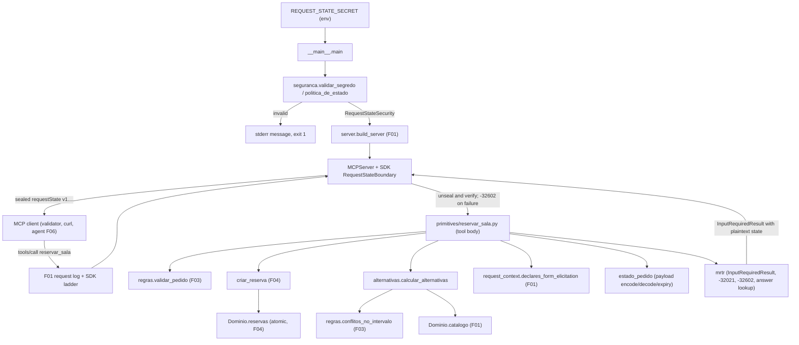
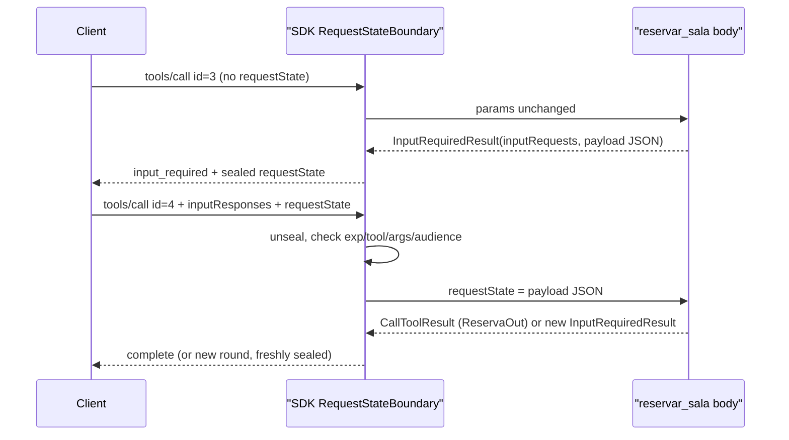

# Technical Specification: MRTR Conflict Resolution

**Complexity:** medium

## 1. Technical Overview

### What

F05 replaces the interim conflict branch of `reservar_sala` (F04 A6) with the MCP 2026-07-28 Multi Round-Trip Request (MRTR) flow, and makes the server's `requestState` protection real. It has four parts:

- **Request-state security at startup.** A new module, `servidor_mcp/seguranca.py`, validates `REQUEST_STATE_SECRET`: at least 64 hexadecimal characters, otherwise the process exits with code `1` and the exact PRD message. It then builds the SDK policy `RequestStateSecurity(keys=[secret], ttl=600)`. `__main__.main` fills the slot F01 reserved for this and passes the policy to `build_server`, which already forwards it to `MCPServer` (F01 A18). The SDK's `RequestStateBoundary` middleware, which `MCPServer` installs, then seals every outgoing `requestState` and checks every one that comes back. It uses AES-256-GCM under an HKDF-derived key, an expiry claim, a binding to the tool name and arguments digest, and an audience claim (the server name). A failed check is answered with `-32602` before the tool body runs.
- **Two pure domain modules** (no MCP types, no I/O). `servidor_mcp/alternativas.py` computes the offer: other rooms whose capacity is at least the requested room's, that are free for the whole interval, sorted by capacity then id, at most 3. `servidor_mcp/estado_pedido.py` defines the **sealed payload** and encodes and decodes it: tool name, original `sala`, `inicio`, `fim`, `responsavel`, the offered alternatives in order, the `inputRequests` key, and the expiry timestamp (issue time + 600 s).
- **An MCP protocol helper module**, `servidor_mcp/mrtr.py`. It builds the `InputRequiredResult` (one form `elicitation/create` with a flat `sala` enum schema, and the encoded payload as `requestState`), the `-32021` error (missing form-elicitation capability) and the `-32602` errors (bad payload, missing answer). It also reads the client's `ElicitResult` for the issued key.
- **The extended tool body** in `primitives/reservar_sala.py`. The tool gains a `Context` parameter and widens its return annotation to `Annotated[CallToolResult, ReservaOut] | InputRequiredResult`. The `tools/list` descriptor stays byte-identical to the wire capture (verified, Section 3.1). The body runs in one of two modes:
  - first round: F03 validation → F04 atomic create → if the room is taken, compute alternatives → none: `Sem alternativas disponiveis no intervalo` → no `elicitation.form` capability: `-32021` → otherwise `input_required`;
  - retry (a `requestState` is present): decode the sealed payload → read the answer under the sealed key → `decline`/`cancel` → `reservado: false`; `accept` of a sealed alternative → F04 creation with the sealed values; anything else, or the chosen room taken meanwhile → recompute and issue a new round.

### Why

- The MCP server must not keep any state between `input_required` and the retry, and a retry must still work after a restart (PRD F05 Capabilities). So every value needed to finish the request is carried in the `requestState` and sealed with a key from the environment. The SDK's boundary already provides integrity, confidentiality, expiry and request binding. Using it rather than custom HMAC code is what the PRD asks for ("the SDK's integrity utility").
- The SDK offers two ways to do MRTR: resolvers (`Resolve` + `Elicit`) or a tool body that returns `InputRequiredResult` itself. F05 uses the hand-rolled body. Resolvers re-run on every round and drop an answer whenever the rendered question changes, so a `decline` could be turned into a new question instead of the PRD's `reservado: false`. Resolvers also turn an out-of-enum `accept` into an SDK `ToolError` instead of a new round. And they treat a bare `elicitation: {}` as form support, which breaks the F01 cross-feature test that expects `-32021` for it (Section 3.1, S5 and S9).
- Keeping the alternatives rule and the payload format in pure modules means they can be unit tested without a server. It also follows the F03/F04 split: rules sit in `regras.py`/`reservas.py`, and MCP-facing code sits in `primitives/`.

### Scope

**Included (PRD F05 Capabilities, Experience and Error Handling. The whole feature is in scope because the PRD has no Core/Full split for F05):**
- First-call decision order: validation → conflict check → if free, create (F04) → else compute alternatives → none: `isError` `Sem alternativas disponiveis no intervalo` → no `elicitation.form` in this request's capabilities: `-32021`, HTTP `400`, `data.requiredCapabilities` → else `input_required`.
- The alternatives rule (capacity ≥ requested, free in the whole interval, the requested room excluded, sorted by `capacidade` then `id`, at most 3).
- `input_required` contract: exactly one `inputRequests` entry, server-assigned key `reservar_sala:escolha_de_sala`, `elicitation/create` in `mode: form`, the exact message and flat `requestedSchema`, plus a sealed `requestState`.
- `REQUEST_STATE_SECRET` validation (≥ 64 hex characters) with startup abort, and SDK `RequestStateSecurity` with a 600 s TTL. No secret anywhere in code or repository.
- Sealed payload with everything needed to rebuild the request, plus expiry. Nothing is kept in server memory between rounds.
- Retry handling: integrity, expiry or tool binding failure → `-32602`; missing key → `-32602`; sealed values win over re-sent arguments; `decline` → `motivo: "recusado"`; `cancel` → `motivo: "cancelado"`; `accept` of a sealed, still-free alternative → F04 reservation; `accept` of anything else, or of a room booked in the meantime → a new round with recomputed alternatives and a fresh `requestState`, or `Sem alternativas...`.
- Removal of the F04 interim branch (`_responder_conflito`, `mensagens.SALA_OCUPADA`) and of the `need_mrtr` gate in `test_cross_feature_f01.py` (F04 A15 follow-up).

**Output contracts (PRD F05 Provides):**

| PRD Provides item | Exposed as | Module | Consumers |
|---|---|---|---|
| `input_required` contract: single `inputRequests` entry (server-assigned key), `elicitation/create` in `mode: form`, flat `requestedSchema` whose `sala` is an `enum` of alternative room ids in offer order, opaque sealed `requestState` | `tools/call reservar_sala` result with `resultType: input_required` (Section 5.2) | `primitives/reservar_sala.py`, `mrtr.py` | F06 (normalized `InputRequired` outcome), F09, validator checks 13–14 |
| Decline/cancel result (`reservado: false`, `motivo`) | `complete` result, `structuredContent` = `ReservaOut(reservado=False, motivo="recusado" \| "cancelado")`, all other fields `null` (Section 5.4) | `primitives/reservar_sala.py` | F09 (→ `TASK_STATE_CANCELED`), validator check 19 |
| New `input_required` rounds on retry with recomputed alternatives and a fresh `requestState` | Same shape as the first round, same key, new enum, new state (Section 5.5) | `primitives/reservar_sala.py` | F09 (replaces the stored state and key) |

**Input contracts (PRD F05 Consumes):**

| PRD Consumes item | Provided as | Used for |
|---|---|---|
| F01: room catalog (id, capacidade) | `Dominio.catalogo` (`todas()` in file order, `get(id)`, `Sala.capacidade`) | Candidate rooms and the capacity filter |
| F01: validated per-request client capabilities | `request_context.declares_form_elicitation(ctx)` over `Context.client_capabilities`, built by the SDK from this request's `_meta` only | The `-32021` decision |
| F03: shared validation routine and conflict detection | `regras.validar_pedido`, `regras.conflitos_no_intervalo`, `resultados.erro_de_execucao` | First-round validation, candidate freeness, rebuilding the request from sealed values |
| F04: reservation creation routine and `ReservaOut` result | `criar_reserva(dominio, pedido, responsavel)` → `ReservaOut` \| `SalaOcupada` \| `CallToolResult`; `ReservaOut` model | Free path, accept path, "booked meanwhile" detection, decline/cancel result |
| (F01 hook) request-state security slot | `Settings.request_state_secret`; `build_server(..., request_state_security=...)` | Policy construction and installation |

**Excluded / deferred:**
- Agent-side pause/resume, storing `requestState` per Task, `alternativas:` text and `escolha=` parsing (F09). Normalizing `input_required` and retry invocation (F06, already done)
- URL-mode elicitation, sampling, server-initiated requests (PRD Out of Scope)
- Encryption as a stated requirement: the SDK codec happens to encrypt, but only integrity is a product requirement (PRD Out of Scope, "Encryption of `requestState` beyond integrity protection")
- Replay prevention of a still-valid `requestState`: not required; a replayed `accept` cannot double-book because creation re-checks the ledger atomically (A14)
- README text about these decisions (F10). Section 3.3 lists the facts F10 must quote

### Requirements (from PRD Capabilities and Experience)

| ID | Requirement | PRD source |
|---|---|---|
| R1 | MRTR uses the SDK's first-class `input_required` support (`InputRequiredResult` returned by the tool, sealed by the SDK `RequestStateBoundary`). No server-initiated `elicitation/create` request is ever sent | Capabilities 1 |
| R2 | Alternatives: rooms other than the requested one, `capacidade` ≥ requested capacity, free in the whole interval; sorted by `capacidade` ascending, then `id` ascending; at most 3 | Capabilities 2 |
| R3 | First-call decision order: F03 validation → conflict check → free: create (F04) → alternatives → none: `isError` `Sem alternativas disponiveis no intervalo` (no elicitation) → no `elicitation.form`: `-32021`, `data.requiredCapabilities = {"elicitation": {"form": {}}}`, HTTP `400` → else `input_required` | Capabilities 3 |
| R4 | Message `A sala pedida esta ocupada nesse intervalo. Escolha uma alternativa.`; `requestedSchema` = `{"type": "object", "properties": {"sala": {"type": "string", "title": "Sala", "description": "Sala alternativa escolhida", "enum": [...]}}, "required": ["sala"]}` | Capabilities 4 |
| R5 | `requestState` protected by the SDK utility with a key from `REQUEST_STATE_SECRET` (≥ 64 hex characters); startup refused when it is missing or shorter; no secret value in code or repository | Capabilities 5 |
| R6 | The sealed payload holds the tool name, original `sala`, `inicio`, `fim`, `responsavel`, the offered alternatives in order, the `inputRequests` key and the expiry (issue + 10 min) | Capabilities 6 |
| R7 | Nothing is kept in server memory between rounds; a retry after a restart with the same secret completes | Capabilities 7 |
| R8 | Retry: integrity failure, expiry, or state bound to another tool → `-32602`; key missing from `inputResponses` → `-32602`; re-sent `arguments` ignored (sealed values win); `decline` → `complete`, `reservado: false`, `motivo: "recusado"`; `cancel` → `motivo: "cancelado"`; `accept` of a sealed, still-free alternative → F04 reservation with the sealed `inicio`/`fim`/`responsavel`; `accept` of another room, or of a room booked since → recomputed alternatives in a new round with a fresh `requestState`, or `Sem alternativas disponiveis no intervalo` | Capabilities 8 |

**UX flows (PRD Experience 1–4), on `2026-11-03` in `-03:00`, fresh process:**

| # | Request | Response |
|---|---|---|
| 1 | `reservar_sala` `sala-garagem` 14:00–15:00 `Marty` (conflicts with `res-0001`) | `resultType: input_required`, key `reservar_sala:escolha_de_sala`, `enum: ["sala-fusca", "sala-mirante"]`, `requestState: "v1.…"` |
| 2 | retry with a new id, the same `arguments`, `inputResponses: {"reservar_sala:escolha_de_sala": {"action": "accept", "content": {"sala": "sala-fusca"}}}` and the untouched `requestState` | `complete`, `isError: false`, `sala: "sala-fusca"`, `reserva: "res-0003"`, original `inicio`/`fim`/`responsavel` |
| 3 | retry instead with `{"action": "decline"}` | `complete`, `reservado: false`, `motivo: "recusado"` |
| 4 | the same conflicting call with `clientCapabilities: {}` | HTTP `400`, `-32021`, `data.requiredCapabilities` |

**Request flow (first round):** `POST /mcp` → F01 log line → SDK inbound ladder → `RequestStateBoundary` (no `requestState`: pass through) → argument validation → tool body → `validar_pedido` → failure: `erro_de_execucao` → `criar_reserva` → `ReservaOut`: returned → `SalaOcupada` → `calcular_alternativas` → empty: `erro_de_execucao(SEM_ALTERNATIVAS)` → `declares_form_elicitation(ctx)` false: raise `MCPError(-32021)` → `novo_estado` + `pedir_escolha` → `InputRequiredResult` → boundary seals `requestState` in a fresh envelope → HTTP 200.

**Request flow (retry):** `POST /mcp` → F01 log line → ladder → boundary unseals and verifies (failure: `-32602 Invalid or expired requestState`, HTTP 400, body not run) → plaintext payload in `ctx.request_state` → argument validation → body → `decodificar` (invalid, wrong tool or expired: `-32602`) → `resposta_para(ctx, chave)` (missing: `-32602`) → branch on `action` → result → boundary seals a new round's `requestState` (if any) with the same request binding.

## 2. Architecture Impact

### Affected components

| Path | Change |
|---|---|
| `servidor-mcp/src/servidor_mcp/seguranca.py` | New: secret validation, `SegredoInvalidoError`, `RequestStateSecurity` factory, TTL constant |
| `servidor-mcp/src/servidor_mcp/alternativas.py` | New: pure alternatives rule |
| `servidor-mcp/src/servidor_mcp/estado_pedido.py` | New: sealed payload value, encoding, decoding, expiry |
| `servidor-mcp/src/servidor_mcp/mrtr.py` | New: `InputRequiredResult` builder, `-32021`/`-32602` errors, answer lookup |
| `servidor-mcp/src/servidor_mcp/primitives/reservar_sala.py` | Modified: `Context` parameter, widened return annotation, first-round conflict flow, retry flow, `reserva_nao_realizada`; interim branch removed |
| `servidor-mcp/src/servidor_mcp/__main__.py` | Modified: reserved slot filled (validate secret, build the policy, pass it to `build_server`) |
| `servidor-mcp/src/servidor_mcp/mensagens.py` | Modified: F05 block appended; interim `SALA_OCUPADA` removed |
| `servidor-mcp/tests/**` | New unit/integration files; `conftest.py` `fresh_app` gains an optional security policy; `test_reservar_sala.py` and `test_cross_feature_f01.py` adjusted (Section 7) |

Unchanged and reused: `server.py` (already forwards `request_state_security`), `config.py` (already reads the secret raw), `request_context.py` (`declares_form_elicitation`), `regras.py`, `reservas.py`, `resultados.py`, `primitives/__init__.py` (no new registrar: F04 coordination rule).

### Component and data flow



### Round-trip sequence



## 3. Technical Decisions

| Decision | Chosen Approach | Alternative Considered | Trade-off |
|---|---|---|---|
| MRTR mechanism | Hand-rolled: the tool body reads `ctx.request_state`/`ctx.input_responses` and returns `InputRequiredResult`; the SDK boundary seals it (A1) | SDK resolvers (`Annotated[..., Resolve(fn)]` + `Elicit[Model]`) | More body code and an explicit `-32021`. In return, decline/cancel always complete, an out-of-enum accept starts a new round, the payload carries the original request as the PRD requires, and bare `elicitation: {}` is refused (S5, S9) |
| `requestState` protection | SDK `RequestStateSecurity(keys=[secret], ttl=600)` passed to `MCPServer` (AES-256-GCM AEAD + HKDF, envelope claims `exp`, method, tool, arguments digest, audience) (A2) | Custom HMAC-SHA256 over a base64 JSON | Zero custom crypto; the token is also confidential. The wire error text is fixed by the SDK (`Invalid or expired requestState`) |
| Sealed payload | Own versioned JSON inside the SDK envelope with tool, original arguments, alternatives, key and `expira` (A6) | Only the alternatives (SDK envelope already binds tool and arguments) | A few dozen bytes more. In return the payload is self-sufficient (PRD R6), and expiry is checked twice (envelope `exp` and `expira`) |
| Tampered `arguments` on retry | Rejected with `-32602` by the boundary's arguments-digest binding. The body still uses only the sealed values when the binding passes (A7) | Strip the binding so that tampered arguments reach the body, which ignores them | Fails closed and is accepted by the PRD AC ("either fails or books with … `Doc`") and validator check 18. A client must re-send identical arguments, as `exemplos/wire/04` and F06 do |
| Capability gate | Explicit check of `declares_form_elicitation(ctx)` only when an elicitation is about to be issued (first round or new round); `MCPError(-32021)` (A9) | Gate every call | A free booking and an `accept`/`decline` retry work without the capability (AC 4). `{}` and `{"elicitation": {}}` are both refused when an elicitation would be issued |
| Module split | Pure `alternativas.py` + `estado_pedido.py`; MCP-typed `mrtr.py`; orchestration in the tool module (A3) | Everything in `primitives/reservar_sala.py` | Three more modules; each rule is unit-testable without a server, matching F03/F04 |

### 3.1 SDK and contract facts relied upon

Verified while writing this spec against the installed `mcp==2.3.0` in the repo-root `.venv`. A throwaway in-process probe registered the planned signature on an `MCPServer` built with `RequestStateSecurity(keys=[token_hex(32)])` and called it over the F01 app (`build_app`) with `starlette.testclient`:

| # | Fact | Evidence |
|---|---|---|
| S1 | With the signature `reservar_sala(sala: str, inicio: str, fim: str, responsavel: str, ctx: Context) -> Annotated[CallToolResult, ReservaOut] \| InputRequiredResult`, the `tools/list` entry is **equal** to the `reservar_sala` entry of `exemplos/wire/01-tools-list.json`. The `ctx` parameter is skipped in `inputSchema`; the `InputRequiredResult` arm is removed before the output schema is derived (`func_metadata`). A returned `ReservaOut` still yields `structuredContent` + one text block | probe (dict equality); `utilities/func_metadata.py` lines 384–430 |
| S2 | The spelling `Annotated[CallToolResult \| InputRequiredResult, ReservaOut]` **loses** `outputSchema` and `structuredContent` (the residual arm is a bare `CallToolResult`). The union must sit outside `Annotated` | probe |
| S3 | A returned `InputRequiredResult` goes through `convert_result` unchanged. On the wire it becomes `result.inputRequests` + `result.requestState` + `resultType: "input_required"`, and `ElicitRequestFormParams` renders `mode: "form"`. The `requestedSchema` dict is passed through (JSON-equal to `exemplos/wire/03`) | probe; `func_metadata.convert_result` |
| S4 | The `requestState` sent on the wire is `v1.` + base64url (AES-256-GCM, 4-byte key id, 12-byte nonce). `ctx.request_state` on the retry is the exact plaintext the body returned (the boundary unseals before the handler runs) | probe; `mcp/server/request_state.py` |
| S5 | `RequestStateBoundary` rejects, before the body runs, with HTTP `400` and `{"code": -32602, "message": "Invalid or expired requestState", "data": {"reason": "invalid_request_state"}}` when: the token is modified (last 6 chars), it was sealed under another secret, the envelope is older than the TTL, or `name`/`arguments` differ from the sealed round. It logs `requestState rejected on tools/call: <reason>` at WARNING to stderr | probe (tampered, other secret, `time.time` + 601 s, `responsavel` changed) |
| S6 | A retry presented to a **new** `MCPServer` instance with the same secret is accepted (stateless restart) | probe |
| S7 | `MCPError(code=-32021, message, data)` raised in a synchronous tool body becomes a top-level JSON-RPC error with HTTP `400` (not an `isError` result) | probe; `tools/base.py` `run` re-raises `MCPError`; F01 status mapping |
| S8 | `ctx.input_responses` parses `{"action": …, "content": …}` into `ElicitResult` (`action` ∈ accept/decline/cancel, `content` dict or `None`). It is `None` when the retry omits `inputResponses`. Capabilities are read per request (`ctx.client_capabilities`); a retry without `elicitation.form` still runs the body | probe |
| S9 | The SDK resolver path (`_require_capability`) counts `{"elicitation": {}}` as form support, and drops a recorded answer when the re-rendered question digest changes. `ClientCapabilities.model_validate({"elicitation": {}})` gives `ElicitationCapability(form=None, url=None)`, which `declares_form_elicitation` correctly reports as `False` | `mcp/server/mcpserver/resolve.py`; probe |
| S10 | `RequestStateSecurity(keys=[str])` encodes the string as UTF-8 and requires ≥ 32 bytes; a 64-hex-character secret gives 64 bytes of input to HKDF-SHA256. The default `bind_principal` returns `None` on this unauthenticated transport; the audience defaults to the server name `central-de-salas` (F01 A19) | `request_state.py` |
| S11 | Sync tool bodies run on a worker thread (F03 S8); `MCPError` raised there propagates unchanged | F03 spec; probe |

### 3.2 Assumptions and Auto-Accept Decisions

Each row is a decision the PRD did not answer. It is labeled with the Auto-Accept Policy row that produced it, so the user can review and override it.

| # | Decision | Choice | Auto-Accept policy row |
|---|---|---|---|
| A1 | MRTR mechanism | Hand-rolled `InputRequiredResult` from the tool body (no `Resolve`/`Elicit`); reasons in Section 1 "Why" and S5/S9 | Technical decisions with a clear recommendation from spec-writer |
| A2 | Seal algorithm | The SDK's built-in AEAD codec (AES-256-GCM + HKDF-SHA256) through `RequestStateSecurity(keys=[secret], ttl=600.0)`. The PRD allows "HMAC (or AEAD)". F10's "Decisões técnicas" must say "AEAD AES-256-GCM via the SDK `RequestStateSecurity` (integrity + confidentiality)", not literally HMAC | Technical decisions with a clear recommendation from spec-writer |
| A3 | Module placement | `seguranca.py`, `alternativas.py`, `estado_pedido.py`, `mrtr.py` at package level, next to `regras.py`/`reservas.py`; the tool body stays in `primitives/reservar_sala.py` (F04 rule: F05 adds no registrar) | Multiple conflicting patterns in the codebase (F03/F04 split, the most recent, applied) |
| A4 | Secret format | Valid iff `re.fullmatch(r"[0-9a-fA-F]{64,}", value)`. Missing, empty, shorter, or containing any non-hex character (whitespace included, no trimming) → abort. The string is passed **unchanged** to `keys=[...]` (S10); no `bytes.fromhex`, so an odd length ≥ 64 is also accepted | Partial PRD specifications |
| A5 | Startup order | Secret check runs right after `load_settings` and **before** loading `dados/` and binding the port. So a missing secret exits with code `1` and only the secret message, and the banner never prints | Technical decisions with a clear recommendation from spec-writer |
| A6 | Payload format | Compact JSON (`separators=(",", ":")`, `ensure_ascii=True`, fixed key order): `{"v": 1, "ferramenta", "sala", "inicio", "fim", "responsavel", "alternativas": [..], "chave", "expira"}`. `expira` = `int(time.time()) + 600` (integer Unix seconds). Decoding is strict: `v == 1`, every field present with the right JSON type, `alternativas` a non-empty list of strings, at most 3. Any deviation → treated as invalid (`-32602`) | Partial PRD specifications |
| A7 | Re-sent arguments | The SDK binding rejects changed `arguments` with `-32602` (S5). When they are identical, the body still rebuilds the request from the sealed payload only and never reads the tool parameters on a retry round | Technical decisions with a clear recommendation from spec-writer |
| A8 | Wire key | `reservar_sala:escolha_de_sala` (module-qualified style, like the SDK's `module:qualname` in `exemplos/wire/03`; the PRD's `__main__:escolha_de_sala` is only an example). It is constant, sealed in the payload as `chave`, and the answer is read only under the sealed key | Partial PRD specifications |
| A9 | Capability check | `request_context.declares_form_elicitation(ctx)` (strict `form` presence) is evaluated only when an `InputRequiredResult` is about to be returned, on the first round or a new round. Failure → `MCPError(code=-32021, message="Client did not declare the form elicitation capability required by 'reservar_sala:escolha_de_sala'", data={"requiredCapabilities": {"elicitation": {"form": {}}}})`. The code comes from `mcp_types.MISSING_REQUIRED_CLIENT_CAPABILITY`; `data` is built with `MissingRequiredClientCapabilityErrorData(...).model_dump(by_alias=True, mode="json", exclude_none=True)`, giving the same shape as `exemplos/wire/06` | Partial PRD specifications |
| A10 | Schema shape for one alternative | Always `enum`, even with a single id (`"enum": ["sala-x"]`); `const` is never emitted. PRD Capabilities line 4 spells `enum`, and F06 accepts both | Technical decisions with a clear recommendation from spec-writer |
| A11 | `-32602` texts produced by F05 itself | Payload invalid, wrong tool, or `expira` passed → the SDK's frozen error is reproduced (`message: "Invalid or expired requestState"`, `data: {"reason": "invalid_request_state"}`), so clients see one shape. Missing answer → `message: "inputResponses sem resposta para reservar_sala:escolha_de_sala"`, no `data`. An answer under the key that is not an `ElicitResult` is treated as missing | Partial PRD specifications |
| A12 | Accept with bad content | `action: accept` with `content` absent, without a `sala` key, or with a non-string `sala` is treated like "room not among the sealed alternatives" → recompute and issue a new round. It is never an `isError` | Description too vague |
| A13 | Recompute target | A new round always recomputes the alternatives for the **original** sealed room and interval. The original room is never booked implicitly, even if it became free (possible only across a restart that dropped a run-time reservation) | Description too vague |
| A14 | Replay | A still-valid `requestState` may be presented more than once. `decline`/`cancel` replays return the same result. An `accept` replay hits `SalaOcupada` (the room was booked by the first) and gets a new round, so there is no double booking | Partial PRD specifications |
| A15 | New-round state | Each new round uses the same key and new alternatives, and seals a fresh payload with a new `expira` (now + 600 s). The SDK re-seals it with the inbound round's binding (same tool and arguments) | Technical decisions with a clear recommendation from spec-writer |
| A16 | First round carrying `inputResponses` but no `requestState` | Treated as a first round; `inputResponses` is ignored | Partial PRD specifications |
| A17 | Validation on the accept path | The body rebuilds `PedidoValidado` with `validar_pedido(catalogo, escolhida, sealed inicio, sealed fim)`. A failure, impossible while `dados/` is unchanged, returns that F03 `isError` text verbatim | Technical decisions with a clear recommendation from spec-writer |
| A18 | Alternatives atomicity | Alternatives are computed outside the ledger lock (it is an offer, not a write). The accept path re-checks freeness atomically through `criar_reserva` → `registrar_se_livre` | Technical decisions with a clear recommendation from spec-writer |
| A19 | Clock | `estado_pedido` and `mrtr` call `time.time()` through `import time`, so tests patch one function (`monkeypatch.setattr(time, "time", …)`), which also moves the SDK envelope clock | Technical decisions with a clear recommendation from spec-writer |
| A20 | Test app security | `conftest.fresh_app(registrars=None, request_state_security=None)` forwards the policy to `build_server`. `None` keeps the SDK's ephemeral per-process key, which is enough for in-process tests. Restart tests use real processes with an explicit shared secret | Technical decisions with a clear recommendation from spec-writer |
| A21 | Dependencies | None added. `cryptography` is already installed as a dependency of `mcp==2.3.0` and is never imported by project code | Feature requires new technology not present in the codebase (not triggered) |
| A22 | Strings | F05 block appended to `mensagens.py`: `SEGREDO_INVALIDO`, `MENSAGEM_ESCOLHA`, `CAMPO_SALA_TITULO`, `CAMPO_SALA_DESCRICAO`, `SEM_ALTERNATIVAS`, `ESTADO_INVALIDO`, `RESPOSTA_AUSENTE`, `CAPACIDADE_AUSENTE`; the interim `SALA_OCUPADA` (and its comment) is deleted | Technical decisions with a clear recommendation from spec-writer |

### 3.3 Coordination points

| Shared artifact | Rule |
|---|---|
| `primitives/reservar_sala.py` | F05 keeps `ReservaOut`, `reserva_confirmada` and `criar_reserva` unchanged. It removes `_responder_conflito`, and adds `reserva_nao_realizada(motivo)` and the round helpers |
| `server.py` `build_server` | Used as is: `request_state_security` is forwarded only when given (F01 A18). `SERVER_NAME` must stay `central-de-salas`, because it is the token audience (F01 A19) |
| `__main__.py` reserved slot | F05 replaces the placeholder comment with the secret check and the policy construction; nothing else in the startup order changes |
| `conftest.py` `fresh_app` | Gains the optional `request_state_security` keyword; existing callers are unaffected |
| `test_cross_feature_f01.py` | `need_mrtr` is deleted and its two callers use `need_tool(client, mcp_post, "reservar_sala")` (F04 A15 follow-up) |
| `test_reservar_sala.py::test_second_booking_of_same_slot_is_not_created` | The interim-text branch is replaced by an assertion of `input_required` with alternatives for `sala-aquario` 09:00–10:00 |
| Agent (F06) | Expects one `inputRequests` entry, `mode: form`, `sala.enum`, a string `requestState`, and accepts `-32602` as protocol failure. No agent change is needed; the 4 gated tests in `agente/tests/integration/test_mcp_host_against_server.py` activate |
| F09 | Must store the key from `inputRequests` (not hardcode it), must re-send byte-identical `arguments` (SDK binding, A7), and maps `-32602` → `Erro do servidor MCP: -32602 Invalid or expired requestState` |
| F10 README "Decisões técnicas" | Quote: SDK `RequestStateSecurity`, AES-256-GCM AEAD, key from `REQUEST_STATE_SECRET` (≥ 64 hex), TTL 600 s, sealed payload contents, arguments binding (tampered arguments → `-32602`), no server memory between rounds |

### 3.4 PRD traceability

| PRD block | Spec destination |
|---|---|
| F05 Consumes | Section 1 Input contracts |
| F05 Provides | Section 1 Output contracts; Sections 5.2, 5.4, 5.5 |
| F05 Capabilities | Section 1 R1–R8; Sections 5, 6 |
| F05 Experience | Section 1 UX flows; Section 5 examples |
| F05 user stories | R2 (predictable offer), R8 (retry, decline), R3 (`-32021`), R5/R8 (tamper), R6/R7 (restart), R3 (zero alternatives) |
| F05 Error Handling | Section 5.7 |
| Section 9 F05 acceptance criteria | Section 7 traceability matrix |
| Section 9 Cross-Feature Integration criteria naming F05 | Section 7 `test_cross_feature_f05.py` |

## 4. Component Overview

**Backend:**

| File Path | New/Modified | Purpose | Key Responsibilities |
|---|---|---|---|
| `servidor-mcp/src/servidor_mcp/seguranca.py` | New | Request-state security policy | `TTL_ESTADO_SEGUNDOS = 600`. `SegredoInvalidoError(Exception)` whose `str()` is `mensagens.SEGREDO_INVALIDO`. `validar_segredo(valor: str \| None) -> str` (A4). `politica_de_estado(segredo: str) -> RequestStateSecurity` returns `RequestStateSecurity(keys=[segredo], ttl=TTL_ESTADO_SEGUNDOS)` with default audience/principal (S10). No module-level secret, no logging of the value |
| `servidor-mcp/src/servidor_mcp/alternativas.py` | New | Pure alternatives rule (no MCP, no I/O, no clock) | `LIMITE_ALTERNATIVAS = 3`. `calcular_alternativas(catalogo: CatalogoDeSalas, reservas: LivroDeReservas, pedido: PedidoValidado) -> tuple[str, ...]`: from `catalogo.todas()` keep rooms with `id != pedido.sala.id`, `capacidade >= pedido.sala.capacidade` and `conflitos_no_intervalo(reservas, sala.id, pedido.intervalo)` empty; sort by `(capacidade, id)`; return the first 3 ids |
| `servidor-mcp/src/servidor_mcp/estado_pedido.py` | New | Sealed payload (plaintext the SDK seals) | `VERSAO_ESTADO = 1`, `FERRAMENTA = "reservar_sala"`, `CHAVE_ESCOLHA = "reservar_sala:escolha_de_sala"`. Frozen `EstadoDoPedido` (Section 6). `novo_estado(pedido: PedidoValidado, responsavel: str, alternativas: tuple[str, ...]) -> EstadoDoPedido` (stamps `expira = int(time.time()) + TTL_ESTADO_SEGUNDOS`). `codificar(estado) -> str` (A6). `decodificar(texto: str) -> EstadoDoPedido \| None` (strict, never raises). `expirado(estado) -> bool` (`time.time() >= expira`) |
| `servidor-mcp/src/servidor_mcp/mrtr.py` | New | MCP-typed round helpers | `pedir_escolha(estado: EstadoDoPedido) -> InputRequiredResult`: one entry `{estado.chave: ElicitRequest(params=ElicitRequestFormParams(message=MENSAGEM_ESCOLHA, requested_schema=esquema_de_escolha(estado.alternativas)))}` and `request_state=codificar(estado)`. `esquema_de_escolha(alternativas) -> dict` (R4, A10). `exigir_elicitacao_form(ctx) -> None` raises the A9 `MCPError` unless `declares_form_elicitation(ctx)`. `estado_invalido() -> MCPError` (A11, SDK-identical). `resposta_ausente(chave) -> MCPError`. `resposta_para(ctx, chave) -> ElicitResult` (raises `resposta_ausente` when `ctx.input_responses` is `None`, lacks the key, or the value is not an `ElicitResult`). `estado_da_rodada(ctx) -> EstadoDoPedido` (decode, `ferramenta == "reservar_sala"`, not `expirado`, else raise `estado_invalido()`) |
| `servidor-mcp/src/servidor_mcp/primitives/reservar_sala.py` | Modified | Tool body with MRTR | Keeps `ReservaOut`, `reserva_confirmada`, `criar_reserva`. Adds `reserva_nao_realizada(motivo: str) -> ReservaOut` (`reservado=False`, `motivo`, rest `None`). Adds `_oferecer_alternativas(dominio, ctx, pedido, responsavel) -> CallToolResult \| InputRequiredResult` (compute → empty: `erro_de_execucao(SEM_ALTERNATIVAS)` → `exigir_elicitacao_form` → `pedir_escolha(novo_estado(...))`). Adds `_retomar(dominio, ctx) -> ReservaOut \| CallToolResult \| InputRequiredResult` (Section 5.3 retry table). Tool signature: `reservar_sala(sala: str, inicio: str, fim: str, responsavel: str, ctx: Context) -> Annotated[CallToolResult, ReservaOut] \| InputRequiredResult` (S1, not S2). Body: `ctx.request_state is not None` → `_retomar`; else validate → `criar_reserva` → `SalaOcupada` → `_oferecer_alternativas`. Removes `_responder_conflito`. Closure holds only `dominio` |
| `servidor-mcp/src/servidor_mcp/__main__.py` | Modified | Startup | After `load_settings`: `segredo = validar_segredo(settings.request_state_secret)`; on `SegredoInvalidoError` → `_fail(str(exc))` (exit 1). Then `politica = politica_de_estado(segredo)` and later `build_server(dominio, request_state_security=politica)` |
| `servidor-mcp/src/servidor_mcp/mensagens.py` | Modified | Exact strings | Deletes `SALA_OCUPADA` and its "Interim" comment. Appends an F05 block: `SEGREDO_INVALIDO = 'REQUEST_STATE_SECRET ausente ou com menos de 32 bytes: gere com python3 -c "import secrets; print(secrets.token_hex(32))"'`, `MENSAGEM_ESCOLHA = "A sala pedida esta ocupada nesse intervalo. Escolha uma alternativa."`, `CAMPO_SALA_TITULO = "Sala"`, `CAMPO_SALA_DESCRICAO = "Sala alternativa escolhida"`, `SEM_ALTERNATIVAS = "Sem alternativas disponiveis no intervalo"`, `ESTADO_INVALIDO = "Invalid or expired requestState"`, `RESPOSTA_AUSENTE = "inputResponses sem resposta para {chave}"`, `CAPACIDADE_AUSENTE = "Client did not declare the form elicitation capability required by '{chave}'"` |

**Database:** none. Nothing is stored between rounds; the ledger stays in memory (F01/F04).

## 5. API Contracts

All calls go to F01's single endpoint `POST /mcp` with the common envelope and headers (`_meta` protocol version and client capabilities, `MCP-Protocol-Version: 2026-07-28`, `Mcp-Method: tools/call`, `Mcp-Name: reservar_sala`). Authentication: none. The `tools/list` entry is unchanged (S1; F04 Section 5.1).

### 5.1 `tools/call reservar_sala` request fields (F05 additions)

| Field | Type | Required | Validation | Description |
|---|---|---|---|---|
| `name` | `string` | Yes | `reservar_sala` | Tool name; sealed binding target on retries |
| `arguments.sala` / `inicio` / `fim` / `responsavel` | `string` | Yes | SDK string; on a retry, must equal the sealed round's `arguments` (SDK digest binding) | Original request; never read on a retry round (A7) |
| `inputResponses` | `object` | Retry only | Key `reservar_sala:escolha_de_sala` with an `ElicitResult` (`action` ∈ `accept`/`decline`/`cancel`; `content.sala` string for accept) | Client answer; ignored on a first round (A16) |
| `requestState` | `string` | Retry only | Must be a token minted by this server's secret, unexpired, for this tool and arguments; echoed byte for byte | Sealed payload |
| `_meta["io.modelcontextprotocol/clientCapabilities"]` | `object` | Yes (F01) | `elicitation.form` needed only when a round is issued (A9) | Per-request capabilities |

### 5.2 First round, conflict → `input_required` (validator checks 13–14; AC 1–2)

**Request Example** (equal to the body of `exemplos/wire/03-tools-call-conflito-input-required.json`):
```json
{
  "jsonrpc": "2.0",
  "id": 3,
  "method": "tools/call",
  "params": {
    "name": "reservar_sala",
    "arguments": {
      "sala": "sala-garagem",
      "inicio": "2026-11-03T14:00:00-03:00",
      "fim": "2026-11-03T15:00:00-03:00",
      "responsavel": "Marty"
    },
    "_meta": {
      "io.modelcontextprotocol/protocolVersion": "2026-07-28",
      "io.modelcontextprotocol/clientInfo": {"name": "agente-central-de-salas", "version": "1.0.0"},
      "io.modelcontextprotocol/clientCapabilities": {"elicitation": {"form": {}}},
      "traceparent": "00-4bf92f3577b34da6a3ce929d0e0e4736-00f067aa0ba902b7-01"
    }
  }
}
```

**Response (200):**

| Field | Type | Description |
|---|---|---|
| `result.resultType` | `string` | `input_required` |
| `result.inputRequests` | `object` | Exactly one key, `reservar_sala:escolha_de_sala` |
| `result.inputRequests.<key>.method` | `string` | `elicitation/create` |
| `result.inputRequests.<key>.params.mode` | `string` | `form` |
| `result.inputRequests.<key>.params.message` | `string` | `A sala pedida esta ocupada nesse intervalo. Escolha uma alternativa.` |
| `result.inputRequests.<key>.params.requestedSchema` | `object` | Flat; single `sala` string property with `title`, `description`, `enum` (offer order); `required: ["sala"]` |
| `result.requestState` | `string` | `v1.` + base64url; opaque; different on every issue (random nonce) |
| `result.content` / `structuredContent` / `isError` | — | Absent |

**Response Example** (JSON-equal to `exemplos/wire/03` except the key and the token):
```json
{
  "jsonrpc": "2.0",
  "id": 3,
  "result": {
    "inputRequests": {
      "reservar_sala:escolha_de_sala": {
        "method": "elicitation/create",
        "params": {
          "message": "A sala pedida esta ocupada nesse intervalo. Escolha uma alternativa.",
          "mode": "form",
          "requestedSchema": {
            "properties": {
              "sala": {
                "type": "string",
                "title": "Sala",
                "description": "Sala alternativa escolhida",
                "enum": ["sala-fusca", "sala-mirante"]
              }
            },
            "required": ["sala"],
            "type": "object"
          }
        }
      }
    },
    "requestState": "v1.rBW1E33jVhrAhIbyhgzcc6aKm6TEaB_YjKAWkuZt2g65nrHp…",
    "resultType": "input_required",
    "_meta": {"io.modelcontextprotocol/serverInfo": {"name": "central-de-salas", "version": "1.0.0"}}
  }
}
```

Offer table on a fresh process (R2):

| Request | Requested capacity | Offer |
|---|---|---|
| `sala-garagem` 14:00–15:00 (`res-0001`) | 12 | `["sala-fusca", "sala-mirante"]` |
| `sala-fusca` 16:00–17:00 (`res-0002`) | 12 | `["sala-garagem", "sala-mirante"]` |
| `sala-aquario` 09:00–10:00 already booked by a run-time reservation | 4 | `["sala-porao", "sala-fusca", "sala-garagem"]` (capacities 6, 12, 12; the tie is broken by id, and `sala-fusca` < `sala-garagem`; the cap of 3 drops `sala-mirante`) |
| `sala-mirante` slot taken | 20 | `[]` → `Sem alternativas disponiveis no intervalo` |

### 5.3 Retry → `complete` with the chosen room (validator check 16; AC 5)

**Request Example** (shape of `exemplos/wire/04`, with the F05 key):
```json
{
  "jsonrpc": "2.0",
  "id": 4,
  "method": "tools/call",
  "params": {
    "name": "reservar_sala",
    "arguments": {
      "sala": "sala-garagem",
      "inicio": "2026-11-03T14:00:00-03:00",
      "fim": "2026-11-03T15:00:00-03:00",
      "responsavel": "Marty"
    },
    "inputResponses": {
      "reservar_sala:escolha_de_sala": {"action": "accept", "content": {"sala": "sala-fusca"}}
    },
    "requestState": "v1.rBW1E33jVhrAhIbyhgzcc6aKm6TEaB_YjKAWkuZt2g65nrHp…",
    "_meta": {
      "io.modelcontextprotocol/protocolVersion": "2026-07-28",
      "io.modelcontextprotocol/clientCapabilities": {"elicitation": {"form": {}}},
      "traceparent": "00-4bf92f3577b34da6a3ce929d0e0e4736-00f067aa0ba902b7-01"
    }
  }
}
```

**Response (Success - 200):** identical shape to F04 Section 5.2 (`ReservaOut`, `reservado: true`, `motivo: null`, one text block with the same JSON). `sala` is the chosen room, `inicio`/`fim`/`responsavel` are the **sealed** strings, and `reserva` is the next `res-NNNN` from the F04 routine.

```json
{
  "jsonrpc": "2.0",
  "id": 4,
  "result": {
    "content": [{"type": "text", "text": "{\n  \"reserva\": \"res-0003\",\n  \"reservado\": true,\n  \"sala\": \"sala-fusca\",\n  \"inicio\": \"2026-11-03T14:00:00-03:00\",\n  \"fim\": \"2026-11-03T15:00:00-03:00\",\n  \"responsavel\": \"Marty\",\n  \"politica\": \"2026-11-01\",\n  \"motivo\": null\n}"}],
    "isError": false,
    "resultType": "complete",
    "structuredContent": {
      "reserva": "res-0003", "reservado": true, "sala": "sala-fusca",
      "inicio": "2026-11-03T14:00:00-03:00", "fim": "2026-11-03T15:00:00-03:00",
      "responsavel": "Marty", "politica": "2026-11-01", "motivo": null
    },
    "_meta": {"io.modelcontextprotocol/serverInfo": {"name": "central-de-salas", "version": "1.0.0"}}
  }
}
```

**Retry decision table** (`_retomar`, after the SDK boundary has verified the token):

| # | Condition | Outcome |
|---|---|---|
| 1 | Payload undecodable, `ferramenta != "reservar_sala"`, or `expirado` | `-32602` `Invalid or expired requestState` (A11), HTTP 400 |
| 2 | `inputResponses` absent, key `chave` absent, or value not an `ElicitResult` | `-32602` `inputResponses sem resposta para reservar_sala:escolha_de_sala`, HTTP 400 |
| 3 | `action: decline` | `complete`, `ReservaOut(reservado=False, motivo="recusado")` |
| 4 | `action: cancel` | `complete`, `ReservaOut(reservado=False, motivo="cancelado")` |
| 5 | `action: accept`, `content.sala` ∈ sealed `alternativas` | `validar_pedido(catalogo, escolhida, inicio, fim)` (failure → its `isError` text) → `criar_reserva` → `ReservaOut`: returned; internal failure `CallToolResult`: returned; `SalaOcupada` → row 6 |
| 6 | `accept` with a room outside the sealed list, bad/missing content (A12), or row 5 found the room taken | Rebuild the original request from sealed `sala`/`inicio`/`fim` → `calcular_alternativas` → empty: `isError` `Sem alternativas disponiveis no intervalo` → `exigir_elicitacao_form(ctx)` (`-32021`) → `pedir_escolha(novo_estado(...))`: a new round (5.5) |

### 5.4 Retry → decline / cancel (validator check 19; AC 8)

**Request:** as 5.3 with `"inputResponses": {"reservar_sala:escolha_de_sala": {"action": "decline"}}` (or `"cancel"`).

**Response (200)** — body equal to `exemplos/wire/11` (decline):

| Field | Type | Description |
|---|---|---|
| `result.resultType` | `string` | `complete` |
| `result.isError` | `boolean` | `false` |
| `result.structuredContent.reservado` | `boolean` | `false` |
| `result.structuredContent.motivo` | `string` | `recusado` (decline) or `cancelado` (cancel) |
| other `structuredContent` fields | `null` | `reserva`, `sala`, `inicio`, `fim`, `responsavel`, `politica` |

```json
{
  "jsonrpc": "2.0",
  "id": 12,
  "result": {
    "content": [{"type": "text", "text": "{\n  \"reserva\": null,\n  \"reservado\": false,\n  \"sala\": null,\n  \"inicio\": null,\n  \"fim\": null,\n  \"responsavel\": null,\n  \"politica\": null,\n  \"motivo\": \"recusado\"\n}"}],
    "isError": false,
    "resultType": "complete",
    "structuredContent": {"reserva": null, "reservado": false, "sala": null, "inicio": null, "fim": null, "responsavel": null, "politica": null, "motivo": "recusado"},
    "_meta": {"io.modelcontextprotocol/serverInfo": {"name": "central-de-salas", "version": "1.0.0"}}
  }
}
```

### 5.5 Retry → new round

Same shape as 5.2: the same key, an `enum` recomputed for the original request, and a **new** `requestState` (fresh `expira`, fresh nonce). Example: the first round on `sala-garagem` 14:00–15:00 offered `["sala-fusca", "sala-mirante"]`. Someone then booked `sala-fusca` 14:00–15:00, and the client accepts `sala-fusca` → new round with `enum: ["sala-mirante"]`. If `sala-mirante` is also taken → `isError: true`, `Sem alternativas disponiveis no intervalo`.

### 5.6 Error responses

**`-32021` — conflict without form elicitation (validator check 15; AC 3)** — request as 5.2 with `"clientCapabilities": {}` (or `{"elicitation": {}}`):
```json
{
  "jsonrpc": "2.0",
  "id": 6,
  "error": {
    "code": -32021,
    "message": "Client did not declare the form elicitation capability required by 'reservar_sala:escolha_de_sala'",
    "data": {"requiredCapabilities": {"elicitation": {"form": {}}}}
  }
}
```
HTTP status `400`.

**`-32602` — tampered, expired, other-secret, other-tool or changed-arguments `requestState` (validator checks 17–18; AC 6, 7, 11)** — produced by the SDK boundary (or by F05 with the same text, A11):
```json
{
  "jsonrpc": "2.0",
  "id": 7,
  "error": {"code": -32602, "message": "Invalid or expired requestState", "data": {"reason": "invalid_request_state"}}
}
```
HTTP status `400`. Stderr: the F01 line `mcp method=tools/call id=7 name=reservar_sala traceparent=…` plus the SDK WARNING `requestState rejected on tools/call: <reason>`.

**`-32602` — answer missing:**
```json
{"jsonrpc": "2.0", "id": 8, "error": {"code": -32602, "message": "inputResponses sem resposta para reservar_sala:escolha_de_sala"}}
```

**Zero alternatives (validator check 20; AC 9):**
```json
{
  "jsonrpc": "2.0",
  "id": 9,
  "result": {
    "content": [{"type": "text", "text": "Sem alternativas disponiveis no intervalo"}],
    "isError": true,
    "resultType": "complete",
    "_meta": {"io.modelcontextprotocol/serverInfo": {"name": "central-de-salas", "version": "1.0.0"}}
  }
}
```

**Error Codes:**

| Code | HTTP Status | Description |
|---|---|---|
| `-32021` | 400 | A round must be issued but this request's capabilities lack `elicitation.form` |
| `-32602` `Invalid or expired requestState` | 400 | Token modified, foreign key, expired (envelope `exp` or payload `expira`), other tool, other arguments, undecodable payload |
| `-32602` `inputResponses sem resposta para …` | 400 | Retry without an answer under the sealed key |
| `sem_alternativas` | 200 (`isError: true`) | `Sem alternativas disponiveis no intervalo` |
| F03/F04 execution errors | 200 (`isError: true`) | Unchanged (validation messages, `Falha interna ao registrar a reserva`) |
| `-32602` / `-32020` (envelope, headers) | 400 | F01 ladder, unchanged |

### 5.7 Error Handling (PRD F05 Error Handling)

| Condition | Detection | Outcome |
|---|---|---|
| `requestState` with one character changed | SDK codec (GCM tag or base64 canonical form) | `-32602`; body not run; no reservation; F01 stderr line with the id |
| `requestState` older than 10 minutes | SDK envelope `exp` (`iat + 600`) and payload `expira` | `-32602`; no reservation |
| Retry with tampered `arguments` | SDK arguments-digest binding | `-32602`; the tampered values never take effect (A7) |
| State presented to another tool | SDK target binding, then payload `ferramenta` | `-32602` |
| `REQUEST_STATE_SECRET` missing or not ≥ 64 hex characters | `seguranca.validar_segredo` before data load | Exit code `1`, stderr exactly `REQUEST_STATE_SECRET ausente ou com menos de 32 bytes: gere com python3 -c "import secrets; print(secrets.token_hex(32))"` |
| Chosen alternative booked by someone else between rounds | `criar_reserva` → `SalaOcupada` inside the ledger lock | New `input_required` round (or `Sem alternativas…`); never a double booking |
| Server restarted between rounds (same secret) | Stateless payload + same key ring | Retry completes normally |
| Server restarted with another secret | SDK `unknown key` | `-32602` |

## 6. Data Model

No database and no migration. F05 adds one value object that travels inside the sealed token, and computes one derived value. Nothing persists on the server between rounds.

**Value: `EstadoDoPedido`** (`estado_pedido.py`, frozen; JSON key order as listed, A6)

| Field (JSON key) | Type | Nullable | Default | Description |
|---|---|---|---|---|
| `v` | `int` | No | `1` | Payload version; any other value → invalid |
| `ferramenta` | `str` | No | `"reservar_sala"` | Tool the state belongs to |
| `sala` | `str` | No | - | Original requested room id (verbatim) |
| `inicio` | `str` | No | - | Original `inicio`, raw string |
| `fim` | `str` | No | - | Original `fim`, raw string |
| `responsavel` | `str` | No | - | Original `responsavel`, raw string |
| `alternativas` | `tuple[str, ...]` (JSON array) | No | - | Offered ids in offer order, 1–3 items |
| `chave` | `str` | No | `"reservar_sala:escolha_de_sala"` | The `inputRequests` key issued |
| `expira` | `int` | No | - | Unix seconds = issue time (floored) + 600 |

**Payload example** (the plaintext before the SDK seals it):
```json
{"v":1,"ferramenta":"reservar_sala","sala":"sala-garagem","inicio":"2026-11-03T14:00:00-03:00","fim":"2026-11-03T15:00:00-03:00","responsavel":"Marty","alternativas":["sala-fusca","sala-mirante"],"chave":"reservar_sala:escolha_de_sala","expira":1793721600}
```

**SDK envelope around the payload** (owned by `RequestStateBoundary`, listed for completeness; not built by F05):

| Claim | Meaning |
|---|---|
| `v` | Envelope version (1) |
| `iat` / `exp` | Issue time / issue time + TTL (600 s) |
| `m` / `t` / `a` | Method `tools/call`, tool name, SHA-256 digest (16 bytes, base64url) of the canonical `arguments` |
| `aud` | `central-de-salas` |
| `s` | The F05 payload string above |

**Derived value: alternatives** (`alternativas.calcular_alternativas`)

| Rule | Definition |
|---|---|
| Exclusion | `sala.id != pedido.sala.id` |
| Capacity | `sala.capacidade >= pedido.sala.capacidade` |
| Freeness | `conflitos_no_intervalo(reservas, sala.id, pedido.intervalo) == ()` (half-open, F03) |
| Order | ascending `(capacidade, id)` |
| Cap | first 3 |

**Invariants:**

| Invariant | Definition | Purpose |
|---|---|---|
| Stateless rounds | No dict, cache or global keeps payloads between requests | Restart safety (R7, AC 10) |
| Sealed values win | A retry builds every reservation field from the payload; tool parameters are not read on retry rounds | PRD Error Handling (tampered arguments) |
| No double booking | The accept path creates only through `criar_reserva` (atomic check-then-append) | Chosen room booked meanwhile → new round |
| No secret in repo | The secret only comes from the environment; tests generate one at runtime | AC 13 |

## 7. Testing Strategy

**Test File Structure** (run from `servidor-mcp/` with the `dev` extra installed):

| Test File | Test Type | Target | Coverage Goal |
|---|---|---|---|
| `servidor-mcp/tests/unit/test_seguranca.py` | Unit | `seguranca.py` | 100% |
| `servidor-mcp/tests/unit/test_alternativas.py` | Unit | `alternativas.py` | 100% |
| `servidor-mcp/tests/unit/test_estado_pedido.py` | Unit | `estado_pedido.py` | 100% |
| `servidor-mcp/tests/unit/test_mrtr.py` | Unit (fake `ctx` via `SimpleNamespace`) | `mrtr.py` | 100% |
| `servidor-mcp/tests/integration/test_mrtr_flow.py` | Integration (in-process `fresh_app` + `mcp_post`) | Tool body rounds, wire contract | 95% |
| `servidor-mcp/tests/integration/test_mrtr_process.py` | Integration (subprocess via `start_server`) | Startup secret check, restart, real HTTP | n/a |
| `servidor-mcp/tests/integration/test_cross_feature_f05.py` | Integration | Cross-Feature criteria naming F05 | n/a |
| `servidor-mcp/tests/integration/test_reservar_sala.py` (modified) | Integration | Second booking now pauses | n/a |
| `servidor-mcp/tests/integration/test_cross_feature_f01.py` (modified) | Integration | `need_mrtr` removed | n/a |
| `servidor-mcp/tests/conftest.py` (modified) | Fixture | `fresh_app(..., request_state_security=None)` | n/a |

Helpers local to the F05 test files: `h(hora, dia="2026-11-03")`; `reservar(client, mcp_post, sala, inicio, fim, responsavel="Doc", **options)` returns the `httpx.Response` with a random 12-hex id; `retomar(client, mcp_post, args, chave, resposta, estado, **options)` sends the retry with a new random id; `chave_e_estado(result)` returns `(key, requestState)`.

**`unit/test_seguranca.py`:**

| Test Function | Description | Assertions |
|---|---|---|
| `test_valid_secret_from_token_hex` | `secrets.token_hex(32)` | Returned unchanged |
| `test_longer_hex_secret_accepted` | 96 hex chars, odd length 65 | Returned unchanged |
| `test_uppercase_hex_accepted` | `"A"*64` | Accepted |
| `test_missing_secret_rejected` | `None`, `""` | `SegredoInvalidoError`; `str(exc) == mensagens.SEGREDO_INVALIDO` |
| `test_short_secret_rejected` | 63 hex chars | `SegredoInvalidoError` |
| `test_non_hex_secret_rejected` | 64 chars with one `g`; 64 hex + trailing space | `SegredoInvalidoError` |
| `test_policy_uses_ttl_600_and_codec` | `politica_de_estado(token_hex(32))` | `ttl == 600`; `codec` is `AESGCMRequestStateCodec`; `audience is None` (server name applied by `MCPServer`) |
| `test_message_text_is_exact` | Constant | Equals the PRD string byte for byte |

**`unit/test_alternativas.py`** (repository `dados/`; `PedidoValidado` from `validar_pedido`):

| Test Function | Description | Assertions |
|---|---|---|
| `test_garagem_conflict_offers_fusca_then_mirante` | `sala-garagem` 14:00–15:00 | `("sala-fusca", "sala-mirante")` |
| `test_fusca_conflict_offers_garagem_then_mirante` | `sala-fusca` 16:00–17:00 | `("sala-garagem", "sala-mirante")` |
| `test_requested_room_never_offered` | Any request | Requested id not in result |
| `test_smaller_rooms_never_offered` | `sala-porao` 09:00–10:00 | Every id has capacity ≥ 6; `sala-aquario` absent |
| `test_capped_at_three_sorted_by_capacity_then_id` | `sala-aquario` 09:00–10:00 | `("sala-porao", "sala-fusca", "sala-garagem")` |
| `test_busy_candidate_excluded` | Ledger with `sala-fusca` 14:30–15:30 added; request `sala-garagem` 14:00–15:00 | `("sala-mirante",)` |
| `test_back_to_back_candidate_is_free` | `sala-fusca` booked 15:00–16:00; request `sala-garagem` 14:00–15:00 | `sala-fusca` offered |
| `test_largest_room_has_no_alternatives` | `sala-mirante` 11:00–12:00 | `()` |
| `test_custom_catalog_tie_break_by_id` | Catalog with `b` (12), `a` (12), `c` (12), `d` (12), request room cap 10 | `("a", "b", "c")` |

**`unit/test_estado_pedido.py`:**

| Test Function | Description | Assertions |
|---|---|---|
| `test_round_trip` | `codificar` → `decodificar` | Equal value |
| `test_encoding_is_compact_ascii_and_ordered` | Encode with `responsavel` `"Zé"` | No spaces; `é` escape; keys in A6 order |
| `test_novo_estado_stamps_expiry_600s` | `time.time` patched to `1000.7` | `expira == 1600`; `chave == CHAVE_ESCOLHA`; `ferramenta == "reservar_sala"`; raw strings kept |
| `test_expirado_boundary` | `expira = 1600`; time 1599.9 / 1600 | `False` / `True` |
| `test_decodificar_rejects_garbage` | `"x"`, `"[]"`, `"{}"`, `"null"` | `None` |
| `test_decodificar_rejects_wrong_version_or_types` | `v: 2`; `expira: "1"`; `alternativas: []`; 4 alternatives; `sala: 5`; missing `chave` | `None` |

**`unit/test_mrtr.py`:**

| Test Function | Description | Assertions |
|---|---|---|
| `test_pedir_escolha_shape` | Two alternatives | One key `reservar_sala:escolha_de_sala`; `ElicitRequest` `mode == "form"`; message exact; schema equals R4 with that `enum`; `request_state == codificar(estado)` |
| `test_single_alternative_uses_enum` | One alternative | `"enum": ["sala-mirante"]`; no `const` |
| `test_exigir_elicitacao_form_passes_with_form` | Caps `{"elicitation": {"form": {}}}` | No exception |
| `test_exigir_elicitacao_form_raises_32021` | Caps `{}`, `{"elicitation": {}}`, `{"elicitation": {"url": {}}}`, `None` | `MCPError` code `-32021`; message exact; `data == {"requiredCapabilities": {"elicitation": {"form": {}}}}` |
| `test_resposta_para_returns_elicit_result` | Accept answer under the key | Returned `action == "accept"` |
| `test_resposta_para_missing_raises_32602` | `input_responses` `None`; other key only | `MCPError` `-32602`, message `inputResponses sem resposta para reservar_sala:escolha_de_sala` |
| `test_estado_da_rodada_invalid_or_expired` | Garbage payload; `ferramenta` other; expired | `MCPError` `-32602`, `Invalid or expired requestState`, `data.reason == "invalid_request_state"` |

**`integration/test_mrtr_flow.py`:**

| Test Function | Description | Assertions |
|---|---|---|
| `test_conflict_returns_input_required_matching_wire_capture` | Body/headers of `exemplos/wire/03` | HTTP 200; `resultType` `input_required`; one entry; its value JSON-equals the captured entry; `requestState` starts with `v1.`; no `content` |
| `test_enum_is_fusca_then_mirante` | Garagem 14:00–15:00 | Flat schema, single `sala` property, `enum == ["sala-fusca", "sala-mirante"]`, `required == ["sala"]` |
| `test_retry_accept_books_chosen_room_with_sealed_values` | Accept `sala-fusca` | `complete`, `isError` false, `sala` `sala-fusca`, `reserva` `res-0003`, `inicio`/`fim`/`responsavel` sealed; text JSON equals `structuredContent` |
| `test_validator_check_16_fusca_conflict_accept_garagem` | `sala-fusca` 16:00–17:00 → accept `sala-garagem` | `complete`, `sala` `sala-garagem` |
| `test_retry_with_new_id_is_logged_twice_with_different_ids` | First id `a1`, retry id `b2` | Two `tools/call` log lines named `reservar_sala` with ids `a1`, `b2` |
| `test_decline_returns_recusado_and_matches_wire_11` | Decline (fusca 16:00 Jennifer, as wire 11) | `structuredContent` equals capture; text block equals capture text; ledger length 2 |
| `test_cancel_returns_cancelado` | Cancel | `reservado` false, `motivo` `cancelado`, other fields null |
| `test_decline_replay_is_idempotent` | Same decline twice | Both equal |
| `test_accept_replay_cannot_double_book` | Same accept twice | First `res-0003`; second `input_required` with `enum == ["sala-mirante"]`; ledger length 3 |
| `test_accept_outside_offer_starts_new_round` | Accept `sala-aquario` | `input_required`; same key; same enum; new `requestState` ≠ old |
| `test_accept_bad_content_starts_new_round` | `content` absent; `{"sala": 5}`; `{}` | `input_required` each time |
| `test_chosen_room_booked_meanwhile_starts_new_round` | After round 1, book `sala-fusca` 14:00–15:00 directly; accept `sala-fusca` | `input_required` with `["sala-mirante"]`; no double booking (fusca has one reservation in that slot) |
| `test_new_round_without_alternatives_returns_sem_alternativas` | After round 1, book fusca and mirante 14:00–15:00; accept fusca | `isError` true, text `Sem alternativas disponiveis no intervalo`, no `inputRequests` |
| `test_new_round_requires_form_capability` | Accept outside offer with `caps={}` | HTTP 400, `-32021` |
| `test_accept_and_decline_retries_do_not_require_capability` | Accept valid alternative with `caps={}` | `complete`, booked |
| `test_conflict_without_capability_returns_32021` | `caps={}` and `{"elicitation": {}}` | HTTP 400; `-32021`; `data.requiredCapabilities == {"elicitation": {"form": {}}}`; ledger unchanged |
| `test_free_booking_without_capability_succeeds` | Aquario 09:00–10:00 `caps={}` | `complete`, `reservado` true |
| `test_tampered_state_last_six_chars_rejected` | Validator mutation (`[:-6] + "AAAAAA"`/`"BBBBBB"`) | HTTP 400; `-32602`; ledger length 2 |
| `test_ten_mutations_rejected` | Flip one char at 10 positions (start, middle, end) | All `-32602`; no reservation |
| `test_tampered_arguments_never_take_effect` | Validator check 18 scenario (state for garagem 09:00–10:00 `Doc`, retry args mirante 13:00–14:00 `Biff`) | Error `-32602` **or** `inicio` 09:00 and `responsavel` `Doc`; no reservation with `Biff` in the ledger |
| `test_state_presented_to_other_tool_rejected` | Send the state to `consultar_disponibilidade` with matching-looking params | `-32602` |
| `test_expired_state_rejected` | `time.time` patched + 601 s before the retry | HTTP 400; `-32602`; no reservation |
| `test_state_from_other_secret_rejected` | Round on an app with policy `K1`, retry on an app with `K2` | `-32602` |
| `test_retry_on_new_app_with_same_secret_succeeds` | Round on app A (policy `K`), retry on a new app B (same `K`, fresh ledger) | `complete`, booked in B |
| `test_missing_input_response_key_rejected` | Retry with `inputResponses: {}`; with another key; without the field | `-32602`, `inputResponses sem resposta para reservar_sala:escolha_de_sala` |
| `test_zero_alternatives_conflict` | Book mirante 11:00–12:00 then same again | `isError` true, exact text, no `inputRequests`, no `requestState` |
| `test_validation_still_runs_before_conflict_logic` | Invalid window on an occupied room | F03 message, not `input_required` |
| `test_no_state_kept_between_rounds` | After a round, inspect `server` instance attributes and `reservar_sala` closure | No new attributes or caches besides `dominio`; payload only in the token |
| `test_same_conflict_twice_gives_same_offer_and_different_tokens` | Two identical first rounds | Equal `inputRequests`; different `requestState` |

**`integration/test_mrtr_process.py`** (real processes, stdlib `urllib`):

| Test Function | Description | Assertions |
|---|---|---|
| `test_startup_without_secret_exits_1` | `start_server(env={"REQUEST_STATE_SECRET": None}, wait_banner=False)` | Exit code 1; stderr exactly the PRD message; no `ouvindo em` line |
| `test_startup_with_short_secret_exits_1` | 63 hex chars; 64 non-hex chars | Exit code 1; same message |
| `test_retry_after_restart_with_same_secret` | Secret `S`; round on process 1; kill; start process 2 with `S`; retry accept `sala-fusca` | `complete`, `reserva` `res-0003` (fresh ledger in process 2) |
| `test_retry_after_restart_with_new_secret_rejected` | Same, process 2 with a new secret | `-32602` |
| `test_rejected_retry_is_logged_with_its_id` | Tampered retry with id `deadbeef0001` | Stderr has `mcp method=tools/call id=deadbeef0001 name=reservar_sala …` and a `requestState rejected` warning |
| `test_source_tree_has_no_hardcoded_secret` | Scan `servidor-mcp/src`, `agente/src`, root files and `servidor-mcp/tests` for `REQUEST_STATE_SECRET\s*=\s*['"][0-9a-fA-F]{32,}` and 64+ hex literals | No match |

**`integration/test_cross_feature_f05.py`** (one test per Section 9 Cross-Feature criterion naming F05; server side where the criterion spans the agent):

| Test Function | Cross-Feature criterion | Assertions |
|---|---|---|
| `test_alternatives_respect_foundation_capacities` | Alternatives offered by F05 respect capacities from the F01 catalog | For each room with a conflicting slot (seeded or created), every offered id has `capacidade` ≥ the requested room's `Dominio.catalogo` capacity |
| `test_32021_exactly_when_form_elicitation_missing` | F05 emits `-32021` exactly when the per-request capabilities validated by F01 lack `elicitation.form` | Sequence `form`, `{}`, `{"elicitation": {}}`, `{"elicitation": {"url": {}}}`, `form` on the same conflict → `input_required`, `-32021`, `-32021`, `-32021`, `input_required` (no inference from earlier requests) |
| `test_alternatives_only_when_f03_reports_conflict` | F05 offers alternatives only when F03 conflict detection reports at least one conflict | For free/occupied samples: `consultar_disponibilidade.livre` true ⇒ `complete`; `input_required` ⇒ `conflitos` non-empty |
| `test_retry_reservation_created_by_f04_routine` | A reservation completed through an F05 retry gets the next `res-NNNN` and is visible to `consultar_disponibilidade` | `res-0003`, `politica` `2026-11-01`; query shows it |
| `test_enum_order_and_key_echo_contract` | `alternativas:` order (F09) equals the F05 `enum` order; `inputResponses` key equals `inputRequests` key | `enum` equals `calcular_alternativas(...)` order; retry using the exact received key succeeds; a retry using any other key gets `-32602` |
| `test_retry_with_new_id_and_byte_identical_state` | The F09 retry goes through F06 with a new id and the stored `requestState` byte for byte | Retry with a new id and the unmodified token succeeds; the same token with any byte changed fails |
| `test_decline_result_is_reservado_false_for_bridge` | A decline sent by F09 receives F05's `reservado: false` result | `structuredContent.reservado is False`, `motivo == "recusado"`, `isError` false |
| `test_continuation_artifact_fields_come_from_sealed_request` | The artifact after a continuation uses the original `inicio`, `fim`, `responsavel` with the chosen room | Accept result: `sala` = chosen, other three = original strings |

**Modified tests:**

| Test | Change |
|---|---|
| `test_reservar_sala.py::test_second_booking_of_same_slot_is_not_created` | Second booking returns `input_required` with `enum == ["sala-porao", "sala-fusca", "sala-garagem"]`; ledger length 3 |
| `test_cross_feature_f01.py` | `need_mrtr` deleted; callers use `need_tool(..., "reservar_sala")` |

**Gated tests elsewhere that become active when F05 lands:** `test_cross_feature_f01.py::test_alternatives_never_smaller_than_requested_room` and `::test_32021_exactly_when_request_capabilities_lack_form_elicitation`; `test_cross_feature_f03.py::test_reservation_completed_through_retry_is_visible_to_consultar_disponibilidade` (and the `input_required` branch of `::test_alternatives_offered_only_when_conflict_detected`); `test_cross_feature_f04.py::test_retry_reservation_created_by_f04_routine`; and on the agent side, the 4 pause/retry tests in `agente/tests/integration/test_mcp_host_against_server.py` (run from `agente/`).

**Acceptance criteria traceability (PRD Section 9, F05):**

| # | Acceptance criterion | Test(s) |
|---|---|---|
| 1 | Garagem 14:00–15:00 → `input_required`, one `elicitation/create` entry, `mode: form`, non-empty `requestState` | `test_conflict_returns_input_required_matching_wire_capture` |
| 2 | Flat `requestedSchema`, single `sala` string property, `enum == ["sala-fusca", "sala-mirante"]` | `test_enum_is_fusca_then_mirante`, `test_garagem_conflict_offers_fusca_then_mirante` |
| 3 | Same call with `clientCapabilities: {}` → HTTP 400, `-32021`, `data.requiredCapabilities` | `test_conflict_without_capability_returns_32021`, `test_32021_exactly_when_form_elicitation_missing` |
| 4 | Conflict-free booking with `clientCapabilities: {}` succeeds | `test_free_booking_without_capability_succeeds` |
| 5 | Fusca 16:00–17:00 retry with new id, same key, accept `sala-garagem` → `complete`, `sala-garagem` | `test_validator_check_16_fusca_conflict_accept_garagem` |
| 6 | Last 6 characters changed → `-32602`, no reservation | `test_tampered_state_last_six_chars_rejected`, `test_ten_mutations_rejected` |
| 7 | Tampered `arguments` either fail or book with sealed `inicio`/`responsavel` | `test_tampered_arguments_never_take_effect` |
| 8 | `decline` → `complete`, no `isError`, `reservado: false`, `motivo: "recusado"` | `test_decline_returns_recusado_and_matches_wire_11` |
| 9 | Mirante conflict → `isError`, `Sem alternativas disponiveis no intervalo`, no `inputRequests` | `test_zero_alternatives_conflict`, `test_largest_room_has_no_alternatives` |
| 10 | Valid retry succeeds after kill/restart with the same secret | `test_retry_after_restart_with_same_secret`, `test_retry_on_new_app_with_same_secret_succeeds` |
| 11 | State older than 10 minutes → `-32602` | `test_expired_state_rejected`, `test_expirado_boundary` |
| 12 | No secret or < 64 hex → exit code 1 | `test_startup_without_secret_exits_1`, `test_startup_with_short_secret_exits_1`, `test_missing_secret_rejected`, `test_short_secret_rejected` |
| 13 | No hardcoded secret in the source tree | `test_source_tree_has_no_hardcoded_secret` |

**Validator checks exercised by F05 (`validador/validar.py`):** 13 (`input_required`, one entry, state), 14 (form mode, `["sala-fusca", "sala-mirante"]`), 15 (`-32021`, HTTP 400, `requiredCapabilities`), 16 (fusca conflict → accept `sala-garagem`), 17 (tampered state → `-32602`), 18 (tampered arguments → `-32602`), 19 (decline → `reservado: false`), 20 (zero alternatives message). With F05, checks 1–20 can all pass against the MCP server alone.
