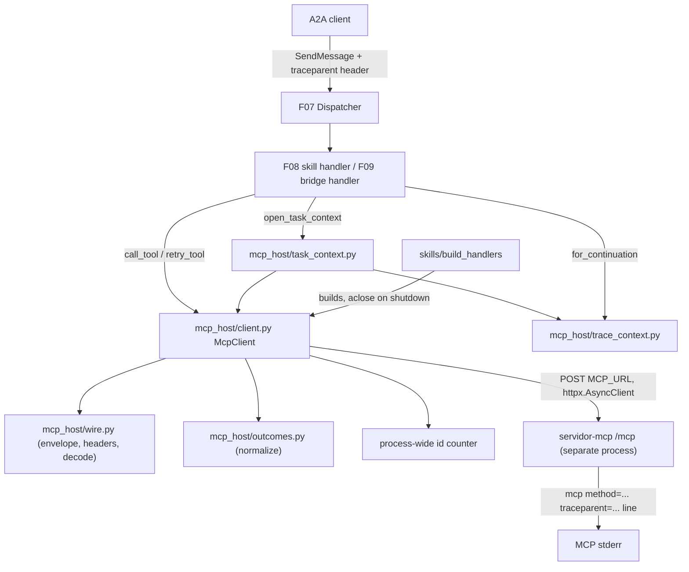
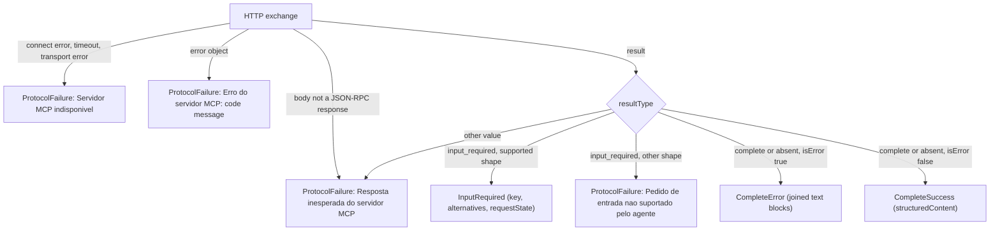

# Technical Specification: Agent MCP Host Client

**Complexity:** medium

## 1. Technical Overview

### What

F06 adds the inward-facing half of the agent: an MCP host client inside `agente/` that talks to the MCP server (`servidor-mcp/`, F01–F05) over Streamable HTTP. It speaks only the wire contract. It never imports `servidor_mcp`. Every request is stateless and self-contained. The body carries the mandatory `_meta` envelope (protocol version `2026-07-28`, client info, `{"elicitation": {"form": {}}}` capabilities and a W3C `traceparent`). The headers mirror the body (`MCP-Protocol-Version`, `Mcp-Method`, `Mcp-Name`). Each request uses a fresh JSON-RPC id from one process-wide counter that starts at 1.

The client offers three things to its consumers. F08 calls a **per-Task context opener**: it runs `tools/list` and then `resources/read politica://uso` under the Task's trace context. It returns the discovered tool names and the policy version taken from the `versao:` first line. F08 and F09 call a **tool invocation**, which normalizes every `tools/call` answer into exactly one of four outcomes: complete-success, complete-error, input-required and protocol-failure. F09 calls a **retry invocation**: it re-issues the same `tools/call` with a new id, `inputResponses` keyed by the stored key, and the stored `requestState` byte for byte.

F06 contains no booking logic and no A2A logic. It never registers an elicitation callback. An `input_required` result always comes back to the caller raw, as an input-required outcome. `requestState` is an opaque string. F06 never decodes it, inspects it, logs it or rebuilds it.

### Why

- The validator and the evaluator grep the MCP server's stderr. They expect a `tools/list` and a `resources/read` before each Task's first `tools/call`, the caller's trace-id on every line, and distinct ids for the initial and retried `tools/call`. These are client-side properties. They must be guaranteed by one component, not re-implemented by F08 and F09.
- The F01 server rejects any request whose `_meta` or mirrored headers are incomplete or inconsistent (`-32602`, `-32020`, HTTP 400). A single request builder makes conformance structural.
- The bridge (F09) only works if the Task can pause. An SDK client with an elicitation callback answers the server by itself and the Task never pauses (README, "Dicas finais"). A thin client that surfaces `input_required` as data, with typed outcomes, keeps the pause/resume decision in the agent.

### Scope

**Included (PRD F06 Capabilities, Experience and Error Handling — full scope, no Core/Full split):**
- New runtime dependency `httpx==0.28.1` (async HTTP client), moved from the `dev` extra to the runtime dependencies with the same pin (Section 3.3, A1).
- `MCP_URL` setting (default `http://localhost:7301/mcp`) added to `Settings`, with startup validation.
- W3C trace-context handling: parse an incoming `traceparent`, keep its trace-id and flags, create a new span-id for every MCP request, or generate a new trace-id once per Task when the header is absent or invalid.
- MCP request envelope and header builder; response decoder for `application/json` and single-event `text/event-stream` bodies.
- Process-wide JSON-RPC id counter starting at 1.
- MCP client with a 10-second limit per request, a shared connection pool, and mapping of transport failures and JSON-RPC errors to protocol-failure outcomes.
- `tools/list` discovery, `resources/read politica://uso` with policy-version extraction, `tools/call` with outcome normalization, and the retry invocation.
- Per-Task MCP context opener (discovery, then policy) used by F08.
- Client lifecycle: built inside the registration hook and closed through `Handlers.aclose` on shutdown.
- Exact Portuguese failure messages in `mensagens.py`.

**Output contracts (PRD F06 Provides):**

| PRD Provides item | Exposed as | Module | Consumers |
|---|---|---|---|
| Per-Task MCP context: discovered tool names and policy version extracted from `politica://uso` | `open_task_context(client, traceparent, *, required_tool=RESERVAR_SALA) -> TaskMcpContext \| ProtocolFailure`. `TaskMcpContext` has `trace`, `tools`, `tool_names`, `policy_version` | `mcp_host/task_context.py` | F08 |
| Normalized `tools/call` outcome: complete-success (`structuredContent` fields), complete-error (exact text of the content blocks), input-required (single key, alternative room ids from `sala` `enum`/`const`, opaque `requestState`), protocol-failure (JSON-RPC code and message, or transport failure) | `McpClient.call_tool(trace, name, arguments) -> ToolOutcome`, where `ToolOutcome = CompleteSuccess \| CompleteError \| InputRequired \| ProtocolFailure` | `mcp_host/client.py`, `mcp_host/outcomes.py` | F08, F09 |
| Retry invocation: same tool name and original arguments, new JSON-RPC id, `inputResponses` keyed by the stored key, stored `requestState` byte for byte | `McpClient.retry_tool(trace, name, arguments, *, input_key, input_response, request_state) -> ToolOutcome`, plus the builders `accept_response(sala)` and `decline_response()` | `mcp_host/client.py`, `mcp_host/outcomes.py` | F09 |
| (Added by F06 for F09, A11) Trace context that can be stored in the paused record and re-derived on a continuation | `TraceContext` (frozen) with `TraceContext.for_task(raw)` and `TraceContext.for_continuation(stored, raw)` | `mcp_host/trace_context.py` | F08, F09 |

**Input contracts (PRD F06 Consumes), over HTTP only:**

| PRD Consumes item | Wire source | How F06 reads it |
|---|---|---|
| F01: `tools/list` discovery (tool names, `inputSchema`, `outputSchema`) | `result.tools[]` of `tools/list` (`exemplos/wire/01`) | Keeps each tool's `name`, `inputSchema` and `outputSchema` in server order. Follows `nextCursor` pages (A16) |
| F02: `politica://uso` text whose first line is `versao: <value>` | `result.contents[]` of `resources/read` (`exemplos/wire/05`) | Takes the text of the entry whose `uri` is `politica://uso`. The version is the trimmed text after `versao:` on its first line |
| (Wire contract, F04/F05, `exemplos/wire/02`, `03`, `04`, `06`, `11`) `tools/call` results and errors | `result` (`resultType`, `isError`, `content`, `structuredContent`, `inputRequests`, `requestState`) or `error` | Normalized per Section 5.5 |

**Excluded / deferred to other features:**
- Parsing `reservar sala=...`, mapping outcomes to Task states, the `reserva` artifact and its texts (F08).
- The paused record, parsing `escolha=<valor>`, building the `alternativas:` line, choosing accept or decline (F09). F06 only provides the retry invocation and the response builders.
- Any domain rule: room ids, capacities, time windows, conflicts (forbidden in `agente/`).
- An agent-side log of MCP requests. The MCP server's stderr is the evidence (A18).
- README instructions for `MCP_URL` (F10). F06 records the variable and its default (Section 5.8).

### Requirements (from PRD Capabilities and Experience)

| ID | Requirement | PRD source |
|---|---|---|
| R1 | Python ≥ 3.10 code under `agente/`. HTTP only to `MCP_URL` (default `http://localhost:7301/mcp`). Importing server code is forbidden | Capabilities 1 |
| R2 | No SDK elicitation callback. `input_required` is always returned raw to the caller | Capabilities 2 |
| R3 | Every body carries `_meta` with `io.modelcontextprotocol/protocolVersion: "2026-07-28"`, `io.modelcontextprotocol/clientInfo: {"name": "agente-central-de-salas", "version": "1.0.0"}`, `io.modelcontextprotocol/clientCapabilities: {"elicitation": {"form": {}}}` and `traceparent` | Capabilities 3 |
| R4 | Every request carries `Content-Type: application/json`, `Accept: application/json, text/event-stream`, `MCP-Protocol-Version: 2026-07-28`, `Mcp-Method: <method>` and, for `tools/call` / `resources/read`, `Mcp-Name: <tool name or URI>` | Capabilities 4 |
| R5 | Accepts `application/json` and single-event `text/event-stream` response bodies | Capabilities 5 |
| R6 | JSON-RPC ids come from a process-wide monotonically increasing counter starting at 1 | Capabilities 6 |
| R7 | Trace context: a valid incoming `traceparent` keeps trace-id and flags, with a new random 16-hex span-id per MCP request. An absent or invalid header yields a new random trace-id, generated once per Task | Capabilities 7 |
| R8 | Policy version = text after `versao:` on the first line of the resource, trimmed | Capabilities 8 |
| R9 | 10-second limit per MCP request | Capabilities 9 |
| R10 | `requestState` is never decoded, inspected, logged or rebuilt | Capabilities 10 |
| R11 | New Task: `tools/list`, then `resources/read politica://uso`, both with the Task's trace-id. Then the skill's `tools/call` returns one normalized outcome. A later continuation's retry gets the next id | Experience 1–3 |
| R12 | Error Handling: unreachable or timed out → `Servidor MCP indisponivel`. JSON-RPC error → `Erro do servidor MCP: <code> <message>`. `reservar_sala` not discovered → `Ferramenta reservar_sala nao encontrada no servidor MCP`. No `versao:` line → `Politica de uso sem versao declarada`. Unsupported `input_required` shape → `Pedido de entrada nao suportado pelo agente` | Error Handling |

**Per-Task flow (F08 calling F06):** `TraceContext.for_task(ctx.traceparent)` → `tools/list` (id n, new span) → `reservar_sala` present? → `resources/read politica://uso` (id n+1, new span) → version extracted → `TaskMcpContext` → `call_tool(trace, "reservar_sala", args)` (id n+2) → one `ToolOutcome`.

**Continuation flow (F09 calling F06):** `TraceContext.for_continuation(stored_trace, ctx.traceparent)` → `retry_tool(...)` (new id from the same counter) → one `ToolOutcome`. No `tools/list` or `resources/read` is repeated on a continuation (A15).

## 2. Architecture Impact

### Affected components

| Path | Role |
|---|---|
| `agente/pyproject.toml` | Adds `httpx==0.28.1` to runtime dependencies (removed from `dev`, same pin) |
| `agente/src/agente/config.py` | `Settings.mcp_url` and `MCP_URL` validation |
| `agente/src/agente/mensagens.py` | F06 failure messages and the `MCP_URL` startup error |
| `agente/src/agente/mcp_host/__init__.py` | Public surface of the MCP host client (re-exports) |
| `agente/src/agente/mcp_host/trace_context.py` | W3C `traceparent` parsing and generation |
| `agente/src/agente/mcp_host/wire.py` | Protocol constants, request body and header builders, response body decoding |
| `agente/src/agente/mcp_host/outcomes.py` | Outcome types, result normalization, input-response builders |
| `agente/src/agente/mcp_host/client.py` | `McpClient`: id counter, HTTP transport, timeouts, discovery, resource read, tool call, retry |
| `agente/src/agente/mcp_host/task_context.py` | Per-Task context opener (discovery, then policy) |
| `agente/src/agente/skills/__init__.py` | Builds the `McpClient` from `Settings` and registers its `aclose` |
| `agente/src/agente/__main__.py` | Maps the new `MCP_URL` configuration error to exit `1` (already done through `ConfigError`; no new branch) |
| `agente/tests/**` | Unit and integration tests (Section 7) |

### Component and data flow



### Outcome normalization



## 3. Technical Decisions

| Decision | Chosen Approach | Alternative Considered | Trade-off |
|---|---|---|---|
| MCP client stack | Thin hand-rolled JSON-RPC client over `httpx.AsyncClient` that builds the stateless 2026-07-28 envelope itself (Section 3.1) | Official `mcp` v2 client: `ClientSession.call_tool(..., allow_input_required=True)` over `streamable_http_client` | Full control over the process-wide id counter starting at 1, per-request `traceparent` in `_meta`, header mirroring, SSE fallback and raw `input_required`, which are exactly the PRD's client properties. In exchange, F06 owns roughly 300 lines of protocol code that the SDK would hide. This matches F07's hand-rolled A2A choice |
| HTTP library | `httpx==0.28.1` (async), already pinned in both projects' `dev` extras, promoted to a runtime dependency of `agente` | Standard-library `urllib` in a worker thread; `aiohttp` | No new package in the venv and the same pin as `servidor-mcp` (F07 A4 rule). Native async fits the Starlette handlers. Cost: one runtime dependency in `agente` |
| Client lifetime | One `McpClient` (one `AsyncClient` and one id counter) per agent process, built in `skills.build_handlers(settings)` and closed through `Handlers.aclose` | A client per Task | One counter guarantees process-wide unique ids (R6), and connections are pooled. The README explicitly allows a live client object between calls. Protocol state is still never reused between requests |
| Timeout | `httpx.Timeout(10.0)` on every phase, plus an overall `asyncio.wait_for(..., 10.0)` around each exchange | httpx phase timeouts only | httpx timeouts apply per phase, so a slow-drip response could exceed 10 s. The outer bound makes R9 a hard limit |
| Outcome model | Four frozen dataclasses and a union type; the client never raises for protocol conditions | Exceptions per failure kind | Consumers (F08/F09) use exhaustive matching. A failure can never escape as an unhandled exception that F07 would turn into `Falha interna do agente` |
| Per-Task opening order | `tools/list` → check required tool → `resources/read` → version check; stop at the first failure | Read the policy even when the tool is missing | Fails fast with fewer MCP requests. The acceptance order (`tools/list` and `resources/read` before the first `tools/call`) holds on every successful path |
| Trace context ownership | Immutable `TraceContext(trace_id, flags, generated)` created once per Task, with a new span-id produced per request inside the client | Span-id fixed per Task | R7 requires a new span per MCP request. A fixed trace-id per Task gives "one generated trace-id per Task" without shared mutable state |
| Proxy and environment | `trust_env=False`, `follow_redirects=False`, HTTP/1.1 | httpx defaults | A developer's `HTTP_PROXY`/`ALL_PROXY` could otherwise send localhost MCP traffic through a proxy and break the evaluator flow. A redirect is not part of the MCP contract |

### 3.1 Official `mcp` client vs hand-rolled client

| # | PRD client property | `mcp` v2 client (`ClientSession`) | Hand-rolled (chosen) |
|---|---|---|---|
| 1 | Raw `input_required` (R2) | `Client.call_tool` drives `input_required` through callbacks and retries by itself. `ClientSession.call_tool(..., allow_input_required=True)` returns `InputRequiredResult` instead (confirmed, SDK v2 API docs, Context7) | Native: `InputRequired` outcome |
| 2 | Process-wide id counter starting at 1 (R6) | Ids come from the session's own request counter. Its starting value, and whether one session can be shared across concurrent Tasks, are not documented (U1, U2) | `itertools.count(1)` owned by the single client |
| 3 | Per-request `traceparent` with a new span-id inside `_meta` (R3, R7) | `meta=` parameter on `call_tool`. Unconfirmed for `list_tools` / `read_resource`, and unconfirmed whether the SDK merges or replaces the envelope keys (U3) | Built per request |
| 4 | Exact `clientInfo` and `{"elicitation": {"form": {}}}` in every request | Derived from session construction and registered callbacks. Declaring form elicitation may require registering an elicitation callback, which R2 forbids (U4) | Constant envelope |
| 5 | Every Task's first MCP request is `tools/list` | The session may send `server/discover` or other handshake traffic on connect (U5) | No implicit requests |
| 6 | Single-event SSE and JSON bodies (R5) | Handled by the transport | Small decoder (Section 5.6) |

**Decision:** hand-rolled. Rows 2, 4 and 5 are PRD-visible properties the SDK client cannot be shown to guarantee. Row 4 risks contradicting R2. The assignment's mandatory MCP SDK is the server SDK, which F01–F05 use. The README restriction "the agent talks to the MCP server over HTTP, like a real MCP client" is met by a client that speaks the 2026-07-28 wire format. The SDK alternative stays documented so F10's "Decisões técnicas" can cite it.

**Unconfirmed SDK facts (recorded only to justify the choice; nothing in F06 depends on them):**

| # | Unconfirmed fact |
|---|---|
| U1 | Initial value of `ClientSession`'s request id counter in `mcp` 2.3.0 |
| U2 | Whether concurrent `call_tool` calls on one `ClientSession` are supported without cross-talk |
| U3 | Whether `meta=` is merged with or replaces the SDK-generated `io.modelcontextprotocol/*` keys |
| U4 | Whether declaring `elicitation.form` without an elicitation callback is possible |
| U5 | Whether the session issues `server/discover` before the first request under 2026-07-28 |

### 3.2 Wire facts relied upon

| Fact | Evidence |
|---|---|
| Successful results are HTTP 200 `application/json` with `resultType` (`complete` or `input_required`) and `_meta.io.modelcontextprotocol/serverInfo` | `exemplos/wire/01`–`05`, `11` |
| JSON-RPC errors produced by the SDK ladder and MRTR come with HTTP `400` (`-32700`, `-32602`, `-32020`, `-32021`, `-32022`) or `404` (`-32601`), with a JSON-RPC body | F01 spec Section 3.1 (`ERROR_CODE_HTTP_STATUS`), `exemplos/wire/06` |
| Ladder rejections may carry `id: null` | F01 spec A16, V3 |
| A tool execution error is `{"content": [{"type": "text", "text": m}], "isError": true, "resultType": "complete"}` with no `structuredContent`. Argument-shape errors carry the SDK prefix `Error executing tool <name>: ` | F03 spec S4, S6 |
| `input_required` has one `inputRequests` entry whose value is `{"method": "elicitation/create", "params": {"message", "mode": "form", "requestedSchema": {"properties": {"sala": {"enum": [...]}}}}}`, plus `requestState` | `exemplos/wire/03`; F05 PRD Provides (`enum` or `const`) |
| The server rejects a `Host` other than `127.0.0.1:*`, `localhost:*` or `[::1]:*` with 421 plain text when bound to localhost | F01 spec Section 3.1 |
| The server log reads `traceparent` from `params._meta.traceparent` only; the HTTP header is ignored | F01 spec A15 |

**Verify at implementation** (plan step 2). Each item names the component that changes if the fact differs:

| # | Item to verify | Component affected | Fallback if it differs |
|---|---|---|---|
| V1 | In `httpx==0.28.1`, `ConnectError`, `ReadTimeout`, `ConnectTimeout`, `RemoteProtocolError` are all subclasses of `httpx.TransportError` | `client.py` | Catch `httpx.TimeoutException` and `httpx.NetworkError` explicitly in addition |
| V2 | `httpx.AsyncClient(trust_env=False, follow_redirects=False, timeout=httpx.Timeout(10.0))` signature, and `httpx.MockTransport` for async tests | `client.py`, tests | Adjust keyword names; behavior stays the same |
| V3 | The running F01 server answers the agent's requests (with `Host: localhost:7301`) without 421, and answers `-32602`/`-32020` with HTTP 400 plus a JSON body | `client.py` (non-2xx bodies are decoded) | None needed: the decoder reads the body whatever the status |
| V4 | On Windows, `localhost` resolving to `::1` first while the server listens on `127.0.0.1` adds at most a few seconds to a refused connection, inside the 10 s limit | Default `MCP_URL` | Keep the PRD default and record the observation for F10; `MCP_URL=http://127.0.0.1:7301/mcp` stays a valid override |
| V5 | `httpx` resolves with the shared venv pins (`mcp==2.3.0` uses `httpx2`, not `httpx`, so there is no range conflict) | `pyproject.toml` | Keep `httpx==0.28.1` in both manifests; move both together if a conflict appears |

### 3.3 Assumptions and Auto-Accept Decisions

Every row below is a decision the PRD did not answer. Each names the Auto-Accept Policy row that produced it, so the user can review and override it later.

| # | Decision | Choice | Auto-Accept policy row |
|---|---|---|---|
| A1 | HTTP client dependency | `httpx==0.28.1` becomes a runtime dependency of `agente` (removed from the `dev` extra, where it already was, with the same pin; Starlette's `TestClient` keeps working because the runtime install provides it). No other new package | Feature requires new technology not present in the codebase |
| A2 | Client stack | Hand-rolled JSON-RPC client, not the SDK's `ClientSession` (Section 3.1) | Technical decision with a clear recommendation |
| A3 | Package layout | New subpackage `agente/src/agente/mcp_host/` (not `mcp`, which would read like the SDK's top-level package in the shared venv). English module names, Portuguese user-facing strings in `mensagens.py` (F07 A33) | Multiple conflicting patterns (flat modules vs the `skills/` subpackage): subpackage chosen because F06 adds five cohesive modules |
| A4 | `MCP_URL` validation | Must be an absolute `http`/`https` URL with a host. Otherwise startup fails with `MCP_URL invalida: <valor>` and exit `1`. Kept verbatim (no trailing-slash change: `/mcp` and `/mcp/` are both logged by the server). Default `http://localhost:7301/mcp` | Partial PRD specification |
| A5 | No startup probe | The agent starts even when the MCP server is down. Discovery happens per Task, so a later server start is picked up without restarting the agent | Technical decision with a clear recommendation |
| A6 | JSON-RPC ids | Integers from `itertools.count(1)`, owned by the single `McpClient`. One `next()` per request, taken before the request is sent, including requests that later fail. Never reused. The counter is not reset by errors and does not survive a restart | Partial PRD specification |
| A7 | Request rendering | Body rendered with the agent's existing renderer (`agente.jsonrpc.render`: compact, `ensure_ascii=False`, UTF-8). Key order: `jsonrpc, id, method, params`; inside `params` the method fields first, then `_meta` last, in the order of `exemplos/wire/01`–`05`. `_meta` key order: `protocolVersion, clientInfo, clientCapabilities, traceparent` | Technical decision with a clear recommendation |
| A8 | `traceparent` validity | Valid only if it matches `^00-[0-9a-f]{32}-[0-9a-f]{16}-[0-9a-f]{2}$` (lowercase, version `00`, exactly four fields), the trace-id is not all zeros and the parent-id is not all zeros. Surrounding whitespace is stripped first. Anything else (uppercase hex, other versions, extra fields) counts as invalid and triggers a generated trace-id | Partial PRD specification |
| A9 | Generated trace values | Trace-id: `secrets.token_hex(16)`, regenerated if all zeros. Flags for a generated trace: `01`. Span-id: `secrets.token_hex(8)` per request, regenerated if all zeros or equal to the incoming parent-id | Partial PRD specification |
| A10 | Flags | A valid incoming header's flags are copied unchanged into every MCP request of that Task | Technical decision with a clear recommendation (PRD "keeps the trace-id and flags") |
| A11 | Continuation trace context | `TraceContext.for_continuation(stored, raw)`: a valid continuation header provides the trace-id and flags. Otherwise the stored Task trace context is reused unchanged (PRD F09 Retry rule) | Technical decision with a clear recommendation |
| A12 | HTTP status handling | The body is decoded whatever the HTTP status. A JSON-RPC `error` object → `Erro do servidor MCP: <code> <message>`. A body that is not a JSON-RPC response (plain-text 421/403/400, HTML, empty body, 5xx without JSON, 3xx) → `Resposta inesperada do servidor MCP` | Partial PRD specification |
| A13 | Response id matching | A `result` must carry the request's id, otherwise `Resposta inesperada do servidor MCP`. An `error` is accepted with the request's id or `null` (SDK ladder behavior, F01 A16) | Partial PRD specification |
| A14 | `Erro do servidor MCP` rendering | `f"{code} {message}"` with surrounding whitespace removed: `Erro do servidor MCP: -32602 <SDK message>`. A non-integer code → `Resposta inesperada do servidor MCP`. A missing or non-string message renders as `Erro do servidor MCP: <code>`. The message is never shortened or translated | Partial PRD specification |
| A15 | Discovery frequency | `tools/list` and `resources/read` run once per new Task (PRD "at the start of every Task"). A continuation's retry does not repeat them. Discovered tools are never cached across Tasks | Technical decision with a clear recommendation |
| A16 | `tools/list` pagination | When `result.nextCursor` is a non-empty string, the next page is requested with `params.cursor` (new id, same trace-id), up to 10 pages. Tools accumulate in server order. More than 10 pages → `Resposta inesperada do servidor MCP` | Partial PRD specification |
| A17 | Tool record | `ToolInfo(name, input_schema, output_schema)` per entry with a non-empty string `name`. Entries without a usable name are skipped. Schemas are kept as received (or `None`) and are not validated by F06 | Partial PRD specification |
| A18 | Agent-side logging | F06 writes nothing to stderr or stdout. The MCP server's request log is the evidence for trace-id and id checks. This also guarantees R10 (no `requestState` in any agent log) | Technical decision with a clear recommendation |
| A19 | `requestState` handling | Stored in `InputRequired.request_state` as a dataclass field with `repr=False`, and passed back as the same `str` object. It never appears in an exception message or a `repr`. Absent in the result → `None`, and the retry then omits `requestState` (MCP allows a stateless `input_required`). Present but not a string, or an empty string → `Pedido de entrada nao suportado pelo agente` | Partial PRD specification |
| A20 | Supported `input_required` shape | `inputRequests` is an object with exactly one entry. Its value has `method == "elicitation/create"`. `params.mode` is `"form"` or absent (form is the MCP default). `params.requestedSchema.properties.sala` exists and has either a non-empty `enum` of non-empty strings (order kept, used as given) or a non-empty string `const` (one alternative). `enum` wins when both are present. Anything else → `Pedido de entrada nao suportado pelo agente`. The elicitation message is not exposed | Partial PRD specification |
| A21 | Complete-error text | The `text` of every `content` entry with `type == "text"`, in order, joined with `\n` (one block in practice, so the text stays verbatim, SDK prefixes included). No text block → `Resposta inesperada do servidor MCP` | Partial PRD specification |
| A22 | Complete-success payload | `structuredContent` (a JSON object) is returned as a detached `dict`, in key order. Fallback when it is absent: the first text block parsed as a JSON object. Neither available → `Resposta inesperada do servidor MCP`. F06 does not validate against `outputSchema` | Partial PRD specification |
| A23 | `resultType` | `input_required` → input-required path. `complete` or absent → complete path. Any other value → `Resposta inesperada do servidor MCP` | Partial PRD specification |
| A24 | Policy extraction | From `result.contents`, the first entry whose `uri` is `politica://uso` and whose `text` is a string. If none, the first entry with a string `text`. The first line ends at the first `\n` (a trailing `\r` is dropped). It must start with `versao:` at column 0. The version is the rest, trimmed, and must be non-empty. Any failure, including empty `contents`, → `Politica de uso sem versao declarada`. Same rule as the server (F01 A10) | Partial PRD specification |
| A25 | SSE decoding | For `Content-Type: text/event-stream`: events are separated by a blank line. The `data:` lines of an event are joined with `\n`. The first event whose data parses as a JSON-RPC response with the request's id (or an error with `null` id) is used. Comments and notifications are ignored. No such event → `Resposta inesperada do servidor MCP` | Partial PRD specification |
| A26 | Transport failures | Any `httpx.TransportError` (connection refused, DNS failure, timeouts, connection reset, protocol error) and the outer 10 s `asyncio.TimeoutError` → `Servidor MCP indisponivel`. `asyncio.CancelledError` is never swallowed | Partial PRD specification |
| A27 | Connection settings | `httpx.AsyncClient(timeout=httpx.Timeout(10.0), trust_env=False, follow_redirects=False)` with default pool limits. No retries at the HTTP layer: a failed request is reported once (a retry could duplicate a booking) | Technical decision with a clear recommendation |
| A28 | Required tool constant | `RESERVAR_SALA = "reservar_sala"` lives in `mcp_host/task_context.py`. The opener takes `required_tool` as a parameter, so tests can open a context against an F01–F03-only server with `listar_salas`. The failure text is the template `Ferramenta {nome} nao encontrada no servidor MCP`, which yields the PRD text for `reservar_sala` | Technical decision with a clear recommendation |
| A29 | Client construction site | `skills.build_handlers(settings)` builds the `McpClient` and returns `Handlers(..., aclose=client.aclose)` while the F07 stubs are still in place. F08 and F09 receive the same instance through closures inside `build_handlers` | Technical decision with a clear recommendation (follows F07 A22) |
| A30 | Arguments pass-through | `call_tool` and `retry_tool` send `arguments` exactly as given (a `dict` of strings for `reservar_sala`). F06 does not validate them against `inputSchema`: argument errors are the server's decision (no domain logic in the agent) | Technical decision with a clear recommendation |
| A31 | Input-response builders | `accept_response(sala) -> {"action": "accept", "content": {"sala": sala}}` and `decline_response() -> {"action": "decline"}`, matching `exemplos/wire/04` and `11`. The retry sends `{"<input_key>": <response>}` as `inputResponses` | Technical decision with a clear recommendation |
| A32 | Test strategy for the real server | Integration tests start `servidor_mcp` as a subprocess (existing `start_mcp_server` fixture) and are skipped when it is not installed. Tests that need `reservar_sala` (F04/F05) are skipped while the server's `tools/list` lacks it. Task-level acceptance tests are skipped while `build_handlers` still returns the F07 stub new-Task handler (F07 cross-feature pattern) | Technical decision with a clear recommendation |

### 3.4 PRD traceability

| PRD block | Spec destination |
|---|---|
| F06 Consumes | Section 1 Input contracts; Section 5.2–5.4 response tables |
| F06 Provides | Section 1 Output contracts; Section 5.7 in-process API; Section 6 |
| F06 Capabilities | Section 1 R1–R10; Sections 3 and 5 |
| F06 Experience | Section 1 R11 and flows; Section 5.2–5.4 examples (ids 1–4) |
| F06 Error Handling | Section 1 R12; Section 5.5 |
| Section 9 F06 acceptance criteria | Section 7 acceptance traceability |
| Section 9 Cross-Feature Integration (criteria naming F06) | Section 7 `test_cross_feature_f06.py` |

## 4. Component Overview

**Packaging and configuration:**

| File Path | New/Modified | Purpose | Key Responsibilities |
|---|---|---|---|
| `agente/pyproject.toml` | Modified | Manifest | `dependencies` gains `httpx==0.28.1`. The `dev` extra keeps `pytest==9.1.1` only. Everything else unchanged |
| `agente/src/agente/config.py` | Modified | Configuration | `Settings` gains `mcp_url: str` (field added last so positional construction of the existing three fields keeps working through a default `DEFAULT_MCP_URL`). `load_settings` reads `MCP_URL` and validates it (A4). `DEFAULT_MCP_URL = "http://localhost:7301/mcp"`. Docstring updated |
| `agente/src/agente/mensagens.py` | Modified | Exact strings | Adds `MCP_INDISPONIVEL`, `MCP_ERRO`, `MCP_FERRAMENTA_AUSENTE`, `POLITICA_SEM_VERSAO`, `MCP_PEDIDO_NAO_SUPORTADO`, `MCP_RESPOSTA_INESPERADA`, `MCP_URL_INVALIDA` (Section 5.5) |

**Backend:**

| File Path | New/Modified | Purpose | Key Responsibilities |
|---|---|---|---|
| `agente/src/agente/mcp_host/__init__.py` | New | Public surface | Re-exports `McpClient`, `open_task_context`, `TaskMcpContext`, `ToolInfo`, `TraceContext`, the four outcome types, `ToolOutcome`, `accept_response`, `decline_response`, `RESERVAR_SALA`, `POLICY_URI`. Module docstring states the consumer rules of the boundary table below |
| `agente/src/agente/mcp_host/trace_context.py` | New | W3C trace context | Frozen `TraceContext(trace_id, flags, generated: bool)`. `parse_traceparent(raw) -> TraceContext \| None` (A8). `TraceContext.for_task(raw)` (parsed or generated, A9). `TraceContext.for_continuation(stored, raw)` (A11). `new_span_id(avoid=None) -> str`. `TraceContext.header_value(span_id) -> str` renders `00-<trace>-<span>-<flags>`. The original incoming parent-id is kept privately so the span-id differs from it |
| `agente/src/agente/mcp_host/wire.py` | New | Wire format | Constants `PROTOCOL_VERSION = "2026-07-28"`, `CLIENT_INFO`, `CLIENT_CAPABILITIES`, `ACCEPT = "application/json, text/event-stream"`, method names. `build_meta(traceparent) -> dict`. `build_request(rpc_id, method, params, traceparent) -> dict` (A7). `build_headers(method, name=None) -> dict` (R4). `decode_response(content_type, body, rpc_id) -> dict \| None`, which returns a JSON-RPC response object for JSON or SSE bodies (A25), or `None` when there is none |
| `agente/src/agente/mcp_host/outcomes.py` | New | Outcome model | Frozen `CompleteSuccess(structured)`, `CompleteError(text)`, `InputRequired(input_key, alternatives: tuple[str, ...], request_state: str \| None [repr=False])`, `ProtocolFailure(message, code: int \| None = None)`. `ToolOutcome` union. `normalize_tool_result(result) -> ToolOutcome` (A20–A23). `error_failure(error_obj) -> ProtocolFailure` (A14). `accept_response(sala)`, `decline_response()` (A31) |
| `agente/src/agente/mcp_host/client.py` | New | MCP client | `McpClient(url, *, timeout=10.0, transport=None)`. Owns one `httpx.AsyncClient` (A27) and the id counter (A6). `async list_tools(trace) -> tuple[ToolInfo, ...] \| ProtocolFailure` (pagination A16). `async read_resource(trace, uri) -> str \| ProtocolFailure` (returns the chosen text, A24). `async call_tool(trace, name, arguments) -> ToolOutcome`. `async retry_tool(trace, name, arguments, *, input_key, input_response, request_state) -> ToolOutcome`. `async aclose()`. Private `_exchange(method, params, trace, name)`: next id, new span-id, build, POST, bounded wait, decode, id check; returns the JSON-RPC response object or a `ProtocolFailure` (A12, A13, A26). `transport` is injectable for tests (`httpx.MockTransport`) |
| `agente/src/agente/mcp_host/task_context.py` | New | Per-Task context | `RESERVAR_SALA`, `POLICY_URI = "politica://uso"`. Frozen `TaskMcpContext(trace, tools, policy_version)` with property `tool_names`. `extract_policy_version(text) -> str \| None` (A24). `async open_task_context(client, traceparent, *, required_tool=RESERVAR_SALA) -> TaskMcpContext \| ProtocolFailure`, which applies the opening order of Section 3 |
| `agente/src/agente/skills/__init__.py` | Modified | Registration hook | `build_handlers(settings)` creates `McpClient(settings.mcp_url)` and returns `Handlers(new_task=stub, continuation=stub, aclose=client.aclose)`. The docstring tells F08/F09 to capture this same instance in their handler closures (A29) |

**Module boundaries for consumers (F08, F09):**

| Consumer need | Use | Rule |
|---|---|---|
| Start MCP work for a new Task | `await open_task_context(client, ctx.traceparent)` | Call once per new Task, before any `call_tool`. On `ProtocolFailure`, fail the Task with `failure.message` |
| Call `reservar_sala` | `await client.call_tool(task_ctx.trace, RESERVAR_SALA, arguments)` | Match on the four outcome types. Never catch transport exceptions: F06 already converts them |
| Keep state for a pause (F09) | Store `InputRequired.input_key`, `.alternatives`, `.request_state` and `task_ctx.trace` in the private attachment | Never put `request_state` in a message, artifact, exception text or log |
| Resume (F09) | `trace = TraceContext.for_continuation(stored_trace, ctx.traceparent)`, then `await client.retry_tool(trace, RESERVAR_SALA, original_args, input_key=..., input_response=accept_response(sala) or decline_response(), request_state=stored)` | Same tool name and the original arguments. The client assigns the new id |
| Policy version for the artifact | `task_ctx.policy_version` | Already trimmed (e.g. `2026-11-01`) |
| Exact failure texts | `ProtocolFailure.message` | Use verbatim; already from `mensagens.py` |

**Database:** none. No migration. All F06 state is the id counter and the HTTP connection pool in process memory.

## 5. API Contracts

F06 exposes no new HTTP endpoint. Its contracts are the outbound MCP requests (5.1–5.4), the outcome and error mapping (5.5–5.6), the in-process API for F08/F09 (5.7) and the configuration (5.8).

### 5.1 Common outbound request

- **Method:** POST
- **URL:** `MCP_URL` (default `http://localhost:7301/mcp`)
- **Authentication:** none (out of scope)

**Headers (every request):**

| Header | Value | Notes |
|---|---|---|
| `Content-Type` | `application/json` | |
| `Accept` | `application/json, text/event-stream` | R5 |
| `MCP-Protocol-Version` | `2026-07-28` | Equals `_meta` protocol version |
| `Mcp-Method` | the body `method` | |
| `Mcp-Name` | `params.name` (`tools/call`) or `params.uri` (`resources/read`) | Omitted for `tools/list` |
| `Host` | set by httpx from `MCP_URL` (`localhost:7301` by default) | Allowed by the server's DNS-rebinding protection |

No `traceparent` HTTP header and no `Mcp-Session-Id` are sent. The server reads trace context from `_meta` only.

**Body `params._meta` (every request):**

| Field | Type | Value |
|---|---|---|
| `io.modelcontextprotocol/protocolVersion` | `string` | `2026-07-28` |
| `io.modelcontextprotocol/clientInfo` | `object` | `{"name": "agente-central-de-salas", "version": "1.0.0"}` |
| `io.modelcontextprotocol/clientCapabilities` | `object` | `{"elicitation": {"form": {}}}` |
| `traceparent` | `string` | `00-<Task trace-id>-<new span-id>-<flags>` |

### 5.2 `tools/list` (Experience 1, id 1)

**Request Example** (headers: `Mcp-Method: tools/list`, no `Mcp-Name`). The A2A caller sent `traceparent: 00-4bf92f3577b34da6a3ce929d0e0e4736-00f067aa0ba902b7-01`:
```json
{
  "jsonrpc": "2.0",
  "id": 1,
  "method": "tools/list",
  "params": {
    "_meta": {
      "io.modelcontextprotocol/protocolVersion": "2026-07-28",
      "io.modelcontextprotocol/clientInfo": {"name": "agente-central-de-salas", "version": "1.0.0"},
      "io.modelcontextprotocol/clientCapabilities": {"elicitation": {"form": {}}},
      "traceparent": "00-4bf92f3577b34da6a3ce929d0e0e4736-5a3c9e17b2d40f86-01"
    }
  }
}
```
A follow-up page request adds `"cursor": "<nextCursor>"` before `_meta` (A16).

**Response fields read:**

| Field | Type | Use |
|---|---|---|
| `result.tools[].name` | `string` | Discovered tool names, in order |
| `result.tools[].inputSchema` | `object` | Kept in `ToolInfo` |
| `result.tools[].outputSchema` | `object` | Kept in `ToolInfo` (may be absent) |
| `result.nextCursor` | `string` | Pagination (A16) |

**Response Example (abridged from `exemplos/wire/01`):**
```json
{
  "jsonrpc": "2.0",
  "id": 1,
  "result": {
    "cacheScope": "private",
    "resultType": "complete",
    "tools": [
      {"name": "listar_salas", "description": "Lista todas as salas com capacidade e recursos.", "inputSchema": {"type": "object", "properties": {}}, "outputSchema": {"type": "object"}},
      {"name": "consultar_disponibilidade", "inputSchema": {"type": "object"}, "outputSchema": {"type": "object"}},
      {"name": "reservar_sala", "inputSchema": {"type": "object"}, "outputSchema": {"type": "object"}}
    ],
    "ttlMs": 0,
    "_meta": {"io.modelcontextprotocol/serverInfo": {"name": "central-de-salas", "version": "1.0.0"}}
  }
}
```
Server stderr: `mcp method=tools/list id=1 name=- traceparent=00-4bf92f3577b34da6a3ce929d0e0e4736-5a3c9e17b2d40f86-01`

### 5.3 `resources/read politica://uso` (Experience 1, id 2)

**Request Example** (headers: `Mcp-Method: resources/read`, `Mcp-Name: politica://uso`):
```json
{
  "jsonrpc": "2.0",
  "id": 2,
  "method": "resources/read",
  "params": {
    "uri": "politica://uso",
    "_meta": {
      "io.modelcontextprotocol/protocolVersion": "2026-07-28",
      "io.modelcontextprotocol/clientInfo": {"name": "agente-central-de-salas", "version": "1.0.0"},
      "io.modelcontextprotocol/clientCapabilities": {"elicitation": {"form": {}}},
      "traceparent": "00-4bf92f3577b34da6a3ce929d0e0e4736-c18e0d2f94b7a356-01"
    }
  }
}
```

**Response fields read:**

| Field | Type | Use |
|---|---|---|
| `result.contents[].uri` | `string` | Selects the `politica://uso` entry (A24) |
| `result.contents[].text` | `string` | Policy text; first line `versao: <value>` |

**Response Example:** `exemplos/wire/05` `response.body`. Its text starts with `versao: 2026-11-01\n`, so `policy_version == "2026-11-01"`.

### 5.4 `tools/call` and retry (Experience 2–3, ids 3 and 4)

**Initial call — Request Example** (headers: `Mcp-Method: tools/call`, `Mcp-Name: reservar_sala`). Same shape as `exemplos/wire/03`, with the agent's span-id:
```json
{
  "jsonrpc": "2.0",
  "id": 3,
  "method": "tools/call",
  "params": {
    "name": "reservar_sala",
    "arguments": {
      "sala": "sala-garagem",
      "inicio": "2026-11-03T14:00:00-03:00",
      "fim": "2026-11-03T15:00:00-03:00",
      "responsavel": "Marty"
    },
    "_meta": {
      "io.modelcontextprotocol/protocolVersion": "2026-07-28",
      "io.modelcontextprotocol/clientInfo": {"name": "agente-central-de-salas", "version": "1.0.0"},
      "io.modelcontextprotocol/clientCapabilities": {"elicitation": {"form": {}}},
      "traceparent": "00-4bf92f3577b34da6a3ce929d0e0e4736-7e21b0c4d9a35f18-01"
    }
  }
}
```

**Retry — Request Example** (new id from the same counter; `inputResponses` and `requestState` between `arguments` and `_meta`, as in `exemplos/wire/04`):
```json
{
  "jsonrpc": "2.0",
  "id": 4,
  "method": "tools/call",
  "params": {
    "name": "reservar_sala",
    "arguments": {
      "sala": "sala-garagem",
      "inicio": "2026-11-03T14:00:00-03:00",
      "fim": "2026-11-03T15:00:00-03:00",
      "responsavel": "Marty"
    },
    "inputResponses": {
      "__main__:escolha_de_sala": {"action": "accept", "content": {"sala": "sala-fusca"}}
    },
    "requestState": "v1.ChSULhPTQFmhFaa1JD_cOZAOLthermsAclsGLBhonYIs69R9...<verbatim>",
    "_meta": {
      "io.modelcontextprotocol/protocolVersion": "2026-07-28",
      "io.modelcontextprotocol/clientInfo": {"name": "agente-central-de-salas", "version": "1.0.0"},
      "io.modelcontextprotocol/clientCapabilities": {"elicitation": {"form": {}}},
      "traceparent": "00-4bf92f3577b34da6a3ce929d0e0e4736-0b9d47e2a61c835f-01"
    }
  }
}
```
Decline: `inputResponses` value `{"action": "decline"}` (`exemplos/wire/11`). When the stored `request_state` is `None`, the `requestState` key is omitted (A19).

**Normalized outcomes for the wire examples:**

| Wire response | Outcome |
|---|---|
| `exemplos/wire/02` and `04` (complete, `isError: false`) | `CompleteSuccess(structured={"reserva": "res-0003", "reservado": true, "sala": "sala-aquario", ...})` |
| `exemplos/wire/11` (decline result) | `CompleteSuccess(structured={"reserva": null, "reservado": false, ..., "motivo": "recusado"})` (F09 decides what it means) |
| `{"content": [{"type": "text", "text": "Sala inexistente: sala-delorean"}], "isError": true, "resultType": "complete"}` | `CompleteError(text="Sala inexistente: sala-delorean")` |
| `exemplos/wire/03` (input_required) | `InputRequired(input_key="__main__:escolha_de_sala", alternatives=("sala-fusca", "sala-mirante"), request_state=<verbatim>)` |
| `exemplos/wire/06` (HTTP 400, `-32021`) | `ProtocolFailure("Erro do servidor MCP: -32021 Client did not declare the form elicitation capability required by resolver '__main__:escolha_de_sala'", code=-32021)` (not expected in practice: the agent always declares form) |
| HTTP 400, `-32602`, expired or tampered `requestState` | `ProtocolFailure("Erro do servidor MCP: -32602 <SDK message>", code=-32602)` |

### 5.5 Error Codes and Messages (PRD F06 Error Handling, A12–A26)

All failures surface as `ProtocolFailure(message, code)`. F06 never raises for these conditions.

| Condition | `message` (exact, `mensagens.py`) | `code` | Raised by |
|---|---|---|---|
| Connection refused, DNS failure, connection reset, HTTP protocol error, any httpx timeout, or the outer 10 s bound | `Servidor MCP indisponivel` | `None` | `client._exchange` (A26) |
| JSON-RPC `error` object in the response | `Erro do servidor MCP: <code> <message>` | the code | `outcomes.error_failure` (A14) |
| Body not a JSON-RPC response; `result` with another id; unknown `resultType`; complete-error without text; complete-success without an object payload; more than 10 `tools/list` pages | `Resposta inesperada do servidor MCP` | `None` | `wire.decode_response`, `client`, `outcomes` |
| Required tool absent from discovery | `Ferramenta reservar_sala nao encontrada no servidor MCP` (template `Ferramenta {nome} nao encontrada no servidor MCP`) | `None` | `task_context.open_task_context` (A28) |
| Policy resource without a valid `versao:` first line, or no text entry | `Politica de uso sem versao declarada` | `None` | `task_context.open_task_context` (A24) |
| `input_required` with zero or several `inputRequests` entries, a method other than `elicitation/create`, a non-form mode, no `sala` property, no usable `enum`/`const`, or a non-string/empty `requestState` | `Pedido de entrada nao suportado pelo agente` | `None` | `outcomes.normalize_tool_result` (A20) |
| `MCP_URL` invalid at startup | `MCP_URL invalida: <valor>` (stderr, exit `1`) | — | `config.load_settings` (A4) |

`Resposta inesperada do servidor MCP` is shared with F09 ("decline answered with anything other than `reservado: false`"). F09 reuses the same constant.

### 5.6 Response decoding (R5, A25)

| `Content-Type` of the response | Decoding |
|---|---|
| starts with `application/json` | `json.loads` of the UTF-8 body |
| starts with `text/event-stream` | SSE events; `data:` lines joined with `\n`; the first event whose JSON is a response to this request is used |
| anything else, or missing | Attempt `json.loads`; on failure → `Resposta inesperada do servidor MCP` |

A decoded value counts as a JSON-RPC response only if it is an object with `"jsonrpc": "2.0"` and exactly one of `result` (an object) or `error` (an object).

### 5.7 In-process API (for F08 and F09)

**`TraceContext`** (frozen):

| Member | Description |
|---|---|
| `trace_id: str` | 32 lowercase hex, never all zeros |
| `flags: str` | 2 lowercase hex |
| `generated: bool` | `True` when no valid incoming header existed |
| `for_task(raw: str \| None) -> TraceContext` | Parsed from a valid header (A8), else generated (A9) |
| `for_continuation(stored: TraceContext, raw: str \| None) -> TraceContext` | A11 |
| `header_value(span_id: str) -> str` | `00-<trace_id>-<span_id>-<flags>` |

**`McpClient`:**

| Operation | Returns | Notes |
|---|---|---|
| `McpClient(url, *, timeout=10.0, transport=None)` | — | One instance per process (A29) |
| `await list_tools(trace)` | `tuple[ToolInfo, ...] \| ProtocolFailure` | One or more requests (A16) |
| `await read_resource(trace, uri)` | `str \| ProtocolFailure` | Text selected per A24 |
| `await call_tool(trace, name, arguments)` | `ToolOutcome` | One request |
| `await retry_tool(trace, name, arguments, *, input_key, input_response, request_state)` | `ToolOutcome` | One request; new id; `request_state` echoed unchanged |
| `await aclose()` | `None` | Idempotent; awaited by the F07 lifespan |

**`open_task_context(client, traceparent, *, required_tool=RESERVAR_SALA)`** → `TaskMcpContext(trace, tools, policy_version)` or `ProtocolFailure`. It sends exactly two requests on success (one more per extra `tools/list` page). On a missing tool it sends only `tools/list`.

**Outcome types:**

| Type | Fields | Meaning |
|---|---|---|
| `CompleteSuccess` | `structured: dict` | `isError` false or absent |
| `CompleteError` | `text: str` | `isError: true`; verbatim text (A21) |
| `InputRequired` | `input_key: str`, `alternatives: tuple[str, ...]`, `request_state: str \| None` (hidden from `repr`) | Supported `input_required` (A20) |
| `ProtocolFailure` | `message: str`, `code: int \| None` | Section 5.5 |

### 5.8 Configuration contract

| Variable | Default | Validation | Failure |
|---|---|---|---|
| `MCP_URL` | `http://localhost:7301/mcp` | Absolute `http`/`https` URL with a host (A4) | stderr `MCP_URL invalida: <valor>`, exit `1`, nothing bound |

The existing variables (`AGENT_PORT`, `AGENT_HOST`, `AGENT_PUBLIC_URL`) are unchanged. The banner is unchanged (A18: no extra stderr line).

## 6. Data Model

In-memory only: no database, no migration, no file I/O.

**Value types (all frozen):**

| Type | Field | Type | Nullable | Description |
|---|---|---|---|---|
| `TraceContext` | `trace_id` | `str` (32 hex) | No | Task trace-id |
| | `flags` | `str` (2 hex) | No | Copied or `01` |
| | `generated` | `bool` | No | Generated vs propagated |
| | `_parent_id` | `str` (16 hex) | Yes | Incoming span-id to avoid; not compared, not rendered |
| `ToolInfo` | `name` | `str` | No | Tool name |
| | `input_schema` | `dict` | Yes | As received |
| | `output_schema` | `dict` | Yes | As received |
| `TaskMcpContext` | `trace` | `TraceContext` | No | Task trace context |
| | `tools` | `tuple[ToolInfo, ...]` | No | Discovery result, server order |
| | `policy_version` | `str` | No | e.g. `2026-11-01` |
| | `tool_names` (property) | `tuple[str, ...]` | No | Derived from `tools` |
| `CompleteSuccess` | `structured` | `dict` | No | Detached copy |
| `CompleteError` | `text` | `str` | No | Non-empty |
| `InputRequired` | `input_key` | `str` | No | Server-assigned key |
| | `alternatives` | `tuple[str, ...]` | No (≥ 1) | `enum` order or single `const` |
| | `request_state` | `str` | Yes | Opaque; `repr=False` |
| `ProtocolFailure` | `message` | `str` | No | Exact text |
| | `code` | `int` | Yes | JSON-RPC code when available |

**Process state (`McpClient`):**

| Item | Type | Purpose |
|---|---|---|
| `_ids` | `itertools.count(1)` | Process-wide unique ids (R6). Each request takes one value in a single synchronous `next()` call (no `await` in between), so concurrent Tasks on one event loop never share an id |
| `_http` | `httpx.AsyncClient` | Pooled connections; closed by `aclose` |
| `_url`, `_timeout` | `str`, `float` | Configuration |

**Invariants:**

| Invariant | Definition | Purpose |
|---|---|---|
| Unique ids | Every outbound request has an id never used before in the process | R6; evaluator step 6 |
| One trace-id per Task | Every request made with one `TraceContext` carries its `trace_id` | R7; acceptance 5 and 6 |
| Fresh span per request | A span-id is generated per request, non-zero and different from the incoming parent-id | R7; acceptance 5 |
| Opaque state | `request_state` is only copied, never parsed, sliced, logged or rendered by `repr` | R10; validator check 34 |
| Total outcomes | Every public client operation returns a value from its declared union; only `CancelledError` and programming errors propagate | F08/F09 never see transport exceptions |

## 7. Testing Strategy

**Test File Structure** (run with `python -m pytest agente` from the repo root, `dev` extra installed):

| Test File | Test Type | Target | Coverage Goal |
|---|---|---|---|
| `agente/tests/unit/test_config.py` | Unit (extended) | `MCP_URL` in `config.py` | 100% |
| `agente/tests/unit/test_trace_context.py` | Unit | `mcp_host/trace_context.py` | 100% |
| `agente/tests/unit/test_mcp_wire.py` | Unit | `mcp_host/wire.py` | 100% |
| `agente/tests/unit/test_mcp_outcomes.py` | Unit | `mcp_host/outcomes.py` | 100% |
| `agente/tests/unit/test_mcp_client.py` | Unit (`httpx.MockTransport`, `asyncio.run`) | `mcp_host/client.py` | 95% |
| `agente/tests/unit/test_task_context.py` | Unit (`httpx.MockTransport`) | `mcp_host/task_context.py` | 100% |
| `agente/tests/integration/test_mcp_host_against_server.py` | Integration (subprocess `servidor_mcp`) | Client against the real F01–F05 server | n/a |
| `agente/tests/integration/test_process.py` | Integration (extended) | Startup with `MCP_URL`; shutdown closes the client | n/a |
| `agente/tests/integration/test_cross_feature_f06.py` | Integration (both subprocesses, gated) | Section 9 F06 acceptance and Cross-Feature criteria at Task level | n/a |

**New fixtures (`conftest.py`):**

| Fixture | Description |
|---|---|
| `mock_mcp` | Builds an `McpClient` on `httpx.MockTransport`. A scripted responder records every `httpx.Request` (headers and parsed body) and answers from a queue of `(status, content_type, body)` tuples or a callable |
| `hung_server` | A TCP listener thread on a free port that accepts connections and never answers (timeout tests) |
| `mcp_lines` | Filters a `start_mcp_server` process's stderr to `mcp ` lines and parses them into `(method, id, name, traceparent)` |

**`unit/test_config.py` (additions):**

| Test Function | Description | Assertions |
|---|---|---|
| `test_mcp_url_default` | No variable | `mcp_url == "http://localhost:7301/mcp"` |
| `test_mcp_url_override_kept_verbatim` | `http://127.0.0.1:9999/mcp/` | Value unchanged |
| `test_invalid_mcp_url_raises_config_error` | Parametrized `localhost:7301/mcp`, `ftp://x/mcp`, `http://`, `""` | `ConfigError` with `MCP_URL invalida: <valor>` |

**`unit/test_trace_context.py`:**

| Test Function | Description | Assertions |
|---|---|---|
| `test_valid_traceparent_keeps_trace_id_and_flags` | `00-4bf92f...4736-00f067aa0ba902b7-01` | `trace_id`, `flags == "01"`, `generated is False` |
| `test_invalid_traceparent_variants_generate` | Parametrized: `None`, `""`, uppercase hex, version `01`/`ff`, all-zero trace-id, all-zero parent-id, short fields, 5 fields, garbage | `generated is True`; 32-hex non-zero trace-id; flags `01` |
| `test_whitespace_around_header_is_stripped` | Leading and trailing spaces | Parsed as valid |
| `test_new_span_id_format_and_difference_from_parent` | 1 000 span-ids with a fixed parent | All `^[0-9a-f]{16}$`, none zero, none equal to the parent |
| `test_header_value_rendering` | Known values | `00-<trace>-<span>-<flags>` |
| `test_for_continuation_prefers_valid_new_header` | Stored generated trace; valid continuation header | Continuation trace-id used |
| `test_for_continuation_falls_back_to_stored` | Absent or invalid header | Same `TraceContext` as stored |
| `test_two_tasks_without_header_get_different_trace_ids` | Two `for_task(None)` | Different trace-ids |

**`unit/test_mcp_wire.py`:**

| Test Function | Description | Assertions |
|---|---|---|
| `test_meta_has_all_mandatory_fields` | `build_meta(tp)` | Exact four keys and values, in A7 order |
| `test_tools_list_request_matches_wire_01_shape` | `build_request(1, "tools/list", {}, tp)` | Equal to wire 01 request body except `traceparent`; key order included |
| `test_resources_read_request_matches_wire_05_shape` | `uri` param | Equal to wire 05 body except id and `traceparent` |
| `test_tools_call_request_matches_wire_03_shape` | Arguments of wire 03 | Equal except `traceparent` |
| `test_retry_request_matches_wire_04_and_11_shape` | Accept and decline responses | Equal to wire 04 / 11 bodies except id and `traceparent`; `requestState` byte-identical |
| `test_retry_without_request_state_omits_key` | `request_state=None` | No `requestState` key |
| `test_headers_per_method` | `tools/list`, `resources/read`, `tools/call` | Exact header sets; `Mcp-Name` only for the last two |
| `test_decode_json_body` | `application/json` | Parsed response |
| `test_decode_single_event_sse` | `event: message\ndata: {...}\n\n` | Parsed response |
| `test_decode_sse_multiline_data_and_ignores_notifications` | Notification event then a response event split over two `data:` lines | The response |
| `test_decode_rejects_non_jsonrpc_bodies` | Plain text, HTML, `[]`, `{}`, `{"jsonrpc":"2.0"}`, both `result` and `error` | `None` |

**`unit/test_mcp_outcomes.py`:**

| Test Function | Description | Assertions |
|---|---|---|
| `test_wire_02_is_complete_success` | Wire 02 result | `CompleteSuccess.structured` equals `structuredContent`, key order kept |
| `test_wire_11_decline_is_complete_success_with_reservado_false` | Wire 11 result | `structured["reservado"] is False`, `motivo == "recusado"` |
| `test_is_error_text_is_verbatim` | `Sala inexistente: sala-delorean`; SDK-prefixed validation text | `CompleteError.text` identical |
| `test_multiple_text_blocks_joined_with_newline` | Two text blocks plus an image block | `"a\nb"` |
| `test_is_error_without_text_is_unexpected` | No text blocks | `ProtocolFailure("Resposta inesperada do servidor MCP")` |
| `test_missing_structured_content_falls_back_to_text_json` | Only a JSON text block | `CompleteSuccess` with the parsed object |
| `test_wire_03_is_input_required` | Wire 03 result | key `__main__:escolha_de_sala`, alternatives `("sala-fusca", "sala-mirante")`, `request_state` is the same string |
| `test_const_gives_single_alternative` | `sala.const = "sala-mirante"` | `("sala-mirante",)` |
| `test_absent_mode_counts_as_form` | No `mode` | `InputRequired` |
| `test_unsupported_input_required_shapes` | Parametrized: two entries, zero entries, `sampling/createMessage`, `mode: url`, no `sala`, empty `enum`, non-string enum item, `requestState` `""` or `123` | `ProtocolFailure("Pedido de entrada nao suportado pelo agente")` |
| `test_absent_request_state_is_none` | No `requestState` | `request_state is None` |
| `test_unknown_result_type_is_unexpected` | `resultType: "task"` | `Resposta inesperada do servidor MCP` |
| `test_error_failure_rendering` | `-32602` with message; without message; string code | `Erro do servidor MCP: -32602 <m>`; `Erro do servidor MCP: -32602`; unexpected |
| `test_request_state_hidden_from_repr` | 64-char sentinel state | Sentinel absent from `repr(outcome)` and `str(outcome)` |
| `test_input_response_builders` | `accept_response("sala-fusca")`, `decline_response()` | Equal to the wire 04 / 11 values |

**`unit/test_mcp_client.py`:**

| Test Function | Description | Assertions |
|---|---|---|
| `test_ids_start_at_1_and_increase_across_methods` | `list_tools`, `read_resource`, `call_tool`, `retry_tool` | Body ids `1, 2, 3, 4` |
| `test_ids_never_repeat_under_concurrency` | 50 concurrent `call_tool` via `asyncio.gather` | 50 distinct ids |
| `test_failed_request_still_consumes_an_id` | Connect error, then a success | Second id is 2 |
| `test_every_request_has_meta_and_headers` | All four operations | R3 and R4 asserted on each recorded request; `MCP-Protocol-Version` equals the `_meta` version; `Mcp-Name` equals `name`/`uri` |
| `test_same_trace_id_new_span_per_request` | Three requests with one `TraceContext` from a header | Same trace-id; three distinct span-ids, all different from the incoming parent-id |
| `test_retry_echoes_request_state_and_key` | Retry with the wire 03 state | `inputResponses` key and `requestState` byte-identical; same `name` and `arguments` |
| `test_connect_error_is_unavailable` | Transport raises `httpx.ConnectError` | `ProtocolFailure("Servidor MCP indisponivel")` |
| `test_timeout_is_unavailable` | `hung_server` with `timeout=0.5` | Failure message `Servidor MCP indisponivel`; elapsed < 2 s |
| `test_default_timeout_is_10_seconds` | Default client | Timeout value 10.0 on the `AsyncClient` and the outer bound |
| `test_jsonrpc_error_with_http_400_is_server_error` | 400 + `-32602` body, id `null` | `Erro do servidor MCP: -32602 ...`, `code == -32602` |
| `test_non_json_421_is_unexpected` | 421 `text/plain` | `Resposta inesperada do servidor MCP` |
| `test_result_with_other_id_is_unexpected` | Result id 99 | Unexpected |
| `test_tools_list_pagination` | Two pages via `nextCursor` | Tools concatenated in order; second request has `cursor` and the next id |
| `test_tools_list_page_limit` | Endless cursors | Unexpected after 10 requests |
| `test_no_environment_proxy_is_used` | `HTTP_PROXY` set to an unreachable proxy, mock transport | Request reaches the mock (`trust_env=False`) |
| `test_aclose_is_idempotent` | Two `aclose()` calls | No error |
| `test_cancelled_error_propagates` | Transport awaits forever, task cancelled | `CancelledError` raised, not converted |

**`unit/test_task_context.py`:**

| Test Function | Description | Assertions |
|---|---|---|
| `test_open_sends_tools_list_then_resources_read` | Wire 01 and 05 responses | Two requests in that order, same trace-id; context has `policy_version == "2026-11-01"` and `tool_names` in server order |
| `test_missing_required_tool_stops_after_discovery` | Tools without `reservar_sala` | `ProtocolFailure("Ferramenta reservar_sala nao encontrada no servidor MCP")`; one request only |
| `test_policy_without_version_line` | Parametrized texts: `# Politica`, `versao:` (empty), ` versao: x`, `VERSAO: x`, empty `contents` | `ProtocolFailure("Politica de uso sem versao declarada")` |
| `test_policy_version_trimmed_and_crlf` | `versao:  2026-11-01 \r\n...` | `2026-11-01` |
| `test_policy_entry_selected_by_uri` | Two entries, the second `politica://uso` | Version from the second |
| `test_discovery_failure_propagates_message` | `tools/list` connect error; `tools/list` `-32602` | Same `ProtocolFailure`; no second request |
| `test_extract_policy_version_matches_server_rule` | Table of first lines | Same results as F01 A10 |

**`integration/test_mcp_host_against_server.py`** (subprocess `servidor_mcp` from `start_mcp_server`; client built with `McpClient(f"http://localhost:{port}/mcp")`; skipped when `servidor_mcp` is not installed):

| Test Function | Description | Assertions |
|---|---|---|
| `test_discovery_lists_registered_tools` | `list_tools` | Includes `listar_salas` and `consultar_disponibilidade`; server stderr has one `tools/list` line with the trace-id |
| `test_policy_version_from_real_resource` | `open_task_context(..., required_tool="listar_salas")` | `policy_version == "2026-11-01"`; stderr: `tools/list` then `resources/read` with `name=politica://uso`, same trace-id, ids `n`, `n+1` |
| `test_no_request_is_rejected_by_the_ladder` | All operations | No `ProtocolFailure` with code `-32602`, `-32020` or `-32022` |
| `test_complete_error_text_is_verbatim` | `call_tool("consultar_disponibilidade", {"sala": "sala-delorean", ...})` | `CompleteError(text="Sala inexistente: sala-delorean")` |
| `test_trace_id_and_distinct_spans_in_server_log` | Three calls with a header trace-id `T` | Every stderr `traceparent` has trace-id `T` and flags `01`; span-ids distinct and different from the incoming one |
| `test_generated_trace_id_shared_within_task` | `TraceContext.for_task(None)` for two calls | Both stderr lines carry the same generated trace-id |
| `test_ids_unique_in_server_log` | 10 mixed requests | All logged ids distinct and increasing |
| `test_reservar_sala_conflict_is_input_required` | Skip unless `reservar_sala` is discovered (F04/F05). `sala-garagem` 14:00–15:00 `Marty` | `InputRequired` with alternatives `("sala-fusca", "sala-mirante")` |
| `test_retry_accept_completes_with_new_id` | Same skip; retry `accept_response("sala-fusca")` | `CompleteSuccess` with `sala == "sala-fusca"`; stderr shows two `tools/call reservar_sala` with different ids |
| `test_retry_decline_returns_reservado_false` | Same skip; `decline_response()` | `structured["reservado"] is False` |
| `test_tampered_state_is_server_error` | Same skip; last character of the state changed | `ProtocolFailure` whose message starts `Erro do servidor MCP: -32602` |
| `test_server_down_is_unavailable_quickly` | Server stopped, then `open_task_context` | `Servidor MCP indisponivel` in under 10 s |

**`integration/test_process.py` (additions):**

| Test Function | Description | Assertions |
|---|---|---|
| `test_invalid_mcp_url_exits_1` | `MCP_URL=localhost:7301` | Exit `1`; stderr `MCP_URL invalida: localhost:7301` |
| `test_agent_starts_without_mcp_server` | `MCP_URL` to a free, closed port | Banner printed; card served; no MCP traffic at startup |

**`integration/test_cross_feature_f06.py`** (both processes; `start_mcp_server`, then `start_agent` with `MCP_URL`). Each test is skipped with "consumer feature not registered yet" while `skills.build_handlers` still returns the F07 stub for the handler it needs (F08 for new Tasks, F09 for continuations), or while the server lacks `reservar_sala`:

| Test Function | Criterion (PRD Section 9) | Assertions |
|---|---|---|
| `test_tools_list_precedes_first_tool_call_per_task` | F06 #1 | For each of two Tasks (identified by trace-id), the stderr `tools/list` line precedes the first `tools/call` line |
| `test_policy_read_precedes_first_tool_call_per_task` | F06 #2 | Same with `resources/read name=politica://uso` |
| `test_every_agent_request_declares_meta` | F06 #3 | Every stderr line has a non-dash `traceparent` (the server only logs `_meta.traceparent`); no Task fails with `-32602`. The `_meta` content itself is covered by `test_every_request_has_meta_and_headers` |
| `test_no_request_rejected_for_header_mismatch` | F06 #4 | Paused and completed Tasks occur; no Task status contains `-32020` |
| `test_traceparent_trace_id_propagated_with_new_span` | F06 #5 | A2A `traceparent` trace-id `T`, span `S`: every stderr line of the Task has trace-id `T` and span ≠ `S` |
| `test_generated_trace_id_shared_by_task_requests` | F06 #6 | No header: the Task's stderr lines share one trace-id, different from another Task's |
| `test_no_two_agent_requests_share_an_id` | F06 #7 | All stderr ids across several Tasks are distinct |
| `test_mcp_down_fails_task_within_10_seconds` | F06 #8 | MCP server stopped: `SendMessage` returns `TASK_STATE_FAILED` with `Servidor MCP indisponivel` in under 10 s |
| `test_agent_tools_list_lists_server_tools` | Cross-Feature: the agent's `tools/list` (F06) lists the tools registered on F01, including `reservar_sala` | A Task completes (proof that `reservar_sala` was discovered); a direct `tools/list` to the server returns the same names the agent saw |
| `test_artifact_politica_equals_extracted_version` | Cross-Feature: `politica` of every `reserva` artifact equals the version F06 extracted from the F02 resource | Artifact JSON `politica == "2026-11-01"` (first line of `dados/politica-de-uso.md`) for a direct and a resumed Task |
| `test_is_error_text_reaches_task_verbatim` | Cross-Feature: tool `isError` text (F04 via F06) appears verbatim in the F08 status message and history | `sala-delorean` → status and history contain `Sala inexistente: sala-delorean` |
| `test_retry_uses_new_id_and_verbatim_state` | Cross-Feature: the F09 retry goes through the F06 retry invocation with a new id and the stored `requestState` byte for byte | Pause then `escolha=sala-fusca`: two `tools/call reservar_sala` lines with different ids; the Task completes (a changed state would have been rejected with `-32602`) |

**Acceptance criteria traceability (PRD Section 9, F06):**

| # | Acceptance criterion | Test(s) |
|---|---|---|
| 1 | MCP stderr shows `tools/list` before the Task's first `tools/call` | `test_open_sends_tools_list_then_resources_read`, `test_tools_list_precedes_first_tool_call_per_task` |
| 2 | MCP stderr shows `resources/read politica://uso` before the Task's first `tools/call` | `test_policy_version_from_real_resource`, `test_policy_read_precedes_first_tool_call_per_task` |
| 3 | Every request has `protocolVersion`, `clientCapabilities == {"elicitation": {"form": {}}}` and `traceparent` in `_meta` | `test_meta_has_all_mandatory_fields`, `test_every_request_has_meta_and_headers`, `test_every_agent_request_declares_meta` |
| 4 | Every request has `MCP-Protocol-Version`, `Mcp-Method` (+ `Mcp-Name`), none rejected with `-32020` | `test_headers_per_method`, `test_no_request_is_rejected_by_the_ladder`, `test_no_request_rejected_for_header_mismatch` |
| 5 | Incoming trace-id `T` on every MCP request, span-id different from the incoming one | `test_same_trace_id_new_span_per_request`, `test_trace_id_and_distinct_spans_in_server_log`, `test_traceparent_trace_id_propagated_with_new_span` |
| 6 | No incoming `traceparent`: one generated trace-id shared by the Task's requests | `test_two_tasks_without_header_get_different_trace_ids`, `test_generated_trace_id_shared_within_task`, `test_generated_trace_id_shared_by_task_requests` |
| 7 | No two MCP requests share a JSON-RPC id | `test_ids_start_at_1_and_increase_across_methods`, `test_ids_never_repeat_under_concurrency`, `test_ids_unique_in_server_log`, `test_no_two_agent_requests_share_an_id` |
| 8 | MCP server stopped → new Task `FAILED` with `Servidor MCP indisponivel` within 10 s | `test_connect_error_is_unavailable`, `test_timeout_is_unavailable`, `test_server_down_is_unavailable_quickly`, `test_mcp_down_fails_task_within_10_seconds` |
