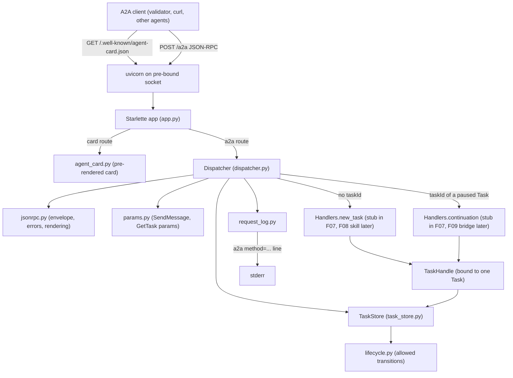
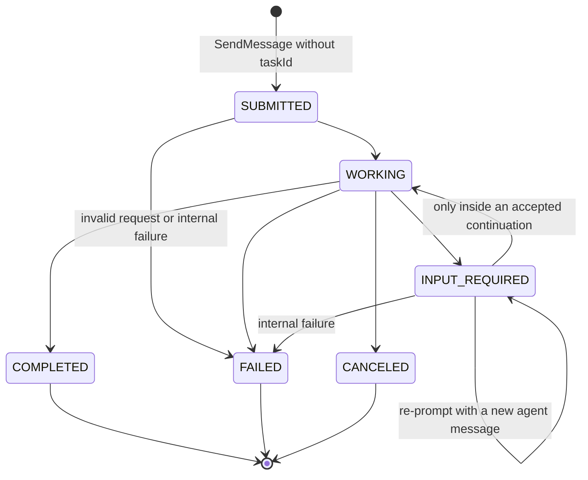
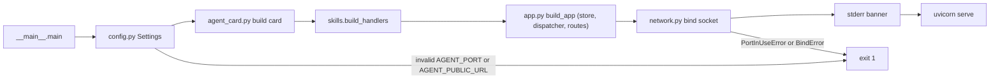

# Technical Specification: A2A Server Foundation

**Complexity:** medium

## 1. Technical Overview

### What

F07 bootstraps the `agente/` Python project and delivers the agent process's outward-facing half: an A2A v1.0 server using the JSON-RPC 2.0 binding over HTTP. The process listens on `127.0.0.1:7300` (overridable through `AGENT_HOST` / `AGENT_PORT`). It serves the Agent Card at `GET /.well-known/agent-card.json` and the JSON-RPC endpoint at `POST /a2a`, with the methods `SendMessage` and `GetTask`. It owns the A2A Task model (`task-`, `ctx-`, `msg-`, `art-` identifiers with 12 hex digits each, plus status, history and artifacts), the Task state machine with terminal-state immutability, and an in-memory Task store keyed by Task id. It writes one stderr line per A2A request.

The server is a small hand-rolled JSON-RPC dispatcher on Starlette and uvicorn, not the official `a2a-sdk` (Section 3.1 explains why). F07 contains no booking logic. A new-Task request (no `taskId`) goes to a **new-Task handler** extension point, which F08 fills with the `reservar-sala` skill. A continuation request (`taskId` of a paused Task) goes to a **continuation handler** extension point, which F09 fills with the bridge. Until those features land, two documented stub handlers fail the Task with fixed messages.

F07 does not depend on F01 at runtime. The agent never imports `servidor_mcp`. The two processes only share a virtualenv and the conventions F01 established (layout, pins, logging style, startup and exit-code behavior).

### Why

- F08 and F09 need the same Task store, the same state machine and the same routing. If each built them, the terminal-state rule, the "continuation only while paused" rule and the private paused-state rule would end up split between two features. Building them once behind explicit seams avoids that.
- The validator and the evaluator compare A2A bodies literally: enum spellings, the `result.task` wrapper, `supportedInterfaces[]`, key shapes from `exemplos/wire/07`–`10`. They send no `A2A-Version` header. A dispatcher this project controls can reproduce those shapes exactly, and it can treat the missing header as `1.0`. The SDK reads a missing header as `0.3` (Section 3.1).
- The bridge (F09) needs guarantees that only the Task store can give atomically. A continuation is accepted only while the Task is paused and no other handler runs on it. A private per-Task record is never serialized and is discarded when the Task ends. `INPUT_REQUIRED → WORKING` can only happen inside an accepted continuation. F07 makes these guarantees structural, so F09 does not have to re-implement them.

### Scope

**Included (PRD F07 Capabilities, Experience and Error Handling — full scope, no Core/Full split):**
- `agente/` project: `pyproject.toml` with every direct dependency pinned with `==`. Src-layout package `agente`. Entry points `python -m agente` and console script `agente`. A `dev` extra for tests.
- Runtime configuration from the environment: `AGENT_HOST`, `AGENT_PORT`, `AGENT_PUBLIC_URL`.
- An Agent Card built from `AGENT_PUBLIC_URL`, identical in shape and key order to `exemplos/wire/07-a2a-agent-card.json`.
- A JSON-RPC 2.0 envelope parser and error model: `-32700`, `-32600`, `-32601`, `-32602`, `-32603`, plus the A2A errors `-32001`, `-32004`, `-32005`, `-32009` carrying `google.rpc.ErrorInfo` data.
- Validation of the `SendMessage` and `GetTask` params, and parsing of the incoming message.
- The A2A data model (Task, TaskStatus, Message, Part, Artifact) and its wire serialization in the exact key order of `exemplos/wire/08`–`10`.
- The Task state machine, the in-memory Task store, Task handles bound to one Task, continuation claims and the private per-Task attachment.
- Extension points: the request context, the new-Task and continuation handler protocols, a registration hook, and the stub handlers.
- A method dispatcher that routes requests, contains failures and processes `SendMessage` synchronously.
- The stderr request log `a2a method=<method> id=<id> task=<taskId or -> state=<resulting state or ->`.
- Startup: a pre-bound listening socket, port-in-use detection, a stderr banner and exit codes, mirroring F01.

**Output contracts (PRD F07 Provides):**

| PRD Provides item | Exposed as | Module | Consumers |
|---|---|---|---|
| Task store and lifecycle operations: create Task (`id`, `contextId`), transition state with a status message, append a message to history, attach an artifact, read a Task by id | `TaskStore` (the dispatcher creates and reads Tasks) and `TaskHandle` (handed to handlers, bound to one Task): `transition(state, text=None)`, `append_message(text)`, `add_artifact(name, text)`, `snapshot()`, `state()` | `task_store.py` | F08, F09 |
| Incoming A2A request context: parsed message (`messageId`, `role`, text parts, optional `taskId`) and the raw HTTP `traceparent` header value, routed to new-Task handling when `taskId` is absent and to continuation handling when present | `RequestContext` and `IncomingMessage`; the `Handlers.new_task` / `Handlers.continuation` seams; the registration hook `skills.build_handlers(settings)` | `handlers.py`, `skills/__init__.py`, `dispatcher.py` | F08, F09 |
| (Added by F07 for F09, Section 3.3 A18/A23) A private per-Task attachment that is never serialized, logged or returned and is dropped on terminal transition. Continuations are rejected with `-32004` while a handler runs on the Task | `TaskHandle.set_attachment` / `get_attachment` / `clear_attachment`; dispatcher claim check | `task_store.py`, `dispatcher.py` | F09 |

**Input contracts (PRD F07 Consumes):** none. F07 depends on no other feature. Its only inputs are A2A HTTP requests and environment variables. It reads nothing from `dados/` and never calls the MCP server (F06 does).

**Excluded / deferred to other features:**
- Parsing the `reservar sala=...` request, the MCP calls, the `reserva` artifact content and the confirmation and error texts (F06, F08).
- Parsing `escolha=<valor>`, the paused record's content, the MCP retry and the `alternativas:` line (F09). F07 only provides the attachment slot, the claim and the routing.
- Validating the W3C `traceparent` format and deriving the trace-id (F06). F07 hands over the raw header value.
- The `MCP_URL` setting (F06 extends `Settings`).
- The delivery README and install commands (F10). F07 records the install requirement F10 must document (Section 3.3, A6).

### Requirements (from PRD Capabilities and Experience)

| ID | Requirement | PRD source |
|---|---|---|
| R1 | Python ≥ 3.10 project under `agente/`. Direct dependencies pinned with `==` in `agente/pyproject.toml`. Installed with `pip` in a `venv` | Capabilities 1 |
| R2 | Port `7300` (env `AGENT_PORT`), bind host `127.0.0.1` (env `AGENT_HOST`) | Capabilities 1 |
| R3 | `GET /.well-known/agent-card.json` → HTTP 200 with the v1.0 card of `exemplos/wire/07`. `supportedInterfaces[0].url` is `<AGENT_PUBLIC_URL>/a2a`. `AGENT_PUBLIC_URL` defaults to `http://localhost:7300`. No `securitySchemes`, no v0.x fields | Capabilities 2, Experience 1 |
| R4 | `POST /a2a` JSON-RPC 2.0 with `SendMessage` and `GetTask`. Other method → `-32601`. Invalid JSON → `-32700`. Invalid request object → `-32600`. Missing `params.message` / `params.id` → `-32602` | Capabilities 3 |
| R5 | Task shape: `id` `task-<12 hex>`, `contextId` `ctx-<12 hex>` (always new for a new Task), `status {state, message}`, `history` in order, `artifacts`. Agent messages use `ROLE_AGENT`, `msg-<12 hex>`, and carry `taskId` and `contextId` | Capabilities 4 |
| R6 | `SendMessage` and `GetTask` results use `{"result": {"task": {...}}}` | Capabilities 5 |
| R7 | State machine `SUBMITTED → WORKING → {COMPLETED, FAILED, CANCELED, INPUT_REQUIRED}`. `INPUT_REQUIRED → WORKING` only through a valid continuation. Terminal states never change | Capabilities 6 |
| R8 | `SendMessage` returns only after the Task is terminal or `INPUT_REQUIRED`. `GetTask` reflects the current state at any time | Capabilities 7, Experience 3 |
| R9 | In-memory Task store keyed by Task id. Tasks do not survive a restart | Capabilities 8 |
| R10 | One stderr line per A2A request: `a2a method=<method> id=<id> task=<taskId or -> state=<resulting state or ->` | Capabilities 9 |
| R11 | Error handling per PRD: terminal `SendMessage` → `-32004` `Task <id> esta em estado terminal: <state>`, Task untouched. Unknown id → `-32001`. Unexpected exception → Task `FAILED` with `Falha interna do agente`, and the response still returns the Task | Error Handling |

**Request flow:** client `POST /a2a` → the Starlette endpoint reads the body and the `A2A-Version` and `traceparent` headers → dispatcher: envelope (`-32700` / `-32600`) → version header (`-32009`) → method lookup (`-32601`) → params (`-32602` / `-32005`) → Task lookup and routing (`-32001` / `-32004`) → handler → settle check → JSON body (HTTP 200) → one stderr log line.

**Startup flow:** load configuration → build the Agent Card → build the handlers through the registration hook → build the Task store and the app → bind the socket → print the stderr banner → serve until SIGINT/SIGTERM (handlers' `aclose` runs on shutdown).

## 2. Architecture Impact

### Affected components

| Path | Role |
|---|---|
| `agente/pyproject.toml` | Project manifest, pinned dependencies, entry points, pytest configuration |
| `agente/src/agente/__init__.py` | Package marker and version |
| `agente/src/agente/__main__.py` | Process entry point and startup sequence |
| `agente/src/agente/config.py` | Environment configuration |
| `agente/src/agente/mensagens.py` | Exact user-facing strings (errors, stub messages, banner) |
| `agente/src/agente/ids.py` | Identifier generation (`task-`, `ctx-`, `msg-`, `art-`) |
| `agente/src/agente/protocol.py` | A2A v1.0 value types, enums and wire serialization |
| `agente/src/agente/lifecycle.py` | Task state machine (allowed transitions, terminal states) |
| `agente/src/agente/task_store.py` | In-memory Task store, Task handles, claims, private attachments |
| `agente/src/agente/jsonrpc.py` | JSON-RPC 2.0 envelope, error model, response rendering |
| `agente/src/agente/params.py` | `SendMessage` / `GetTask` params validation and message parsing |
| `agente/src/agente/handlers.py` | Request context, handler protocols, `Handlers` bundle, stub handlers |
| `agente/src/agente/skills/__init__.py` | Registration hook where F08/F09 plug in their handlers |
| `agente/src/agente/dispatcher.py` | Method table, routing, synchronous processing, failure containment |
| `agente/src/agente/agent_card.py` | Agent Card construction and pre-rendering |
| `agente/src/agente/request_log.py` | stderr request log formatting and writing |
| `agente/src/agente/app.py` | Starlette application assembly (card route, A2A route, lifespan) |
| `agente/src/agente/network.py` | Listening socket creation and port-in-use detection |
| `agente/tests/**` | Unit and integration tests (Section 7) |
| `.gitignore` (repo root) | Ensure `*.egg-info/` and `.pytest_cache/` are ignored (added by F01; idempotent) |
| `agente/.gitkeep` | Removed (folder no longer empty) |

### Request path



### Task state machine



### Startup path



## 3. Technical Decisions

| Decision | Chosen Approach | Alternative Considered | Trade-off |
|---|---|---|---|
| A2A server stack | Hand-rolled JSON-RPC 2.0 dispatcher on Starlette (Section 3.1) | Official `a2a-sdk` 1.2.1 (`DefaultRequestHandler`, `AgentExecutor`, `InMemoryTaskStore`, `create_jsonrpc_routes`) | The project owns the protocol model, the envelope handling and the store, written against the spec and `exemplos/wire/`. In exchange: exact wire shapes, `-32004` with PRD messages, a header-less `1.0` dialect, F09's claim and private-slot guarantees, and two runtime dependencies instead of a protobuf/Google API stack |
| HTTP framework | Starlette `1.7.0` (constructor-based `routes` and `lifespan`) served by uvicorn `0.54.0` | Pure ASGI callable; FastAPI | Starlette is already pulled into the shared venv by `mcp` 2.3.0, and its `TestClient` matches F01's test style. FastAPI adds pydantic/OpenAPI weight with no benefit for two routes |
| Extension points | Two async handler protocols (`new_task`, `continuation`) bundled in `Handlers`, built by `skills.build_handlers(settings)`; each handler receives a `RequestContext` and a `TaskHandle` bound to one Task | Subclassing a base agent class; an event bus | Two seams, no inheritance. Handlers cannot touch other Tasks, so per-Task isolation is structural (F09 "never swap state") |
| Concurrency control | One `threading.Lock` around all store operations (no lock is held across an `await`), plus a per-Task **claim** held by the dispatcher while a handler runs | `asyncio.Lock` per Task held across the handler | A second continuation on a busy Task is rejected at once with `-32004` instead of queuing behind the in-flight retry (F09 Error Handling). `GetTask` never blocks |
| Paused state privacy | Store-owned private attachment map, separate from the Task record, never read by the serializer or the logger, and dropped automatically on terminal transition | F09 keeps its own dict keyed by Task id | F07 guarantees "never serialized" and "deleted at terminal state" atomically with the transition. The slot is typed `object`, so F07 never knows its content |
| Wire serialization | Explicit ordered builders per type (`to_wire`), plus one renderer (compact separators, `ensure_ascii=False`, UTF-8) | `dataclasses.asdict`; pydantic models | Key order exactly as `exemplos/wire/08`–`10` (`messageId, role, parts, taskId, contextId`; `id, contextId, status, history, artifacts`), `artifacts: []` always present, optional keys omitted rather than `null` |
| `A2A-Version` header | Absent → served as `1.0`; present with major.minor `1.0` → served; anything else → `VersionNotSupportedError` `-32009` | Spec default (absent means `0.3`); ignoring the header | The validator and the wire examples send no header and expect `1.0` semantics. The only advertised interface is `1.0`. Explicit other versions are still refused per spec |
| Request log timing | Written once per `POST /a2a`, **after** processing (it carries the resulting state), before the response is returned | Log before processing (F01 style) | A line is lost if the process dies mid-request. Accepted because the PRD's line includes the resulting state |
| Listening socket | Pre-bound socket handed to uvicorn (`sockets=[sock]`), own copy of F01's `network.py` design | Let uvicorn bind | Exact `Porta <port> em uso...` message and exit code `1`. The code is duplicated rather than imported because the agent must not depend on `servidor_mcp` |

### 3.1 Official `a2a-sdk` vs hand-rolled dispatcher

Each criterion was evaluated against the official SDK (latest `a2a-sdk` 1.2.1 on PyPI, `requires-python >=3.10`) and a hand-rolled Starlette dispatcher.

| # | Criterion | `a2a-sdk` 1.2.1 | Hand-rolled (chosen) |
|---|---|---|---|
| 1 | Byte-level fidelity to `exemplos/wire/07`–`10` and to what `validar.py` reads | **Blocking risk:** the SDK's `validate_version` treats a missing `A2A-Version` header as `0.3` and raises `VersionNotSupportedError` on mismatch (confirmed, SDK API docs). The validator's `a2a()` sends only `Content-Type` and optionally `traceparent`. Making the SDK accept these requests means injecting a fake header through middleware or a context builder, which rewrites protocol semantics. Unconfirmed: whether the SDK's ProtoJSON output keeps the wire key order and emits `artifacts: []` (U2, U3) | Full control: ordered builders reproduce wire 08–10 exactly (asserted by `test_wire_fidelity.py`). The card is built field by field from wire 07 |
| 2 | Error semantics (`-32004` terminal with PRD message, `-32001`, `-32601`/`-32700`/`-32600`/`-32602`) | Error codes are mapped by the SDK. Messages are fixed SDK English texts. Unconfirmed which error the SDK's handler raises for a message to a terminal Task (U1) | Exact codes and Portuguese messages from `mensagens.py`. A2A errors carry `google.rpc.ErrorInfo` data as the spec's JSON-RPC section recommends |
| 3 | Synchronous `SendMessage` until terminal or `INPUT_REQUIRED`; in-memory store keyed by id | Supported (blocking is the spec default; `InMemoryTaskStore`), but through an event queue and active-task consumers running in the background | Direct: the dispatcher awaits the handler and then checks the settled state. The store is a dict under one lock |
| 4 | F09 control: private paused record never serialized; `INPUT_REQUIRED → WORKING` only through a valid continuation; continuation while `WORKING` → `-32004` | No equivalent concept. A message to a busy Task would be routed to the running executor or queued (unconfirmed, U4) | Claims plus private attachment slot plus a transition guard in the store (Section 6) |
| 5 | Access to the incoming `traceparent` header per request | Possible through a custom `ServerCallContextBuilder` (unconfirmed default contents, U5) | `request.headers` → `RequestContext.traceparent` |
| 6 | Dependency surface | Core deps: `protobuf`, `google-api-core`, `googleapis-common-protos`, `pydantic`, `httpx`, `json-rpc`, `packaging`, `culsans` (Python < 3.13), plus the `http-server` extra (`starlette`, `sse-starlette`) (confirmed, PyPI metadata) | `starlette`, `uvicorn` (both already in the venv through `mcp`) |

**Decision:** hand-rolled. Criterion 1 alone is decisive: an SDK server must be forced to treat header-less requests as `1.0` before any validator check from 24 onward can pass. Criteria 2 and 4 then require wrapping or bypassing the SDK's request handler anyway. The A2A SDK is not mandated by the assignment, which only mandates "A2A v1.0. Binding JSON-RPC 2.0 sobre HTTP" and the official **MCP** SDK.

**SDK facts not confirmed (recorded only to justify the choice; nothing in F07 depends on them):**

| # | Unconfirmed SDK fact |
|---|---|
| U1 | Which JSON-RPC error `DefaultRequestHandler` returns for `SendMessage` to a terminal Task (`-32004` per spec, or `-32602` as in earlier SDK lines) |
| U2 | Whether the SDK's JSON serialization emits empty repeated fields (`"artifacts": []`) |
| U3 | Whether the SDK serializes keys in proto field-number order (`messageId, contextId, taskId, role, parts`) or another order |
| U4 | How the SDK handles a second message for a Task whose executor is still running |
| U5 | Whether `ServerCallContext` exposes HTTP headers by default or only through a custom context builder; whether an id-generator hook exists for `task-<12 hex>` ids |
| U6 | Whether `create_jsonrpc_routes(..., enable_v0_3_compat=True)` routes a header-less `SendMessage` to the `1.0` handler or to the `0.3` adapter |

### 3.2 Dependency facts relied upon

| Fact | Evidence |
|---|---|
| `starlette` latest is `1.7.0`, `requires-python >=3.10`, depends on `anyio>=4,<5` | PyPI metadata |
| Starlette 1.0 removed `on_startup`/`on_shutdown`, `@app.route()`, `@app.exception_handler()` and `@app.middleware()`; routes, lifespan, exception handlers and middleware are passed to the `Starlette(...)` constructor | Starlette 1.0.0 release notes |
| `mcp==2.3.0` requires `starlette>=0.48.0` on Python ≥ 3.14 (`>=0.27` below), `sse-starlette>=3.0.0` and `uvicorn>=0.31.1`; `sse-starlette` 3.5.0 requires `starlette>=0.49.1`. So `starlette==1.7.0` and `uvicorn==0.54.0` co-install with F01's pins in one venv | PyPI metadata |
| `uvicorn` `0.54.0` serves pre-bound sockets through `Server.serve(sockets=[...])` | F01 spec Section 3.1 |
| A2A v1.0 JSON-RPC codes: `TaskNotFoundError -32001`, `UnsupportedOperationError -32004`, `ContentTypeNotSupportedError -32005`, `VersionNotSupportedError -32009`. SendMessage to a terminal Task → `UnsupportedOperationError`. Method names are PascalCase. `result` holds `task` or `message`. Each `error.data` entry must carry `@type`, and `google.rpc.ErrorInfo` (domain `a2a-protocol.org`, reason in UPPER_SNAKE_CASE without the `Error` suffix) is recommended | A2A specification (Sections 3.1.1, 5.4, 9.1, 9.4.1, 9.5, 11.6) |
| Blocking `SendMessage` (the default) must wait until a terminal or interrupted state (`INPUT_REQUIRED`) | A2A specification Section 3.2.2 |

**Verify at implementation** (plan step 2). Each item names the component that changes if the fact differs:

| # | Item to verify | Component affected | Fallback if it differs |
|---|---|---|---|
| V1 | Starlette `1.7.0`: `Route(path, endpoint, methods=["GET"])` also answers `HEAD` and returns 405 for other verbs; `Starlette(routes=..., lifespan=...)` signature | `app.py`, tests | Adjust the route declaration; the asserted behavior stays the same |
| V2 | The editable install of the src-layout project (`pip install -e ./agente`) puts `agente/src` on `sys.path` through a static `.pth` entry. If so, `python -m agente` run from the repository root imports the regular package `agente/src/agente`, not the `__init__`-less repo folder `./agente/`: under PEP 420 a regular package found later on `sys.path` beats an earlier namespace portion | Install instructions (F10) | Document `pip install -e ./agente --config-settings editable_mode=compat`, which forces the `.pth` path strategy |
| V3 | `httpx==0.28.1` `ASGITransport` drives the app in-process for concurrent async requests, without lifespan | tests only | Use a real uvicorn instance on a free port for the concurrency tests |
| V4 | The shared venv resolves `mcp==2.3.0`, `starlette==1.7.0`, `uvicorn==0.54.0` without conflict | `pyproject.toml` pin | Move `starlette` to the newest version accepted by `mcp`'s and `sse-starlette`'s ranges |

### 3.3 Assumptions and Auto-Accept Decisions

Every row below is a decision the PRD did not answer. Each names the Auto-Accept Policy row that produced it, so the user can review and override it later.

| # | Decision | Choice | Auto-Accept policy row |
|---|---|---|---|
| A1 | Package layout and names | Src layout, F01's scheme (folder name = distribution, underscores for the import package): distribution `agente`, import package `agente`. The repo folder `./agente/` has no `__init__.py`, so it can only be a namespace portion and never shadows the installed regular package (V2) | Empty codebase bootstrap (follows F01 A1) |
| A2 | Build backend | `setuptools==84.0.0`, same as F01 A2 | Empty codebase bootstrap (follows F01) |
| A3 | Runtime dependency pins | `starlette==1.7.0`, `uvicorn==0.54.0` (same uvicorn pin as F01). No A2A SDK, no HTTP client (F06 picks its own) | New technology not in the codebase |
| A4 | Transitive dependencies | Only direct dependencies pinned (F01 A4). Pins shared with `servidor-mcp` (`uvicorn`, `pytest`, `httpx`, `setuptools`) must stay identical in both manifests because they install into one venv | Partial PRD specification |
| A5 | Entry points | `python -m agente` (the documented command) plus console script `agente`. Nothing written to stdout | Partial PRD specification (follows F01 A5) |
| A6 | Install mode for F10 | Editable install into the repo-root venv: `pip install -e ./agente` (dev: `-e "./agente[dev]"`) | Partial PRD specification (follows F01 A6) |
| A7 | A2A stack | Hand-rolled dispatcher, not `a2a-sdk` (Section 3.1) | Technical decision with a clear recommendation |
| A8 | `AGENT_PUBLIC_URL` | Default `http://localhost:<AGENT_PORT>` (so `http://localhost:7300` by default, as the PRD states). An override must be an absolute `http`/`https` URL with a host, or startup fails with `AGENT_PUBLIC_URL invalida: <valor>` and exit `1`. One trailing `/` is stripped. The card URL is `<public_url>/a2a` | Partial PRD specification |
| A9 | HTTP status of JSON-RPC responses | Always `200` with `Content-Type: application/json`, errors included (JSON-RPC over HTTP convention; the A2A HTTP status table applies to the HTTP+JSON binding). The validator reads the body regardless of status | Partial PRD specification |
| A10 | `A2A-Version` header | Absent or empty → `1.0`. A value whose major.minor is `1.0` (`1.0`, `1.0.3`) → served. Any other value → `-32009` `Versao do protocolo A2A nao suportada: <valor>`. The query-parameter form of the version is not read | Technical decision with a clear recommendation |
| A11 | JSON-RPC envelope strictness | Body must be one JSON object. Arrays (batches, including empty) → `-32600`. `jsonrpc` must be `"2.0"`. `method` must be a string. `id` must be a string or a non-boolean integer. A missing `id` (notification), `null`, a float, a boolean or a structured value → `-32600` with `id: null` (A2A defines no notifications). Request bodies are parsed regardless of `Content-Type` | Partial PRD specification |
| A12 | Incoming message rules | `messageId` is a non-empty string. `role` must be `ROLE_USER`. `parts` is a non-empty array of objects. A part with a string `text` is a text part. A part carrying `raw`, `url` or `data` and no `text` → `ContentTypeNotSupportedError` `-32005`. Other malformed parts → `-32602`. `taskId` and `contextId`, when present, are non-empty strings. History stores the user message as received, normalized to `messageId, role, parts[{text}], taskId?, contextId?`; other fields (`metadata`, `extensions`, part `mediaType`) are dropped | Partial PRD specification |
| A13 | Fields with no effect | `params.configuration` (including `returnImmediately`, `historyLength`, `acceptedOutputModes`), `params.metadata`, `params.tenant`, and `GetTask`'s `historyLength`/`tenant` are accepted and ignored: processing is always blocking and `GetTask` always returns the full history. A client `contextId` never selects a context: a new Task always gets a new `ctx-`, and a continuation uses the Task's own | Partial PRD specification |
| A14 | Message text for handlers | `IncomingMessage.text_parts` keeps each part's text in order. `IncomingMessage.text` joins them with one space (the validator's own `" ".join` convention). F08/F09 parse `text` | Partial PRD specification |
| A15 | Error messages and data | Portuguese messages without accents, centralized in `mensagens.py` (Section 5.5). Standard JSON-RPC errors carry no `data`. A2A errors carry `data: [ErrorInfo]` with `reason` `TASK_NOT_FOUND`, `UNSUPPORTED_OPERATION`, `CONTENT_TYPE_NOT_SUPPORTED` or `VERSION_NOT_SUPPORTED`, domain `a2a-protocol.org`, and string `metadata` (`taskId`, `state`, `version`). No timestamp, which keeps errors deterministic. Messages never contain attachment content | Partial PRD specification |
| A16 | Status message semantics | `transition(state, text)` creates one agent message, sets it as `status.message` and appends that same message (same `messageId`) to `history`. `transition(state)` without text sets `status` to `{state}` only, clearing the previous message. `TaskStatus.timestamp` is never emitted (determinism; absent from wire examples) | Partial PRD specification |
| A17 | Allowed transitions | `SUBMITTED → {WORKING, FAILED}`; `WORKING → {COMPLETED, FAILED, CANCELED, INPUT_REQUIRED}`; `INPUT_REQUIRED → {WORKING, INPUT_REQUIRED, FAILED}`, where `→ WORKING` is permitted only while a continuation claim is held. Terminal states have no outgoing transition. `SUBMITTED → FAILED` covers F08's malformed request. `INPUT_REQUIRED → INPUT_REQUIRED` covers F09's re-prompt. `INPUT_REQUIRED → FAILED` covers internal failures. `REJECTED`, `AUTH_REQUIRED` and `UNSPECIFIED` are never produced | Technical decision with a clear recommendation |
| A18 | Busy Tasks | The dispatcher holds a claim on a Task while any handler runs on it (`new` or `continuation`). A continuation to a Task that is claimed, or whose state is `SUBMITTED`/`WORKING`, → `-32004` `Task <id> nao aguarda entrada`, and the Task is untouched (implements F09's Error Handling row inside F07's routing) | Technical decision with a clear recommendation |
| A19 | User messages in history | The dispatcher, not the handlers, appends the incoming user message: at creation for a new Task, and atomically with claiming for an accepted continuation, before the handler runs. Rejected requests never modify the Task | Technical decision with a clear recommendation |
| A20 | Handler contract | Handlers are `async` callables `(RequestContext, TaskHandle) -> None` and must leave the Task terminal or `INPUT_REQUIRED`. If the Task is still `SUBMITTED`/`WORKING` after return, it is moved to `FAILED` with `Falha interna do agente`. Any `Exception` raised by a handler has the same effect (unless the Task is already terminal); `asyncio.CancelledError` propagates. The stderr diagnostic prints the exception type and stack frames only, never the exception message or locals, so no attachment content can reach a log | Technical decision with a clear recommendation |
| A21 | Stub handlers (F07 alone) | New-Task stub: `SUBMITTED → FAILED` with `Skill reservar-sala ainda nao implementada`. Continuation stub: `INPUT_REQUIRED → FAILED` with `Continuacao de Task ainda nao implementada` (reachable only from tests, since no F07 Task ever pauses) | Technical decision with a clear recommendation (orchestrator instruction) |
| A22 | Registration hook | `agente/skills/__init__.py` exposes `build_handlers(settings) -> Handlers`, returning the stubs in F07. F08 replaces `new_task`, F09 replaces `continuation`, and either may add an `aclose` coroutine for shared resources (e.g. F06's HTTP client). Same pattern as F01's `primitives` registry | Technical decision with a clear recommendation |
| A23 | Private attachment | One opaque slot per Task (`object`), stored outside the Task record. Read only through that Task's handle. Dropped automatically when the Task becomes terminal. Never passed to the serializer, the logger, `repr` or error messages | Technical decision with a clear recommendation |
| A24 | Identifiers | `<prefix>-` + `secrets.token_hex(6)` (12 lowercase hex). A generated Task id already in the store is regenerated. Generation goes through an injectable `IdFactory` (tests use fixed ids to reproduce the wire examples) | Partial PRD specification |
| A25 | Request log rendering | One line per `POST /a2a`, written and flushed after processing. `method`/`id` come from the envelope (`-` when unreadable). `task` is the Task in the result, or for errors the Task id the request referenced (`params.id` / `message.taskId`), else `-`. `state` is the resulting Task state, `-` for errors. Values that are empty or contain whitespace or control characters are JSON-quoted. Integer and string ids render unquoted (F01 A15 rules). Card `GET` requests are not logged | Partial PRD specification |
| A26 | `traceparent` | Passed to handlers as the raw value of the first `traceparent` HTTP header, or `None`. No validation in F07 (F06 owns parsing and the fallback trace-id) | Technical decision with a clear recommendation |
| A27 | Banner and startup failures | Three stderr lines after the bind: `agente central-de-salas ouvindo em http://<host>:<port>`, `agent card: http://<host>:<port>/.well-known/agent-card.json`, `endpoint A2A anunciado: <public_url>/a2a`. Failures (exit `1`): `AGENT_PORT invalida: <valor>`, `AGENT_PUBLIC_URL invalida: <valor>`, `Porta <port> em uso: defina AGENT_PORT ou encerre o processo anterior`, `Falha ao abrir <host>:<port>: <motivo>`. An unexpected startup exception prints a traceback and exits `1`. SIGINT/SIGTERM → graceful shutdown, exit `0`. uvicorn runs with `log_level="warning"`, `access_log=False`, `lifespan="on"` | Partial PRD specification (mirrors F01 A11–A13) |
| A28 | Socket options | Same as F01 A14: `SO_REUSEADDR` on POSIX, `SO_EXCLUSIVEADDRUSE` on Windows | Technical decision with a clear recommendation |
| A29 | Unprotected surface | No request size limit, no `Content-Type` enforcement, no Host/Origin allowlist, no CORS (localhost-only process; authentication and deployment are out of scope) | Partial PRD specification |
| A30 | Test stack | `pytest==9.1.1` and `httpx==0.28.1` in the `dev` extra (same pins as F01). Starlette `TestClient` for in-process tests. `asyncio.run` with `httpx.ASGITransport` for concurrency tests (no extra plugin dependency). Subprocess tests for process behavior. `addopts = "--import-mode=importlib"`, so test basenames shared with `servidor-mcp/tests` never collide. Each project's suite runs separately (`python -m pytest agente`) | Empty codebase bootstrap (follows F01 A23) |
| A31 | JSON rendering | One renderer for every body: `json.dumps(..., ensure_ascii=False, separators=(",", ":"))` encoded UTF-8. The card is rendered once at startup and served from bytes | Technical decision with a clear recommendation |
| A32 | Store retention | No eviction: Tasks live until the process exits (the validator creates under 20). Unbounded growth over a long uptime is accepted | Partial PRD specification |
| A33 | Naming convention | Infrastructure modules and A2A protocol types in English, matching the A2A spec vocabulary (`Task`, `Message`, `TaskStore`, `dispatcher`). Every user-facing string in Portuguese without accents, in `mensagens.py` | Empty codebase bootstrap (follows F01 A22) |

### 3.4 PRD traceability

| PRD block | Spec destination |
|---|---|
| F07 Provides | Section 1 Output contracts; Section 4 module boundaries; Sections 5.6 and 6 |
| F07 Consumes | Section 1 Input contracts (none) |
| F07 Capabilities | Section 1 Requirements R1–R10; Sections 3, 5 and 6 |
| F07 Experience | Section 1 flows; Sections 5.1–5.4 |
| F07 Error Handling | Section 1 R11; Section 5.5 |
| F09 Error Handling (continuation while `WORKING`) | A18; Section 5.5 |
| Section 9 F07 acceptance criteria | Section 7 acceptance tests and traceability matrix |
| Section 9 Cross-Feature Integration (criteria naming F07) | Section 7 `test_cross_feature_f07.py` |

## 4. Component Overview

**Packaging and configuration:**

| File Path | New/Modified | Purpose | Key Responsibilities |
|---|---|---|---|
| `agente/pyproject.toml` | New | Project manifest | `[build-system]` with `setuptools==84.0.0`. `[project]`: name `agente`, version `1.0.0`, `requires-python >=3.10`, dependencies `starlette==1.7.0`, `uvicorn==0.54.0`. Optional `dev` extra: `pytest==9.1.1`, `httpx==0.28.1`. Console script `agente` → `agente.__main__:main`. Package discovery under `src`. pytest `testpaths = ["tests"]` and `addopts = "--import-mode=importlib"` |
| `.gitignore` | Modified (only if absent) | Ignore generated artifacts | Ensure `*.egg-info/` and `.pytest_cache/` are present (F01 adds them first; idempotent) |
| `agente/.gitkeep` | Removed | Placeholder no longer needed | — |

**Backend:**

| File Path | New/Modified | Purpose | Key Responsibilities |
|---|---|---|---|
| `agente/src/agente/__init__.py` | New | Package marker | Exposes `__version__ = "1.0.0"` |
| `agente/src/agente/__main__.py` | New | Entry point | `main() -> int`: runs the startup sequence (Section 1). Maps `ConfigError`, `PortInUseError`, `BindError` to their `mensagens` text on stderr and exit code `1`. Prints the banner after the socket is bound. Runs uvicorn on the pre-bound socket (A27). Returns `0` on graceful shutdown |
| `agente/src/agente/config.py` | New | Environment configuration | Frozen `Settings` (`host`, `port`, `public_url`). `load_settings(environ)` with defaults `127.0.0.1` / `7300` / `http://localhost:<port>`. Raises `ConfigError` for an invalid `AGENT_PORT` (not an integer in 1–65535) or `AGENT_PUBLIC_URL` (A8). Docstring states that F06 adds `mcp_url` here |
| `agente/src/agente/mensagens.py` | New | Exact strings | Every template in Section 5.5 plus the stub messages (A21), the internal-failure message, the banner lines and the startup errors (A27). F08/F09 add their own constants here |
| `agente/src/agente/ids.py` | New | Identifiers | Prefix constants `task-`, `ctx-`, `msg-`, `art-`. `IdFactory` protocol (`task_id`, `context_id`, `message_id`, `artifact_id`). `RandomIdFactory` using `secrets.token_hex(6)` |
| `agente/src/agente/protocol.py` | New | A2A value types | Enums `TaskState` (wire values `TASK_STATE_SUBMITTED`, `_WORKING`, `_COMPLETED`, `_FAILED`, `_CANCELED`, `_INPUT_REQUIRED`) and `Role` (`ROLE_USER`, `ROLE_AGENT`). Frozen `Part(text)`, `Message(message_id, role, parts, task_id, context_id)`, `Artifact(artifact_id, name, parts)`. `to_wire` builders for message, artifact, status and task in the Section 6 key order |
| `agente/src/agente/lifecycle.py` | New | State machine | `TERMINAL_STATES`, `ALLOWED_TRANSITIONS` (A17), `is_terminal(state)`, `check_transition(current, target, *, continuation_claim) -> None`, which raises `InvalidTransitionError` |
| `agente/src/agente/task_store.py` | New | Task store | `TaskStore(ids)`: lock-protected maps of Task records, claims and private attachments (Section 6). `create_task(user_message) -> task_id` (state `SUBMITTED`, `new` claim held). `begin_continuation(task_id, user_message)` (atomic checks plus history append plus `continuation` claim). `end_claim(task_id)`. `snapshot(task_id) -> dict`. `state_of(task_id)`. `settle(task_id)` (unsettled → `FAILED` internal). `handle(task_id) -> TaskHandle`. Exceptions `TaskNotFoundError`, `TerminalTaskError(task_id, state)`, `NotAwaitingInputError(task_id)`, `InvalidTransitionError`, `TaskImmutableError`. `TaskHandle` methods listed in Section 5.6 |
| `agente/src/agente/jsonrpc.py` | New | JSON-RPC 2.0 | Code constants (`PARSE_ERROR -32700`, `INVALID_REQUEST -32600`, `METHOD_NOT_FOUND -32601`, `INVALID_PARAMS -32602`, `INTERNAL_ERROR -32603`, `TASK_NOT_FOUND -32001`, `UNSUPPORTED_OPERATION -32004`, `CONTENT_TYPE_NOT_SUPPORTED -32005`, `VERSION_NOT_SUPPORTED -32009`). `JsonRpcError(code, message, data=None)` exception. `parse_envelope(body: bytes) -> Envelope(id, method, params)`, which raises `JsonRpcError` (A11). `success(id, result)`. `failure(id, error)`. Builders for the A2A errors with `ErrorInfo` data (A15). `render(obj) -> bytes` (A31) |
| `agente/src/agente/params.py` | New | Params validation | `parse_send_message(params) -> IncomingMessage` and `parse_get_task(params) -> str` (task id). Each raises `JsonRpcError` `-32602` or `-32005` with the exact detail strings of Section 5.5 |
| `agente/src/agente/handlers.py` | New | Extension points | Frozen `IncomingMessage(message_id, text_parts, task_id, context_id)` with `text` (A14) and `to_message()`. Frozen `RequestContext` (Section 5.6). `NewTaskHandler` and `ContinuationHandler` protocols. Frozen `Handlers(new_task, continuation, aclose=None)`. `stub_new_task_handler`, `stub_continuation_handler` (A21) |
| `agente/src/agente/skills/__init__.py` | New | Registration hook | `build_handlers(settings) -> Handlers` returns the stubs in F07. The module docstring states the contract for F08 (replace `new_task`), F09 (replace `continuation`) and shared-resource cleanup through `aclose` (A22) |
| `agente/src/agente/dispatcher.py` | New | Method dispatch | `Dispatcher(store, handlers)`. `async dispatch(body, *, a2a_version, traceparent) -> DispatchOutcome(body_bytes, log_fields)`. Applies the order of Section 1 (envelope → version → method → params → routing). `SendMessage`: new-Task path or continuation path, then awaits the handler inside `try/finally` (claim release), then `settle`. `GetTask`: snapshot. Converts store exceptions to A2A errors. An unexpected exception outside a Task → `-32603` |
| `agente/src/agente/agent_card.py` | New | Agent Card | Constants for name, description, provider, version, skill (exact wire 07 texts). `AGENT_CARD_PATH = "/.well-known/agent-card.json"`. `build_agent_card(public_url) -> dict` in wire 07 key order. `render_agent_card(public_url) -> bytes` |
| `agente/src/agente/request_log.py` | New | Request log | `format_log_line(method, rpc_id, task_id, state) -> str` (A25 rendering). `RequestLogger(stream=sys.stderr)` writes and flushes one line; a formatting failure falls back to `a2a method=- id=- task=- state=-` and never breaks the request |
| `agente/src/agente/app.py` | New | ASGI assembly | `A2A_PATH = "/a2a"`. `build_app(settings, *, handlers, store=None, ids=None, log_stream=sys.stderr) -> Starlette` with routes `GET AGENT_CARD_PATH` (pre-rendered bytes, `application/json`) and `POST A2A_PATH` (read body, `A2A-Version` and the first `traceparent` header → dispatcher → logger → `Response(body, 200, application/json)`), plus a lifespan that awaits `handlers.aclose` on shutdown when present |
| `agente/src/agente/network.py` | New | Socket binding | `bind_listening_socket(host, port) -> socket` with the A28 options. Raises `PortInUseError(port)` on `EADDRINUSE` / `WSAEADDRINUSE` and `BindError(host, port, motivo)` on any other `OSError` (same contract as F01's `network.py`, independent copy) |

**Module boundaries for consumers (F08, F09):**

| Consumer need | Import from | Rule |
|---|---|---|
| Plug in the skill or the bridge | `agente.skills.build_handlers` | Return a `Handlers` with your callable. Construct shared resources (F06 client) here, never at import time |
| Read the request | `RequestContext` argument | Read-only. `ctx.message.text` is the parse input. `ctx.traceparent` is the raw header |
| Change the Task | `TaskHandle` argument | The only write path. It is bound to `ctx.task_id` and cannot reach other Tasks |
| Keep paused state (F09) | `TaskHandle.set_attachment` / `get_attachment` / `clear_attachment` | Opaque to F07. Never put it in a message, artifact or exception message |
| Agent-side message ids or artifact ids | Produced by `TaskHandle.transition` / `append_message` / `add_artifact` | Never build `msg-`/`art-` ids by hand |
| Exact strings | `agente.mensagens` | Add constants; never inline user-facing strings |
| Domain rules | — | Forbidden in `agente/` (README restriction; F08 acceptance) |

**Database:** none. No migration. Tasks live in process memory only (R9).

## 5. API Contracts

The agent exposes two HTTP routes. Every JSON-RPC response, success or error, is HTTP `200` with `Content-Type: application/json` (A9). Authentication: none (out of scope).

### 5.1 `GET /.well-known/agent-card.json`

- **Method:** GET (HEAD also answered)
- **Path:** `/.well-known/agent-card.json`
- **Authentication:** none

**Response (Success - 200, `application/json`):**

| Field | Type | Description |
|---|---|---|
| `name` | `string` | `Central de Salas` |
| `description` | `string` | `Reserva salas de reuniao da Hill Valley Tech.` |
| `provider.organization`, `provider.url` | `string` | `Hill Valley Tech`, `https://hillvalley.example` |
| `version` | `string` | `1.0.0` |
| `supportedInterfaces[0].url` | `string` | `<AGENT_PUBLIC_URL>/a2a` |
| `supportedInterfaces[0].protocolBinding` | `string` | `JSONRPC` |
| `supportedInterfaces[0].protocolVersion` | `string` | `1.0` |
| `capabilities` | `object` | `streaming`, `pushNotifications`, `extendedAgentCard` all `false` |
| `defaultInputModes`, `defaultOutputModes` | `string[]` | `["text/plain"]` |
| `skills[0]` | `AgentSkill` | `id` `reservar-sala`, `name`, `description`, `tags`, `inputModes`, `outputModes`, `examples` (wire 07 texts) |

Never present: `securitySchemes`, `security`, `preferredTransport`, `additionalInterfaces`, `url`, `protocolVersion` at card level, `signatures`.

**Response Example (defaults, `AGENT_PUBLIC_URL` unset):**
```json
{
  "name": "Central de Salas",
  "description": "Reserva salas de reuniao da Hill Valley Tech.",
  "provider": {"organization": "Hill Valley Tech", "url": "https://hillvalley.example"},
  "version": "1.0.0",
  "supportedInterfaces": [
    {"url": "http://localhost:7300/a2a", "protocolBinding": "JSONRPC", "protocolVersion": "1.0"}
  ],
  "capabilities": {"streaming": false, "pushNotifications": false, "extendedAgentCard": false},
  "defaultInputModes": ["text/plain"],
  "defaultOutputModes": ["text/plain"],
  "skills": [
    {
      "id": "reservar-sala",
      "name": "Reservar sala",
      "description": "Reserva uma sala em um intervalo. Se houver conflito, pergunta qual alternativa usar.",
      "tags": ["salas", "agenda"],
      "inputModes": ["text/plain"],
      "outputModes": ["text/plain"],
      "examples": [
        "reservar sala=sala-garagem inicio=2026-11-03T14:00:00-03:00 fim=2026-11-03T15:00:00-03:00 responsavel=Marty"
      ]
    }
  ]
}
```
With `AGENT_PUBLIC_URL=http://127.0.0.1:7300` the body is equal, key for key and in order, to `exemplos/wire/07-a2a-agent-card.json` `response.body`.

### 5.2 `POST /a2a` — common envelope

**Headers:**

| Header | Required | Validation | Description |
|---|---|---|---|
| `Content-Type` | No (not enforced, A11) | — | Clients send `application/json` |
| `A2A-Version` | No | absent/empty, or major.minor `1.0` | Other values → `-32009` (A10) |
| `traceparent` | No | none in F07 | Raw value handed to handlers (A26) |

**Body:**

| Field | Type | Required | Validation | Description |
|---|---|---|---|---|
| `jsonrpc` | `string` | Yes | equals `"2.0"` | Else `-32600` |
| `id` | `string \| integer` | Yes | non-boolean integer or string | Else `-32600` with `id: null` |
| `method` | `string` | Yes | `SendMessage` or `GetTask` | Other string → `-32601`; non-string → `-32600` |
| `params` | `object` | Yes for both methods | object | Else `-32602` |

### 5.3 `SendMessage`

**Request params:**

| Field | Type | Required | Validation | Description |
|---|---|---|---|---|
| `message` | `object` | Yes | object | The user message |
| `message.messageId` | `string` | Yes | non-empty | Client id, echoed in history |
| `message.role` | `string` | Yes | `ROLE_USER` | Client messages only |
| `message.parts` | `Part[]` | Yes | non-empty array of objects | Each `{"text": "<string>"}`; non-text content → `-32005` |
| `message.taskId` | `string` | No | non-empty when present | Present → continuation of that Task; absent → new Task |
| `message.contextId` | `string` | No | non-empty when present | Stored in history as received; never selects a context (A13) |
| `configuration`, `metadata`, `tenant` | any | No | — | Ignored (A13) |

**New Task — Request Example** (shape of the validator's `enviar()` and of `exemplos/wire/08`):
```json
{
  "jsonrpc": "2.0",
  "id": "9c1e04aa77b2",
  "method": "SendMessage",
  "params": {
    "message": {
      "messageId": "msg-6ae2ad6802e5",
      "role": "ROLE_USER",
      "parts": [
        {"text": "reservar sala=sala-porao inicio=2026-11-03T09:00:00-03:00 fim=2026-11-03T10:00:00-03:00 responsavel=Doc"}
      ]
    }
  }
}
```

**Response (Success - 200):**

| Field | Type | Description |
|---|---|---|
| `result.task.id` | `string` | `task-<12 hex>`, new |
| `result.task.contextId` | `string` | `ctx-<12 hex>`, new |
| `result.task.status.state` | `string` | Terminal state or `TASK_STATE_INPUT_REQUIRED` (R8) |
| `result.task.status.message` | `Message` | Present when the last transition carried text; agent message with `taskId` and `contextId` |
| `result.task.history` | `Message[]` | User and agent messages in order |
| `result.task.artifacts` | `Artifact[]` | Always present, possibly `[]` |

**Response Example (F07 alone, stub new-Task handler):**
```json
{
  "jsonrpc": "2.0",
  "id": "9c1e04aa77b2",
  "result": {
    "task": {
      "id": "task-1a2b3c4d5e6f",
      "contextId": "ctx-0f9e8d7c6b5a",
      "status": {
        "state": "TASK_STATE_FAILED",
        "message": {
          "messageId": "msg-a1b2c3d4e5f6",
          "role": "ROLE_AGENT",
          "parts": [{"text": "Skill reservar-sala ainda nao implementada"}],
          "taskId": "task-1a2b3c4d5e6f",
          "contextId": "ctx-0f9e8d7c6b5a"
        }
      },
      "history": [
        {
          "messageId": "msg-6ae2ad6802e5",
          "role": "ROLE_USER",
          "parts": [
            {"text": "reservar sala=sala-porao inicio=2026-11-03T09:00:00-03:00 fim=2026-11-03T10:00:00-03:00 responsavel=Doc"}
          ]
        },
        {
          "messageId": "msg-a1b2c3d4e5f6",
          "role": "ROLE_AGENT",
          "parts": [{"text": "Skill reservar-sala ainda nao implementada"}],
          "taskId": "task-1a2b3c4d5e6f",
          "contextId": "ctx-0f9e8d7c6b5a"
        }
      ],
      "artifacts": []
    }
  }
}
```
With F08/F09 registered, the same envelope carries the shapes of `exemplos/wire/08` (paused) and `10` (completed with an artifact). Section 7's wire-fidelity tests reproduce both byte for byte through scripted handlers.

**Continuation — Request Example** (`exemplos/wire/10` request body): `message.taskId` set, text `escolha=sala-mirante`. Routing (dispatcher, atomically in the store):

| Task state / condition | Outcome |
|---|---|
| Unknown `taskId` | `-32001` |
| `COMPLETED`, `FAILED`, `CANCELED` | `-32004` `Task <id> esta em estado terminal: <state>`; Task untouched |
| `SUBMITTED` or `WORKING`, or claimed by an in-flight handler | `-32004` `Task <id> nao aguarda entrada`; Task untouched; in-flight handler unaffected |
| `INPUT_REQUIRED`, not claimed | User message appended to history, `continuation` claim taken, continuation handler awaited, response `result.task` |

### 5.4 `GetTask`

**Request params:**

| Field | Type | Required | Validation | Description |
|---|---|---|---|---|
| `id` | `string` | Yes | non-empty | Task id |
| `historyLength`, `tenant` | any | No | — | Ignored (A13) |

**Request Example** (`exemplos/wire/09`):
```json
{"jsonrpc": "2.0", "id": 2, "method": "GetTask", "params": {"id": "task-3f658e57d468"}}
```

**Response (Success - 200):** `result.task` with the same fields as 5.3, reflecting the state at the moment of the call. During an in-flight `SendMessage` it shows `TASK_STATE_WORKING`. The body equals `exemplos/wire/09` `response.body` for the Task of wire 08.

**Unknown id — Response Example:**
```json
{
  "jsonrpc": "2.0",
  "id": 7,
  "error": {
    "code": -32001,
    "message": "Task nao encontrada: task-000000000000",
    "data": [
      {
        "@type": "type.googleapis.com/google.rpc.ErrorInfo",
        "reason": "TASK_NOT_FOUND",
        "domain": "a2a-protocol.org",
        "metadata": {"taskId": "task-000000000000"}
      }
    ]
  }
}
```

### 5.5 Error Codes and Messages (PRD F07 Error Handling, A11–A15, A18)

**Terminal Task — Response Example:**
```json
{
  "jsonrpc": "2.0",
  "id": "5d2e9a7c1b30",
  "error": {
    "code": -32004,
    "message": "Task task-3f658e57d468 esta em estado terminal: TASK_STATE_COMPLETED",
    "data": [
      {
        "@type": "type.googleapis.com/google.rpc.ErrorInfo",
        "reason": "UNSUPPORTED_OPERATION",
        "domain": "a2a-protocol.org",
        "metadata": {"taskId": "task-3f658e57d468", "state": "TASK_STATE_COMPLETED"}
      }
    ]
  }
}
```

**Parse error — Response Example:** `{"jsonrpc":"2.0","id":null,"error":{"code":-32700,"message":"Erro de parse: o corpo nao e JSON valido"}}`

| Code | HTTP Status | Message (exact, from `mensagens.py`) | Condition |
|---|---|---|---|
| `-32700` | 200 | `Erro de parse: o corpo nao e JSON valido` | Body is not UTF-8 JSON |
| `-32600` | 200 | `Requisicao invalida: <detalhe>`, detail one of `corpo deve ser um objeto JSON`, `lotes nao sao suportados`, `jsonrpc deve ser "2.0"`, `method ausente ou nao textual`, `id ausente ou com tipo invalido` | A11 |
| `-32601` | 200 | `Metodo nao encontrado: <method>` | Any method other than `SendMessage`/`GetTask` (incl. `CancelTask`, `ListTasks`, `SendStreamingMessage`, `SubscribeToTask`, push-config methods, `GetExtendedAgentCard`, v0.3 names) |
| `-32602` | 200 | `Parametros invalidos: <campo> <motivo>`, e.g. `params deve ser um objeto`, `params.message ausente`, `params.message.messageId deve ser texto nao vazio`, `params.message.role deve ser ROLE_USER`, `params.message.parts deve ser uma lista nao vazia`, `params.message.parts[<i>] invalida`, `params.message.taskId deve ser texto nao vazio`, `params.message.contextId deve ser texto nao vazio`, `params.id ausente`, `params.id deve ser texto nao vazio` | Params validation |
| `-32603` | 200 | `Erro interno do agente` | Unexpected exception before a Task exists (bug path) |
| `-32001` | 200 | `Task nao encontrada: <id>` | `GetTask` or continuation with an unknown id |
| `-32004` | 200 | `Task <id> esta em estado terminal: <state>` | `SendMessage` to `COMPLETED`/`FAILED`/`CANCELED`; Task untouched |
| `-32004` | 200 | `Task <id> nao aguarda entrada` | Continuation to a busy Task (A18); Task untouched |
| `-32005` | 200 | `Tipo de conteudo nao suportado: o agente aceita apenas partes de texto` | Part with `raw`/`url`/`data` and no `text` |
| `-32009` | 200 | `Versao do protocolo A2A nao suportada: <valor>` | `A2A-Version` major.minor ≠ `1.0` |
| (result) | 200 | Task `FAILED` with status message `Falha interna do agente` | Handler raised, or returned leaving the Task `SUBMITTED`/`WORKING` |

Precedence (first failure wins): `-32700` → `-32600` → `-32009` → `-32601` → `-32602`/`-32005` (fields in table order) → `-32001` → `-32004`. Error `id` echoes the request id whenever the envelope's `id` was valid. Otherwise it is `null`.

### 5.6 Extension-point contract (in-process API for F08/F09)

**`RequestContext`** (frozen, one per accepted `SendMessage`):

| Field | Type | Description |
|---|---|---|
| `rpc_id` | `str \| int` | JSON-RPC id of the request |
| `task_id` | `str` | The Task being handled (new or continued) |
| `context_id` | `str` | That Task's `contextId` |
| `is_continuation` | `bool` | `True` when routed to the continuation handler |
| `message` | `IncomingMessage` | `message_id`, `text_parts: tuple[str, ...]`, `text` (A14), `task_id`, `context_id` as received |
| `traceparent` | `str \| None` | Raw first `traceparent` header (A26) |

**`TaskHandle`** (bound to `ctx.task_id`; every call is atomic under the store lock):

| Operation | Effect | Raises |
|---|---|---|
| `task_id`, `context_id` | Identity | — |
| `state()` | Current `TaskState` | — |
| `snapshot()` | Detached wire dict of the Task (same as `GetTask`) | — |
| `transition(state, text=None)` | Validated transition (A17). With text: a new agent message becomes `status.message` and is appended to history (A16). Terminal target: drops the attachment | `InvalidTransitionError`, `TaskImmutableError` |
| `append_message(text)` | Appends an agent message to history without changing `status` | `TaskImmutableError` |
| `add_artifact(name, text) -> str` | Appends `{"artifactId": "art-…", "name", "parts": [{"text"}]}` and returns its id | `TaskImmutableError` |
| `set_attachment(value)`, `get_attachment()`, `clear_attachment()` | Private per-Task slot (A23) | `TaskImmutableError` on set when terminal |

**Handler protocols:** `NewTaskHandler` and `ContinuationHandler` are `async (ctx: RequestContext, task: TaskHandle) -> None`. Postcondition: the Task is terminal or `INPUT_REQUIRED` (A20). `Handlers(new_task, continuation, aclose=None)` is built by `skills.build_handlers(settings)`.

### 5.7 Stderr request log contract

One line per `POST /a2a`, written and flushed after processing (A25):

`a2a method=<METHOD> id=<ID> task=<TASK> state=<STATE>`

| Field | Value | When absent / not applicable |
|---|---|---|
| `METHOD` | envelope `method` | `-` (unparseable body or non-string method) |
| `ID` | envelope `id`, unquoted | `-` |
| `TASK` | result Task id; for errors the referenced `params.id` / `params.message.taskId` | `-` |
| `STATE` | resulting `status.state` | `-` for error responses |

Examples:
- `a2a method=SendMessage id=9c1e04aa77b2 task=task-1a2b3c4d5e6f state=TASK_STATE_FAILED`
- `a2a method=GetTask id=2 task=task-000000000000 state=-`
- `a2a method=CancelTask id=7 task=- state=-`
- `a2a method=- id=- task=- state=-`

### 5.8 Startup contract

| Item | Contract |
|---|---|
| Command | `python -m agente` (or `agente`) with the repo-root venv active |
| Environment | `AGENT_PORT` (default `7300`), `AGENT_HOST` (default `127.0.0.1`), `AGENT_PUBLIC_URL` (default `http://localhost:<AGENT_PORT>`) |
| Success output (stderr, after bind) | `agente central-de-salas ouvindo em http://127.0.0.1:7300` / `agent card: http://127.0.0.1:7300/.well-known/agent-card.json` / `endpoint A2A anunciado: http://localhost:7300/a2a` |
| stdout | Nothing |
| Exit codes | `1` for every startup failure (A27); `0` after SIGINT/SIGTERM |

| Startup condition | Outcome |
|---|---|
| `AGENT_PORT` not an integer in 1–65535 | stderr `AGENT_PORT invalida: <valor>`, exit `1` |
| `AGENT_PUBLIC_URL` not an absolute http(s) URL | stderr `AGENT_PUBLIC_URL invalida: <valor>`, exit `1` |
| Port in use | stderr `Porta <port> em uso: defina AGENT_PORT ou encerre o processo anterior`, exit `1` |
| Other bind failure | stderr `Falha ao abrir <host>:<port>: <motivo>`, exit `1` |

## 6. Data Model

In-memory only: no database, no migration, no file I/O. One `TaskStore` per process, created by `build_app`.

**Value types (`protocol.py`, immutable):**

| Type | Field | Type | Nullable | Wire key (order) |
|---|---|---|---|---|
| `Part` | `text` | `str` | No | `text` |
| `Message` | `message_id` | `str` | No | 1 `messageId` |
| | `role` | `Role` | No | 2 `role` |
| | `parts` | `tuple[Part, ...]` | No (≥ 1) | 3 `parts` |
| | `task_id` | `str` | Yes (omitted when `None`) | 4 `taskId` |
| | `context_id` | `str` | Yes (omitted when `None`) | 5 `contextId` |
| `Artifact` | `artifact_id` | `str` (`art-<12 hex>`) | No | 1 `artifactId` |
| | `name` | `str` | No | 2 `name` |
| | `parts` | `tuple[Part, ...]` | No | 3 `parts` |

Agent messages always carry both `task_id` and `context_id`. User messages keep only what the client sent (A12).

**Entity: Task record** (`task_store.py`, private, mutated only under the lock):

| Field | Type | Nullable | Default | Wire key (order) |
|---|---|---|---|---|
| `id` | `str` (`task-<12 hex>`) | No | generated | 1 `id` |
| `context_id` | `str` (`ctx-<12 hex>`) | No | generated | 2 `contextId` |
| `state` | `TaskState` | No | `TASK_STATE_SUBMITTED` | 3 `status.state` |
| `status_message` | `Message` | Yes | `None` | 3 `status.message` (omitted when `None`) |
| `history` | `list[Message]` | No | `[user message]` | 4 `history` |
| `artifacts` | `list[Artifact]` | No | `[]` | 5 `artifacts` (always emitted) |

**Containers (`TaskStore`):**

| Map | Key | Value | Purpose |
|---|---|---|---|
| `_tasks` | Task id | Task record | Primary store (R9) |
| `_claims` | Task id | `"new"` or `"continuation"` | Busy marker held by the dispatcher during a handler run (A18) |
| `_attachments` | Task id | `object` | Private per-Task slot (A23); never read by `to_wire` |
| `_lock` | — | `threading.Lock` | Guards all three maps; never held across `await` |

**Lookup structures (index equivalents):**

| Name | Key | Type | Purpose |
|---|---|---|---|
| Task index | `Task.id` | dict | O(1) `GetTask` / routing |
| Claim index | `Task.id` | dict | O(1) busy check |
| Attachment index | `Task.id` | dict | O(1) F09 lookup; isolation per Task |

**Constraints / invariants:**

| Constraint | Type | Definition | Purpose |
|---|---|---|---|
| Unique Task id | Generation-time check | regenerate on collision | `GetTask` unambiguity |
| Allowed transitions | `lifecycle.check_transition` | A17 table | R7 |
| Terminal immutability | Store guard | no transition, history append, artifact or attachment set once `COMPLETED`/`FAILED`/`CANCELED` | R7, PRD Error Handling |
| Resume only by continuation | Store guard | `INPUT_REQUIRED → WORKING` requires `_claims[id] == "continuation"` | R7 "only through a valid continuation" |
| One handler per Task | Claim map | at most one claim per Task; claim released in `finally` | A18 |
| Attachment lifetime | Store guard | deleted on terminal transition; absent from every snapshot | PRD F09 privacy and deletion |
| Status/history coherence | Store behavior | a status message is always the last agent message appended by the same call | A16; wire 08–10 |
| Detached snapshots | Store behavior | `snapshot()` builds new dicts and lists | Callers cannot mutate the store |

## 7. Testing Strategy

**Test File Structure** (run from the repo root with `python -m pytest agente`, `dev` extra installed):

| Test File | Test Type | Target | Coverage Goal |
|---|---|---|---|
| `agente/tests/conftest.py` | Fixtures | Shared helpers | — |
| `agente/tests/unit/test_config.py` | Unit | `config.py` | 100% |
| `agente/tests/unit/test_ids.py` | Unit | `ids.py` | 100% |
| `agente/tests/unit/test_protocol.py` | Unit | `protocol.py` | 100% |
| `agente/tests/unit/test_lifecycle.py` | Unit | `lifecycle.py` | 100% |
| `agente/tests/unit/test_task_store.py` | Unit | `task_store.py` | 95% |
| `agente/tests/unit/test_jsonrpc.py` | Unit | `jsonrpc.py` | 95% |
| `agente/tests/unit/test_params.py` | Unit | `params.py` | 100% |
| `agente/tests/unit/test_agent_card.py` | Unit | `agent_card.py` | 100% |
| `agente/tests/unit/test_request_log.py` | Unit | `request_log.py` | 95% |
| `agente/tests/unit/test_network.py` | Unit | `network.py` | 90% |
| `agente/tests/integration/test_a2a_endpoint.py` | Integration (in-process `TestClient`) | `app.py`, `dispatcher.py`, `handlers.py` | 90% |
| `agente/tests/integration/test_wire_fidelity.py` | Integration (in-process) | Wire shapes vs `exemplos/wire/07`–`10` | n/a |
| `agente/tests/integration/test_routing_and_concurrency.py` | Integration (in-process async, `httpx.ASGITransport`) | Routing, claims, isolation | 90% of routing branches |
| `agente/tests/integration/test_process.py` | Integration (subprocess) | `__main__.py`, startup and stderr contracts | 85% |
| `agente/tests/integration/test_cross_feature_f07.py` | Integration (subprocess, gated) | F07 contracts consumed by F08/F09 | n/a |

**Fixtures (`conftest.py`):**

| Fixture | Description |
|---|---|
| `repo_root` | First ancestor of the tests folder holding `exemplos/` and `agente/` |
| `wire` | Loader of `exemplos/wire/<file>` as ordered JSON (read-only; never written) |
| `fixed_ids` | `IdFactory` double with per-kind queues (task, context, message, artifact); when a queue is empty it falls back to deterministic counters (`task-000000000001`, …) |
| `scripted` | Builds handlers from steps: transition with or without text, add artifact, append message, set attachment, raise an exception, await an `asyncio.Event` |
| `recording` | Handler double that records the `RequestContext` and the Task state it observed, then fails the Task |
| `make_client` | Builds `Settings`, a store with the given id factory, the app with the given `Handlers` (stubs by default) and an in-memory log stream. Yields a Starlette `TestClient` (context manager, lifespan on, base URL `http://127.0.0.1:7300`) plus the captured log lines |
| `a2a_post` | Helper mirroring the validator's `a2a()`: posts `{"jsonrpc","id","method","params"}` with `Content-Type: application/json`, optional `traceparent`/`A2A-Version` headers, or a raw body |
| `send` | Helper mirroring the validator's `enviar()` (message `msg-<hex>`, `ROLE_USER`, one text part, optional `taskId`) |
| `start_agent` | Launches `sys.executable -m agente` with an env overlay (`AGENT_PORT` = free port unless stated) and an optional cwd. A reader thread collects stderr and stdout. Waits for the `ouvindo em` line or process exit. `stop()` terminates the process and returns the exit code |
| `start_mcp_server` | (Cross-feature only) Launches `sys.executable -m servidor_mcp` with `MCP_PORT` free and a runtime-generated `REQUEST_STATE_SECRET`. Skips when `servidor_mcp` is not importable |
| `free_port` | Unused TCP port on `127.0.0.1` |

**`unit/test_config.py`:**

| Test Function | Description | Assertions |
|---|---|---|
| `test_defaults_when_env_empty` | No variables | host `127.0.0.1`, port `7300`, public_url `http://localhost:7300` |
| `test_reads_agent_port_and_agent_host` | Both set | Values honored, port as int |
| `test_public_url_default_follows_agent_port` | `AGENT_PORT=7400` only | public_url `http://localhost:7400` |
| `test_public_url_override_strips_trailing_slash` | `http://127.0.0.1:7300/` | `http://127.0.0.1:7300` |
| `test_invalid_agent_port_raises_config_error` | Parametrized `abc`, `0`, `70000`, `""` | `ConfigError` with `AGENT_PORT invalida: <valor>` |
| `test_invalid_public_url_raises_config_error` | Parametrized `localhost:7300`, `ftp://x`, `http://`, `""` | `ConfigError` with `AGENT_PUBLIC_URL invalida: <valor>` |

**`unit/test_ids.py`:**

| Test Function | Description | Assertions |
|---|---|---|
| `test_ids_have_prefix_and_12_lowercase_hex` | Each kind | Match `^(task\|ctx\|msg\|art)-[0-9a-f]{12}$` per kind |
| `test_ids_are_unique_across_many_calls` | 10 000 task ids | No duplicates |

**`unit/test_protocol.py`:**

| Test Function | Description | Assertions |
|---|---|---|
| `test_agent_message_key_order` | Agent message | Keys `messageId, role, parts, taskId, contextId` in order |
| `test_user_message_keeps_only_received_optional_fields` | Wire 08 user message; wire 10 continuation message | Equal to the wire history entries, key order included |
| `test_task_key_order_and_artifacts_always_present` | Task without artifacts | Keys `id, contextId, status, history, artifacts`; `artifacts == []` |
| `test_status_without_message_omits_message_key` | `{state}` only | No `message` key, no `null` |
| `test_artifact_shape` | One text artifact | `{"artifactId","name","parts":[{"text"}]}` |
| `test_enum_wire_values` | All used states and roles | Exact `TASK_STATE_*`, `ROLE_USER`, `ROLE_AGENT` strings |

**`unit/test_lifecycle.py`:**

| Test Function | Description | Assertions |
|---|---|---|
| `test_allowed_transitions_table` | Parametrized over every (from, to) pair | Allowed exactly per A17; others raise `InvalidTransitionError` |
| `test_terminal_states_have_no_outgoing_transitions` | `COMPLETED`, `FAILED`, `CANCELED` | Every target refused |
| `test_input_required_to_working_requires_continuation_claim` | With and without claim | Refused without, accepted with |
| `test_is_terminal_flags` | All states | True only for the three terminal states |

**`unit/test_task_store.py`:**

| Test Function | Description | Assertions |
|---|---|---|
| `test_create_task_starts_submitted_with_user_message` | New Task | State `SUBMITTED`; history `[user]`; artifacts `[]`; ids prefixed; `new` claim held |
| `test_each_task_gets_new_id_and_context_id` | Two Tasks | Both ids and both contextIds differ |
| `test_colliding_generated_task_id_is_regenerated` | Factory returns an existing id first | Second id used; first Task intact |
| `test_transition_with_text_sets_status_and_appends_same_message` | `WORKING → INPUT_REQUIRED` with text | `status.message` equals the last history entry (same `messageId`) |
| `test_transition_without_text_clears_status_message` | `INPUT_REQUIRED → WORKING` under a continuation claim | `status == {"state": "TASK_STATE_WORKING"}` |
| `test_reprompt_keeps_input_required_and_appends_new_message` | `INPUT_REQUIRED → INPUT_REQUIRED` with text | New `messageId`; history grew by one |
| `test_add_artifact_returns_id_and_appears_in_snapshot` | Add artifact | `art-` id; snapshot artifact equals the expected dict |
| `test_append_message_does_not_change_status` | `append_message` | History grew; status unchanged |
| `test_terminal_task_is_immutable` | Parametrized over the 3 terminal states × (transition, append, artifact, set attachment) | Raises; snapshot identical before and after |
| `test_unknown_task_raises_not_found` | `snapshot`, `handle`, `begin_continuation` | `TaskNotFoundError` |
| `test_begin_continuation_appends_user_message_and_claims` | Paused Task | History grew by the user message; claim `continuation` |
| `test_begin_continuation_on_terminal_task_leaves_it_untouched` | Parametrized terminal states | `TerminalTaskError(state)`; snapshot identical |
| `test_begin_continuation_on_busy_task_is_refused` | State `SUBMITTED`/`WORKING`, or `INPUT_REQUIRED` with a claim held | `NotAwaitingInputError`; snapshot identical |
| `test_end_claim_releases_task` | Claim then release | Next `begin_continuation` succeeds |
| `test_settle_fails_unsettled_task_with_internal_message` | Task left `WORKING` | `FAILED` with `Falha interna do agente`; terminal Task left unchanged |
| `test_attachment_never_appears_in_snapshot` | Attachment holding a 64-char sentinel | Sentinel absent from the rendered snapshot |
| `test_attachment_dropped_on_terminal_transition` | Each terminal state | `get_attachment()` is `None` afterwards |
| `test_attachments_are_isolated_per_task` | Two Tasks, two values | Each handle reads only its own |
| `test_snapshot_is_detached` | Mutate a returned snapshot | Store unaffected |
| `test_concurrent_creates_from_threads_are_all_kept` | 50 threads create Tasks | 50 distinct Tasks retrievable |

**`unit/test_jsonrpc.py`:**

| Test Function | Description | Assertions |
|---|---|---|
| `test_invalid_json_and_non_utf8_return_parse_error` | Truncated JSON; invalid UTF-8 bytes | `-32700`, `id` `null`, exact message |
| `test_invalid_request_variants` | Parametrized: array, empty array, string, number, missing `jsonrpc`, `jsonrpc` `"1.0"`, missing `method`, numeric `method`, missing `id`, `id` `null`/`1.5`/`true`/`{}` | `-32600` with the exact detail; `id` echoed only when valid |
| `test_valid_envelope_accepts_string_and_integer_ids` | ids `"9c1e04aa77b2"` and `3` | Parsed; echoed verbatim in responses |
| `test_success_and_error_response_key_order` | Both builders | `jsonrpc, id, result` / `jsonrpc, id, error{code, message[, data]}` |
| `test_a2a_errors_carry_error_info` | `-32001`, `-32004` (both messages), `-32005`, `-32009` | `data[0]` has `@type`, the expected `reason`, domain `a2a-protocol.org`, string metadata |
| `test_standard_errors_have_no_data` | `-32700`, `-32600`, `-32601`, `-32602`, `-32603` | No `data` key |
| `test_render_is_compact_utf8_without_ascii_escaping` | Text `João` | Bytes contain UTF-8 `João`; no spaces after separators |

**`unit/test_params.py`:**

| Test Function | Description | Assertions |
|---|---|---|
| `test_send_message_params_from_wire_08` | Wire 08 params | `IncomingMessage` fields; `task_id` `None` |
| `test_send_message_continuation_params_from_wire_10` | Wire 10 params | `task_id == "task-3f658e57d468"` |
| `test_send_message_invalid_params` | Parametrized over every `-32602` detail of 5.5 | `JsonRpcError(-32602)` with the exact message |
| `test_non_text_parts_return_32005` | Parts `{"raw": ...}`, `{"url": ...}`, `{"data": ...}` | `-32005` exact message |
| `test_text_joins_parts_with_single_space` | Two text parts | `text == "a b"`; `text_parts == ("a", "b")` |
| `test_ignored_fields_are_accepted` | `configuration.returnImmediately: true`, `metadata`, `tenant`, `extensions` | No error |
| `test_get_task_params` | Valid; missing; empty; numeric id; `historyLength` present | Task id; `-32602` details; ignored field accepted |

**`unit/test_agent_card.py`:**

| Test Function | Description | Assertions |
|---|---|---|
| `test_card_equals_wire_07_for_same_public_url` | `public_url=http://127.0.0.1:7300` | Equal to wire 07 `response.body`, key order included (compared via `json.dumps`) |
| `test_interface_url_uses_public_url_and_a2a_path` | `http://agente.example:9000` | `supportedInterfaces[0].url == "http://agente.example:9000/a2a"` |
| `test_card_has_no_v0_fields_and_no_security` | Default card | None of `preferredTransport`, `additionalInterfaces`, `interfaces`, `securitySchemes`, `security`, top-level `url` |
| `test_rendered_card_bytes_parse_to_card` | `render_agent_card` | `json.loads` equals `build_agent_card` |

**`unit/test_request_log.py`:**

| Test Function | Description | Assertions |
|---|---|---|
| `test_send_message_line` | Success fields | `a2a method=SendMessage id=9c1e04aa77b2 task=task-1a2b3c4d5e6f state=TASK_STATE_FAILED` |
| `test_error_line_carries_referenced_task_and_dash_state` | `GetTask` unknown | `task=task-000000000000 state=-` |
| `test_unparseable_request_logs_all_dashes` | No fields | `a2a method=- id=- task=- state=-` |
| `test_values_with_whitespace_are_json_quoted` | Method `"Send Message"`, id with a newline | One physical line; JSON-quoted values |
| `test_string_and_integer_ids_unquoted` | `7`, `3f1a9c0b2d4e` | `id=7`, `id=3f1a9c0b2d4e` |
| `test_formatting_failure_falls_back_to_dashes` | Formatter forced to raise | All-dash line written |

**`unit/test_network.py`:**

| Test Function | Description | Assertions |
|---|---|---|
| `test_binds_free_port_and_listens` | Free port on `127.0.0.1` | Listening; connect succeeds |
| `test_port_in_use_raises_port_in_use_error` | Port held by another socket | `PortInUseError` carrying the port |
| `test_unknown_host_raises_bind_error` | Host `nao-existe.invalid` | `BindError` with host, port and reason |

**`integration/test_a2a_endpoint.py`** (in-process, `make_client`):

| Test Function | Description | Assertions |
|---|---|---|
| `test_agent_card_returns_200_json` | `GET /.well-known/agent-card.json` | 200; `Content-Type` starts with `application/json`; `json.loads` non-empty |
| `test_agent_card_declares_jsonrpc_interface_v1` | Card | `supportedInterfaces[0]`: `url` ends with `/a2a`, `protocolBinding == "JSONRPC"`, `protocolVersion == "1.0"`; no `preferredTransport`/`additionalInterfaces` |
| `test_agent_card_declares_reservar_sala_skill` | Card | A skill with `id == "reservar-sala"` |
| `test_send_message_without_task_id_creates_new_task` | Two validator-shaped `SendMessage` | Each `result.task.id` matches `^task-[0-9a-f]{12}$`, `contextId` `^ctx-[0-9a-f]{12}$`; both pairs differ |
| `test_stub_skill_fails_task_with_fixed_message` | Default handlers | `TASK_STATE_FAILED`; status text `Skill reservar-sala ainda nao implementada`, also last in history; agent message has `ROLE_AGENT`, `msg-` id, `taskId`, `contextId` |
| `test_send_message_returns_after_task_settles` | Scripted `WORKING → COMPLETED` with artifact | Response already `TASK_STATE_COMPLETED` with the artifact (R8) |
| `test_get_task_returns_same_task` | `GetTask` after `SendMessage` | Same `id`, `contextId`, `status.state`, `history`, `artifacts` as the `SendMessage` result |
| `test_send_message_to_terminal_task_returns_32004_and_keeps_task` | Parametrized `COMPLETED`/`FAILED`/`CANCELED` via scripted handlers, then continuation `escolha=sala-mirante` | `-32004`, message `Task <id> esta em estado terminal: <state>`; `GetTask` snapshot identical before and after |
| `test_get_task_unknown_id_returns_32001` | `GetTask {"id": "task-000000000000"}` | `-32001`, `Task nao encontrada: task-000000000000`, ErrorInfo `TASK_NOT_FOUND` |
| `test_send_message_unknown_task_id_returns_32001` | Continuation to `task-000000000000` | `-32001` |
| `test_unknown_method_returns_32601` | Parametrized `CancelTask`, `ListTasks`, `SendStreamingMessage`, `SubscribeToTask`, `message/send`, `tasks/get` | `-32601`, `Metodo nao encontrado: <method>` |
| `test_invalid_json_returns_32700` | Truncated body | `-32700`; `id` `null` |
| `test_invalid_request_returns_32600` | Missing `jsonrpc`; array body | `-32600` |
| `test_missing_message_or_id_returns_32602` | `SendMessage {}`; `GetTask {}` | `-32602` with `params.message ausente` / `params.id ausente` |
| `test_all_jsonrpc_responses_are_http_200_json` | One success and each error class | Status 200; `application/json` |
| `test_a2a_version_absent_or_1_0_is_served` | No header; `1.0`; `1.0.3` | Success |
| `test_a2a_version_other_returns_32009` | `0.3`, `2.0` | `-32009` exact message; no Task created |
| `test_handler_exception_fails_task_with_internal_message` | Scripted handler raises `RuntimeError("segredo-xyz")` after `WORKING` | `result.task` `FAILED` with `Falha interna do agente`; stderr has `RuntimeError` but not `segredo-xyz` |
| `test_handler_leaving_task_working_is_failed` | Scripted handler stops at `WORKING` | `FAILED` with `Falha interna do agente` |
| `test_each_request_logs_one_line_with_resulting_state` | Success, `-32001`, `-32601`, `-32700` | Four lines in order with the 5.7 fields |
| `test_traceparent_header_reaches_handler_context` | `recording` handler with and without the header | `ctx.traceparent` equals the sent value verbatim; `None` when absent |
| `test_attachment_never_leaks_into_responses_or_log` | Scripted handler sets an attachment with a 64-char sentinel and pauses; then `GetTask`, a terminal-state error, card, a log dump | No response body or log line contains any 40-char substring of the sentinel (mirrors validator check 34) |
| `test_routes_and_verbs` | `GET /a2a`; `POST /.well-known/agent-card.json`; `GET /outra` | 405, 405, 404 |

**`integration/test_wire_fidelity.py`** (in-process, `fixed_ids` loaded with the wire ids):

| Test Function | Description | Assertions |
|---|---|---|
| `test_card_equals_wire_07` | `AGENT_PUBLIC_URL=http://127.0.0.1:7300` | Body equals wire 07 `response.body`, key order included |
| `test_send_message_input_required_equals_wire_08` | Wire 08 request; scripted new-Task handler `WORKING` then `INPUT_REQUIRED` with `alternativas: sala-mirante` | Response JSON equals wire 08 `response.body` (`json.dumps` comparison, key order included) |
| `test_get_task_equals_wire_09` | Wire 09 request after the above | Equals wire 09 `response.body` |
| `test_continuation_completed_equals_wire_10` | Wire 10 request; scripted continuation `WORKING`, add artifact `reserva` with the wire text, `COMPLETED` with `Reserva res-0005 confirmada na sala-mirante.` | Equals wire 10 `response.body` |

**`integration/test_routing_and_concurrency.py`** (each test runs `asyncio.run` with `httpx.AsyncClient(transport=httpx.ASGITransport(app))`):

| Test Function | Description | Assertions |
|---|---|---|
| `test_message_without_task_id_goes_to_new_task_handler` | Two recording handlers | Only `new_task` called; `is_continuation` false |
| `test_message_with_task_id_goes_to_continuation_handler` | Paused Task, continuation | Only `continuation` called; the handler observed the user message already last in history; same `task_id`/`context_id` |
| `test_continuation_while_continuation_runs_returns_32004` | Continuation handler blocks on an event; a second continuation is sent meanwhile | Second → `-32004` `Task <id> nao aguarda entrada`; after the event is released the first completes normally; history holds only the first continuation's user message |
| `test_continuation_while_new_task_handler_runs_returns_32004` | New-Task handler blocks in `WORKING` | Continuation → `-32004` `nao aguarda entrada` |
| `test_get_task_during_in_flight_send_reflects_working` | Blocked handler in `WORKING` | Concurrent `GetTask` → `TASK_STATE_WORKING` |
| `test_two_paused_tasks_resume_independently` | Two Tasks paused with different attachments; continuations interleaved | Each continuation handler reads only its own attachment; both end `COMPLETED`; attachments dropped |
| `test_resume_without_continuation_claim_is_rejected` | New-Task handler tries `INPUT_REQUIRED → WORKING` within its own run | `InvalidTransitionError` → Task `FAILED` with `Falha interna do agente` |

**`integration/test_process.py`** (subprocess, `start_agent`):

| Test Function | Description | Assertions |
|---|---|---|
| `test_starts_on_default_port_and_serves_card` | `AGENT_PORT` unset; skipped if 7300 is busy | Banner `... ouvindo em http://127.0.0.1:7300`; card over real HTTP has url `http://localhost:7300/a2a` |
| `test_banner_lines_and_nothing_on_stdout` | Normal start | Three banner lines exactly per 5.8 (chosen port); stdout empty |
| `test_respects_agent_port_host_and_public_url` | All three set | Reachable on that port; card url `<public_url>/a2a` |
| `test_validator_style_requests_over_http` | `urllib` requests exactly like `validar.py` (no `A2A-Version`, `traceparent` set): card checks 21–23 logic, then a `SendMessage` | Checks 21–23 pass; `SendMessage` returns a `result.task` (stub `FAILED`); one stderr `a2a ...` line |
| `test_port_in_use_exits_1` | Port held by a socket | Exit `1`; `Porta <port> em uso: defina AGENT_PORT ou encerre o processo anterior` |
| `test_invalid_agent_port_exits_1` | `AGENT_PORT=abc` | Exit `1`; `AGENT_PORT invalida: abc` |
| `test_invalid_public_url_exits_1` | `AGENT_PUBLIC_URL=localhost:7300` | Exit `1`; `AGENT_PUBLIC_URL invalida: localhost:7300` |
| `test_python_m_agente_from_repo_root_imports_installed_package` | cwd = repo root | Starts; `agente.__file__` resolved under `agente/src/agente` (V2 guard, via a probe subprocess) |
| `test_starts_from_unrelated_working_directory` | cwd = `tmp_path` | Starts and serves the card |
| `test_tasks_do_not_survive_restart` | Create a Task, restart, `GetTask` | `-32001` (R9) |
| `test_sigterm_shuts_down_with_exit_code_0` | Terminate a running agent (POSIX only) | Exit `0` |

**`integration/test_cross_feature_f07.py`**: one test per Section 9 Cross-Feature Integration criterion that names F07. Each starts both processes (`start_mcp_server`, then `start_agent` with `MCP_URL` pointing at it). Each is skipped with the reason "consumer feature not registered yet" while `skills.build_handlers(settings)` still returns the F07 stub for the handler it needs, or when `servidor_mcp` is not installed. It becomes active as F08/F09 land.

| Test Function | Cross-Feature criterion | Assertions |
|---|---|---|
| `test_tasks_created_by_skill_are_retrievable_by_get_task` | Tasks created by F08 through the F07 store are retrievable by `GetTask` with the same id, contextId and state (needs F08) | `reservar sala=sala-porao ... 09:00–10:00 responsavel=Doc` → `TASK_STATE_COMPLETED`; `GetTask` returns equal `id`, `contextId`, `status.state` |
| `test_traceparent_trace_id_reaches_every_mcp_request_of_the_task` | The trace-id of the `traceparent` header received by F07 appears in the MCP stderr for every MCP request issued by F08 and F09 for that Task (needs F08, F09) | `SendMessage` for `sala-garagem` 14:00–15:00 with `traceparent` trace-id `T` → paused; continuation `escolha=sala-fusca` with the same header → completed; every `mcp ...` stderr line emitted during the two calls contains `T` |
| `test_continuation_updates_same_task_history` | A continuation (F09) updates the same F07 Task (same `id` and `contextId`), adding the user message and the agent message to `history` (needs F09) | Continuation response has the paused Task's `id` and `contextId`; `history` grew by exactly 2, the user message then a `ROLE_AGENT` message |

**Acceptance criteria traceability (PRD Section 9, F07):**

| # | Acceptance criterion | Test(s) |
|---|---|---|
| 1 | `GET /.well-known/agent-card.json` returns HTTP 200 with JSON | `test_agent_card_returns_200_json`, `test_starts_on_default_port_and_serves_card` |
| 2 | `supportedInterfaces[0]` with `url` ending in `/a2a`, `protocolBinding: "JSONRPC"`, `protocolVersion: "1.0"`, no `preferredTransport`/`additionalInterfaces` | `test_agent_card_declares_jsonrpc_interface_v1`, `test_card_has_no_v0_fields_and_no_security`, `test_card_equals_wire_07` |
| 3 | The card has a skill with `id: "reservar-sala"` | `test_agent_card_declares_reservar_sala_skill` |
| 4 | `SendMessage` without `taskId` returns a Task with new `id` (`task-`) and `contextId` (`ctx-`) | `test_send_message_without_task_id_creates_new_task` |
| 5 | `GetTask` with that id returns the same `id`, `contextId`, current `status.state`, `history` and `artifacts` | `test_get_task_returns_same_task`, `test_get_task_equals_wire_09` |
| 6 | `SendMessage` referencing a `COMPLETED`, `FAILED` or `CANCELED` Task returns `-32004` and the state is unchanged | `test_send_message_to_terminal_task_returns_32004_and_keeps_task`, `test_begin_continuation_on_terminal_task_leaves_it_untouched` |
| 7 | `GetTask` with `task-000000000000` returns `-32001` | `test_get_task_unknown_id_returns_32001` |
| 8 | Unknown method (e.g. `CancelTask`) returns `-32601` | `test_unknown_method_returns_32601` |
