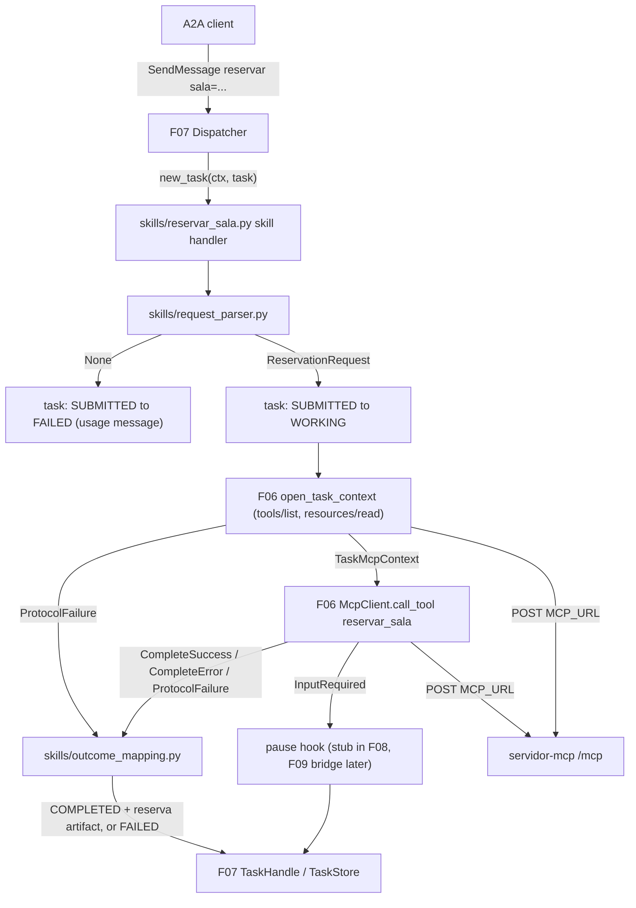
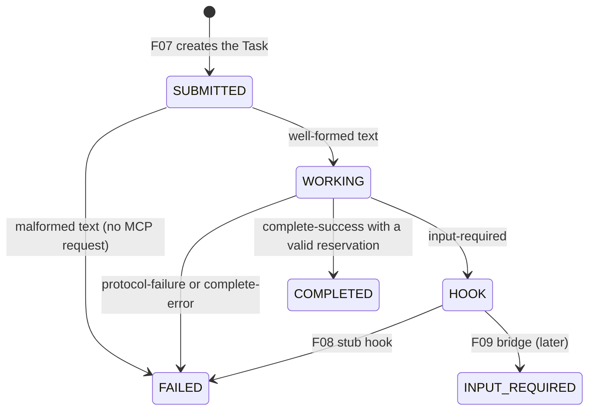

# Technical Specification: Reservation Skill Execution

**Complexity:** medium

## 1. Technical Overview

### What

F08 fills the new-Task seam that F07 left open. It replaces the stub `new_task` handler with the `reservar-sala` skill. The skill parses the incoming text against the fixed format `reservar sala=<id> inicio=<iso8601> fim=<iso8601> responsavel=<nome>`. A malformed text fails the Task at once (`SUBMITTED → FAILED`) with the usage message and sends no MCP request. A well-formed text moves the Task to `WORKING`, opens the per-Task MCP context through F06 (`tools/list`, then `resources/read politica://uso`, both carrying the Task's trace context), and calls `reservar_sala` with the four parsed arguments.

The skill maps each normalized F06 outcome onto the Task. Complete-success becomes `TASK_STATE_COMPLETED` with a `reserva` artifact and the message `Reserva <reserva> confirmada na <sala>.`. Complete-error becomes `TASK_STATE_FAILED` with the tool's text verbatim. Protocol-failure becomes `TASK_STATE_FAILED` with the F06 message. Input-required is handed, together with the original arguments, the policy version and the trace context, to a **pause hook**. F09 provides that hook. Until F09 lands, a documented stub fails the Task with a fixed message.

The agent stays free of domain logic. It never checks room ids, timestamps, windows, durations, capacities or conflicts. Every domain decision comes from the MCP server. F08 adds no HTTP endpoint, no dependency and no configuration. It adds three modules under `agente/src/agente/skills/`, a few strings in `mensagens.py`, and the wiring in the registration hook.

### Why

- Validator checks 24–26 and 35 and the evaluator's first A2A steps need a real skill behind `SendMessage`. F07 only provides the stub `Skill reservar-sala ainda nao implementada`.
- F09 needs two things from F08 that would otherwise be duplicated: the original arguments, policy version and trace context of a paused Task, and the outcome-to-Task mapping it reuses after a retry (completed artifact, failed text). If F08 defines them once, a resumed Task and a direct Task produce the same artifact and the same texts.
- Determinism is measured literally (validator check 36, PRD Section 4). A regular-expression parser plus fixed message templates gives the same state and text for the same input every time.

### Scope

**Included (PRD F08 Capabilities, Experience and Error Handling — full scope, no Core/Full split):**
- Fixed-format request parser over the concatenated message text (F07 `IncomingMessage.text`).
- `reservar-sala` new-Task handler: malformed path, MCP context opening, `reservar_sala` call, outcome dispatch.
- Outcome-to-Task mapping: the `reserva` artifact (keys `reserva, sala, inicio, fim, responsavel, politica`), the confirmation message, and the failed-state texts.
- Input-required hand-off contract (pause hook protocol and hand-off record) plus a stub pause hook used until F09.
- Registration in `skills.build_handlers(settings)` using the single F06 `McpClient`.
- New exact strings in `mensagens.py`.
- Adjustments to the already-written, gated cross-feature tests of F06 and F07 that F08 activates (Section 3.3, A20).

**Input contracts (PRD F08 Consumes):**

| PRD Consumes item | Source in code | How F08 uses it |
|---|---|---|
| F04: `reservar_sala` result, completed (`reserva`, `sala`, `inicio`, `fim`, `responsavel`) or `isError` with the exact execution-error message, received over MCP | Arrives through F06 as `CompleteSuccess.structured` or `CompleteError.text` | Artifact fields copied verbatim from `structured`; error text copied verbatim into the status message |
| F06: per-Task MCP context (discovered tool names, policy version) | `open_task_context(client, ctx.traceparent) -> TaskMcpContext \| ProtocolFailure` (`agente.mcp_host`) | `TaskMcpContext.trace` for the tool call; `TaskMcpContext.policy_version` for the artifact's `politica`. The required-tool check (`reservar_sala` discovered) is done inside the opener |
| F06: normalized `tools/call` outcome (complete-success, complete-error, protocol-failure; plus input-required) | `McpClient.call_tool(trace, RESERVAR_SALA, arguments) -> ToolOutcome` | Exhaustive match on the four outcome types (Section 5.4) |
| F07: Task store and lifecycle operations | `TaskHandle.transition`, `TaskHandle.add_artifact` | `SUBMITTED → FAILED`, `SUBMITTED → WORKING`, `WORKING → COMPLETED/FAILED`; artifact added before the terminal transition |
| F07: incoming request context (message text, `traceparent`) | `RequestContext.message.text`, `RequestContext.traceparent` | Parser input; raw header handed to the F06 opener |

**Output contracts (PRD F08 Provides):**

| PRD Provides item | Exposed as | Module | Consumer |
|---|---|---|---|
| Original request arguments (`sala`, `inicio`, `fim`, `responsavel`), policy version and trace context of the Task, handed over together with the input-required outcome | `InputRequiredHandoff(request, policy_version, trace, outcome)` passed to the pause hook `InputRequiredHandler = async (ctx, task, handoff) -> None`; `ReservationRequest.arguments()` rebuilds the exact `tools/call` arguments | `skills/reservar_sala.py`, `skills/request_parser.py` | F09 |
| Outcome-to-Task mapping: `TASK_STATE_COMPLETED` with the `reserva` artifact and confirmation message; `TASK_STATE_FAILED` with the exact error text | `apply_final_outcome(task, outcome, policy_version)`, plus the building blocks `build_reserva_document`, `render_reserva_artifact`, `complete_with_reservation`, `fail_task` | `skills/outcome_mapping.py` | F09 (retry outcomes) |
| (Registration) the skill plugged into F07 | `skills.build_handlers(settings)` returns `Handlers(new_task=make_reservar_sala_handler(client), continuation=<F07 stub>, aclose=client.aclose)` | `skills/__init__.py` | F07 dispatcher; F09 later passes its own pause hook and continuation |

**Excluded / deferred to other features:**
- Pausing the Task, the private paused record, the `alternativas:` line, parsing `escolha=<valor>`, the MCP retry, decline → `CANCELED` (F09). F08 stops at the hand-off.
- `input_required`, alternatives and `requestState` on the server (F05, being specified in parallel and not implemented). Until F05 lands, the F04 server answers a conflict with the interim execution error `Sala ocupada no intervalo: <sala>`, which F08 maps like any other complete-error (`TASK_STATE_FAILED`, text verbatim).
- Any domain validation in the agent (forbidden by the README and by F08 acceptance criterion 6).
- README text (F10).

### Requirements (from PRD Capabilities and Experience)

| ID | Requirement | PRD source |
|---|---|---|
| R1 | Parse the concatenated text parts against `reservar sala=<id> inicio=<iso8601> fim=<iso8601> responsavel=<nome>`: lowercase keywords, fixed order, one or more spaces between fields; `<id>`, `<inicio>`, `<fim>` non-empty tokens without spaces; `<nome>` the rest of the line, trimmed, non-empty | Capabilities 1 |
| R2 | No validation of room ids, timestamps, policy or conflicts in the agent | Capabilities 2; Section 9 F08 #6 |
| R3 | Malformed request → `SUBMITTED → FAILED`, no MCP request, status message `Pedido invalido: use reservar sala=<id> inicio=<iso8601> fim=<iso8601> responsavel=<nome>` | Capabilities 3 |
| R4 | Valid request → `SUBMITTED → WORKING` → `tools/list` → `resources/read politica://uso` → `tools/call reservar_sala` with the 4 parsed arguments, all with the Task's trace context | Capabilities 4 |
| R5 | Complete-success → `COMPLETED`; artifact `{"artifactId": "art-<12 hex>", "name": "reserva", "parts": [{"text": "<JSON>"}]}` with keys in order `reserva, sala, inicio, fim, responsavel, politica`; `politica` = the policy version the agent read; status message `Reserva <reserva> confirmada na <sala>.` | Capabilities 5; Experience 1–2 |
| R6 | Complete-error → `FAILED`; status message (also in history) equal to the tool text verbatim, SDK prefixes kept | Capabilities 6; Experience 3 |
| R7 | Protocol-failure → `FAILED` with the F06 failure message | Capabilities 7 |
| R8 | Input-required → handed to F09 with original arguments, policy version and trace context | Capabilities 8 |
| R9 | Same request text → same state and same status message text (ids aside) | Capabilities 9 |
| R10 | Error Handling: malformed → usage message, zero MCP requests; MCP down → `Servidor MCP indisponivel`; tool error → exact text, no artifact; tool missing or policy without version → the F06 message | Error Handling |

**New-Task flow (F07 dispatcher → F08 handler):**

1. The dispatcher creates the Task (`SUBMITTED`, user message in history) and awaits `new_task(ctx, task)`.
2. `parse_reservation_request(ctx.message.text)`. On `None`: `task.transition(FAILED, PEDIDO_INVALIDO)` and return.
3. `task.transition(WORKING)` (no text, so no history entry).
4. `open_task_context(client, ctx.traceparent)`. On `ProtocolFailure`: `fail_task(task, failure.message)` and return.
5. `client.call_tool(context.trace, RESERVAR_SALA, request.arguments())`.
6. `InputRequired` → `await on_input_required(ctx, task, InputRequiredHandoff(...))`. Any other outcome → `apply_final_outcome(task, outcome, context.policy_version)`.
7. The dispatcher settles the Task and renders `result.task` (F07).

## 2. Architecture Impact

### Affected components

| Path | Role |
|---|---|
| `agente/src/agente/skills/request_parser.py` | New: fixed-format parser and the parsed request value |
| `agente/src/agente/skills/outcome_mapping.py` | New: outcome-to-Task mapping and the `reserva` artifact |
| `agente/src/agente/skills/reservar_sala.py` | New: skill handler factory, hand-off record, pause-hook protocol and stub |
| `agente/src/agente/skills/__init__.py` | Modified: registers the skill handler with the shared `McpClient` |
| `agente/src/agente/mensagens.py` | Modified: usage, confirmation and pause-stub strings |
| `agente/tests/**` | New unit and integration tests; small fixes to two gated cross-feature files (A20) |

### Component and data flow



### Task states produced by F08



## 3. Technical Decisions

| Decision | Chosen Approach | Alternative Considered | Trade-off |
|---|---|---|---|
| Parser | One anchored regular expression applied to the stripped single-line text (A3–A6) | Tokenizing with `split()` and a key/value map | The regex enforces fixed order and lowercase keywords in one place and is trivially deterministic. A key/value map would accept reordered fields, which the PRD forbids |
| Module layout | Three cohesive modules in the existing `skills/` subpackage: parser, outcome mapping, handler | One `skills/reservar_sala.py` with everything | F09 imports the mapping and the hand-off without importing the handler factory. Each module has one unit-test file. Follows F06's subpackage split (F06 A3) |
| Input-required hand-off | Handler factory takes an injectable **pause hook** `on_input_required`; F08 ships a stub that fails the Task | F08 pauses the Task itself and F09 only handles continuations | The PRD puts pause semantics (paused record, `alternativas:` line) in F09. A hook keeps that boundary and lets F09 plug in through `build_handlers` with no change to F08 code |
| Outcome mapping reuse | Pure functions over a `TaskHandle` (`apply_final_outcome`) shared by F08 and F09 | F09 re-implements the completed/failed mapping | One artifact builder and one set of texts, so a resumed Task's artifact has the same shape as a direct one (Cross-Feature criteria on artifacts) |
| Artifact JSON rendering | `json.dumps(document, ensure_ascii=False)` with the default `", "` / `": "` separators | Compact separators (the agent's response renderer) | Reproduces `exemplos/wire/10`'s artifact text byte for byte for ASCII values. Non-ASCII names stay readable. Both forms parse identically for clients |
| Artifact field source | `reserva, sala, inicio, fim, responsavel` copied verbatim from `structuredContent`; `politica` from the agent's `TaskMcpContext.policy_version` | Copy `politica` from `structuredContent` too | PRD says "taken from the policy version the agent read from the resource". The two values are equal on a healthy server, and Cross-Feature criteria check both sources |
| Validity of a success payload | Require `reservado is True` and the five fields as strings; otherwise `FAILED` with F06's `Resposta inesperada do servidor MCP` (A11) | Trust any `CompleteSuccess` | A decline result (`reservado: false`) or a schema drift can never become a `COMPLETED` Task with a broken artifact. The check reads the payload's shape only, so it is not a domain rule |

### 3.1 Facts relied upon (from implemented features)

| Fact | Evidence |
|---|---|
| `TaskHandle.transition(state, text)` creates one agent message, sets it as `status.message` and appends it to history; `transition(state)` without text adds nothing to history | F07 spec A16; `agente/src/agente/task_store.py` `_apply_transition` |
| Allowed transitions include `SUBMITTED → FAILED`, `SUBMITTED → WORKING`, `WORKING → {COMPLETED, FAILED, CANCELED, INPUT_REQUIRED}`; terminal Tasks reject every write with `TaskImmutableError` | F07 spec A17; `lifecycle.py` |
| A handler exception or a Task left `SUBMITTED`/`WORKING` becomes `FAILED` with `Falha interna do agente` | F07 spec A20; `dispatcher.py` `_send_message` |
| `IncomingMessage.text` joins the text parts with one space | F07 spec A14; `handlers.py` |
| `open_task_context` sends `tools/list`, checks `reservar_sala`, then `resources/read politica://uso`; returns `TaskMcpContext(trace, tools, policy_version)` or a `ProtocolFailure` with the PRD texts | F06 spec 5.7; `mcp_host/task_context.py` |
| `McpClient.call_tool` never raises for protocol conditions; it returns one of `CompleteSuccess(structured)`, `CompleteError(text)`, `InputRequired(input_key, alternatives, request_state)`, `ProtocolFailure(message, code)` | F06 spec 5.5, 5.7; `mcp_host/outcomes.py` |
| `InputRequired.request_state` is hidden from `repr` | F06 spec A19 |
| `skills.build_handlers(settings)` builds one `McpClient(settings.mcp_url)` and registers `client.aclose` | F06 spec A29; `skills/__init__.py` |
| On the current server (F04 without F05) a conflicting `reservar_sala` returns `isError: true` with `Sala ocupada no intervalo: <sala>` | F04 spec A6; F04 progress; `servidor_mcp/primitives/reservar_sala.py` `_responder_conflito` |
| `structuredContent` of a free booking has keys `reserva, reservado, sala, inicio, fim, responsavel, politica, motivo`, with `inicio`/`fim`/`responsavel` stored verbatim | `exemplos/wire/02`; F04 spec |

### 3.2 Assumptions and Auto-Accept Decisions

Every row below is a decision the PRD did not answer. Each names the Auto-Accept Policy row that produced it, so the user can review and override it later.

| # | Decision | Choice | Auto-Accept policy row |
|---|---|---|---|
| A1 | Module placement and naming | `skills/request_parser.py`, `skills/outcome_mapping.py`, `skills/reservar_sala.py` (the last named after the skill id). English module and identifier names, Portuguese user-facing strings in `mensagens.py` (F07 A33). Constants `PEDIDO_INVALIDO`, `RESERVA_CONFIRMADA`, `STUB_PAUSA_NAO_IMPLEMENTADA` | Multiple conflicting patterns in the codebase (flat modules vs subpackages): the `skills/` subpackage, the most recent pattern (F06 A3), is used |
| A2 | Parser input | `ctx.message.text` (parts joined with one space, F07 A14). Multi-part messages are therefore parsed as one line | Technical decision with a clear recommendation |
| A3 | Surrounding whitespace | The whole text is stripped with `str.strip()` before matching, so leading and trailing whitespace (including a trailing newline) is accepted | Partial PRD specification |
| A4 | Separators and line breaks | Between fields: one or more U+0020 spaces only. After stripping, any `\r` or `\n` left in the text → malformed (the format is one line; `<nome>` is "the rest of the line"). Tabs between fields → malformed | Partial PRD specification |
| A5 | Token rules | `sala=`, `inicio=`, `fim=` values match `\S+` (non-empty, no whitespace, any other characters including `=` allowed and passed through). Keywords are exact lowercase literals (`reservar`, `sala=`, `inicio=`, `fim=`, `responsavel=`). No further checks: an unknown room or a bad timestamp is the server's decision (R2) | Partial PRD specification |
| A6 | `<nome>` | Everything after `responsavel=` to the end of the (stripped) text, trimmed. Internal spaces kept verbatim. Empty after trimming → malformed. Text after the name is part of the name (`responsavel=Doc extra=1` → `Doc extra=1`) | Partial PRD specification |
| A7 | Arguments sent | `{"sala", "inicio", "fim", "responsavel"}` in that key order (the order of `exemplos/wire/03`), values exactly as parsed | Technical decision with a clear recommendation |
| A8 | First transition | `SUBMITTED → WORKING` without text, so the history of a completed Task is `[user, confirmation]` and of a failed one `[user, error]`, matching the shape of `exemplos/wire/08`–`10` | Technical decision with a clear recommendation |
| A9 | Artifact order of operations | `add_artifact` runs before `transition(COMPLETED, text)`, because terminal Tasks are immutable. On every failed path no artifact is added | Technical decision with a clear recommendation |
| A10 | Artifact text | `json.dumps(document, ensure_ascii=False)` with default separators; key order `reserva, sala, inicio, fim, responsavel, politica`; no `reservado` or `motivo` key. Byte-identical to the wire 10 artifact text for the same values | Technical decision with a clear recommendation |
| A11 | Success payload checks | `structured["reservado"] is True` and `reserva`, `sala`, `inicio`, `fim`, `responsavel` are all `str`. Otherwise `FAILED` with `Resposta inesperada do servidor MCP` (the F06 constant, already shared with F09). `reserva` and `sala` must also be non-empty, since they appear in the confirmation text | Partial PRD specification |
| A12 | `politica` source | `TaskMcpContext.policy_version` (already trimmed by F06). `structured["politica"]` is ignored | Technical decision with a clear recommendation (PRD "taken from the policy version the agent read") |
| A13 | Confirmation text | `Reserva {reserva} confirmada na {sala}.` built with `str.format` from the payload values | Technical decision with a clear recommendation |
| A14 | Pause hook contract | `InputRequiredHandler = async (ctx: RequestContext, task: TaskHandle, handoff: InputRequiredHandoff) -> None`, called with the Task in `WORKING`. Postcondition: Task terminal or `INPUT_REQUIRED` (F07 A20 settles anything else as `Falha interna do agente`). Injected through `make_reservar_sala_handler(client, *, on_input_required=...)` | Technical decision with a clear recommendation |
| A15 | Stub pause hook (F08 alone) | `WORKING → FAILED` with `Pausa para escolha de alternativa ainda nao implementada`. Never stores anything. Reachable only once F05 returns `input_required` and before F09 registers its hook | Technical decision with a clear recommendation (mirrors F07 A21) |
| A16 | Hand-off record | Frozen `InputRequiredHandoff(request: ReservationRequest, policy_version: str, trace: TraceContext, outcome: InputRequired)`. `repr` hides the outcome's `request_state` (F06 A19) and the dataclass sets `repr=False` on `outcome` as a second guard. The tool name is the constant `RESERVAR_SALA`, not a field | Partial PRD specification |
| A17 | `apply_final_outcome` scope | Handles `CompleteSuccess`, `CompleteError`, `ProtocolFailure` on a Task in `WORKING`. An `InputRequired` passed to it raises `TypeError` (programming error; F07 turns it into `Falha interna do agente`). Decline/cancel interpretation stays in F09, which checks `reservado: false` before calling it | Technical decision with a clear recommendation |
| A18 | Exceptions | F08 catches nothing. F06 already turns transport and protocol problems into outcomes. Any other exception is a bug and is contained by F07 (A20 there), whose diagnostic never prints exception messages | Technical decision with a clear recommendation |
| A19 | Logging | F08 writes nothing to stderr or stdout. The F07 `a2a ...` line and the MCP server's `mcp ...` lines are the evidence | Technical decision with a clear recommendation (follows F06 A18) |
| A20 | Gated tests activated by F08 | Registering the skill activates `test_cross_feature_f07.py` and `test_cross_feature_f06.py`. The F06 `stack` fixture probes with the same booking its tests later send, so on a fresh server the probe consumes the slot and `test_artifact_politica_equals_extracted_version` and `test_agent_tools_list_lists_server_tools` would hit a conflict. F08 changes that probe to the non-booking `sala-delorean` request (still detects the stub and a missing tool). No other existing test changes; `test_a2a_endpoint.py` and `test_process.py` use the stubs or the malformed text `reservar sala=x` and stay green | Technical decision with a clear recommendation |
| A21 | Conflict before F05 | No special handling: the interim server text `Sala ocupada no intervalo: <sala>` is a complete-error and ends the Task `FAILED` verbatim. F08 tests against the real server avoid conflicting requests; the input-required path is tested with the F06 mock transport | Technical decision with a clear recommendation |
| A22 | Domain-free guard | A unit test scans `agente/src/agente/**/*.py` for domain identifiers (`capacidade`, `datetime`, `timedelta`, `fromisoformat`, `08:00`, `20:00`, `salas.json`, `reservas.json`) and for server imports (lines matching `^\s*(from|import)\s+servidor_mcp`), and fails on any hit. Prose is not scanned for words that already occur legitimately: the Agent Card description contains `conflito`, and two docstrings name `servidor_mcp` to say it must not be imported | Technical decision with a clear recommendation |
| A23 | Test stack | Existing: `pytest==9.1.1`, `asyncio.run`, the `mock_mcp` / `fixed_ids` / `make_client` / `start_agent` / `start_mcp_server` fixtures. No new dependency | Technical decision with a clear recommendation |

### 3.3 PRD traceability

| PRD block | Spec destination |
|---|---|
| F08 Consumes | Section 1 Input contracts; Section 5.4 |
| F08 Provides | Section 1 Output contracts; Section 5.5; Section 6 |
| F08 Capabilities | Section 1 R1–R9; Sections 3 and 5 |
| F08 Experience | Section 5.2 examples |
| F08 Error Handling | Section 1 R10; Section 5.3 |
| Section 9 F08 acceptance criteria | Section 7 acceptance traceability |
| Section 9 Cross-Feature Integration (criteria naming F08) | Section 7 `test_cross_feature_f08.py` and the activated F06/F07 cross-feature tests |

## 4. Component Overview

**Backend:**

| File Path | New/Modified | Purpose | Key Responsibilities |
|---|---|---|---|
| `agente/src/agente/skills/request_parser.py` | New | Fixed-format parser | Frozen `ReservationRequest(sala, inicio, fim, responsavel)` with `arguments() -> dict[str, str]` (A7). `parse_reservation_request(text: str) -> ReservationRequest \| None` (A2–A6). One compiled anchored pattern. No domain checks |
| `agente/src/agente/skills/outcome_mapping.py` | New | Outcome-to-Task mapping | `ARTIFACT_NAME = "reserva"`. `ARTIFACT_KEYS = ("reserva", "sala", "inicio", "fim", "responsavel", "politica")`. `build_reserva_document(structured, policy_version) -> dict \| None` (A11, A12). `render_reserva_artifact(document) -> str` (A10). `complete_with_reservation(task, document)` (artifact, then `COMPLETED` with `RESERVA_CONFIRMADA`). `fail_task(task, text)`. `apply_final_outcome(task, outcome, policy_version)` (A17) |
| `agente/src/agente/skills/reservar_sala.py` | New | Skill handler | Frozen `InputRequiredHandoff` (A16). `InputRequiredHandler` protocol (A14). `stub_input_required_handler` (A15). `make_reservar_sala_handler(client: McpClient, *, on_input_required: InputRequiredHandler = stub_input_required_handler) -> NewTaskHandler`, which runs the new-Task flow of Section 1 |
| `agente/src/agente/skills/__init__.py` | Modified | Registration hook | `build_handlers(settings)` builds the `McpClient` and returns `Handlers(new_task=make_reservar_sala_handler(client), continuation=stub_continuation_handler, aclose=client.aclose)`. Docstring updated: F09 passes its pause hook to `make_reservar_sala_handler` and replaces `continuation`, reusing the same client |
| `agente/src/agente/mensagens.py` | Modified | Exact strings | Adds `PEDIDO_INVALIDO`, `RESERVA_CONFIRMADA`, `STUB_PAUSA_NAO_IMPLEMENTADA` (Section 5.3). `STUB_SKILL_NAO_IMPLEMENTADA` stays (still used by `handlers.stub_new_task_handler` and tests) |

**Tests (modified, A20):**

| File Path | New/Modified | Purpose | Key Responsibilities |
|---|---|---|---|
| `agente/tests/integration/test_cross_feature_f06.py` | Modified | Gated F06 Task-level tests | `stack` probe uses `COMMAND` with `sala-delorean` so it books nothing; stub and missing-tool detection unchanged |

**Module boundaries for consumers (F09):**

| Consumer need | Use | Rule |
|---|---|---|
| Plug in the pause | `make_reservar_sala_handler(client, on_input_required=<bridge pause>)` inside `build_handlers` | Same `McpClient` instance for skill and bridge |
| Original arguments for the retry | `handoff.request.arguments()` | Never re-parse the user text |
| Policy version and trace for the paused record | `handoff.policy_version`, `handoff.trace` | Store them in the private attachment with the outcome's key and state |
| Map a retry outcome | `apply_final_outcome(task, outcome, stored_policy_version)` for success, error and failure | Decline/cancel and a new input-required round are F09's branches |
| Exact strings | `agente.mensagens` | Add constants; never inline texts |

**Database:** none. No migration. F08 keeps no state outside the F07 Task store.

## 5. API Contracts

F08 adds no HTTP route. It defines the behaviour of `POST /a2a` `SendMessage` without `taskId` (envelope, errors and shapes from F07 Sections 5.2–5.5), the outbound MCP sequence for one Task (F06 Sections 5.1–5.4), and the in-process hand-off API for F09.

### 5.1 `SendMessage` (new Task) — request

- **Method:** POST
- **Path:** `/a2a`, JSON-RPC method `SendMessage`, no `message.taskId`
- **Authentication:** none (out of scope)

| Field | Type | Required | Validation (F08) | Description |
|---|---|---|---|---|
| `params.message.parts[].text` | `string` | Yes | Joined with one space, then R1/A3–A6 | The booking request |
| header `traceparent` | `string` | No | none in F08; F06 validates and falls back | Trace context for every MCP request of the Task |

**Request Example** (PRD Experience 1, validator check 24 shape):
```json
{
  "jsonrpc": "2.0",
  "id": "9c1e04aa77b2",
  "method": "SendMessage",
  "params": {
    "message": {
      "messageId": "msg-6ae2ad6802e5",
      "role": "ROLE_USER",
      "parts": [
        {"text": "reservar sala=sala-porao inicio=2026-11-03T09:00:00-03:00 fim=2026-11-03T10:00:00-03:00 responsavel=Doc"}
      ]
    }
  }
}
```

**Parser examples:**

| Text | Result |
|---|---|
| `reservar sala=sala-porao inicio=2026-11-03T09:00:00-03:00 fim=2026-11-03T10:00:00-03:00 responsavel=Doc` | `sala-porao`, `2026-11-03T09:00:00-03:00`, `2026-11-03T10:00:00-03:00`, `Doc` |
| `  reservar   sala=a  inicio=b fim=c responsavel=  Emmett  Brown  ` | `a`, `b`, `c`, `Emmett  Brown` |
| `reservar sala=sala-delorean inicio=amanha fim=depois responsavel=Doc` | Parsed (the server rejects the room) |
| `reservar sala=sala-porao` | Malformed |
| `Reservar sala=a inicio=b fim=c responsavel=d` | Malformed (keyword case) |
| `reservar inicio=b sala=a fim=c responsavel=d` | Malformed (order) |
| `reservar sala= inicio=b fim=c responsavel=d` | Malformed (empty token) |
| `reservar sala=a inicio=b fim=c responsavel=` | Malformed (empty name) |
| `reservar sala=a inicio=b fim=c responsavel=Doc\nMarty` | Malformed (two lines) |
| `reservar\tsala=a inicio=b fim=c responsavel=d` | Malformed (tab separator) |

### 5.2 `SendMessage` (new Task) — responses

All responses are HTTP 200 `application/json` with `result.task` (F07 R6, A9).

**Response fields set by F08:**

| Field | Type | Description |
|---|---|---|
| `result.task.status.state` | `string` | `TASK_STATE_COMPLETED`, `TASK_STATE_FAILED`, or (with F09) `TASK_STATE_INPUT_REQUIRED` |
| `result.task.status.message.parts[0].text` | `string` | Confirmation, usage message, tool text or F06 failure text |
| `result.task.history` | `Message[]` | `[user message, agent message]`; the agent message equals `status.message` |
| `result.task.artifacts` | `Artifact[]` | One `reserva` artifact on `COMPLETED`; `[]` otherwise |
| `artifacts[0].parts[0].text` | `string` (JSON) | `reserva`, `sala`, `inicio`, `fim`, `responsavel`, `politica` in this order |

**Response Example — free room (PRD Experience 2, fresh processes):**
```json
{
  "jsonrpc": "2.0",
  "id": "9c1e04aa77b2",
  "result": {
    "task": {
      "id": "task-1a2b3c4d5e6f",
      "contextId": "ctx-0f9e8d7c6b5a",
      "status": {
        "state": "TASK_STATE_COMPLETED",
        "message": {
          "messageId": "msg-a1b2c3d4e5f6",
          "role": "ROLE_AGENT",
          "parts": [{"text": "Reserva res-0003 confirmada na sala-porao."}],
          "taskId": "task-1a2b3c4d5e6f",
          "contextId": "ctx-0f9e8d7c6b5a"
        }
      },
      "history": [
        {
          "messageId": "msg-6ae2ad6802e5",
          "role": "ROLE_USER",
          "parts": [{"text": "reservar sala=sala-porao inicio=2026-11-03T09:00:00-03:00 fim=2026-11-03T10:00:00-03:00 responsavel=Doc"}]
        },
        {
          "messageId": "msg-a1b2c3d4e5f6",
          "role": "ROLE_AGENT",
          "parts": [{"text": "Reserva res-0003 confirmada na sala-porao."}],
          "taskId": "task-1a2b3c4d5e6f",
          "contextId": "ctx-0f9e8d7c6b5a"
        }
      ],
      "artifacts": [
        {
          "artifactId": "art-7259ff515ec2",
          "name": "reserva",
          "parts": [
            {"text": "{\"reserva\": \"res-0003\", \"sala\": \"sala-porao\", \"inicio\": \"2026-11-03T09:00:00-03:00\", \"fim\": \"2026-11-03T10:00:00-03:00\", \"responsavel\": \"Doc\", \"politica\": \"2026-11-01\"}"}
          ]
        }
      ]
    }
  }
}
```

**Response Example — tool execution error (PRD Experience 3), abridged to `result.task`:**
```json
{
  "id": "task-2b3c4d5e6f70",
  "contextId": "ctx-1a9e8d7c6b5b",
  "status": {
    "state": "TASK_STATE_FAILED",
    "message": {
      "messageId": "msg-b2c3d4e5f6a1",
      "role": "ROLE_AGENT",
      "parts": [{"text": "Sala inexistente: sala-delorean"}],
      "taskId": "task-2b3c4d5e6f70",
      "contextId": "ctx-1a9e8d7c6b5b"
    }
  },
  "history": [
    {"messageId": "msg-0c1d2e3f4a5b", "role": "ROLE_USER", "parts": [{"text": "reservar sala=sala-delorean inicio=2026-11-03T09:00:00-03:00 fim=2026-11-03T10:00:00-03:00 responsavel=Doc"}]},
    {"messageId": "msg-b2c3d4e5f6a1", "role": "ROLE_AGENT", "parts": [{"text": "Sala inexistente: sala-delorean"}], "taskId": "task-2b3c4d5e6f70", "contextId": "ctx-1a9e8d7c6b5b"}
  ],
  "artifacts": []
}
```

**Response Example — malformed request:** same shape, `status.state` `TASK_STATE_FAILED`, text `Pedido invalido: use reservar sala=<id> inicio=<iso8601> fim=<iso8601> responsavel=<nome>`, `artifacts: []`. The MCP server logs nothing.

**Outbound MCP sequence for one well-formed Task** (F06 contracts; ids from the process-wide counter):

| Order | MCP request | `Mcp-Name` | Body specifics |
|---|---|---|---|
| 1 | `tools/list` | — | `_meta.traceparent` with the Task trace-id |
| 2 | `resources/read` | `politica://uso` | `uri: politica://uso` |
| 3 | `tools/call` | `reservar_sala` | `arguments: {"sala", "inicio", "fim", "responsavel"}` as parsed |

A failure at step 1 or 2 ends the sequence (F06 opening order). A malformed request sends nothing.

### 5.3 Messages and failure mapping (PRD F08 Error Handling)

| Condition | Task state | Status message (exact) | Source constant | Artifact |
|---|---|---|---|---|
| Text not matching the format | `SUBMITTED → FAILED` | `Pedido invalido: use reservar sala=<id> inicio=<iso8601> fim=<iso8601> responsavel=<nome>` | `mensagens.PEDIDO_INVALIDO` (new) | none |
| Free booking | `WORKING → COMPLETED` | `Reserva <reserva> confirmada na <sala>.` | `mensagens.RESERVA_CONFIRMADA` (new) | `reserva` |
| Tool `isError` (unknown room, policy violation, SDK argument error, internal failure, interim conflict before F05) | `WORKING → FAILED` | the tool text verbatim (e.g. `Sala inexistente: sala-delorean`) | `CompleteError.text` | none |
| MCP server down or 10 s timeout | `WORKING → FAILED` | `Servidor MCP indisponivel` | F06 `MCP_INDISPONIVEL` | none |
| `reservar_sala` not discovered | `WORKING → FAILED` | `Ferramenta reservar_sala nao encontrada no servidor MCP` | F06 `MCP_FERRAMENTA_AUSENTE` | none |
| Policy without version line | `WORKING → FAILED` | `Politica de uso sem versao declarada` | F06 `POLITICA_SEM_VERSAO` | none |
| JSON-RPC error from the server | `WORKING → FAILED` | `Erro do servidor MCP: <code> <message>` | F06 `MCP_ERRO` | none |
| Unsupported `input_required` shape | `WORKING → FAILED` | `Pedido de entrada nao suportado pelo agente` | F06 `MCP_PEDIDO_NAO_SUPORTADO` | none |
| Success payload without `reservado: true` or with non-string fields (A11) | `WORKING → FAILED` | `Resposta inesperada do servidor MCP` | F06 `MCP_RESPOSTA_INESPERADA` | none |
| Supported `input_required`, F08 stub hook | `WORKING → FAILED` | `Pausa para escolha de alternativa ainda nao implementada` | `mensagens.STUB_PAUSA_NAO_IMPLEMENTADA` (new) | none |
| Unexpected exception (bug) | `→ FAILED` | `Falha interna do agente` | F07 | none |

### 5.4 Outcome dispatch

| F06 outcome | F08 action |
|---|---|
| `CompleteSuccess(structured)` | `build_reserva_document(structured, policy_version)`; valid → `complete_with_reservation`; `None` → `fail_task(MCP_RESPOSTA_INESPERADA)` |
| `CompleteError(text)` | `fail_task(text)` |
| `ProtocolFailure(message)` | `fail_task(message)` |
| `InputRequired(...)` | `await on_input_required(ctx, task, InputRequiredHandoff(request, policy_version, trace, outcome))` |

### 5.5 In-process API (for F09)

**`ReservationRequest`** (frozen): `sala: str`, `inicio: str`, `fim: str`, `responsavel: str`; `arguments() -> dict[str, str]` returns a new dict in key order `sala, inicio, fim, responsavel`.

**`InputRequiredHandoff`** (frozen):

| Field | Type | Description |
|---|---|---|
| `request` | `ReservationRequest` | Original parsed arguments |
| `policy_version` | `str` | Version read by F06 for this Task |
| `trace` | `TraceContext` | The Task's trace context (F06), reusable with `TraceContext.for_continuation` |
| `outcome` | `InputRequired` | `input_key`, `alternatives`, opaque `request_state` (`repr=False`) |

**Functions:**

| Function | Precondition | Effect |
|---|---|---|
| `make_reservar_sala_handler(client, *, on_input_required=stub_input_required_handler)` | One shared `McpClient` | Returns the `NewTaskHandler` |
| `apply_final_outcome(task, outcome, policy_version)` | Task in `WORKING`; outcome not `InputRequired` | `COMPLETED` with artifact, or `FAILED` with text (Section 5.3) |
| `build_reserva_document(structured, policy_version)` | — | Ordered dict or `None` (A11) |
| `render_reserva_artifact(document)` | Valid document | Artifact text (A10) |
| `complete_with_reservation(task, document)` | Task in `WORKING` | Adds the `reserva` artifact, then `COMPLETED` with the confirmation |
| `fail_task(task, text)` | Task not terminal | `FAILED` with `text` as status message and history entry |
| `stub_input_required_handler(ctx, task, handoff)` | Task in `WORKING` | `FAILED` with `STUB_PAUSA_NAO_IMPLEMENTADA` |

## 6. Data Model

In-memory only: no database, no migration, no file I/O. Task data lives in the F07 store.

**Value types (frozen):**

| Type | Field | Type | Nullable | Description |
|---|---|---|---|---|
| `ReservationRequest` | `sala` | `str` | No | Non-empty, no whitespace |
| | `inicio` | `str` | No | Non-empty, no whitespace; not parsed |
| | `fim` | `str` | No | Non-empty, no whitespace; not parsed |
| | `responsavel` | `str` | No | Trimmed, non-empty, single line |
| `InputRequiredHandoff` | `request` | `ReservationRequest` | No | |
| | `policy_version` | `str` | No | e.g. `2026-11-01` |
| | `trace` | `TraceContext` | No | |
| | `outcome` | `InputRequired` | No | Hidden from `repr` |

**`reserva` artifact document (JSON text of the artifact's single text part):**

| Key (order) | Type | Source | Example |
|---|---|---|---|
| 1 `reserva` | `string` | `structuredContent.reserva` | `res-0003` |
| 2 `sala` | `string` | `structuredContent.sala` | `sala-porao` |
| 3 `inicio` | `string` | `structuredContent.inicio` (verbatim) | `2026-11-03T09:00:00-03:00` |
| 4 `fim` | `string` | `structuredContent.fim` (verbatim) | `2026-11-03T10:00:00-03:00` |
| 5 `responsavel` | `string` | `structuredContent.responsavel` (verbatim) | `Doc` |
| 6 `politica` | `string` | `TaskMcpContext.policy_version` | `2026-11-01` |

**Constraints / invariants:**

| Constraint | Type | Definition | Purpose |
|---|---|---|---|
| No MCP traffic for malformed text | Handler order | Parse before any client call | R3, Section 9 F08 #5 |
| Discovery before the call | Handler order | `open_task_context` succeeds before `call_tool` | R4; F06 acceptance 1–2 |
| Artifact only on success | Mapping | `add_artifact` only inside `complete_with_reservation` | R10 "no artifact attached" |
| Artifact before terminal | Mapping | Artifact added, then `COMPLETED` | Terminal immutability (F07) |
| Verbatim error text | Mapping | `CompleteError.text` used unchanged | R6; Cross-Feature "verbatim" |
| Opaque state | Hand-off | `request_state` only travels inside `InputRequired`; never in a message, artifact or log | Validator check 34 |
| Domain-free agent | Source guard | No domain identifiers in `agente/src` (A22) | R2; Section 9 F08 #6 |

## 7. Testing Strategy

**Test File Structure** (run with `python -m pytest agente` from the repo root, `dev` extra installed):

| Test File | Test Type | Target | Coverage Goal |
|---|---|---|---|
| `agente/tests/unit/test_request_parser.py` | Unit | `skills/request_parser.py` | 100% |
| `agente/tests/unit/test_outcome_mapping.py` | Unit (real `TaskStore`, `fixed_ids`) | `skills/outcome_mapping.py` | 100% |
| `agente/tests/unit/test_reservar_sala_skill.py` | Unit (`mock_mcp`, `TaskStore`, `asyncio.run`) | `skills/reservar_sala.py` | 100% |
| `agente/tests/unit/test_domain_free_agent.py` | Unit (static source scan) | `agente/src/agente/**` | n/a |
| `agente/tests/integration/test_reservar_sala_endpoint.py` | Integration (in-process `make_client` with the skill on `mock_mcp`) | Skill behind `POST /a2a` | 90% |
| `agente/tests/integration/test_cross_feature_f08.py` | Integration (both subprocesses) | Section 9 F08 acceptance and Cross-Feature criteria | n/a |
| `agente/tests/integration/test_cross_feature_f06.py` | Integration (modified probe, A20) | Gated F06 Task-level criteria, now active | n/a |
| `agente/tests/integration/test_cross_feature_f07.py` | Integration (unchanged, now active for F08) | `test_tasks_created_by_skill_are_retrievable_by_get_task` | n/a |

**`unit/test_request_parser.py`:**

| Test Function | Description | Assertions |
|---|---|---|
| `test_parses_canonical_request` | PRD Experience 1 text | Four fields equal the tokens; `arguments()` keys in order `sala, inicio, fim, responsavel` |
| `test_multiple_spaces_and_surrounding_whitespace_accepted` | Extra spaces between fields, leading/trailing spaces and a trailing newline | Parsed; values unchanged |
| `test_name_is_rest_of_line_trimmed` | `responsavel=  Emmett  Brown  `; `responsavel=Doc extra=1` | `Emmett  Brown`; `Doc extra=1` |
| `test_values_are_not_validated` | `sala-delorean`, `inicio=amanha`, `fim=2026-11-03T14:00:00` | Parsed verbatim |
| `test_malformed_variants_return_none` | Parametrized: missing fields, wrong order, uppercase keyword, `Reservar`, empty token, empty name, tab separator, embedded newline, missing `reservar`, empty text, only spaces, `reservar sala=x` | `None` |
| `test_parts_joined_text_is_parsed` | Text built as `" ".join(["reservar sala=a", "inicio=b fim=c responsavel=d"])` | Parsed |
| `test_arguments_returns_new_dict` | Mutate the returned dict | A second call is unchanged |

**`unit/test_outcome_mapping.py`:**

| Test Function | Description | Assertions |
|---|---|---|
| `test_document_from_wire_02_structured_content` | `structuredContent` of `exemplos/wire/02`, version `2026-11-01` | Keys exactly `ARTIFACT_KEYS` in order; values from the payload; `politica` from the argument |
| `test_politica_comes_from_agent_version` | Payload `politica: "outra"`, version `2026-11-01` | Document `politica == "2026-11-01"` |
| `test_invalid_payloads_return_none` | Parametrized: `reservado` false/missing, `reserva` `null`/empty, `sala` empty, non-string `inicio`, missing `responsavel` | `None` |
| `test_artifact_text_matches_wire_10_format` | Values of the wire 10 artifact | `render_reserva_artifact` equals the wire 10 artifact text byte for byte |
| `test_non_ascii_name_is_not_escaped` | `responsavel: "João"` | Text contains `João`; `json.loads` round-trips |
| `test_complete_with_reservation_adds_artifact_then_completes` | Task in `WORKING` | One artifact `name == "reserva"` with an `art-` id; state `COMPLETED`; status text `Reserva res-0003 confirmada na sala-porao.`; last history entry equals `status.message` |
| `test_apply_final_outcome_complete_error_is_verbatim` | `CompleteError("Error executing tool reservar_sala: ...")` | `FAILED`; status text identical; history last entry identical; `artifacts == []` |
| `test_apply_final_outcome_protocol_failure` | `ProtocolFailure("Servidor MCP indisponivel")` | `FAILED` with that text; no artifact |
| `test_apply_final_outcome_invalid_success_is_unexpected` | `CompleteSuccess({"reservado": False, ...})` | `FAILED` with `Resposta inesperada do servidor MCP`; no artifact |
| `test_apply_final_outcome_rejects_input_required` | `InputRequired(...)` | `TypeError`; Task unchanged |

**`unit/test_reservar_sala_skill.py`** (handler driven directly with a `RequestContext`, a `TaskStore` handle and `MockMcp` answers built from `exemplos/wire/01`, `05`, `02`, `03`):

| Test Function | Description | Assertions |
|---|---|---|
| `test_malformed_request_fails_without_mcp_requests` | Text `reservar sala=sala-porao` | `FAILED` from `SUBMITTED` (no `WORKING` step); usage message exact; `mock.requests == []` |
| `test_free_room_completes_with_artifact` | Wire 01, 05, 02 answers | Requests in order `tools/list`, `resources/read`, `tools/call`; `COMPLETED`; artifact document has `politica == "2026-11-01"` and wire 02 values |
| `test_tool_call_arguments_are_the_parsed_tokens` | Recorded third request | `params.name == "reservar_sala"`; `arguments` equal `ReservationRequest.arguments()`, key order included |
| `test_all_requests_share_task_trace_id` | `ctx.traceparent` with trace-id `T` | Every recorded `_meta.traceparent` has trace-id `T` |
| `test_complete_error_fails_with_verbatim_text` | `tools/call` answers `isError` `Sala inexistente: sala-delorean` | `FAILED`; text identical; no artifact |
| `test_mcp_unavailable_fails_task` | Transport raises `httpx.ConnectError` | `FAILED` with `Servidor MCP indisponivel`; one request attempted |
| `test_missing_tool_fails_after_discovery` | `tools/list` without `reservar_sala` | `FAILED` with `Ferramenta reservar_sala nao encontrada no servidor MCP`; one request |
| `test_policy_without_version_fails` | Resource text `# Politica` | `FAILED` with `Politica de uso sem versao declarada`; no `tools/call` |
| `test_input_required_goes_to_pause_hook_with_handoff` | Wire 03 answer; recording hook | Hook called once with Task in `WORKING`; `handoff.request` equals the parsed request; `policy_version == "2026-11-01"`; `handoff.trace` is the trace used for the calls; `handoff.outcome.input_key == "__main__:escolha_de_sala"`, alternatives `("sala-fusca", "sala-mirante")`, `request_state` identical to the wire string |
| `test_stub_pause_hook_fails_task` | Wire 03 answer, default hook | `FAILED` with `Pausa para escolha de alternativa ainda nao implementada` |
| `test_handoff_repr_hides_request_state` | `repr(handoff)` with a 64-char sentinel state | Sentinel absent |
| `test_same_text_gives_same_state_and_message` | Same request run twice on two Tasks with identical answers | Same final state and same status text |

**`unit/test_domain_free_agent.py`:**

| Test Function | Description | Assertions |
|---|---|---|
| `test_agent_source_has_no_domain_rules` | Scan every `.py` under `agente/src/agente` for the A22 list | No hit; failure message names file and line |
| `test_agent_does_not_import_server_code` | Same scan for `import servidor_mcp` / `from servidor_mcp` statements | No hit |

**`integration/test_reservar_sala_endpoint.py`** (in-process `make_client` with `Handlers(new_task=make_reservar_sala_handler(mock.client), continuation=stub)`, `fixed_ids`):

| Test Function | Description | Assertions |
|---|---|---|
| `test_send_message_free_room_returns_completed_task` | Wire 01/05/02 answers | HTTP 200; `result.task.status.state == "TASK_STATE_COMPLETED"`; history `[user, agent]`; `artifacts[0].name == "reserva"`; response equals the Section 5.2 example structure (fixed ids) |
| `test_send_message_malformed_returns_failed_task` | `reservar sala=sala-porao` | `TASK_STATE_FAILED`, usage message, `artifacts == []`, no MCP request |
| `test_get_task_after_skill_returns_same_task` | `GetTask` after a completed Task | Same `id`, `contextId`, state, history, artifacts |
| `test_request_log_line_has_resulting_state` | Completed Task | `a2a method=SendMessage id=<id> task=<task> state=TASK_STATE_COMPLETED` |
| `test_traceparent_header_reaches_mcp_meta` | Header with trace-id `T` | Every recorded MCP body has trace-id `T` in `_meta.traceparent` |
| `test_no_request_state_in_any_response_after_stub_pause` | Wire 03 answer; card, `SendMessage`, `GetTask` bodies | No body contains any 40-char substring of the wire 03 `requestState` |

**`integration/test_cross_feature_f08.py`** (fresh `start_mcp_server` and `start_agent` with `MCP_URL` per test; skipped when `servidor_mcp` is not installed):

| Test Function | Criterion | Assertions |
|---|---|---|
| `test_free_room_completes_on_fresh_processes` | F08 #1 | `reservar sala=sala-porao inicio=2026-11-03T09:00:00-03:00 fim=2026-11-03T10:00:00-03:00 responsavel=Doc` → `TASK_STATE_COMPLETED` |
| `test_artifact_named_reserva_with_sala_and_politica` | F08 #2; Cross-Feature "`politica` of every `reserva` artifact (F08) equals the version F06 extracted from the F02 resource" | Artifact `name == "reserva"`; JSON `sala == "sala-porao"`, `politica == "2026-11-01"` (first line of `dados/politica-de-uso.md`) |
| `test_completed_status_message` | F08 #3 | Status text matches `^Reserva res-\d{4} confirmada na sala-porao\.$` (`res-0003` on fresh processes) |
| `test_unknown_room_fails_with_tool_text_in_status_and_history` | F08 #4; Cross-Feature "Tool `isError` text (F04 via F06) appears verbatim in the F08 Task status message and history" | `TASK_STATE_FAILED`; status text and a `ROLE_AGENT` history entry both equal `Sala inexistente: sala-delorean` (the server's text, verbatim) |
| `test_malformed_request_fails_with_zero_mcp_lines` | F08 #5 | `reservar sala=sala-porao` → `TASK_STATE_FAILED` with the usage message; MCP stderr `mcp ` line count unchanged |
| `test_artifact_fields_equal_reservar_sala_structured_content` | Cross-Feature "Artifact fields `reserva`, `sala`, `inicio`, `fim`, `responsavel` (F08) equal the `structuredContent` returned by `reservar_sala` (F04)" | Artifact values equal `res-0003`, `sala-porao` and the request strings verbatim; a direct `consultar_disponibilidade` to the server for the same room and interval reports a conflict whose `id`, `inicio`, `fim`, `responsavel` equal the artifact's |
| `test_task_retrievable_by_get_task` | Cross-Feature "Tasks created by F08 through the F07 store are retrievable by `GetTask` with the same id, contextId and state" | `GetTask` returns equal `id`, `contextId`, `status.state` (complements `test_cross_feature_f07.py`) |
| `test_trace_id_reaches_every_mcp_request_of_the_task` | Cross-Feature "The trace-id of the `traceparent` header received by F07 appears in the MCP stderr for every MCP request issued by F08 … for that Task" (F08 part; the F09 part stays in `test_cross_feature_f07.py`) | Header trace-id `T`; the three `mcp ` lines emitted for the Task (`tools/list`, `resources/read`, `tools/call`) all carry `T` |
| `test_mcp_down_fails_task_with_unavailable_message` | F08 Error Handling "MCP server down" | Server stopped → `TASK_STATE_FAILED` with `Servidor MCP indisponivel` |

**Validator smoke (manual, not a pytest file):** with fresh `python -m servidor_mcp` and `python -m agente`, `validador/validar.py` checks 21–26, 31, 34 and 35 pass. Checks 13–20 and 27–30, 32, 33, 36 need F05/F09.

**Acceptance criteria traceability (PRD Section 9, F08):**

| # | Acceptance criterion | Test(s) |
|---|---|---|
| 1 | `reservar sala=sala-porao ... 09:00 ... 10:00 responsavel=Doc` on fresh processes ends `TASK_STATE_COMPLETED` | `test_free_room_completes_on_fresh_processes`, `test_free_room_completes_with_artifact` |
| 2 | Artifact `name: "reserva"` whose text parses to JSON with `sala: "sala-porao"` and `politica: "2026-11-01"` | `test_artifact_named_reserva_with_sala_and_politica`, `test_document_from_wire_02_structured_content` |
| 3 | Status message `Reserva <id> confirmada na sala-porao.` | `test_completed_status_message`, `test_complete_with_reservation_adds_artifact_then_completes` |
| 4 | `sala-delorean` ends `TASK_STATE_FAILED` with `Sala inexistente: sala-delorean` in status message and history | `test_unknown_room_fails_with_tool_text_in_status_and_history`, `test_complete_error_fails_with_verbatim_text` |
| 5 | `reservar sala=sala-porao` ends `FAILED` with the usage message and zero MCP log lines | `test_malformed_request_fails_with_zero_mcp_lines`, `test_malformed_request_fails_without_mcp_requests` |
| 6 | Agent source has no capacity, window, duration or conflict computation | `test_agent_source_has_no_domain_rules`, `test_agent_does_not_import_server_code` |

**Cross-Feature criteria referencing F08 (PRD Section 9):**

| Criterion | Test(s) |
|---|---|
| `politica` of every `reserva` artifact (F08/F09) equals the version F06 extracted from the F02 resource | `test_artifact_named_reserva_with_sala_and_politica`; `test_cross_feature_f06.py::test_artifact_politica_equals_extracted_version` (F09 resumed case stays with F09) |
| Artifact fields (F08) equal the `structuredContent` returned by `reservar_sala` (F04) | `test_artifact_fields_equal_reservar_sala_structured_content`, `test_document_from_wire_02_structured_content` |
| Tool `isError` text (F04 via F06) appears verbatim in the F08 status message and history | `test_unknown_room_fails_with_tool_text_in_status_and_history`; `test_cross_feature_f06.py::test_is_error_text_reaches_task_verbatim` |
| Tasks created by F08 through the F07 store are retrievable by `GetTask` | `test_task_retrievable_by_get_task`; `test_cross_feature_f07.py::test_tasks_created_by_skill_are_retrievable_by_get_task` |
| Trace-id of the F07 `traceparent` header appears in MCP stderr for every MCP request issued by F08 (and F09) | `test_trace_id_reaches_every_mcp_request_of_the_task`; F09 part: `test_cross_feature_f07.py::test_traceparent_trace_id_reaches_every_mcp_request_of_the_task` (gated on F09) |
