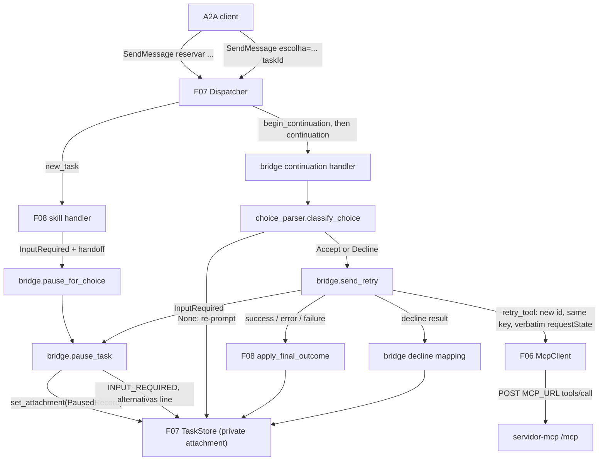
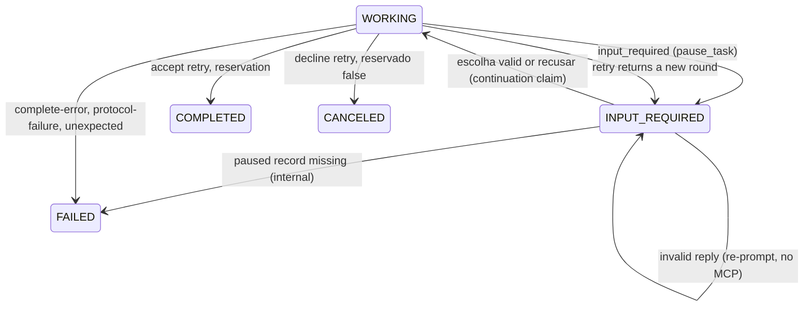

# Technical Specification: The Bridge: Pause and Resume

**Complexity:** medium

## 1. Technical Overview

### What

F09 fills the two seams that F07 and F08 left open. F08 handles a new Task's `input_required` outcome with a stub hook. F09 replaces that stub with a **pause hook**. The hook stores a private paused record on the Task and moves the Task to `TASK_STATE_INPUT_REQUIRED`. The status message is exactly `alternativas: <id1>, <id2>[, <id3>]`.

F07 handles every continuation with a stub. F09 replaces it with a **continuation handler**. The handler reads the user's `escolha=<valor>` reply against the paused record and acts on it:
- An invalid reply re-prompts with the same `alternativas:` line and sends no MCP request.
- A valid reply retries the original `tools/call` through F06. The retry has a new JSON-RPC id, the stored input key, and the stored `requestState` byte for byte.
- The retry outcome becomes `COMPLETED`, `CANCELED`, `FAILED`, or another `INPUT_REQUIRED` round.

The paused record is the only place the agent keeps MCP protocol state. It lives in the F07 Task store's private attachment slot. It is never serialized into any A2A response or log, and the store drops it as soon as the Task becomes terminal. The record is keyed by Task id, so any number of Tasks can be paused at once, and each one resumes only with its own `requestState`.

F09 adds no HTTP route, no dependency and no configuration. It adds two modules under `agente/src/agente/skills/`, two strings in `mensagens.py`, and the wiring in `skills.build_handlers`. It also makes one backward-compatible extension to a test fixture.

### Why

- Validator checks 27–30, 32, 33 and 36 fail today with the F08 stub text `Pausa para escolha de alternativa ainda nao implementada` (F08 progress, final verification: 29/36). F09 is what turns them green.
- PRD Objective "Bridge" requires two things. The MCP `input_required` must surface as an A2A pause. The resume must use a distinct JSON-RPC id with per-Task isolation of the paused state.
- PRD Objective "Keep" requires that no A2A response contains any part of a `requestState` (check 34). The bridge is the only code that touches the state after F06 hands it over, so F09 owns that guarantee.

### Scope

**Included (PRD F09 Capabilities, Experience and Error Handling — full scope, no Core/Full split):**
- Pause hook: build the paused record from F08's hand-off, store it privately, and pause the Task with the exact `alternativas:` line.
- Strict choice parser and classifier for `escolha=<valor>`.
- Continuation handler with three branches: re-prompt, accept retry, decline retry.
- Retry-outcome mapping: completed, failed, canceled, new round.
- Registration of the pause hook and the continuation handler in `skills.build_handlers` with the single shared `McpClient`.
- New exact strings in `mensagens.py`.
- `start_mcp_server` test fixture: optional `port` and `secret` arguments, so the server can be restarted with the same or a different secret (A20).

**Input contracts (PRD F09 Consumes):**

| PRD Consumes item | Source in code | How F09 uses it |
|---|---|---|
| F05: `input_required` contract (single `inputRequests` key, form elicitation with `sala` `enum`/`const` in offer order, opaque `requestState`) | Arrives normalized through F06 as `InputRequired(input_key, alternatives, request_state)` | `input_key` and `request_state` are stored verbatim. `alternatives` is stored in order and rendered into the `alternativas:` line |
| F05: decline result (`reservado: false`, `motivo`) | `CompleteSuccess(structured)` with `structured["reservado"] is False` | Mapped to `CANCELED` with `Reserva recusada: nenhuma alternativa escolhida.`; `motivo` is not inspected (A10) |
| F05: new `input_required` rounds | `InputRequired` returned by `retry_tool` | Replaces the stored key, alternatives and `requestState`, and the Task pauses again |
| F06: normalized input-required outcome and retry invocation | `McpClient.retry_tool(trace, name, arguments, *, input_key, input_response, request_state)`, `accept_response(sala)`, `decline_response()`, `TraceContext.for_continuation(stored, raw)` | One `tools/call` per valid reply. F06 guarantees the new id and forwards the state unchanged |
| F07: Task store and lifecycle operations | `TaskHandle.set_attachment / get_attachment / transition`; store clears the attachment on any terminal transition; `begin_continuation` raises `NotAwaitingInputError` (→ `-32004 Task <id> nao aguarda entrada`) while a Task is not `INPUT_REQUIRED` or is claimed | Private record storage, the pause/re-prompt/resume transitions, and concurrency protection (already implemented, reused unchanged) |
| F07: continuation request context (`taskId`, message text, `traceparent`) | `RequestContext.message.text`, `RequestContext.traceparent`; the dispatcher appends the user message to history before calling the handler | Input to the choice parser and to the retry's trace context |
| F08: original request arguments, policy version and trace context | `InputRequiredHandoff(request: ReservationRequest, policy_version, trace, outcome)` passed to the pause hook | Copied into the paused record. `request.arguments()` rebuilds the retry arguments |
| F08: outcome-to-Task mapping | `apply_final_outcome(task, outcome, policy_version)`, `fail_task(task, text)` | Accept-retry outcomes other than a new round are mapped exactly as in a direct Task |

**Output contracts (PRD F09 has no Provides block):** F09 is a leaf feature. For F10 ("Onde a ponte acontece"), the two places the README must name are:

| Bridge point | File | Function |
|---|---|---|
| MCP `input_required` becomes `TASK_STATE_INPUT_REQUIRED` | `agente/src/agente/skills/bridge.py` | `pause_task` (called from `pause_for_choice` and on a new round) |
| The stored `requestState` goes back to the server | `agente/src/agente/skills/bridge.py` | `send_retry` (calls `McpClient.retry_tool`) |

**Excluded / deferred:**
- README text, including the "Onde a ponte acontece" paragraph (F10).
- Any domain logic. The agent never checks whether the chosen room is free or allowed by policy. It only checks whether the reply is one of the alternatives the server offered.
- Expiry tracking in the agent. Only the server decides whether a `requestState` has expired (A13).
- `CancelTask` and other A2A methods (PRD Out of Scope).

### Requirements (from PRD Capabilities and Experience)

| ID | Requirement | PRD source |
|---|---|---|
| R1 | On input-required, store a private paused record keyed by Task id: `requestState` (verbatim), input key, tool name, original arguments, ordered alternatives, policy version, trace context | Capabilities 1 |
| R2 | Pause the Task: `WORKING → INPUT_REQUIRED`, status message exactly `alternativas: <ids joined by ", ">` in `enum` order (one id for `const`), no prefix; the same message is in history | Capabilities 1; Experience 1 |
| R3 | The paused record never appears in the Task, card, artifacts, status messages, history, errors or logs | Capabilities 2 |
| R4 | A continuation is accepted only for a Task in `INPUT_REQUIRED`; the user message goes to history; the text is trimmed and parsed as `escolha=<valor>` | Capabilities 3 |
| R5 | `<valor>` among the stored alternatives → `WORKING` → retry with `{"action": "accept", "content": {"sala": "<valor>"}}` | Capabilities 3a |
| R6 | `<valor>` = `recusar` → `WORKING` → retry with `{"action": "decline"}` → on `reservado: false`, `CANCELED` with `Reserva recusada: nenhuma alternativa escolhida.` | Capabilities 3b |
| R7 | Any other value or form → no MCP request; Task stays `INPUT_REQUIRED`; a new agent message with the same `alternativas:` line becomes the status message and is appended to history | Capabilities 3c; Experience 2 |
| R8 | Retry: same tool name and original arguments, new JSON-RPC id, `inputResponses` keyed by the stored key, stored `requestState` unchanged, `_meta` trace = the continuation's `traceparent` trace-id when valid, otherwise the Task's | Capabilities 4 |
| R9 | Retry outcomes: complete-success → `COMPLETED` with the `reserva` artifact (`politica` from the stored version); complete-error → `FAILED`; protocol-failure → `FAILED`; new input-required → `INPUT_REQUIRED` with the new alternatives, replacing the stored state and key | Capabilities 5; Experience 3 |
| R10 | The paused record is deleted as soon as the Task becomes terminal | Capabilities 6 |
| R11 | Paused records are independent per Task; any number can be paused at once | Capabilities 7 |
| R12 | Error Handling: expired state → `FAILED` with `Erro do servidor MCP: -32602 <message>`; server down → `Servidor MCP indisponivel`; server restarted with the same secret → completes; continuation while `WORKING` → `-32004 Task <id> nao aguarda entrada`; decline answered with anything but `reservado: false` → `Resposta inesperada do servidor MCP` (protocol failures keep their F06 text, A10) | Error Handling |

**Pause flow (F08 handler → F09 pause hook):**

1. F08 has the Task in `WORKING` and receives `InputRequired` from `call_tool`. It calls `on_input_required(ctx, task, handoff)`, which is `pause_for_choice`.
2. `pause_for_choice` builds `PausedRecord.from_handoff(handoff)` (tool name `RESERVAR_SALA`).
3. `pause_task(task, record)` runs `task.set_attachment(record)`, then `task.transition(INPUT_REQUIRED, render_alternatives(record.alternatives))`.
4. The F07 dispatcher returns `result.task` in `TASK_STATE_INPUT_REQUIRED`.

**Continuation flow (F07 dispatcher → F09 continuation handler):**

1. The dispatcher's `begin_continuation` checks that the Task is `INPUT_REQUIRED` and unclaimed, appends the user message and takes the continuation claim. Every failure here is already answered by F07 with `-32001` or `-32004`.
2. `record = task.get_attachment()`. If it is not a `PausedRecord`, the Task goes `FAILED` with `Falha interna do agente` (A14).
3. `choice = classify_choice(ctx.message.text, record.alternatives)`.
4. `None` → `task.transition(INPUT_REQUIRED, render_alternatives(record.alternatives))`, then return (no MCP traffic).
5. `Accept(sala)` → `task.transition(WORKING)` → `outcome = send_retry(client, ctx, record, accept_response(sala))` → if `InputRequired`, `pause_task(task, record.next_round(outcome))`; otherwise `apply_final_outcome(task, outcome, record.policy_version)`.
6. `Decline` → `task.transition(WORKING)` → `outcome = send_retry(client, ctx, record, decline_response())` → decline mapping (Section 5.4).
7. The dispatcher settles the Task and releases the claim (F07). A terminal transition already dropped the attachment.

## 2. Architecture Impact

### Affected components

| Path | Role |
|---|---|
| `agente/src/agente/skills/choice_parser.py` | New: strict `escolha=<valor>` parser and classifier |
| `agente/src/agente/skills/bridge.py` | New: paused record, pause hook, retry, continuation handler, decline mapping |
| `agente/src/agente/skills/__init__.py` | Modified: registers `pause_for_choice` and `make_continuation_handler(client)` |
| `agente/src/agente/mensagens.py` | Modified: `ALTERNATIVAS`, `RESERVA_RECUSADA` |
| `agente/tests/conftest.py` | Modified: `start_mcp_server(*, port=None, secret=None)` (A20) |
| `agente/tests/**` | New unit and integration tests; gated F06/F07 tests activate on their own |

### Component and data flow



### Task states produced by F09



## 3. Technical Decisions

| Decision | Chosen Approach | Alternative Considered | Trade-off |
|---|---|---|---|
| Paused-record storage | F07's per-Task private attachment (`TaskHandle.set_attachment`), which the store drops on any terminal transition | A separate `dict[task_id, record]` owned by the bridge | The store already gives per-Task isolation, locking and deletion on terminal (R10, R11) with no new lifecycle code. The record cannot outlive its Task |
| Record shape | Frozen `PausedRecord` dataclass with `request_state` marked `repr=False`, built from `InputRequiredHandoff` | Store the hand-off object itself | A dedicated record holds exactly the PRD fields (tool name included) and can produce the next round with `dataclasses.replace`. Hiding the state from `repr` keeps it out of any accidental formatting (R3) |
| Choice parsing | Strict: strip, then `fullmatch` of `escolha=(\S+)`; classify accept (value in alternatives) before decline (`recusar`) | Lenient spacing or case-insensitive keyword | Interview decision. Matches F08's fixed-format parser, keeps behaviour deterministic, and a too-strict reply only re-prompts, so it can never break a Task |
| Retry scope | One `tools/call` only; no new `tools/list` or policy read | Re-open the MCP context on each continuation | The PRD keeps the stored policy version for the artifact. Evaluator step 9 expects the pair of `tools/call` lines, and "every Task's first MCP request is a `tools/list`" is already satisfied by the first round |
| Decline mapping | `CompleteSuccess` with `reservado is False` → `CANCELED`; `ProtocolFailure` → `FAILED` with its F06 text; anything else → `FAILED` with `Resposta inesperada do servidor MCP` | Treat every non-`reservado:false` result as unexpected | Interview decision. An expired state or a server outage on decline gives the same diagnostic text as on accept (PRD Error Handling) |
| Trace on a new round | The record keeps the Task's original trace; a continuation's valid `traceparent` is used only for that retry | Store the continuation's trace for later rounds | PRD: "the continuation's `traceparent` trace-id when present, otherwise the Task's". The Task's trace stays the fallback for every later reply |
| Function naming | `pause_task` and `send_retry` as the single entry points for the two bridge directions | Inline both inside the handlers | F10's README must point at one file and function for each direction. Two named functions give stable anchors |

### 3.1 Facts relied upon (from implemented features)

| Fact | Evidence |
|---|---|
| `make_reservar_sala_handler(client, *, on_input_required=...)` calls the hook with the Task in `WORKING` and an `InputRequiredHandoff(request, policy_version, trace, outcome)` | F08 spec A14, A16; `skills/reservar_sala.py` |
| `InputRequired(input_key, alternatives, request_state)`; `request_state` may be `None` and is hidden from `repr`; alternatives come from `enum` (in order) or `const` | F06 spec; `mcp_host/outcomes.py` |
| `McpClient.retry_tool` sends `name`, `arguments`, `inputResponses: {key: response}` and `requestState` (only when not `None`) with a new id from the process-wide counter | `mcp_host/client.py` |
| `TraceContext.for_continuation(stored, raw)` returns the parsed `raw` when valid, otherwise `stored` | `mcp_host/trace_context.py` |
| `INPUT_REQUIRED → {WORKING, INPUT_REQUIRED, FAILED}` are allowed; `INPUT_REQUIRED → WORKING` needs the continuation claim, which the dispatcher holds for the continuation handler | `lifecycle.py`; `dispatcher.py` `_send_message` |
| `begin_continuation` appends the user message to history and raises `TerminalTaskError` (→ `-32004 Task <id> esta em estado terminal: <state>`), `NotAwaitingInputError` (→ `-32004 Task <id> nao aguarda entrada`) or `TaskNotFoundError` (→ `-32001`) | `task_store.py`; `dispatcher.py` |
| The store pops the attachment on every terminal transition | `task_store.py` `_apply_transition` |
| `transition(state)` without text sets no status message and adds no history entry | F07 spec A16 |
| The real server's input key is `reservar_sala:escolha_de_sala` (the wire examples show `__main__:escolha_de_sala`); the agent treats it as opaque | `servidor_mcp/estado_pedido.py` `CHAVE_ESCOLHA` |
| On retry the server returns: decline → `reservado: false, motivo: "recusado"`; accept of an offered, still-free room → full `ReservaOut`; accept of an occupied/unknown room → new `input_required` round or `Sem alternativas disponiveis no intervalo`; tampered/expired state → `-32602 Invalid or expired requestState` | `servidor_mcp/primitives/reservar_sala.py` `_retomar`; `mensagens.ESTADO_INVALIDO`; `exemplos/wire/04`, `11` |
| `apply_final_outcome` maps `CompleteSuccess`/`CompleteError`/`ProtocolFailure` and raises `TypeError` on `InputRequired` | F08 spec A17 |

### 3.2 Assumptions and Decisions

| # | Decision | Choice | Source |
|---|---|---|---|
| A1 | Module placement | `skills/choice_parser.py` (pure parsing/classification) and `skills/bridge.py` (record, pause, retry, continuation). English identifiers, Portuguese user-facing strings in `mensagens.py` | Codebase pattern (F08 A1 split: parser module + behaviour module) |
| A2 | Choice syntax | `text.strip()`, then `re.fullmatch(r"escolha=(\S+)", stripped)`. Lowercase keyword, no spaces around `=`, value one non-empty token. Leftover `\r`/`\n` cannot match `\S+`. Multi-part messages use F07's joined `ctx.message.text` | Interview: Strict |
| A3 | Classification order | The value is checked against the stored alternatives first (exact, case-sensitive), then against the literal `recusar`. Anything else → `None` (re-prompt). `escolha=RECUSAR` and `escolha=Sala-Fusca` re-prompt | Interview: Strict; PRD Capabilities 3 order |
| A4 | Classified types | `AcceptChoice(sala: str)`, `DeclineChoice()` (frozen), `classify_choice(text, alternatives) -> AcceptChoice \| DeclineChoice \| None` | Technical decision |
| A5 | `PausedRecord` fields | `tool_name: str`, `request: ReservationRequest`, `input_key: str`, `alternatives: tuple[str, ...]`, `policy_version: str`, `trace: TraceContext`, `request_state: str \| None` (`repr=False`). `from_handoff(handoff)` sets `tool_name = RESERVAR_SALA`. `next_round(outcome: InputRequired)` returns a copy with the new key, alternatives and state (A9) | PRD Capabilities 1 |
| A6 | Pause order | `set_attachment` before `transition(INPUT_REQUIRED, ...)`; both run on a non-terminal Task. The claim is held for the whole handler, so no continuation can observe the Task between the two calls | Technical decision |
| A7 | Alternatives line | `mensagens.ALTERNATIVAS = "alternativas: {lista}"` with `lista = ", ".join(alternatives)`. No trailing punctuation | PRD Capabilities 1 |
| A8 | Re-prompt | `task.transition(INPUT_REQUIRED, line)` with the line rebuilt from the stored alternatives: a new agent message (new `messageId`) becomes the status message and is appended to history. Unlimited re-prompts; the record is unchanged | PRD Capabilities 3c |
| A9 | New round | On `InputRequired` from a retry: `pause_task(task, record.next_round(outcome))`. The request, tool name, policy version and the Task's original trace are kept; key, alternatives and state are replaced | PRD Capabilities 5; trace per Section 3 |
| A10 | Decline mapping | `CompleteSuccess` with `structured.get("reservado") is False` → `CANCELED` with `RESERVA_RECUSADA`, `motivo` ignored, no artifact. `ProtocolFailure` → `fail_task(message)`. `CompleteSuccess` otherwise, `CompleteError` or `InputRequired` → `fail_task(MCP_RESPOSTA_INESPERADA)` | Interview: Keep protocol texts |
| A11 | Accept mapping | Everything except `InputRequired` goes to F08 `apply_final_outcome(task, outcome, record.policy_version)`; an accept answered with `reservado: false` therefore becomes `Resposta inesperada do servidor MCP` (F08 A11) | Reuse of F08 mapping |
| A12 | `WORKING` before the retry | `transition(WORKING)` without text, so the history after a completed continuation is `[user, alternativas, user escolha, confirmation]`, the shape of `exemplos/wire/10` | Technical decision (mirrors F08 A8) |
| A13 | Expiry | The agent does not track time. An expired state is detected only by the server (`-32602`) and mapped via F06 to `Erro do servidor MCP: -32602 Invalid or expired requestState` | PRD Error Handling (server owns validity) |
| A14 | Missing/foreign attachment | If `get_attachment()` is not a `PausedRecord`, the Task goes `INPUT_REQUIRED → FAILED` with `FALHA_INTERNA` and no MCP request is sent. Unreachable in normal operation | Technical decision |
| A15 | `request_state is None` | Stored and passed through as `None`; `retry_tool` then omits `requestState`, and the server decides. The agent never invents state | Technical decision (F06 A-rule: never rebuild) |
| A16 | Exceptions and logging | F09 catches nothing and writes nothing to stdout/stderr. F07 contains exceptions (`Falha interna do agente`, attachment dropped on the terminal transition); the F07 `a2a ...` line and the MCP `mcp ...` lines are the evidence | Follows F08 A18–A19 |
| A17 | Stubs | `stub_input_required_handler` and `handlers.stub_continuation_handler` stay in place (still defaults/fixtures in tests); only `build_handlers` changes. `needs_f09` gates in `test_cross_feature_f07.py` and the F09 skip in `test_cross_feature_f06.py` activate on their own | Technical decision |
| A18 | Concurrent continuation | No new code: F07 already rejects a continuation for a Task that is `WORKING` or claimed with `-32004 Task <id> nao aguarda entrada`, and leaves the in-flight retry untouched | F07 implementation |
| A19 | Determinism | The alternatives line depends only on the server's `enum` order; no ids, timestamps or randomness appear in it, so two identical conflicting requests give byte-identical lines (check 36) | PRD Capabilities 1 |
| A20 | Fixture change | `start_mcp_server` accepts `port: int \| None = None` and `secret: str \| None = None` (default: fresh `secrets.token_hex(32)` as today). It lets a test stop the server and start it again on the same port with the same secret (restart case) or a different one (deterministic stand-in for an invalid/expired state, since the 10-minute TTL is not configurable). Existing callers are unaffected | Technical decision |
| A21 | Test stack | Existing `pytest==9.1.1`, `asyncio.run`, `mock_mcp`, `fixed_ids`, `make_client`, `send`, `start_agent`, `start_mcp_server`, `mcp_lines`. No new dependency | Codebase |

### 3.3 PRD traceability

| PRD block | Spec destination |
|---|---|
| F09 Consumes | Section 1 Input contracts; Section 3.1 |
| F09 Capabilities | Section 1 R1–R11; Sections 3 and 5 |
| F09 Experience | Section 5.1–5.2 examples |
| F09 Error Handling | Section 1 R12; Section 5.4 |
| Section 9 F09 acceptance criteria | Section 7 acceptance traceability |
| Section 9 Cross-Feature Integration (criteria naming F09) | Section 7 `test_cross_feature_f09.py` and the activated F06/F07 tests |

## 4. Component Overview

**Backend:**

| File Path | New/Modified | Purpose | Key Responsibilities |
|---|---|---|---|
| `agente/src/agente/skills/choice_parser.py` | New | Reply parsing | `AcceptChoice`, `DeclineChoice`, `DECLINE_VALUE = "recusar"`, `parse_choice_value(text) -> str \| None` (A2), `classify_choice(text, alternatives)` (A3, A4). No knowledge of rooms beyond the given tuple |
| `agente/src/agente/skills/bridge.py` | New | The bridge | `PausedRecord` (A5) with `from_handoff` and `next_round`. `render_alternatives(alternatives) -> str` (A7). `pause_task(task, record)` (A6). `pause_for_choice(ctx, task, handoff)` implements F08's `InputRequiredHandler`. `send_retry(client, ctx, record, input_response) -> ToolOutcome` (R8). `apply_decline_outcome(task, outcome)` (A10). `make_continuation_handler(client) -> ContinuationHandler` runs the continuation flow (Section 1) |
| `agente/src/agente/skills/__init__.py` | Modified | Registration | `build_handlers(settings)` returns `Handlers(new_task=make_reservar_sala_handler(client, on_input_required=pause_for_choice), continuation=make_continuation_handler(client), aclose=client.aclose)`; docstring updated to state the final wiring |
| `agente/src/agente/mensagens.py` | Modified | Exact strings | Adds `ALTERNATIVAS = "alternativas: {lista}"` and `RESERVA_RECUSADA = "Reserva recusada: nenhuma alternativa escolhida."` under a `# Bridge (F09)` heading. Stub texts stay (A17) |

**Tests (modified):**

| File Path | New/Modified | Purpose | Key Responsibilities |
|---|---|---|---|
| `agente/tests/conftest.py` | Modified | Fixture | `start_mcp_server(*, port=None, secret=None)` (A20) |

**Module boundaries:**

| Need | Use | Rule |
|---|---|---|
| Retry arguments | `record.request.arguments()` | Never re-parse the original user text; never use the continuation text as arguments |
| Retry state | `record.request_state`, passed to `retry_tool` unchanged | Never decode, slice, format, log or compare it |
| Policy for the artifact | `record.policy_version` | No new `resources/read` on continuation |
| Strings | `agente.mensagens` | Never inline user-facing text |

**Database:** none. The paused record lives in the F07 store's in-memory attachment map and disappears with the Task or the process.

## 5. API Contracts

F09 adds no HTTP route. It defines how `POST /a2a` `SendMessage` behaves for a Task that pauses, and for a continuation (`message.taskId` present). Envelope, errors and shapes come from F07. It also defines the retry `tools/call` sent to MCP.

### 5.1 Pause — `SendMessage` (new Task, conflicting request)

**Request:** as F08 Section 5.1, e.g. text `reservar sala=sala-garagem inicio=2026-11-03T14:00:00-03:00 fim=2026-11-03T15:00:00-03:00 responsavel=Marty`.

**MCP sequence:** `tools/list` → `resources/read politica://uso` → `tools/call reservar_sala` (answered `input_required`), all with the Task trace.

**Response (fresh processes, PRD Experience 1), abridged to `result.task`:**
```json
{
  "id": "task-3f658e57d468",
  "contextId": "ctx-b125fd5a6174",
  "status": {
    "state": "TASK_STATE_INPUT_REQUIRED",
    "message": {
      "messageId": "msg-5f36afcd2f76",
      "role": "ROLE_AGENT",
      "parts": [{"text": "alternativas: sala-fusca, sala-mirante"}],
      "taskId": "task-3f658e57d468",
      "contextId": "ctx-b125fd5a6174"
    }
  },
  "history": [
    {"messageId": "msg-6ae2ad6802e5", "role": "ROLE_USER", "parts": [{"text": "reservar sala=sala-garagem inicio=2026-11-03T14:00:00-03:00 fim=2026-11-03T15:00:00-03:00 responsavel=Marty"}]},
    {"messageId": "msg-5f36afcd2f76", "role": "ROLE_AGENT", "parts": [{"text": "alternativas: sala-fusca, sala-mirante"}], "taskId": "task-3f658e57d468", "contextId": "ctx-b125fd5a6174"}
  ],
  "artifacts": []
}
```
`GetTask` on a paused Task returns the same shape (`exemplos/wire/09`). The body contains no `requestState`, input key or paused-record field.

### 5.2 Continuation — `SendMessage` with `message.taskId`

- **Method:** POST
- **Path:** `/a2a`, JSON-RPC method `SendMessage`
- **Authentication:** none

| Field | Type | Required | Validation (F09) | Description |
|---|---|---|---|---|
| `params.message.taskId` | `string` | Yes | F07: known, not terminal, `INPUT_REQUIRED`, unclaimed | Paused Task |
| `params.message.parts[].text` | `string` | Yes | Joined with one space, then A2/A3 | `escolha=<id>` or `escolha=recusar` |
| header `traceparent` | `string` | No | F06 parsing; invalid → Task trace | Trace for this retry only |

**Request Example** (`exemplos/wire/10`):
```json
{
  "jsonrpc": "2.0",
  "id": 3,
  "method": "SendMessage",
  "params": {
    "message": {
      "messageId": "msg-441d0aa3db41",
      "role": "ROLE_USER",
      "parts": [{"text": "escolha=sala-fusca"}],
      "taskId": "task-3f658e57d468"
    }
  }
}
```

**Reply classification (stored alternatives `sala-fusca, sala-mirante`):**

| Text | Result |
|---|---|
| `escolha=sala-fusca` | Accept `sala-fusca` |
| `  escolha=sala-mirante\n` | Accept `sala-mirante` (stripped) |
| `escolha=recusar` | Decline |
| `escolha=sala-aquario` | Re-prompt (not offered) |
| `escolha=Sala-Fusca` | Re-prompt (case-sensitive) |
| `escolha=RECUSAR` | Re-prompt |
| `escolha = sala-fusca` | Re-prompt (spaces around `=`) |
| `Escolha=sala-fusca` | Re-prompt (keyword case) |
| `escolha=` | Re-prompt (empty value) |
| `escolha=sala-fusca extra` | Re-prompt (two tokens) |
| `sala-fusca` | Re-prompt (no keyword) |
| `reservar sala=sala-porao ...` | Re-prompt |

**Responses:** all HTTP 200 `result.task` (same `id`/`contextId`), except the F07 JSON-RPC errors listed in Section 5.4.

| Case | `status.state` | Status message | Artifacts | History added |
|---|---|---|---|---|
| Re-prompt | `TASK_STATE_INPUT_REQUIRED` | `alternativas: sala-fusca, sala-mirante` (new `messageId`) | `[]` | user reply, agent line |
| Accept, booked | `TASK_STATE_COMPLETED` | `Reserva <reserva> confirmada na <sala>.` | one `reserva` | user reply, confirmation |
| Accept, new round | `TASK_STATE_INPUT_REQUIRED` | `alternativas: <new list>` | `[]` | user reply, agent line |
| Decline | `TASK_STATE_CANCELED` | `Reserva recusada: nenhuma alternativa escolhida.` | `[]` | user reply, agent message |
| Retry failed | `TASK_STATE_FAILED` | Section 5.4 text | `[]` | user reply, agent message |

**Response Example — accept, booked (PRD Experience 3 shape, `exemplos/wire/10`):** `result.task.status.state` `TASK_STATE_COMPLETED`; history `[user reservar, agent alternativas, user escolha, agent confirmation]`; artifact text `{"reserva": "res-0004", "sala": "sala-fusca", "inicio": "2026-11-03T14:00:00-03:00", "fim": "2026-11-03T15:00:00-03:00", "responsavel": "Marty", "politica": "2026-11-01"}` (F08 A10 rendering; original `inicio`/`fim`/`responsavel`, chosen room, stored policy version).

### 5.3 Retry — outbound MCP `tools/call`

| Field | Value | Source |
|---|---|---|
| `id` | Next value of F06's process-wide counter (always differs from the initial call) | F06 |
| headers | `Mcp-Method: tools/call`, `Mcp-Name: reservar_sala`, plus the F06 standard headers | F06 |
| `params.name` | `reservar_sala` | `record.tool_name` |
| `params.arguments` | `{"sala", "inicio", "fim", "responsavel"}` of the original request, in that order | `record.request.arguments()` |
| `params.inputResponses` | `{"<stored key>": {"action": "accept", "content": {"sala": "<choice>"}}}` or `{"<stored key>": {"action": "decline"}}` | `record.input_key`, `accept_response` / `decline_response` |
| `params.requestState` | Stored string, byte for byte (omitted only if the server sent none) | `record.request_state` |
| `params._meta.traceparent` | `00-<trace-id>-<new span>-<flags>`: trace-id of the continuation's valid `traceparent`, otherwise of the Task | `TraceContext.for_continuation(record.trace, ctx.traceparent)` |

**Example** (`exemplos/wire/04`, key as issued by the real server):
```json
{
  "jsonrpc": "2.0",
  "id": 4,
  "method": "tools/call",
  "params": {
    "name": "reservar_sala",
    "arguments": {"sala": "sala-garagem", "inicio": "2026-11-03T14:00:00-03:00", "fim": "2026-11-03T15:00:00-03:00", "responsavel": "Marty"},
    "inputResponses": {"reservar_sala:escolha_de_sala": {"action": "accept", "content": {"sala": "sala-fusca"}}},
    "requestState": "v1.ChSULhPTQFmh...",
    "_meta": {
      "io.modelcontextprotocol/protocolVersion": "2026-07-28",
      "io.modelcontextprotocol/clientInfo": {"name": "agente-central-de-salas", "version": "1.0.0"},
      "io.modelcontextprotocol/clientCapabilities": {"elicitation": {"form": {}}},
      "traceparent": "00-4bf92f3577b34da6a3ce929d0e0e4736-5a1c0e9d3b7f2468-01"
    }
  }
}
```

### 5.4 Messages and failure mapping (PRD F09 Error Handling)

| Condition | Transition | Status message (exact) / error | Source |
|---|---|---|---|
| Pause (first or new round) | `WORKING → INPUT_REQUIRED` | `alternativas: <ids>` | `mensagens.ALTERNATIVAS` (new) |
| Invalid reply | `INPUT_REQUIRED → INPUT_REQUIRED` | same `alternativas:` line | `mensagens.ALTERNATIVAS` |
| Accept → reservation | `WORKING → COMPLETED` | `Reserva <reserva> confirmada na <sala>.` | F08 `RESERVA_CONFIRMADA` |
| Accept → tool `isError` (e.g. `Sem alternativas disponiveis no intervalo`) | `WORKING → FAILED` | tool text verbatim | F08 |
| Accept → success without `reservado: true` | `WORKING → FAILED` | `Resposta inesperada do servidor MCP` | F08 A11 |
| Decline → `reservado: false` | `WORKING → CANCELED` | `Reserva recusada: nenhuma alternativa escolhida.` | `mensagens.RESERVA_RECUSADA` (new) |
| Decline → any other non-protocol result | `WORKING → FAILED` | `Resposta inesperada do servidor MCP` | F06 `MCP_RESPOSTA_INESPERADA` |
| Expired/tampered state (either branch) | `WORKING → FAILED` | `Erro do servidor MCP: -32602 Invalid or expired requestState` | F06 `MCP_ERRO` |
| MCP server down or 10 s timeout (either branch) | `WORKING → FAILED` | `Servidor MCP indisponivel` | F06 `MCP_INDISPONIVEL` |
| Unsupported `input_required` shape on retry | `WORKING → FAILED` | `Pedido de entrada nao suportado pelo agente` | F06 |
| Paused record missing (A14) | `INPUT_REQUIRED → FAILED` | `Falha interna do agente` | F07 `FALHA_INTERNA` |
| Continuation while `WORKING`/claimed | none (Task untouched) | JSON-RPC `-32004` `Task <id> nao aguarda entrada` | F07 |
| Continuation on a terminal Task | none | JSON-RPC `-32004` `Task <id> esta em estado terminal: <state>` | F07 |
| Unknown `taskId` | none | JSON-RPC `-32001` | F07 |

Every terminal row drops the paused record (store invariant, R10). After a server restart with the same secret, the retry is an ordinary accept that completes. No agent-side handling is needed.

## 6. Data Model

In-memory only: no database, no migration, no file I/O.

**`PausedRecord`** (frozen; stored as the Task's private attachment):

| Field | Type | Nullable | Description |
|---|---|---|---|
| `tool_name` | `str` | No | `reservar_sala` |
| `request` | `ReservationRequest` | No | Original `sala`, `inicio`, `fim`, `responsavel` |
| `input_key` | `str` | No | Key of the single `inputRequests` entry of the current round |
| `alternatives` | `tuple[str, ...]` | No | Offer order of the current round (1–3 ids) |
| `policy_version` | `str` | No | Version read in the Task's first round |
| `trace` | `TraceContext` | No | The Task's trace context (first round) |
| `request_state` | `str` | Yes | Opaque, verbatim; `repr=False` |

**Choice values (frozen):** `AcceptChoice(sala: str)`, `DeclineChoice()`.

**Constraints / invariants:**

| Constraint | Type | Definition | Purpose |
|---|---|---|---|
| One record per Task | Store | Attachment map keyed by Task id | R11; check 33 |
| Record dies with the Task | Store | Popped on every terminal transition | R10 |
| Record stored before the pause is visible | Ordering | `set_attachment` then `transition` | A6 |
| No MCP request on an invalid reply | Handler order | Classify before any client call | Section 9 F09 #2 |
| Verbatim state and key | Retry | Values copied from the record into `retry_tool` | Section 9 F09 #5 |
| Opaque state | Representation | `repr=False`; never in a message, artifact, error or log | R3; check 34 |
| Sealed request wins | Retry | Arguments come from `record.request`, never from the reply | PRD F05 sealed-values policy |

## 7. Testing Strategy

**Test File Structure** (run with `python -m pytest agente` from the repo root, `dev` extra installed):

| Test File | Test Type | Target | Coverage Goal |
|---|---|---|---|
| `agente/tests/unit/test_choice_parser.py` | Unit | `skills/choice_parser.py` | 100% |
| `agente/tests/unit/test_bridge.py` | Unit (`mock_mcp`, real `TaskStore`, `fixed_ids`, `asyncio.run`) | `skills/bridge.py` | 100% |
| `agente/tests/integration/test_bridge_endpoint.py` | Integration (in-process `make_client`, skill + bridge on `mock_mcp`) | Pause/resume behind `POST /a2a` | 90% |
| `agente/tests/integration/test_cross_feature_f09.py` | Integration (both subprocesses) | Section 9 F09 acceptance and Cross-Feature criteria | n/a |
| `agente/tests/integration/test_cross_feature_f07.py` | Integration (unchanged; `needs_f09` tests activate) | Trace-id across pause/resume; continuation updates the same Task | n/a |
| `agente/tests/integration/test_cross_feature_f06.py` | Integration (unchanged; F09 skip no longer taken) | `test_retry_uses_new_id_and_verbatim_state` | n/a |

**`unit/test_choice_parser.py`:**

| Test Function | Description | Assertions |
|---|---|---|
| `test_accepts_offered_alternative` | `escolha=sala-fusca` with `("sala-fusca", "sala-mirante")` | `AcceptChoice("sala-fusca")` |
| `test_surrounding_whitespace_is_stripped` | `"  escolha=sala-mirante\n"` | `AcceptChoice("sala-mirante")` |
| `test_recusar_is_decline` | `escolha=recusar` | `DeclineChoice()` |
| `test_invalid_replies_return_none` | Parametrized: every re-prompt row of Section 5.2 | `None` |
| `test_value_not_offered_returns_none` | `escolha=sala-aquario` | `None` |
| `test_parse_choice_value_is_syntactic_only` | `escolha=anything` | `"anything"` regardless of alternatives |

**`unit/test_bridge.py`** (answers built from `exemplos/wire/03`, `04`, `11`; sentinel 64-char `requestState`):

| Test Function | Description | Assertions |
|---|---|---|
| `test_render_alternatives_enum_and_const` | Two ids; one id | `alternativas: sala-fusca, sala-mirante`; `alternativas: sala-mirante` |
| `test_paused_record_from_handoff` | F08 hand-off | All fields copied; `tool_name == "reservar_sala"` |
| `test_paused_record_repr_hides_state` | `repr(record)`, `str(record)` | Sentinel absent |
| `test_pause_for_choice_stores_record_and_pauses` | Task in `WORKING` | Attachment is the record; state `INPUT_REQUIRED`; status text exact; last history entry equals the status message |
| `test_invalid_reply_reprompts_without_mcp` | `escolha=sala-aquario` | `mock.requests == []`; state `INPUT_REQUIRED`; a new agent message with the same text and a new `messageId`; record unchanged |
| `test_accept_retry_request_shape` | `escolha=sala-fusca` | One request; `params.name`, original `arguments` (key order), `inputResponses == {stored_key: accept}`, `requestState` equals the sentinel byte for byte; JSON-RPC id differs from the first call's |
| `test_accept_success_completes_with_stored_policy` | Wire 04 answer; record policy `2026-11-01`, payload `politica: "outra"` | `COMPLETED`; artifact `sala == "sala-fusca"`, original `inicio`/`fim`/`responsavel`, `politica == "2026-11-01"`; attachment cleared |
| `test_accept_new_round_replaces_state_and_key` | Retry answers a new `input_required` with key `k2`, `enum ["sala-mirante"]`, state `S2` | `INPUT_REQUIRED`; text `alternativas: sala-mirante`; record has `k2`, `("sala-mirante",)`, `S2`, same request, policy and trace |
| `test_second_round_retry_uses_new_state` | Continue after the new round | Second retry carries `k2` and `S2` |
| `test_accept_complete_error_fails_verbatim` | `isError` `Sem alternativas disponiveis no intervalo` | `FAILED` with that text; no artifact; attachment cleared |
| `test_expired_state_fails_with_mcp_error` | JSON-RPC error `-32602` `Invalid or expired requestState` | `FAILED`; text starts with `Erro do servidor MCP: -32602`; attachment cleared |
| `test_server_down_during_retry_fails` | Transport raises `httpx.ConnectError` | `FAILED` with `Servidor MCP indisponivel` |
| `test_decline_cancels` | Wire 11 answer | `CANCELED` with `Reserva recusada: nenhuma alternativa escolhida.`; request carries `{"action": "decline"}`; no artifact |
| `test_decline_unexpected_answers_fail` | Parametrized: `reservado: true` payload, `isError`, `input_required` | `FAILED` with `Resposta inesperada do servidor MCP` |
| `test_decline_protocol_failure_keeps_text` | `-32602` and transport error | F06 texts |
| `test_retry_trace_uses_continuation_traceparent` | Continuation `traceparent` with trace-id `T2` | Retry `_meta.traceparent` trace-id `T2` |
| `test_retry_trace_falls_back_to_task_trace` | No / invalid continuation header | Retry trace-id equals the stored trace's |
| `test_new_round_keeps_task_trace` | New round reached with continuation trace `T2` | Stored record trace is still the Task's |
| `test_missing_record_fails_internal` | `INPUT_REQUIRED` Task without attachment | `FAILED` with `Falha interna do agente`; no request |
| `test_two_tasks_keep_independent_records` | Two paused Tasks with states `S_A`, `S_B` | Each retry carries its own state and key |
| `test_no_output_written` | `capsys` over a full pause/resume | stdout and stderr empty |

**`integration/test_bridge_endpoint.py`** (in-process `make_client` with `Handlers(new_task=make_reservar_sala_handler(mock.client, on_input_required=pause_for_choice), continuation=make_continuation_handler(mock.client))`, `fixed_ids`):

| Test Function | Description | Assertions |
|---|---|---|
| `test_conflict_pauses_with_alternatives_line` | Wire 01/05/03 answers | `TASK_STATE_INPUT_REQUIRED`; status text exact; history `[user, agent]`; `artifacts == []` |
| `test_get_task_on_paused_task_matches_wire_09_shape` | `GetTask` after the pause | Same `id`, `contextId`, state, status text; structure as `exemplos/wire/09` |
| `test_continuation_completes_like_wire_10` | `escolha=sala-fusca`, wire 04 answer | Same `id`/`contextId`; `COMPLETED`; history roles `[USER, AGENT, USER, AGENT]`; artifact as Section 5.2 |
| `test_completed_task_refuses_further_choice` | `escolha=sala-mirante` after completion | JSON-RPC `-32004`, message `Task <id> esta em estado terminal: TASK_STATE_COMPLETED`; Task unchanged |
| `test_continuation_while_working_is_rejected` | Retry answer held on an `asyncio.Event`; second continuation sent meanwhile | Second gets `-32004` `Task <id> nao aguarda entrada`; first completes normally |
| `test_no_response_contains_request_state` | Card, pause, `GetTask`, re-prompt, completion, terminal error bodies | No body contains any 40-character substring of the sentinel state |
| `test_request_log_line_states` | Pause then completion | `a2a ... state=TASK_STATE_INPUT_REQUIRED`, then `state=TASK_STATE_COMPLETED`; no log line contains the sentinel |
| `test_identical_conflicts_give_identical_lines` | Same conflicting text twice with identical answers | Status texts byte-identical |

**`integration/test_cross_feature_f09.py`** (fresh `start_mcp_server` and `start_agent` per test; skipped when `servidor_mcp` is not installed):

| Test Function | Criterion | Assertions |
|---|---|---|
| `test_conflict_pauses_with_exact_alternatives` | F09 #1; Cross-Feature "`alternativas:` order equals the `enum` order produced by F05" | `sala-garagem` 14:00–15:00 `Marty` → `INPUT_REQUIRED`, text exactly `alternativas: sala-fusca, sala-mirante` |
| `test_invalid_choice_reprompts_without_mcp_traffic` | F09 #2 | `escolha=sala-aquario` → `INPUT_REQUIRED`, same line; MCP `mcp ` line count unchanged |
| `test_valid_choice_completes_in_chosen_room` | F09 #3; Cross-Feature "artifact after a continuation uses original `inicio`, `fim`, `responsavel` and the policy version captured by F08, with the chosen room" and "`politica` of every `reserva` artifact (F08/F09) equals the version F06 extracted" | `COMPLETED`; artifact `sala == "sala-fusca"`, original strings, `politica` equals the first line of `dados/politica-de-uso.md` |
| `test_initial_and_retry_tool_calls_have_different_ids` | F09 #4; Cross-Feature "F09 retry goes through the F06 retry invocation with a new id" | Two `tools/call reservar_sala` rows for the Task with different ids (`mcp_lines`) |
| `test_retry_reuses_key_and_state_verbatim` | F09 #5; Cross-Feature "`inputResponses` key equals the `inputRequests` key" and "stored `requestState` byte for byte" | The agent runs against a recording HTTP relay in front of the real server. The retry body's `inputResponses` key and `requestState` equal the values in the initial `input_required` response |
| `test_recusar_cancels_without_reservation` | F09 #6; Cross-Feature "decline receives F05's `reservado: false` and maps it to `CANCELED`" | `CANCELED`; a direct `consultar_disponibilidade` for every offered room in that interval reports no new reservation |
| `test_two_paused_tasks_complete_independently` | F09 #7 | `sala-fusca` 16:00–17:00 and `sala-garagem` 14:00–15:00 both paused, both answered `escolha=sala-mirante`, both `COMPLETED` with different `reserva` and `inicio` |
| `test_no_a2a_body_contains_request_state` | F09 #8 | Through the recording relay, collect every `requestState` the server issued; no A2A response body (card, SendMessage, GetTask, errors) contains any 40-character substring of one |
| `test_same_conflict_twice_gives_identical_lines` | F09 #9 | Two identical conflicting requests → byte-identical `alternativas:` lines |
| `test_invalid_state_fails_with_mcp_error` | F09 #10 (stand-in for expiry, A20) | Pause, restart the MCP server on the same port with a different secret, reply `escolha=sala-fusca` → `FAILED`, text starts with `Erro do servidor MCP: -32602` |
| `test_retry_after_restart_with_same_secret_completes` | F09 Error Handling "restarted between pause and continuation" | Pause, restart with the same secret, reply → `COMPLETED` |
| `test_mcp_down_during_retry_fails` | F09 Error Handling "MCP server down during the retry" | Pause, stop the server, reply → `FAILED` with `Servidor MCP indisponivel` |
| `test_continuation_updates_same_task` | Cross-Feature "A continuation updates the same F07 Task, adding the user message and the agent message to history" | Same `id`/`contextId`; two new history entries `[ROLE_USER, ROLE_AGENT]` (complements `test_cross_feature_f07.py`) |
| `test_trace_id_reaches_retry` | Cross-Feature "trace-id ... appears in the MCP stderr for every MCP request issued by F08 and F09" | Pause and continuation both carry trace-id `T`; every `mcp ` line of the Task has `T`. With no header on the continuation, the retry still carries the Task's trace-id |
| `test_terminal_task_refuses_choice` | PRD Experience 5 | `escolha=sala-mirante` to the completed Task → JSON-RPC `-32004` |

The recording relay is a small in-test HTTP forwarder (standard library or `httpx`, already pinned). The agent's `MCP_URL` points at it. It forwards each request to the real server and keeps every request and response body. The relay sits between the agent and the server, so the agent code and the server code are not involved.

**Validator smoke (manual, not a pytest file):** with fresh `python -m servidor_mcp` and `python -m agente`, `validador/validar.py` reports 36/36 and exit code 0.

**Acceptance criteria traceability (PRD Section 9, F09):**

| # | Acceptance criterion | Test(s) |
|---|---|---|
| 1 | Conflict ends `INPUT_REQUIRED` with exactly `alternativas: sala-fusca, sala-mirante` | `test_conflict_pauses_with_exact_alternatives`, `test_conflict_pauses_with_alternatives_line` |
| 2 | `escolha=sala-aquario` keeps `INPUT_REQUIRED`, repeats the line, no MCP request | `test_invalid_choice_reprompts_without_mcp_traffic`, `test_invalid_reply_reprompts_without_mcp` |
| 3 | `escolha=sala-fusca` ends `COMPLETED` with artifact `sala: "sala-fusca"` | `test_valid_choice_completes_in_chosen_room`, `test_continuation_completes_like_wire_10` |
| 4 | Initial and retry `tools/call` have different ids in MCP stderr | `test_initial_and_retry_tool_calls_have_different_ids`; `test_cross_feature_f06.py::test_retry_uses_new_id_and_verbatim_state` |
| 5 | Retry carries the same key and a byte-identical `requestState` | `test_retry_reuses_key_and_state_verbatim`, `test_accept_retry_request_shape` |
| 6 | `escolha=recusar` ends `CANCELED`, no reservation | `test_recusar_cancels_without_reservation`, `test_decline_cancels` |
| 7 | Two concurrently paused Tasks both complete with different `reserva` and `inicio` | `test_two_paused_tasks_complete_independently`, `test_two_tasks_keep_independent_records` |
| 8 | No A2A response contains any substring of a `requestState` | `test_no_a2a_body_contains_request_state`, `test_no_response_contains_request_state` |
| 9 | Same conflicting request twice → byte-identical `alternativas:` lines | `test_same_conflict_twice_gives_identical_lines`, `test_identical_conflicts_give_identical_lines` |
| 10 | Expired state → `FAILED` with `Erro do servidor MCP: -32602...` | `test_expired_state_fails_with_mcp_error` (exact server error via mock), `test_invalid_state_fails_with_mcp_error` (real server, A20) |

**Cross-Feature criteria referencing F09 (PRD Section 9):**

| Criterion | Test(s) |
|---|---|
| `politica` of every `reserva` artifact (F08/F09) equals the version F06 extracted from the F02 resource | `test_valid_choice_completes_in_chosen_room`; `test_accept_success_completes_with_stored_policy` |
| Trace-id of the F07 `traceparent` header appears in MCP stderr for every MCP request issued by F08 and F09 | `test_trace_id_reaches_retry`; `test_cross_feature_f07.py::test_traceparent_trace_id_reaches_every_mcp_request_of_the_task` |
| `alternativas:` order (F09) equals the F05 `enum` order; `inputResponses` key equals the `inputRequests` key | `test_conflict_pauses_with_exact_alternatives`, `test_retry_reuses_key_and_state_verbatim` |
| F09 retry goes through the F06 retry invocation with a new id and the stored `requestState` byte for byte | `test_initial_and_retry_tool_calls_have_different_ids`, `test_retry_reuses_key_and_state_verbatim`, `test_accept_retry_request_shape` |
| A continuation (F09) updates the same F07 Task, adding the user and agent messages to history | `test_continuation_updates_same_task`; `test_cross_feature_f07.py::test_continuation_updates_same_task_history` |
| Artifact after a continuation uses the original `inicio`, `fim`, `responsavel` and the policy version captured by F08, with the chosen room | `test_valid_choice_completes_in_chosen_room`, `test_accept_success_completes_with_stored_policy` |
| A decline sent by F09 receives F05's `reservado: false` result and maps it to `TASK_STATE_CANCELED` | `test_recusar_cancels_without_reservation`, `test_decline_cancels` |
