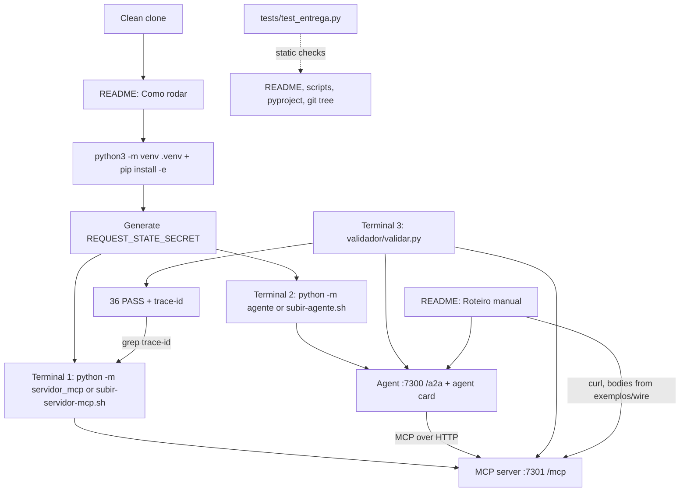
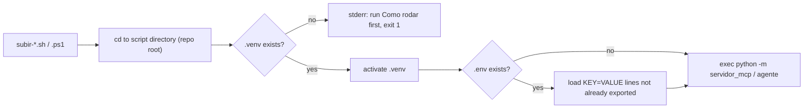

# Technical Specification: Delivery Documentation and Validation

**Complexity:** simple

## 1. Technical Overview

### What

F10 turns the working code of F01–F09 into a delivery that an evaluator can run from a clean clone, using only the README. It adds no runtime behaviour to either process. It produces these artifacts:

- A new root `README.md` in Portuguese. It replaces the starter's assignment text and has the four required sections, in this order: **Como rodar** (with a **Roteiro manual** subsection), **Onde a ponte acontece**, **Decisões técnicas** and **Saída do validador**.
- Four root helper scripts, `subir-servidor-mcp.sh`, `subir-agente.sh`, `subir-servidor-mcp.ps1` and `subir-agente.ps1`. Each one activates the repo-root `.venv`, loads the git-ignored `.env` when it exists, and starts one process in the foreground.
- A committed `.env.example` that leaves `REQUEST_STATE_SECRET=` empty and documents the defaults.
- A `.gitattributes` that pins LF line endings for `*.sh`, so scripts committed from Windows still run on Linux and macOS.
- A repo-root `tests/test_entrega.py` suite (pytest, stdlib only, no imports from either package). It guards the F10 acceptance criteria that can be checked statically.
- A recorded 36/36 validator run pasted into the README, plus a clean-clone verification of every command the README contains.

### Why

- The evaluator follows only the README (evaluator flow steps 1–2). An undocumented step, such as the editable install or the secret export, fails the delivery even when the code passes the validator.
- Earlier features left facts that only the README can carry:
  - The `requestState` is sealed with AEAD AES-256-GCM through the SDK's `RequestStateSecurity`, not with literal HMAC (F05 A2, F05 spec 3.3).
  - The SDK has an era-routing limitation on the `MCP-Protocol-Version` header (F01 progress, Stage 1).
  - The agent uses a hand-rolled MCP client (F06 decision).
  - Both packages need an editable install (F01 A6, F07 A6).
  - The two bridge anchors are `pause_task` and `send_retry` (F09 output contracts).
- The assignment requires an SDK limitation to be documented with an evidence excerpt instead of a workaround ("Restrições não negociáveis").
- `dados/`, `validador/` and `exemplos/` must stay byte-identical to the starter. No LLM SDK may appear in either `pyproject.toml`. A cheap automated guard keeps both rules from regressing silently.

### Scope

**Included — Core Scope (PRD F10):**
- The root `README.md`, replaced in Portuguese, with the four required sections. Its commands are verified from a clean clone.
- A 36/36 validator run with exit code 0, recorded in the README.
- Instructions to generate and export the secret, with no secret value anywhere. `.env` stays git-ignored. It already is: `.gitignore` line 1.

**Included — Full Scope additions (interview: Core + Full):**
- Helper scripts `subir-servidor-mcp.sh`, `subir-agente.sh` and the PowerShell equivalents `subir-servidor-mcp.ps1` and `subir-agente.ps1`.
- `.env.example` with `REQUEST_STATE_SECRET=` empty and the default ports and URLs documented.
- A "Roteiro manual" subsection that reproduces evaluator steps 7–13 with ready-to-paste `curl` commands. The request bodies are extracted from `exemplos/wire/` (interview: "Extract from wire files").

**Included — supporting artifacts (interview decisions):**
- `.gitattributes` (`*.sh text eol=lf`).
- `tests/test_entrega.py`, the repo-root static delivery checks (interview: "Root tests/ suite").

**Input contracts (PRD F10 has no Consumes block; facts consumed from implemented features):**

| Source | Fact the README must carry | Where in README |
|---|---|---|
| F01 config (`servidor_mcp/config.py`) | `MCP_PORT` (7301), `MCP_HOST` (`127.0.0.1`), `MCP_DADOS_DIR` (auto-resolved), `REQUEST_STATE_SECRET` (required) | Como rodar → env table |
| F01 A6 / F07 A6 | Editable install of both packages into one repo-root `.venv` | Como rodar → install step |
| F01 progress, Stage 1 | SDK limitation: an absent or handshake-era `MCP-Protocol-Version` header is served by the SDK legacy path (200), not rejected with `-32020` | Decisões técnicas → Limitações do SDK |
| F05 `seguranca.py`, spec A2/3.3 | `RequestStateSecurity(keys=[secret], ttl=600)`: AEAD AES-256-GCM + HKDF-SHA256 from the SDK, at least 64 hex characters (32 bytes), TTL 600 s, self-contained payload, server exits `1` without a valid secret | Decisões técnicas |
| F05 `primitives/reservar_sala.py` `_retomar` | Retry values come only from the sealed payload ("sealed values win"). The retried `arguments` are never used | Decisões técnicas |
| F06 spec, client decision | Hand-rolled `httpx` MCP client (`agente/src/agente/mcp_host/client.py`) instead of the SDK `ClientSession`. It sees the raw `input_required`, and one process-wide id counter keeps ids unique | Decisões técnicas |
| F06 V4 | On Windows, `localhost` can resolve to `::1` first. `MCP_URL=http://127.0.0.1:7301/mcp` is a valid override | Como rodar → Windows |
| F07 config (`agente/config.py`) | `AGENT_PORT` (7300), `AGENT_HOST` (`127.0.0.1`), `AGENT_PUBLIC_URL` (`http://localhost:<AGENT_PORT>`), `MCP_URL` (`http://localhost:7301/mcp`) | Como rodar → env table |
| F07 `task_store.py` | Tasks live in agent process memory and are lost on restart. The paused record sits in the Task's private attachment, which is dropped on any terminal state | Decisões técnicas |
| F09 output contracts | `agente/src/agente/skills/bridge.py`: `pause_task` (input_required → `TASK_STATE_INPUT_REQUIRED`) and `send_retry` (the stored `requestState` goes back through `McpClient.retry_tool`) | Onde a ponte acontece |
| Both `mensagens.py` | Startup banners (`central-de-salas ouvindo em http://127.0.0.1:7301/mcp`, `agente central-de-salas ouvindo em http://127.0.0.1:7300`) | Como rodar → expected output |

**Output contracts (PRD F10 has no Provides block):** F10 is the terminal feature. Its outputs are the delivery artifacts listed in Section 4 and the README contract in Section 5.

**Excluded / deferred:**
- Any change to `servidor-mcp/src` or `agente/src`. If clean-clone verification finds a defect in code, the fix belongs to the owning feature. F10 only records it.
- Any change to `dados/`, `validador/` or `exemplos/`.
- Pushing or merging to `main`. The final delivery on `main` is a user action that F10's plan names but does not perform without explicit approval.
- Containers, CI pipelines and deploy (PRD Section 7).

### Requirements (from PRD Capabilities and Experience)

| # | Requirement | PRD source |
|---|---|---|
| R1 | "Como rodar" lists: prerequisites (Python ≥ 3.10); `python3 -m venv .venv`; activation; the editable `pip install` of both packages; secret generation with `python3 -c "import secrets; print(secrets.token_hex(32))"` and its export; one start command per process, each in its own terminal; and the validator command `python3 validador/validar.py --agente http://localhost:7300 --mcp http://localhost:7301` | Capabilities 1 |
| R2 | "Como rodar" documents every environment variable and its default: `MCP_PORT=7301`, `AGENT_PORT=7300`, `MCP_URL`, `AGENT_PUBLIC_URL`, plus `MCP_HOST`, `AGENT_HOST`, `MCP_DADOS_DIR` and `REQUEST_STATE_SECRET` | Capabilities 1 |
| R3 | "Onde a ponte acontece" is one paragraph. It names the file and function, with line, where `input_required` becomes `TASK_STATE_INPUT_REQUIRED`, and the file and function, with line, where the stored `requestState` goes back to the server | Capabilities 2 |
| R4 | "Decisões técnicas" states: how `requestState` is protected (key from `REQUEST_STATE_SECRET`, at least 32 bytes), its validity (10 minutes), the policy for retried arguments, that Task state is stored in agent process memory, and any SDK limitation with an evidence excerpt | Capabilities 3 |
| R5 | "Saída do validador" holds the full output of the last run in a code block: the trace-id line, 36 `PASS` lines and `resumo: 36 passaram, 0 falharam, de 36 verificacoes` | Capabilities 4 |
| R6 | `dados/`, `validador/` and `exemplos/` are byte-identical to the upstream starter, commit `263f17e` | Capabilities 5 |
| R7 | No LLM provider SDK in any `pyproject.toml`, and every dependency is pinned with `==` | Capabilities 6; F10 AC 8 |
| R8 | The final delivery is on branch `main` of the public fork | Capabilities 7 |
| R9 | A clean clone, following "Como rodar" top to bottom, reaches: terminal 1 with the MCP server on 7301, terminal 2 with the agent on 7300, and terminal 3 with the validator printing 36 PASS. The printed trace-id can be grepped in terminal 1 | Experience 1–3 |
| R10 | Helper scripts start each process with the venv active, and with `.env` loaded when present | Full Scope 1 |
| R11 | `.env.example` contains `REQUEST_STATE_SECRET=` with an empty value and documents the defaults | Full Scope 2 |
| R12 | The "Roteiro manual" reproduces evaluator steps 7–13 with ready-to-paste `curl` commands | Full Scope 3 |

## 2. Architecture Impact

### Affected components

| Component | Path | Change |
|---|---|---|
| Delivery README | `README.md` | Replaced (starter text removed) |
| Start scripts (POSIX) | `subir-servidor-mcp.sh`, `subir-agente.sh` | New, git mode `100755` |
| Start scripts (Windows) | `subir-servidor-mcp.ps1`, `subir-agente.ps1` | New |
| Env template | `.env.example` | New |
| Line-ending policy | `.gitattributes` | New |
| Delivery checks | `tests/test_entrega.py` | New |
| Application code | `servidor-mcp/`, `agente/` | Unchanged |
| Starter assets | `dados/`, `validador/`, `exemplos/` | Unchanged (guarded) |

### Evaluator flow over the delivery



### Script start sequence



## 3. Technical Decisions

| Decision | Chosen Approach | Alternative Considered | Trade-off |
|---|---|---|---|
| Scope | Core + Full Scope additions | Core only | Interview decision. Scripts and the walkthrough cut evaluator error, at the cost of four extra files to keep in sync with the README |
| Primary start command in README | Explicit `export REQUEST_STATE_SECRET=<valor>` then `python -m servidor_mcp` / `python -m agente` in an activated venv; scripts are documented as a shortcut subsection | Scripts as the only documented path | Meets PRD Capabilities 1 literally ("generation and export", "exact command"), and the README still works if a script breaks. Two documented paths must agree |
| Secret source in scripts | Load the git-ignored `.env` when present; variables already exported win over `.env`; scripts never generate a secret | Exported env only; auto-generate into `.env` | Interview decision. The same secret survives the MCP restart in step 12. A missing or short secret surfaces the server's own exit-1 message |
| Platforms | Bash/`python3` as the main walkthrough; a compact "Windows (PowerShell)" subsection with equivalents and the `.ps1` scripts | Bash only; side-by-side for every step | Interview decision. The evaluator path (Linux/macOS) stays short and literal, and the developer's Windows host is still covered |
| Roteiro request bodies | Extract `.request.body` (and headers) from `exemplos/wire/0N-*.json` with a small `python3` filter. Live values (`taskId`, `requestState`, `inputRequests` key, message text) are substituted on the way | Inline JSON bodies; a `roteiro-manual.sh` script | Interview decision. Stays tied to the starter's contract files, at the price of a slightly denser command line |
| Seal description | State the real mechanism, AEAD AES-256-GCM via the SDK `RequestStateSecurity`, and explain that it gives the integrity HMAC would give plus confidentiality | Describe it as "HMAC" to match the PRD wording | F05 A2 already decided this. The README must be truthful, and the AC "states HMAC protection" is met by an explicit comparison with HMAC |
| Bridge anchors | GitHub-style links with line numbers (`bridge.py#L70`) plus the function names; `tests/test_entrega.py` asserts that each referenced line still starts the named function | Function names only | Satisfies "function/line" and keeps the line numbers from drifting silently |
| Delivery guard | Repo-root `tests/test_entrega.py`, stdlib + pytest, no package imports, git-dependent checks skipped when git or the starter commit is unavailable | Manual checklist only; tests inside `agente/tests` | Interview decision. It runs with `python -m pytest tests` and keeps repo-level concerns out of the packages |
| Line endings | `.gitattributes` with `*.sh text eol=lf` and `*.ps1 text eol=crlf`; `.sh` files committed with mode `100755` (`git update-index --chmod=+x`) | Rely on each developer's `core.autocrlf` | A CRLF shebang or a missing executable bit breaks `./subir-*.sh` on the evaluator's Linux/macOS clone, and Windows cannot set the bit through the filesystem |

### 3.1 Facts relied upon (from implemented features)

| Fact | Evidence |
|---|---|
| The server refuses to start without a secret of at least 64 hex characters, exits `1` and prints `REQUEST_STATE_SECRET ausente ou com menos de 32 bytes: ...` | `servidor_mcp/seguranca.py` `validar_segredo`; `mensagens.SEGREDO_INVALIDO`; `__main__.py` |
| `dados/` is resolved from the package location (first ancestor that holds `dados/` and `servidor-mcp/`), then from the cwd, unless `MCP_DADOS_DIR` is set. The editable install makes this work from any cwd | `servidor_mcp/paths.py` |
| Server banners: `central-de-salas ouvindo em http://{host}:{port}/mcp`, `salas carregadas: 5`, `reservas iniciais: 2`, `politica de uso: versao 2026-11-01` | `servidor_mcp/mensagens.py` |
| Agent banners: `agente central-de-salas ouvindo em http://{host}:{port}`, `agent card: http://{host}:{port}/.well-known/agent-card.json`, `endpoint A2A anunciado: {public_url}/a2a` | `agente/mensagens.py` |
| Entry points: `python -m servidor_mcp`, `python -m agente`, and console scripts `servidor-mcp` / `agente` | Both `pyproject.toml` `[project.scripts]`; `__main__.py` |
| The validator is stdlib-only and needs no venv. Its first line is `trace-id desta execucao: <32 hex>` and its last line is `resumo: N passaram, M falharam, de T verificacoes`. It requires freshly started processes, because reservations accumulate across runs | `validador/validar.py` lines 405–412; `validador/README.md` |
| The live input key is `reservar_sala:escolha_de_sala`. `exemplos/wire/04` and `11` show `__main__:escolha_de_sala`, so the roteiro must take the key from the live `inputRequests` | F09 spec 3.1; `servidor_mcp/estado_pedido.py` `CHAVE_ESCOLHA` |
| The wire files are wrappers `{descricao, request: {url, metodo, headers, body}, response}`, so `curl -d @file` does not work as is | `exemplos/wire/*.json` |
| `dados/`, `validador/` and `exemplos/` are unchanged since the starter commit `263f17e` | `git diff --stat 263f17e HEAD -- dados validador exemplos` is empty |
| Pins today: server `mcp==2.3.0`, `pydantic==2.13.5`, `uvicorn==0.54.0`; agent `starlette==1.7.0`, `uvicorn==0.54.0`, `httpx==0.28.1`; dev extras `pytest==9.1.1` (+ `httpx==0.28.1`); build backend `setuptools==84.0.0` | Both `pyproject.toml` |
| A paused-and-resumed Task produces four `mcp` rows in the server stderr: `tools/list`, `resources/read`, and two `tools/call` with different ids | F09 progress, Stage 2 |

### 3.2 Assumptions and Decisions

| # | Decision | Choice | Source |
|---|---|---|---|
| A1 | README language and tone | Portuguese, with section titles spelled exactly `## Como rodar`, `## Onde a ponte acontece`, `## Decisões técnicas`, `## Saída do validador` (with accents). Code identifiers stay as in the source | PRD Core Scope; starter README "6. README" |
| A2 | README top matter | Title `# A Ponte — Central de Salas`, a 3–5 line summary (two processes, ports, what the bridge does), and a link to the starter repo. The assignment text is removed, not kept below | Technical decision |
| A3 | Install command | `pip install -e ./servidor-mcp -e ./agente`. An optional line `pip install -e "./servidor-mcp[dev]" -e "./agente[dev]"` for running the tests | F01 A6, F07 A6 |
| A4 | Secret commands (bash) | Option shown first: `export REQUEST_STATE_SECRET="$(python3 -c 'import secrets; print(secrets.token_hex(32))')"` in terminal 1. Option for scripts: `python3 -c "import secrets; print('REQUEST_STATE_SECRET=' + secrets.token_hex(32))" > .env`. The README warns that the restart in step 12 needs the same value | PRD Capabilities 1; interview (secret) |
| A5 | Who needs the secret | Only the MCP server. The README says so explicitly, so the agent terminal needs no export | `agente/config.py` (no secret) |
| A6 | Start commands | Terminal 1: `source .venv/bin/activate && python -m servidor_mcp`. Terminal 2: `source .venv/bin/activate && python -m agente`. Terminal 3: `python3 validador/validar.py --agente http://localhost:7300 --mcp http://localhost:7301`. Each step shows the expected banner lines | Technical decision (`python -m` works whenever the venv is active, with no dependency on PATH for console scripts) |
| A7 | Re-run rule | The README states that both processes must be restarted before each validator run (Ctrl+C, then the same start commands), quoting `validador/README.md` | `validador/README.md` |
| A8 | Environment table | Columns: Variável, Processo, Padrão, Descrição. Rows: `REQUEST_STATE_SECRET` (servidor, obrigatório, ≥ 64 hex), `MCP_PORT` (7301), `MCP_HOST` (127.0.0.1), `MCP_DADOS_DIR` (auto), `AGENT_PORT` (7300), `AGENT_HOST` (127.0.0.1), `AGENT_PUBLIC_URL` (`http://localhost:<AGENT_PORT>`), `MCP_URL` (`http://localhost:7301/mcp`) | PRD Capabilities 1; F01/F07 config |
| A9 | Windows subsection | `py -3 -m venv .venv` (or `python`), `.\.venv\Scripts\Activate.ps1`, `$env:REQUEST_STATE_SECRET = (python -c "import secrets; print(secrets.token_hex(32))")`, `python -m servidor_mcp`, `python validador\validar.py ...`, `.\subir-servidor-mcp.ps1`. It also notes the `ExecutionPolicy` (`-ExecutionPolicy Bypass -File`) and the `MCP_URL=http://127.0.0.1:7301/mcp` override | Interview (platforms); F06 V4 |
| A10 | Script contract (`.sh`) | `#!/usr/bin/env bash`, `set -euo pipefail`, `cd` to the script's own directory, fail with a Portuguese message and exit `1` when `.venv/bin/activate` is missing, source it, load `.env` (A11), then `exec python -m <pkg>`. No arguments; all configuration comes from the env | Interview (scope, secret) |
| A11 | `.env` loading rules | Lines `KEY=VALUE`. Blank lines and lines starting with `#` are skipped. Surrounding whitespace is trimmed and one pair of matching quotes is stripped from the value. A key already present in the environment is **not** overwritten. No shell evaluation of values, so the file is parsed and never `source`d. The same rules apply in `.sh` and `.ps1` | Interview (secret: exported env wins) |
| A12 | Script contract (`.ps1`) | Same steps with `$PSScriptRoot`, `.venv\Scripts\Activate.ps1`, `$ErrorActionPreference = 'Stop'`, and exit `1` with a message when the venv is missing. Windows PowerShell 5.1 compatible: no `??` and no `&&` | A10; Windows PS 5.1 floor |
| A13 | `.env.example` content | A comment header (copy to `.env`, never commit `.env`, how to generate), `REQUEST_STATE_SECRET=` (empty), then the defaults commented out: `# MCP_PORT=7301`, `# MCP_HOST=127.0.0.1`, `# AGENT_PORT=7300`, `# AGENT_HOST=127.0.0.1`, `# AGENT_PUBLIC_URL=http://localhost:7300`, `# MCP_URL=http://localhost:7301/mcp`. Defaults stay commented so that copying the file never pins a value by accident | PRD Full Scope 2 |
| A14 | Empty secret in `.env` | `REQUEST_STATE_SECRET=` copied as is sets an empty value, and the server exits `1` with its own message. The README tells the user to fill it in. No special handling in the scripts | Technical decision |
| A15 | Roteiro helper | One bash function defined at the top of the subsection, `corpo ARQUIVO [chave=valor ...]`, built on `python3 -c`. It prints `request.body` of `exemplos/wire/ARQUIVO` as compact JSON, with dotted-path overrides (`params.message.taskId=...`, `params.requestState=...`, `params.message.parts.0.text=...`). It also handles one rename: `params.inputResponses` takes the key captured from the live `inputRequests`. A second function, `campo JSON caminho`, reads one value from a response. MCP headers (`MCP-Protocol-Version`, `Mcp-Method`, `Mcp-Name`) are written explicitly in each `curl` | Interview (Extract from wire files) |
| A16 | Roteiro precondition and expected values | Run it right after fresh starts and **before** the validator, or restart both processes first. Expected values follow the cumulative state: step 7 → `alternativas: sala-fusca, sala-mirante`; step 8 books `sala-mirante` 14:00–15:00; step 9's repeat pauses with `alternativas: sala-fusca` (mirante is now taken) and ends `TASK_STATE_CANCELED`; step 10 → `Sala inexistente: sala-inexistente`; step 11 → `-32602`; step 12 completes in `sala-fusca`; step 13 → HTTP `400` + `-32021`. Each step prints only what must be checked (state, status text, error code) | Evaluator flow steps 7–13; F09 3.1 |
| A17 | Tamper in step 11 | Replace the last character of the live `requestState` with a different base64url character (`A`↔`B`), as the evaluator does ("trocar um caractere") | Evaluator step 11 |
| A18 | Restart in step 12 | Ctrl+C in terminal 1 and the same start command again, with the same secret (exported in that terminal or in `.env`). The retry uses the `requestState` captured before the restart | Evaluator step 12 |
| A19 | Retried arguments policy text | "Valores selados vencem": on a retry the server rebuilds the booking from the sealed payload (`sala` original, `inicio`, `fim`, `responsavel`, `alternativas`, `chave`) and ignores the `arguments`. Verification V3 confirms whether the SDK envelope also rejects edited arguments with `-32602`, and the README states the observed behaviour | PRD Capabilities 3; `_retomar` docstring |
| A20 | SDK limitations documented | (1) Era routing on `MCP-Protocol-Version`, with an excerpt from the installed `mcp` package's `streamable_http_manager.py` (file path + 3–10 quoted lines) and the observed behaviour. (2) Anything new found during clean-clone verification, in the same format. The SDK's automatic stamping of `resultType` and serverInfo `_meta` is described as behaviour, not as a limitation | F01 progress; starter "Restrições não negociáveis" |
| A21 | Other technical decisions listed | Hand-rolled MCP client and why (the SDK elicitation callback would answer by itself); one process-wide JSON-RPC id counter; `traceparent` propagation (inherited trace-id, fresh span-id); rule-based parser, no LLM; two processes over HTTP, and the agent never imports `servidor_mcp` | F06/F08 specs; PRD Objective "Keep" |
| A22 | Validator output provenance | One sentence above the code block names the date, OS and Python version of the run, and states that both processes were freshly started. The code block is pasted verbatim, with no trimming | PRD Capabilities 4 |
| A23 | Starter commit constant | `tests/test_entrega.py` compares against `263f17e202fd861d14aa7a5e6a539d13a62857c3`. The test is skipped, not failed, when `git` is missing or the commit is absent (shallow clone) | Technical decision |
| A24 | Secret scan scope | Tracked files from `git ls-files`, excluding `dados/`, `validador/` and `exemplos/`. Fail on any 64+ hex run, or on `REQUEST_STATE_SECRET=` followed by a non-empty value outside a code example that uses `$(`, `<...>` or a generator command | F05 AC 13; F10 AC 6 |
| A25 | LLM SDK deny-list | `openai`, `anthropic`, `google-genai`, `google-generativeai`, `langchain` (prefix), `llama-index`/`llama_index`, `mistralai`, `cohere`, `ollama`, `litellm`, `groq`, `transformers`. Checked against every requirement name in both `pyproject.toml` (`dependencies`, optional dependencies, `build-system.requires`) | PRD Capabilities 6 |
| A26 | Pin rule | Every requirement string in both `pyproject.toml` (including dev extras and `build-system.requires`) must match `<name>[extras]==<version>` | F10 AC 8 |
| A27 | TOML parsing in tests | `tomllib` when Python ≥ 3.11. On 3.10, a minimal regex extraction of the quoted strings inside `dependencies = [...]`, `dev = [...]` and `requires = [...]`. No new dependency | Python ≥ 3.10 floor; no `tomli` pinned |
| A28 | Clean-clone verification | Clone the branch into an empty temp directory, follow only "Como rodar" (bash path on Linux/macOS or WSL when available; PowerShell path on Windows), run the validator 3 times with both processes restarted before each run, and run the Roteiro once. If no Python 3.10 interpreter is available, the README states which Python version was verified, and the gap is recorded in progress (V1) | PRD Success Metrics "Pass", "Guarantee" |
| A29 | Final delivery | Merging the feature branch into `main` of the fork goes through a PR, opened only with the user's explicit approval. F10 commits never push on their own | PRD Capabilities 7; session rules |

### 3.3 Verifications for implementation

| # | Verify | Where | If false |
|---|---|---|---|
| V1 | `pip install -e ./servidor-mcp -e ./agente` succeeds on Python 3.10 (`setuptools==84.0.0` and `mcp==2.3.0` support 3.10) | Clean venv with a 3.10 interpreter | Record the evidence and report it to the user. Changing a pin is the owning feature's decision, not F10's |
| V2 | `python -m servidor_mcp` and `python -m agente` work from the repo root after the editable install (no shadowing by the `servidor-mcp/` and `agente/` folders) | Clean clone | Fall back to the console scripts `servidor-mcp` / `agente` in the README |
| V3 | A retry with edited `arguments` and a valid `requestState` is either rejected with `-32602` or books with the sealed values | Manual `curl` (or F05 integration test evidence) | Only the README wording of A19 changes |
| V4 | The exact excerpt and path of the era-routing code in the installed `mcp==2.3.0` | `.venv/.../mcp/server/streamable_http_manager.py` | Quote whatever file holds the routing; keep the behavioural description |
| V5 | `.sh` scripts run on Linux/macOS from a clone made on another machine (LF endings, executable bit) | `git ls-files -s`, `file`, a run under bash (WSL or Git Bash at minimum) | Fix `.gitattributes` / `git update-index --chmod=+x` |
| V6 | The `corpo` helper works with the `python3` that the bash path provides (inside or outside the venv) | Roteiro run | Adjust the helper, never the wire files |

### 3.4 PRD traceability

| PRD block | Spec destination |
|---|---|
| F10 Core Scope | Section 1 Scope → Included (Core) |
| F10 Full Scope additions | Section 1 Scope → Included (Full); A10–A18 |
| F10 Capabilities | Section 1 R1–R8; Section 5 |
| F10 Experience | R9; Section 2 flow; A28 |
| F10 Error Handling | Not present in the PRD. Script failure modes in Section 5.3 |
| Section 9 F10 acceptance criteria | Section 7 acceptance traceability |
| Section 9 Cross-Feature Integration | No criterion names F10. Covered indirectly by the 36/36 validator run (Section 7, manual) |

## 4. Component Overview

**Delivery artifacts:**

| File Path | New/Modified | Purpose | Key Responsibilities |
|---|---|---|---|
| `README.md` | Modified (replaced) | Delivery documentation | Four required sections; Roteiro manual; env table; SDK limitations with evidence; verbatim validator output |
| `subir-servidor-mcp.sh` | New (mode 100755) | Start the MCP server on Linux/macOS | Activate `.venv`, load `.env` without overriding exported vars, `exec python -m servidor_mcp` |
| `subir-agente.sh` | New (mode 100755) | Start the agent on Linux/macOS | Same as above, `exec python -m agente` |
| `subir-servidor-mcp.ps1` | New | Start the MCP server on Windows | PowerShell 5.1-compatible equivalent of the `.sh` script |
| `subir-agente.ps1` | New | Start the agent on Windows | PowerShell 5.1-compatible equivalent |
| `.env.example` | New | Env template | Empty `REQUEST_STATE_SECRET=`, commented defaults, generation hint |
| `.gitattributes` | New | Line-ending policy | `*.sh` LF, `*.ps1` CRLF |
| `.gitignore` | Unchanged | — | Already ignores `.env` and `.venv/`. `.env.example` is not matched |

**Tests:**

| File Path | New/Modified | Purpose | Key Responsibilities |
|---|---|---|---|
| `tests/test_entrega.py` | New | Static delivery guard | README sections and validator summary, bridge anchors, secret scan, pins and LLM deny-list, starter dirs unchanged, script presence/mode/endings, `.env` ignored |

No file under `servidor-mcp/`, `agente/`, `dados/`, `validador/` or `exemplos/` changes.

## 5. Delivery Contracts

F10 exposes no HTTP endpoint. The contracts are the README structure and the scripts' command-line behaviour.

### 5.1 README outline

| Heading | Required content |
|---|---|
| `# A Ponte — Central de Salas` | Summary (A2), link to the starter repo |
| `## Como rodar` | Prerequisites (Python ≥ 3.10, git, curl); numbered steps: clone → venv → activate → install (A3) → secret (A4, A5) → terminal 1 (MCP) → terminal 2 (agent) → terminal 3 (validator) with expected output; re-run rule (A7); env table (A8) |
| `### Atalho: scripts de subida` | `cp .env.example .env`, fill in the secret (or generate it with A4's second command), `./subir-servidor-mcp.sh`, `./subir-agente.sh`; the precedence rule (exported env wins) |
| `### Windows (PowerShell)` | A9 |
| `### Testes automatizados` (optional) | `pip install -e "./servidor-mcp[dev]" -e "./agente[dev]"`, then `python -m pytest servidor-mcp`, `python -m pytest agente`, `python -m pytest tests` |
| `### Roteiro manual` | Helper definitions (A15), then one block per evaluator step 7–13 with what to check (A16–A18) |
| `## Onde a ponte acontece` | One paragraph (see 5.2) |
| `## Decisões técnicas` | Bullets: proteção do `requestState`; validade; estado autocontido / sobrevive a restart; valores selados vencem (A19); estado das Tasks em memória; cliente MCP próprio (A21); ids e `traceparent`; determinismo; `### Limitações do SDK` with evidence (A20) |
| `## Saída do validador` | Provenance sentence (A22) and a fenced `text` block with the full output |

### 5.2 "Onde a ponte acontece" paragraph contract

The paragraph must contain, in prose:
- A link to `agente/src/agente/skills/bridge.py` with an `#L<n>` anchor, where line `n` starts `def pause_task`. It explains that `reservar_sala`'s handler (`agente/src/agente/skills/reservar_sala.py`) receives `InputRequired` from `McpClient.call_tool` and hands it to `pause_for_choice` → `pause_task`. That function stores the `PausedRecord` (with the `requestState`) in the Task's private attachment and moves the Task to `TASK_STATE_INPUT_REQUIRED` with `alternativas: ...`.
- A link to the same file with an `#L<m>` anchor, where line `m` starts `async def send_retry`. It explains that the continuation handler calls `send_retry`, which goes to `McpClient.retry_tool` (`agente/src/agente/mcp_host/client.py`). That method repeats the `tools/call` with a new JSON-RPC id, `inputResponses` under the received key, and the stored `requestState` unchanged.

Expected rendering (line numbers taken from the code at write time):

```markdown
O `input_required` do MCP vira `TASK_STATE_INPUT_REQUIRED` em
[`pause_task`](agente/src/agente/skills/bridge.py#L70) ... e o `requestState` guardado volta
para o servidor em [`send_retry`](agente/src/agente/skills/bridge.py#L80) ...
```

### 5.3 Script behaviour

| Situation | `.sh` / `.ps1` behaviour | Exit code |
|---|---|---|
| `.venv` missing | stderr: `Ambiente virtual .venv nao encontrado. Siga "Como rodar" no README.` | `1` |
| `.env` missing | Continue with the current environment | — |
| `.env` present, key already exported | Keep the exported value | — |
| `.env` present, key not exported | Export the `.env` value for the child process | — |
| Secret missing, empty or short | The server prints `REQUEST_STATE_SECRET ausente ou com menos de 32 bytes: ...` | `1` (server's) |
| Port in use / data load failure | The server's or agent's own message is passed through | `1` (process's) |
| Normal start | Foreground process; banners on stderr; Ctrl+C stops it | Process's |

### 5.4 `.env.example`

```dotenv
# Copie para .env (nunca versione o .env) e preencha o segredo:
#   python3 -c "import secrets; print(secrets.token_hex(32))"
# Variaveis ja exportadas no terminal tem precedencia sobre este arquivo.
REQUEST_STATE_SECRET=

# Padroes (descomente para alterar)
# MCP_HOST=127.0.0.1
# MCP_PORT=7301
# AGENT_HOST=127.0.0.1
# AGENT_PORT=7300
# AGENT_PUBLIC_URL=http://localhost:7300
# MCP_URL=http://localhost:7301/mcp
```

### 5.5 Roteiro manual — per-step contract

| Step | Wire source (`request.body`) | Overrides | What the command prints / evaluator checks |
|---|---|---|---|
| 7 | `08-a2a-send-message.json` | — | `TASK_STATE_INPUT_REQUIRED`, status text `alternativas: sala-fusca, sala-mirante`; `TASK` variable captured |
| 8 | `10-a2a-send-message-continuacao.json`, then `GetTask` | `params.message.taskId=$TASK` | `TASK_STATE_COMPLETED`; artifact `reserva` with `sala-mirante` and `politica` |
| 9 | `08` then `10` | step 7 again; then `taskId`, text `escolha=recusar` | Pause line (now `alternativas: sala-fusca`), then `TASK_STATE_CANCELED` |
| 10 | `08` | text with `sala=sala-inexistente` | `TASK_STATE_FAILED`, `Sala inexistente: sala-inexistente` in `history` |
| 11 | `03-tools-call-conflito-input-required.json` → `04-tools-call-retry.json` | retry: `requestState` with one character swapped, `inputResponses` key from live `inputRequests` | JSON-RPC error `-32602` |
| 12 | `03` → (restart MCP) → `04` | `requestState` intact, live key, accept `sala-fusca` | `resultType: complete`, `reservado: true` |
| 13 | `06-erro-32021-sem-elicitation.json` | — | HTTP `400`, error `-32021`, `data.requiredCapabilities` |

## 6. Data Model

Not applicable. F10 adds no data structures. The only stored state touched is `.env`, which is git-ignored, user-created and parsed per A11.

## 7. Testing Strategy

**Test File Structure** (run with `python -m pytest tests` from the repo root. Only `pytest` is needed, from either package's `dev` extra):

| Test File | Test Type | Target | Coverage Goal |
|---|---|---|---|
| `tests/test_entrega.py` | Static (filesystem + `git` subprocess) | Delivery artifacts | Every statically checkable F10 acceptance criterion |
| Manual: clean-clone run (A28) | End-to-end | README "Como rodar", scripts, validator ×3, Roteiro | F10 AC 2, 3; Success Metrics "Pass" and "Guarantee" |

**`tests/test_entrega.py`:**

| Test Function | Description | Assertions |
|---|---|---|
| `test_readme_has_required_sections` | Parse `## ` headings | `Como rodar`, `Onde a ponte acontece`, `Decisões técnicas`, `Saída do validador` present, in this order |
| `test_readme_does_not_keep_starter_text` | Starter-only markers | No `## Critérios de Aceite` or `## Fluxo do avaliador` heading from the assignment |
| `test_como_rodar_has_required_commands` | Substrings in the section | `python3 -m venv .venv`, `pip install -e ./servidor-mcp`, `-e ./agente`, `secrets.token_hex(32)`, `REQUEST_STATE_SECRET`, `python -m servidor_mcp`, `python -m agente`, the exact validator command |
| `test_como_rodar_documents_env_vars` | Env table | `MCP_PORT`, `7301`, `AGENT_PORT`, `7300`, `MCP_URL`, `AGENT_PUBLIC_URL` present |
| `test_bridge_anchors_point_at_named_functions` | Extract `bridge.py#L<n>` links from "Onde a ponte acontece" | Exactly two anchors; the lines start `def pause_task` and `async def send_retry` |
| `test_decisoes_tecnicas_states_required_facts` | Substrings in the section | `REQUEST_STATE_SECRET`, `AES-256-GCM`, `HMAC`, `10 minutos`, `memória`, `Limitações do SDK` |
| `test_validator_output_is_a_full_passing_run` | Fenced block under "Saída do validador" | `trace-id desta execucao: [0-9a-f]{32}`; `PASS 01`…`PASS 36` each exactly once; no `FAIL`; `resumo: 36 passaram, 0 falharam, de 36 verificacoes` |
| `test_no_secret_in_tracked_files` | A24 scan | No 64+ hex run; no non-empty literal `REQUEST_STATE_SECRET=` value |
| `test_env_is_gitignored_and_example_is_tracked` | `git check-ignore .env`, `git ls-files .env.example` | `.env` ignored, `.env.example` tracked, `.env` not tracked |
| `test_env_example_secret_is_empty` | Parse `.env.example` | `REQUEST_STATE_SECRET` line present with an empty value; defaults only in comments |
| `test_dependencies_are_pinned` | A26 over both `pyproject.toml` | Every requirement uses `==` |
| `test_no_llm_provider_sdk` | A25 deny-list | No denied name in any requirement |
| `test_starter_dirs_unchanged` | `git diff --quiet 263f17e -- dados validador exemplos` and `git status --porcelain -- dados validador exemplos` | Exit 0 and empty output; skipped when git or the commit is unavailable (A23) |
| `test_scripts_exist_with_lf_and_exec_bit` | Read bytes; `git ls-files -s` | Four scripts present; `.sh` files have no `\r`, start with `#!/usr/bin/env bash`, mode `100755` |
| `test_scripts_do_not_generate_or_embed_secrets` | Script text | No `token_hex`, no 64-hex literal, no write to `.env` |

**Acceptance traceability (PRD Section 9, F10):**

| Acceptance criterion | Covered by |
|---|---|
| README contains the four sections | `test_readme_has_required_sections` |
| Following only "Como rodar" in a fresh clone on Python ≥ 3.10 starts both processes | Manual clean-clone run (A28, V1, V2); `test_como_rodar_has_required_commands` |
| Validator prints 36 PASS and exits `0` against fresh processes | Manual clean-clone run ×3; `test_validator_output_is_a_full_passing_run` |
| "Onde a ponte acontece" names file and function for both directions | `test_bridge_anchors_point_at_named_functions` |
| "Decisões técnicas" states HMAC protection, 10-minute validity, in-memory Task storage | `test_decisoes_tecnicas_states_required_facts` (AEAD stated as the mechanism, with an explicit comparison to HMAC) |
| README explains generating/exporting the secret and contains no secret value | `test_como_rodar_has_required_commands`, `test_no_secret_in_tracked_files` |
| `git diff` vs the starter shows no change in `dados/`, `validador/`, `exemplos/` | `test_starter_dirs_unchanged` |
| No LLM provider SDK; all dependencies pinned with `==` | `test_no_llm_provider_sdk`, `test_dependencies_are_pinned` |

**Integration (Cross-Feature):** no Section 9 Cross-Feature criterion names F10. The clean-clone validator runs re-verify F01–F09 end to end (checks 1–36). The Roteiro run re-verifies evaluator steps 7–13, including the MCP restart (step 12) and the trace-id grep (step 5), which the validator cannot cover.

**Regression:** after F10, `python -m pytest servidor-mcp`, `python -m pytest agente` and `python -m pytest tests` all pass. F10 changes no package code, so the first two must give the same results as at the end of F09.
