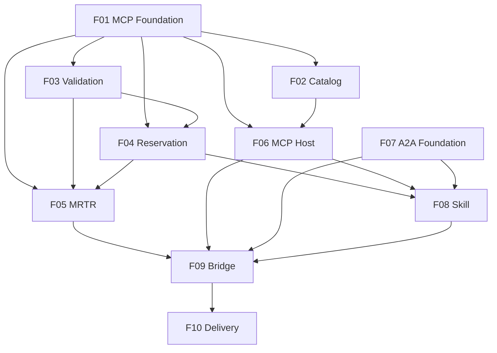

# A Ponte — Central de Salas: an A2A Agent with MCP Inside

## 1. Executive Summary

A Ponte ("The Bridge") turns Hill Valley Tech's five meeting rooms into an agent capability. It is delivered as two independent processes: a **Model Context Protocol (MCP) server** (`servidor-mcp/`, port 7301) that exposes the room domain as tools and a resource, and an **agent** (`agente/`, port 7300) that consumes that server as an MCP host on the inside and offers a `reservar-sala` skill to the rest of the company as an **A2A v1.0 server** on the outside. Any assistant in the company can discover the agent through its Agent Card and book a room without touching the shared spreadsheet.

The product is built for two audiences at once: the company's other agents and assistants, which need a deterministic, discoverable booking capability, and the MBA course evaluator, who verifies protocol conformance with an automated 36-check validator plus a manual 13-step flow. The core value is not the booking domain — which is deliberately trivial (5 rooms, 3 policy rules, in-memory reservations) — but the correct stitching of two sessionless protocols: MCP's Multi Round-Trip Requests (MRTR) with a sealed `requestState`, and A2A's Task with identity, state and product.

At a high level: an A2A client sends `SendMessage` with a fixed-format request (`reservar sala=<id> inicio=<iso8601> fim=<iso8601> responsavel=<nome>`). The agent opens a Task, discovers the MCP tools, reads the usage policy, and calls `reservar_sala` over Streamable HTTP. If the room is free, the Task completes with a `reserva` artifact. If it is taken, the MCP server answers `input_required` with a form elicitation listing up to three alternatives and an HMAC-sealed `requestState`; the agent pauses the Task in `TASK_STATE_INPUT_REQUIRED`, stores the `requestState` bound to that Task, and — when the client answers `escolha=<id>` or `escolha=recusar` — repeats the original `tools/call` with a new JSON-RPC id, the `inputResponses` and the untouched `requestState`. No LLM is involved anywhere: the same request always yields the same result.

## 2. Problem and Opportunity

### The Problem

**Room booking is locked in a spreadsheet nobody respects**
- 5 meeting rooms are managed through a single shared spreadsheet, with no enforcement of the 3 usage rules (08:00–20:00 window, 2-hour maximum, no overlaps)
- Company assistants cannot book rooms programmatically; every booking requires a human to open the sheet
- Overlapping bookings are only discovered when two groups show up at the same door

**Both protocols are sessionless, and the naive design breaks**
- MCP (spec revision `2026-07-28`) on stateless Streamable HTTP has no back-channel: a server that tries to call the client mid-tool receives a "no back-channel for server-initiated requests" error on the first attempt
- An MCP client configured with an SDK elicitation callback answers the question by itself, so the A2A Task never pauses and half of the required flow (pause → client decision → resume) disappears
- Reusing the JSON-RPC id on the retry works in many SDKs but violates the spec and fails the evaluator's log inspection

**State that travels through the client is attacker-controlled**
- `requestState` is returned to the client and echoed back on retry; an unsigned base64 JSON lets a client book any room, time or responsible person by editing it
- A server that keeps the pending state in memory loses every paused booking on restart, while the contract requires a retry to succeed after a restart
- Leaking `requestState` to A2A clients exposes internal protocol state across a boundary that must stay opaque

**Agent-to-agent consumers need a stable, discoverable, deterministic contract**
- Other agents must discover the capability at a well-known URI (`/.well-known/agent-card.json`) in the exact A2A v1.0 shape (`supportedInterfaces[]`, `protocolBinding`, `protocolVersion`)
- The evaluator compares two identical pauses byte for byte; any non-determinism (LLM, random ordering, greetings) fails the check
- Without `traceparent` propagation, a failed booking cannot be correlated from the A2A caller down to the MCP server log

**Evaluation is automated and unforgiving**
- 36 validator checks, each with exact error codes (`-32602`, `-32021`, `-32004`-class A2A errors), exact HTTP statuses (`400`) and exact Portuguese error messages
- The delivery must work from a clean clone following only the README; any undocumented step fails the evaluator flow
- Altering `dados/`, `validador/` or `exemplos/` invalidates the delivery

### The Opportunity

- **Spreadsheet → MCP server as the single source of room truth:** the three tools (`listar_salas`, `consultar_disponibilidade`, `reservar_sala`) and the `politica://uso` resource enforce the 3 policy rules and the alternatives rule in exactly one place, the MCP server (F01–F05).
- **Sessionless protocols → explicitly named state on both sides:** MRTR's `input_required` + `requestState` on the MCP side and the A2A Task in `TASK_STATE_INPUT_REQUIRED` on the outside are stitched by the agent, which sees the raw `input_required`, pauses the Task, and resumes with a fresh JSON-RPC id (F05, F06, F09).
- **Attacker-controlled state → sealed, self-contained, expiring `requestState`:** HMAC integrity with a key from `REQUEST_STATE_SECRET` (≥ 32 bytes), a 10-minute expiry, and every field needed to rebuild the request sealed inside, so tampering is rejected with `-32602` and a restart changes nothing (F05).
- **Discovery and determinism → rule-based A2A agent with a v1.0 Agent Card:** a fixed-format parser instead of an LLM, a well-known card, exact `alternativas:` lines, and trace-id propagation into every MCP `_meta` (F06, F07, F08, F09).
- **Strict evaluation → validator-driven delivery:** a README with the four required sections, reproducible commands from a clean clone using `pip` + `venv` with pinned versions, and a recorded 36/36 validator run (F10).

## 3. Target Audience

### Primary Users

**Course Evaluator**
- Clones the fork into an empty folder, follows only the delivery README, and starts both processes in two terminals with the MCP server's stderr visible
- Runs `python3 validador/validar.py --agente http://localhost:7300 --mcp http://localhost:7301` and expects 36 PASS and exit code 0
- Performs 13 manual steps with `curl`: inspects the Agent Card, pauses and resumes Tasks, tampers with a `requestState`, restarts the MCP server mid-flow, and greps stderr for the trace-id and the pair of `tools/call` ids

**A2A Client Agent (Hill Valley Tech assistants)**
- Discovers the agent through `GET /.well-known/agent-card.json` and selects the `reservar-sala` skill
- Sends `SendMessage` in the fixed format and must handle `TASK_STATE_INPUT_REQUIRED` by replying `escolha=<id>` or `escolha=recusar` on the same `taskId`
- Polls with `GetTask` and reads the `reserva` artifact as JSON; propagates a W3C `traceparent` header for end-to-end correlation

**Direct MCP Client / Integrator**
- Talks to `http://localhost:7301/mcp` directly (validator checks 1–20, MCP Inspector, scripted `curl` with the bodies in `exemplos/wire/`)
- Declares (or deliberately omits) `io.modelcontextprotocol/clientCapabilities` and expects per-request capability negotiation, never inferred from earlier requests
- Completes the MRTR cycle by hand: reads `inputRequests`, answers with the same key in `inputResponses`, echoes `requestState`, and uses a new JSON-RPC id

### Behavioral Profile

- All users are machines or technical people driving machines through raw JSON-RPC over HTTP; nobody uses a graphical interface
- They compare outputs literally: exact strings, exact codes, exact ordering — "close enough" is a failure
- They assume no session: every request carries its own protocol version, capabilities and trace context
- They treat everything that comes back through the client (`requestState`, retried arguments) as untrusted input

## 4. Objectives

### Product Objectives

1. **Pass** the starter's conformance validator end to end against freshly started processes.
2. **Bridge** MCP's `input_required` into A2A's `TASK_STATE_INPUT_REQUIRED` and back, with a distinct JSON-RPC id on every retry and per-Task isolation of paused state.
3. **Seal** the `requestState` so that tampering is always detected, expiry is enforced, and a valid state survives a server restart.
4. **Keep** the agent deterministic, opaque and traceable: rule-based parsing, no domain logic, no `requestState` leakage, and `traceparent` propagated into every MCP request.
5. **Guarantee** reproducibility from a clean clone using only the delivery README.

### Success Metrics

| Objective | Metric | Measurement condition |
|---|---|---|
| Pass | 36/36 checks PASS and process exit code `0` | 3 consecutive runs, each with both processes restarted immediately before the run |
| Bridge | 100% of conflicting `SendMessage` requests end in `TASK_STATE_INPUT_REQUIRED` with the exact `alternativas:` line; 100% of `(initial, retry)` `tools/call` pairs in the MCP stderr have different ids | Evaluator steps 6–9 plus validator checks 27–33 |
| Bridge | 2 Tasks paused concurrently each complete with their own reservation (different `reserva` ids and `inicio`) | Validator check 33 |
| Seal | 100% of tampered states rejected with `-32602` | 10 mutations at different character positions of a real `requestState` (start, middle, end) plus validator check 17 |
| Seal | A retry with a valid `requestState` completes after the MCP server process is restarted; the same state is rejected once older than 10 minutes | Evaluator step 12; manual expiry test with a state issued > 600 s earlier |
| Keep | 0 A2A responses (card, status messages, history, artifacts, errors) contain any 40-character substring of a `requestState` | Validator check 34 |
| Keep | 2 identical requests produce byte-identical pause messages; 0 LLM provider packages in any `pyproject.toml` | Validator check 36; dependency review |
| Keep | 100% of MCP requests triggered by an A2A request carrying `traceparent` log the same trace-id in MCP stderr, and every Task's first MCP request is a `tools/list` | Grep of the validator-printed trace-id in MCP stderr (evaluator step 5) |
| Guarantee | Evaluator reaches a 36/36 validator run following only the README, in ≤ 10 minutes, on Linux/macOS with Python ≥ 3.10 | Fresh clone in an empty directory, no prior virtualenv |

## 5. User Stories

### F01. MCP Server Foundation
- As a direct MCP client, I want a single Streamable HTTP endpoint at `http://localhost:7301/mcp` so that every MCP operation goes to one URL
- As a direct MCP client, I want each request to be self-contained (no `initialize`, no session id) so that I can send any method at any time
- As a direct MCP client, I want a request missing `io.modelcontextprotocol/protocolVersion` or `io.modelcontextprotocol/clientCapabilities` in `_meta` to be rejected with `-32602` and HTTP `400` so that the server never guesses my protocol state
- As a direct MCP client, I want a request whose `MCP-Protocol-Version`, `Mcp-Method` or `Mcp-Name` header disagrees with the body to be rejected with `-32020` so that proxies and the body cannot diverge
- As the evaluator, I want every request logged to stderr with method, id and `traceparent` so that I can follow a booking from the A2A caller to the MCP server
- As the system, I want to load rooms, seeded reservations and the policy from `dados/` at startup so that every tool works from the same in-memory domain

### F02. Room Catalog and Policy Resource
- As a direct MCP client, I want to call `listar_salas` without arguments so that I receive the 5 rooms with id, name, capacity and resources
- As a direct MCP client, I want `listar_salas` to return both `structuredContent` (matching its `outputSchema`) and the same JSON as a text block so that both modern and legacy clients can read it
- As the agent, I want to read `politica://uso` as `text/markdown` so that I can extract the policy version from its first line
- As a direct MCP client, I want reading an unknown resource URI to fail with `-32602` so that I never receive an empty `contents` array

### F03. Availability and Policy Validation
- As a direct MCP client, I want to ask `consultar_disponibilidade` whether a room is free in an interval so that I can see conflicting reservations before booking
- As a direct MCP client, I want an unknown room to return `Sala inexistente: <id>` so that I know the id is wrong
- As a direct MCP client, I want intervals outside 08:00–20:00 (-03:00), longer than 2 hours, or inverted to return the exact policy messages so that I can correct the request
- As the system, I want availability and booking to share one validation routine so that both tools always return the same errors for the same input

### F04. Room Reservation
- As a direct MCP client, I want `reservar_sala` to create a reservation when the interval is free and within policy so that the room is mine
- As a direct MCP client, I want the result to include `reserva`, `reservado`, `sala`, `inicio`, `fim`, `responsavel` and `politica` so that I have a complete receipt
- As a direct MCP client, I want reservations created during the run to be visible to later availability checks and bookings so that the same slot is never booked twice in the same process

### F05. MRTR Conflict Resolution
- As a direct MCP client, I want a booking that conflicts to return `resultType: input_required` with one form elicitation listing the alternatives so that I can choose another room
- As a direct MCP client, I want the alternatives to be the free rooms with equal or greater capacity, at most 3, sorted by capacity then id, so that the offer is predictable
- As a direct MCP client, I want to retry with a new JSON-RPC id, the same `inputResponses` key and the untouched `requestState` so that the server completes the booking in the room I picked
- As a direct MCP client, I want to decline the elicitation and receive a normal `complete` result with `reservado: false` so that declining is not treated as an error
- As a direct MCP client that did not declare form elicitation, I want a conflicting booking to fail with `-32021`, `data.requiredCapabilities` and HTTP `400` so that I know which capability is missing
- As the system, I want to reject a tampered or expired `requestState` with `-32602` so that attacker-controlled state never takes effect
- As the system, I want the `requestState` to carry everything needed to rebuild the request so that a retry still works after a restart
- As the system, I want a conflict with zero alternatives to return `Sem alternativas disponiveis no intervalo` without any elicitation

### F06. Agent MCP Host Client
- As the agent, I want to call `tools/list` at the start of every Task so that I discover tools at runtime instead of hardcoding them
- As the agent, I want to read `politica://uso` at the start of every Task and extract the version from `versao: <value>` so that the artifact carries the current policy version
- As the agent, I want every MCP request to carry the mandatory `_meta` fields, `{"elicitation": {"form": {}}}` capabilities and the mirrored headers so that the stateless server accepts it
- As the agent, I want to propagate the caller's trace-id into the `traceparent` of every MCP request of a Task so that the evaluator can find it in the MCP stderr
- As the agent, I want to receive the raw `input_required` result instead of having an SDK callback answer it so that the A2A Task can pause and ask the real client

### F07. A2A Server Foundation
- As an A2A client agent, I want to fetch `GET /.well-known/agent-card.json` and find a v1.0 card with a JSON-RPC interface and the `reservar-sala` skill so that I can discover and call the agent
- As an A2A client agent, I want `SendMessage` without `taskId` to open a new Task with its own `id` and `contextId` so that each request is tracked independently
- As an A2A client agent, I want `GetTask` to return the Task's id, contextId, current state, history and artifacts at any time so that I can poll the outcome
- As an A2A client agent, I want a `SendMessage` to a Task in a terminal state to be refused with an error so that finished Tasks never restart
- As an A2A client agent, I want an unknown `taskId` to be refused with `TaskNotFoundError` so that I know the reference is wrong

### F08. Reservation Skill Execution
- As an A2A client agent, I want to send `reservar sala=<id> inicio=<iso8601> fim=<iso8601> responsavel=<nome>` and get a `TASK_STATE_COMPLETED` Task with a `reserva` artifact when the room is free
- As an A2A client agent, I want the artifact to contain the reservation JSON including `politica` with the version read from the resource so that I know which policy governed the booking
- As an A2A client agent, I want a tool execution error (e.g., unknown room) to end the Task in `TASK_STATE_FAILED` with the tool's exact message in the history so that I can show the reason
- As an A2A client agent, I want a request that does not follow the fixed format to end in `TASK_STATE_FAILED` with a usage message so that I can fix my request

### F09. The Bridge: Pause and Resume
- As an A2A client agent, I want a conflicting request to leave the Task in `TASK_STATE_INPUT_REQUIRED` with exactly `alternativas: <id>, <id>` so that I can choose a room
- As an A2A client agent, I want to reply `escolha=<id>` on the same `taskId` so that the agent completes the booking in the chosen room
- As an A2A client agent, I want to reply `escolha=recusar` so that the Task ends in `TASK_STATE_CANCELED` without a booking
- As an A2A client agent, I want an invalid choice to keep the Task paused and repeat the alternatives so that I can try again
- As the system, I want to keep each Task's `requestState` private and bound to that Task so that two paused Tasks never swap state and no A2A response ever exposes it
- As the system, I want to retry the original `tools/call` with a new JSON-RPC id, the same input key and the verbatim `requestState` so that the MCP server can finish the operation statelessly

### F10. Delivery Documentation and Validation
- As the evaluator, I want a README with "Como rodar", "Onde a ponte acontece", "Decisões técnicas" and "Saída do validador" so that I can run and assess the delivery without guessing
- As the evaluator, I want exact commands that work from a clean clone so that both processes start and the validator runs on the first attempt
- As the evaluator, I want instructions to generate and export `REQUEST_STATE_SECRET` without any real secret committed so that the public repository stays safe
- As the evaluator, I want the full output of the last 36/36 validator run pasted in the README so that I can compare it with my own run

## 6. Functionalities

### F01. MCP Server Foundation

**Provides:**
- MCP endpoint `/mcp` answering `tools/list` with every registered tool (name, description, `inputSchema`, `outputSchema`) (used by F06)
- Room catalog loaded from `dados/salas.json`: id, nome, capacidade, recursos (used by F02, F03, F05)
- Reservation ledger seeded from `dados/reservas.json`: id, sala, inicio, fim, responsavel (used by F03, F04)
- Policy document text loaded verbatim from `dados/politica-de-uso.md` (used by F02)
- Declared policy version parsed from the policy's first line `versao: <value>` (used by F04)
- Validated per-request client capabilities taken from `_meta["io.modelcontextprotocol/clientCapabilities"]` (used by F05)

**Capabilities:**
- Python ≥ 3.10 project under `servidor-mcp/` using the official `mcp` Python SDK v2 aligned with spec revision `2026-07-28`; every dependency pinned with `==` in `servidor-mcp/pyproject.toml`; installed with `pip` inside a `venv`
- Streamable HTTP transport, single endpoint `/mcp`, listening on port `7301` by default (env `MCP_PORT`), bind host `127.0.0.1` by default (env `MCP_HOST`)
- Stateless mode: no `initialize` handshake required, no `Mcp-Session-Id`, no server-initiated requests; every request is processed only from its own body and headers
- Responses are plain `application/json` bodies (no SSE framing), because the validator parses the raw body as JSON; every successful result carries `resultType` (`complete` or `input_required`)
- Declares the `tools` and `resources` server capabilities; `serverInfo` is `{"name": "central-de-salas", "version": "1.0.0"}`
- `_meta` validation on every request: missing `io.modelcontextprotocol/protocolVersion` or missing `io.modelcontextprotocol/clientCapabilities` → JSON-RPC error `-32602` with HTTP `400`; the server never falls back to values seen in earlier requests
- Header mirroring: `MCP-Protocol-Version`, `Mcp-Method` and (for `tools/call` and `resources/read`) `Mcp-Name` must match the body; a mismatch → `-32020` (SDK behavior, kept enabled)
- Request log on **stderr** (never via the deprecated MCP logging notification), one line per received request, including rejected ones, in the form `mcp method=<method> id=<id> name=<tool or uri or -> traceparent=<value or ->`
- Domain data is read once at startup from `dados/` (read-only; files are never written); the reservation ledger lives in memory and does not survive a restart
- `dados/` path resolved relative to the repository root so the server works regardless of the current working directory

**Experience:**
1. The operator activates the virtualenv, exports `REQUEST_STATE_SECRET`, and starts the server with a single documented command.
2. On startup the server prints to stderr: `central-de-salas ouvindo em http://127.0.0.1:7301/mcp`, the number of rooms loaded (5) and seeded reservations (2), and the policy version (`2026-11-01`).
3. Each incoming request produces exactly one log line before it is processed, e.g. `mcp method=tools/call id=3 name=reservar_sala traceparent=00-4bf92f3577b34da6a3ce929d0e0e4736-00f067aa0ba902b7-01`.
4. Requests without the mandatory `_meta` fields return HTTP `400` with `{"jsonrpc":"2.0","id":<id>,"error":{"code":-32602,...}}`.

**Error Handling:**
- `dados/salas.json`, `dados/reservas.json` or `dados/politica-de-uso.md` missing or unreadable at startup → process exits with code `1` and stderr message `Falha ao carregar dados/: <arquivo> <motivo>`
- Policy file without a `versao: <value>` first line → process exits with code `1` and stderr message `Politica de uso sem versao declarada`
- Port `7301` already in use → process exits with code `1` and stderr message `Porta 7301 em uso: defina MCP_PORT ou encerre o processo anterior`
- Request body that is not valid JSON → JSON-RPC `-32700` (parse error), logged with `method=- id=-`
- Request missing `_meta` fields → `-32602`, HTTP `400`, logged with the method and id it carried

### F02. Room Catalog and Policy Resource

**Consumes:**
- F01: room catalog (id, nome, capacidade, recursos)
- F01: policy document text

**Provides:**
- Resource `politica://uso` returning the policy document text with `mimeType` `text/markdown`, whose first line is `versao: <value>` (used by F06)

**Capabilities:**
- Tool `listar_salas`: `inputSchema` `{"type": "object", "properties": {}}`; `outputSchema` `ListaDeSalas` with required `salas: SalaOut[]`, where `SalaOut` requires `id` (string), `nome` (string), `capacidade` (integer), `recursos` (string[])
- `listar_salas` result: `structuredContent = {"salas": [...]}` with the 5 rooms in the order of `dados/salas.json`, plus **exactly one** text content block whose text is the JSON serialization of the same object (`json.loads(text) == structuredContent`)
- Resource `politica://uso`: listed by `resources/list`, `resources/read` returns one entry in `contents` with `uri` `politica://uso`, `mimeType` `text/markdown` and `text` equal byte for byte to `dados/politica-de-uso.md`
- `resources/read` of any other URI (e.g., `politica://inexistente`) → JSON-RPC error `-32602`; returning an empty `contents` array is forbidden

**Experience:**
1. Client sends `tools/call` `listar_salas` with `arguments: {}` → receives `sala-aquario`, `sala-porao`, `sala-garagem`, `sala-fusca`, `sala-mirante` with capacities 4, 6, 12, 12, 20.
2. Client sends `resources/read` with `uri: politica://uso` and `Mcp-Name: politica://uso` → receives the 5-line policy starting with `versao: 2026-11-01`.
3. Client sends `resources/read` with an unknown URI → receives `-32602`; the stderr line still records the method, id and URI.

### F03. Availability and Policy Validation

**Consumes:**
- F01: room catalog (id)
- F01: reservation ledger (id, sala, inicio, fim, responsavel)

**Provides:**
- Shared validation routine (room existence, timestamp parsing, interval validity, usage window, maximum duration) returning the exact execution-error message, and conflict detection returning the conflicting reservations (id, inicio, fim, responsavel) for a room and interval (used by F04, F05)

**Capabilities:**
- Tool `consultar_disponibilidade` with required string arguments `sala`, `inicio`, `fim`; `outputSchema` `Disponibilidade` with required `sala` (string), `livre` (boolean), `conflitos` (`ConflitoOut[]` with `id`, `inicio`, `fim`, `responsavel`)
- Timestamps must be ISO 8601 with an explicit UTC offset (e.g., `2026-11-03T14:00:00-03:00`); they are converted to `-03:00` (São Paulo) for policy checks
- Validation order (first failure wins), each returned as `isError: true` inside a `complete` result with one text block containing the exact message:
  1. Room not in `dados/salas.json` → `Sala inexistente: <id informado>`
  2. Unparseable or offset-less timestamp → `Horario invalido: <valor informado>`
  3. `fim` ≤ `inicio` → `Intervalo invalido: fim deve ser posterior a inicio`
  4. `inicio` before 08:00 or `fim` after 20:00 (both in -03:00, same calendar day) → `Fora da janela de uso: a politica permite reservas entre 08:00 e 20:00`
  5. `fim - inicio` > 120 minutes → `Duracao acima do limite: a politica permite no maximo 2 horas`
- Boundaries are inclusive: `08:00–10:00`, `18:00–20:00` and exactly 120 minutes are valid
- Overlap uses half-open intervals: `[a.inicio, a.fim)` and `[b.inicio, b.fim)` conflict iff `a.inicio < b.fim` and `b.inicio < a.fim`; back-to-back bookings (14:00–15:00 and 15:00–16:00) do not conflict
- Success result: `structuredContent = {"sala", "livre", "conflitos"}` with conflicts sorted by `inicio` then `id`, plus one text block with the same JSON
- No rule depends on the current date; past dates are valid

**Experience:**
1. Client asks `consultar_disponibilidade` for `sala-garagem` 14:00–15:00 on 2026-11-03 → `{"sala": "sala-garagem", "livre": false, "conflitos": [{"id": "res-0001", ..., "responsavel": "Marty"}]}`.
2. Client asks for `sala-aquario` 07:00–08:00 → `isError: true`, `Fora da janela de uso: a politica permite reservas entre 08:00 e 20:00`.
3. Client asks for `sala-aquario` 09:00–12:00 → `isError: true`, `Duracao acima do limite: a politica permite no maximo 2 horas`.
4. Client asks for `sala-aquario` 10:00–09:00 → `isError: true`, `Intervalo invalido: fim deve ser posterior a inicio`.

### F04. Room Reservation

**Consumes:**
- F01: reservation ledger (id, sala, inicio, fim, responsavel)
- F01: declared policy version
- F03: shared validation routine and conflict detection

**Provides:**
- Reservation creation routine that appends a record to the ledger and returns the `ReservaOut` result (reserva, reservado, sala, inicio, fim, responsavel, politica, motivo) (used by F05)
- Tool `reservar_sala` over MCP returning either a completed reservation (`structuredContent` with reserva, reservado, sala, inicio, fim, responsavel, politica, motivo, plus one text block with the same JSON) or an `isError: true` result whose text is the exact execution-error message (used by F08)

**Capabilities:**
- Tool `reservar_sala` with required string arguments `sala`, `inicio`, `fim`, `responsavel`; `outputSchema` `ReservaOut` with nullable `reserva`, `sala`, `inicio`, `fim`, `responsavel`, `politica`, `motivo` and boolean `reservado`
- Applies the F03 validation routine first; any failure returns the same exact message as `consultar_disponibilidade`
- When the interval is free: creates reservation `res-NNNN`, where `NNNN` is the highest numeric suffix in the ledger plus 1, zero-padded to 4 digits (first new reservation in a fresh process is `res-0003`)
- `inicio`, `fim` and `responsavel` are stored and returned exactly as received (no normalization), so clients can compare strings
- `politica` is the declared policy version (`2026-11-01`); `reservado` is `true`; `motivo` is `null`
- New reservations are immediately visible to `consultar_disponibilidade` and `reservar_sala` in the same process; nothing is written to disk
- When the interval conflicts, the request is handed to the MRTR flow (F05)

**Experience:**
1. Client calls `reservar_sala` for `sala-aquario` 09:00–10:00, `responsavel` `Doc` → `resultType: complete`, `isError: false`, `structuredContent.reserva = "res-0003"`.
2. Client immediately calls `consultar_disponibilidade` for the same room and interval → `livre: false`, conflict `res-0003`.

**Error Handling:**
- Unknown room → `isError: true`, `Sala inexistente: <id>`; no reservation created
- Policy violation (window, duration, inverted interval, invalid timestamp) → `isError: true` with the exact F03 message; no reservation created
- Missing required argument → rejected by `inputSchema` validation (SDK error); no reservation created
- Unexpected internal exception while appending → `isError: true`, `Falha interna ao registrar a reserva`; the ledger is left unchanged

### F05. MRTR Conflict Resolution

**Consumes:**
- F01: room catalog (id, capacidade)
- F01: validated per-request client capabilities
- F03: shared validation routine and conflict detection
- F04: reservation creation routine and `ReservaOut` result

**Provides:**
- `input_required` contract: a single `inputRequests` entry (server-assigned key) whose value is an `elicitation/create` request in `mode: form` with a flat `requestedSchema` whose `sala` property is an `enum` (or `const` with one alternative) of alternative room ids in offer order, plus an opaque sealed `requestState`; the decline/cancel result (`reservado: false`, `motivo`); and new `input_required` rounds re-issued on retry with recomputed alternatives and a fresh `requestState` (used by F09)

**Capabilities:**
- Implemented with the SDK's first-class MRTR support (`input_required` in the Python SDK), never by sending a server-initiated `elicitation/create` request
- Alternatives rule: rooms other than the requested one, with `capacidade` ≥ the requested room's capacity, free in the whole requested interval; sorted by `capacidade` ascending, ties by `id` ascending; at most 3
- Decision order on the first call: F03 validation → conflict check → if free, create (F04) → else compute alternatives → if none, `isError: true` with `Sem alternativas disponiveis no intervalo` (no elicitation) → else, if the request's `_meta` capabilities lack `elicitation.form`, JSON-RPC `-32021` with `data.requiredCapabilities = {"elicitation": {"form": {}}}` and HTTP `400` → else `input_required`
- Elicitation message: `A sala pedida esta ocupada nesse intervalo. Escolha uma alternativa.`; `requestedSchema` is `{"type": "object", "properties": {"sala": {"type": "string", "title": "Sala", "description": "Sala alternativa escolhida", "enum": [...]}}, "required": ["sala"]}`
- `requestState` sealed with HMAC (or AEAD) using the SDK's integrity utility; key from env `REQUEST_STATE_SECRET`, which must be at least 64 hex characters (32 bytes, as produced by `secrets.token_hex(32)`); the server refuses to start if the variable is missing or shorter; no secret value exists anywhere in the code or repository
- Sealed payload contains everything needed to rebuild the request: tool name (`reservar_sala`), original `sala`, `inicio`, `fim`, `responsavel`, the offered alternatives in order, the `inputRequests` key, and the expiry timestamp (issue time + 10 minutes)
- Nothing is stored in server memory between `input_required` and the retry; a retry presented after a server restart (same secret) completes normally
- Retry handling reads `params.inputResponses` and `params.requestState`:
  - Integrity check fails, payload expired, or state bound to another tool → JSON-RPC `-32602` (message as produced by the SDK)
  - `inputResponses` missing the issued key → `-32602`
  - Arguments re-sent in `params.arguments` are ignored; the sealed values always win
  - `action: decline` → `complete`, `isError: false`, `structuredContent` with `reservado: false`, `motivo: "recusado"`, all other fields `null`
  - `action: cancel` → same as decline with `motivo: "cancelado"`
  - `action: accept` with `content.sala` among the sealed alternatives and still free → reservation created through F04 with the sealed `inicio`, `fim`, `responsavel` in the chosen room → `complete` with the full `ReservaOut`
  - `action: accept` with a room not among the sealed alternatives, or one that became occupied since the first round → alternatives recomputed for the original request; a new `input_required` round with a fresh `requestState` (or `Sem alternativas disponiveis no intervalo` if none remain)

**Experience:**
1. Client calls `reservar_sala` for `sala-garagem` 14:00–15:00 (conflicts with `res-0001`) → `resultType: input_required`, one key (e.g., `__main__:escolha_de_sala`), `enum: ["sala-fusca", "sala-mirante"]`, `requestState: "v1...."`.
2. Client retries with a new id, the same `arguments`, `inputResponses: {"<same key>": {"action": "accept", "content": {"sala": "sala-fusca"}}}` and the untouched `requestState` → `complete` with `sala: "sala-fusca"`.
3. Client retries instead with `{"action": "decline"}` → `complete`, `reservado: false`, `motivo: "recusado"`.
4. Client sends the same conflicting call with `clientCapabilities: {}` → HTTP `400`, `-32021`, `data.requiredCapabilities`.

**Error Handling:**
- `requestState` with one character changed → `-32602`; no reservation created; stderr line records the rejected `tools/call` and its id
- `requestState` older than 10 minutes → `-32602`; no reservation created
- Retry with tampered `arguments` (different room, time or `responsavel`) → sealed values are used; the reservation reflects the original request, never the tampered one
- `REQUEST_STATE_SECRET` missing or < 64 hex chars → startup aborted with exit code `1` and stderr `REQUEST_STATE_SECRET ausente ou com menos de 32 bytes: gere com python3 -c "import secrets; print(secrets.token_hex(32))"`
- Chosen alternative booked by someone else between rounds → new `input_required` round instead of a double booking

### F06. Agent MCP Host Client

**Consumes:**
- F01: `tools/list` discovery (tool names, `inputSchema`, `outputSchema`)
- F02: `politica://uso` resource text whose first line is `versao: <value>`

**Provides:**
- Per-Task MCP context: discovered tool names and policy version extracted from `politica://uso` (used by F08)
- Normalized `tools/call` outcome, one of: complete-success (`structuredContent` fields), complete-error (exact text of the content blocks), input-required (single `inputRequests` key, alternative room ids read from `requestedSchema.properties.sala` `enum` or `const`, opaque `requestState`), protocol-failure (JSON-RPC code and message, or transport failure) (used by F08, F09)
- Retry invocation: re-issues a `tools/call` with the same tool name and original arguments, a new JSON-RPC id, `inputResponses` keyed by the stored key, and the stored `requestState` byte for byte (used by F09)

**Capabilities:**
- Python ≥ 3.10 code under `agente/`, talking to the MCP server over HTTP only (env `MCP_URL`, default `http://localhost:7301/mcp`); importing server code is forbidden
- Never registers an SDK elicitation callback; `input_required` is always surfaced raw to the caller
- Every request body carries `_meta` with `io.modelcontextprotocol/protocolVersion: "2026-07-28"`, `io.modelcontextprotocol/clientInfo: {"name": "agente-central-de-salas", "version": "1.0.0"}`, `io.modelcontextprotocol/clientCapabilities: {"elicitation": {"form": {}}}` and `traceparent`
- Every request carries headers `Content-Type: application/json`, `Accept: application/json, text/event-stream`, `MCP-Protocol-Version: 2026-07-28`, `Mcp-Method: <method>` and, for `tools/call` / `resources/read`, `Mcp-Name: <tool name or URI>`
- Accepts both `application/json` and single-event `text/event-stream` response bodies
- JSON-RPC ids come from a process-wide monotonically increasing counter starting at 1, so a retry id always differs from the initial id
- Trace context: given a W3C `traceparent` (`00-<32 hex>-<16 hex>-<2 hex>`, trace-id not all zeros), keeps the trace-id and flags and generates a new random 16-hex span-id per MCP request; an absent or invalid header yields a new random trace-id generated once per Task
- Policy version is the text after `versao:` on the first line of the resource, trimmed (e.g., `2026-11-01`)
- HTTP timeout of 10 seconds per MCP request
- Never decodes, inspects, logs or rebuilds `requestState`; it is handled as an opaque string

**Experience:**
1. For a new Task with trace-id `4bf92f35...`, the agent sends `tools/list` (id 1) and `resources/read politica://uso` (id 2); the MCP stderr shows both with the same trace-id.
2. The agent calls `reservar_sala` (id 3) and returns one normalized outcome to the skill (F08).
3. On a later continuation, the retry goes out as id 4 with the stored key and `requestState`.

**Error Handling:**
- MCP server unreachable or 10-second timeout → protocol-failure outcome with message `Servidor MCP indisponivel`
- JSON-RPC error response (e.g., `-32602` for an expired `requestState`) → protocol-failure outcome with message `Erro do servidor MCP: <code> <message>`
- `reservar_sala` absent from the discovered tool list → protocol-failure outcome with message `Ferramenta reservar_sala nao encontrada no servidor MCP`
- Policy resource without a `versao:` first line → protocol-failure outcome with message `Politica de uso sem versao declarada`
- `input_required` with more than one `inputRequests` entry, a non-form elicitation, or no `sala` property → protocol-failure outcome with message `Pedido de entrada nao suportado pelo agente`

### F07. A2A Server Foundation

**Provides:**
- Task store and lifecycle operations: create Task (`id`, `contextId`), transition state with a status message, append a message to history, attach an artifact, read a Task by id (used by F08, F09)
- Incoming A2A request context: parsed message (`messageId`, `role`, text parts, optional `taskId`) and the value of the HTTP `traceparent` header, routed to new-Task handling when `taskId` is absent and to continuation handling when present (used by F08, F09)

**Capabilities:**
- Python ≥ 3.10 project under `agente/`, dependencies pinned with `==` in `agente/pyproject.toml`; listens on port `7300` by default (env `AGENT_PORT`), bind host `127.0.0.1` (env `AGENT_HOST`)
- `GET /.well-known/agent-card.json` → HTTP 200, A2A v1.0 card matching `exemplos/wire/07-a2a-agent-card.json`: `name` `Central de Salas`, `description`, `provider` (`Hill Valley Tech`, `https://hillvalley.example`), `version` `1.0.0`, `supportedInterfaces: [{"url": "<AGENT_PUBLIC_URL>/a2a", "protocolBinding": "JSONRPC", "protocolVersion": "1.0"}]`, `capabilities` (`streaming: false`, `pushNotifications: false`, `extendedAgentCard: false`), `defaultInputModes`/`defaultOutputModes` `["text/plain"]`, one skill with `id` `reservar-sala` including name, description, tags, modes and the fixed-format example; `AGENT_PUBLIC_URL` defaults to `http://localhost:7300`; no `securitySchemes`
- `POST /a2a` JSON-RPC 2.0 binding with methods `SendMessage` and `GetTask`; any other method → `-32601`; invalid JSON → `-32700`; invalid request object → `-32600`; missing `params.message` or `params.id` → `-32602`
- Task shape: `id` `task-<12 hex>`, `contextId` `ctx-<12 hex>` (always new for a new Task), `status: {state, message}`, `history` (user and agent messages in order), `artifacts`; agent messages use `role: ROLE_AGENT`, `messageId` `msg-<12 hex>`, and carry `taskId` and `contextId`
- `SendMessage` and `GetTask` responses use the shape in `exemplos/wire/08`–`10`: `{"result": {"task": {...}}}`
- State machine: `TASK_STATE_SUBMITTED` → `TASK_STATE_WORKING` → one of `TASK_STATE_COMPLETED`, `TASK_STATE_FAILED`, `TASK_STATE_CANCELED`, `TASK_STATE_INPUT_REQUIRED`; `INPUT_REQUIRED` → `WORKING` only through a valid continuation; terminal states (`COMPLETED`, `FAILED`, `CANCELED`) never change again
- `SendMessage` is processed synchronously: the response is returned when the Task reaches a terminal state or `TASK_STATE_INPUT_REQUIRED`; `GetTask` reflects the current state at any time
- Task store is an in-memory map keyed by Task id inside the agent process; Tasks do not survive an agent restart
- Each A2A request logged to stderr as `a2a method=<method> id=<id> task=<taskId or -> state=<resulting state or ->`

**Experience:**
1. Client runs `curl http://localhost:7300/.well-known/agent-card.json` and sees the JSON-RPC interface, protocol version `1.0` and skill `reservar-sala`.
2. Client sends `SendMessage` without `taskId` → receives a Task with new `id` and `contextId`.
3. Client sends `GetTask` with `{"id": "<task id>"}` → receives the same Task with its current state, history and artifacts.

**Error Handling:**
- `SendMessage` referencing a Task in `COMPLETED`, `FAILED` or `CANCELED` → `UnsupportedOperationError` `-32004` with message `Task <id> esta em estado terminal: <state>`; the Task is not modified
- `SendMessage` or `GetTask` with an unknown task id → `TaskNotFoundError` `-32001`
- Malformed JSON body → `-32700`; unknown method → `-32601`
- Unexpected exception while handling a Task → Task moved to `TASK_STATE_FAILED` with message `Falha interna do agente`; the JSON-RPC response still returns the Task

### F08. Reservation Skill Execution

**Consumes:**
- F04: `reservar_sala` result, completed (`reserva`, `sala`, `inicio`, `fim`, `responsavel`) or `isError` with the exact execution-error message, received over MCP
- F06: per-Task MCP context (discovered tool names, policy version) and normalized `tools/call` outcome (complete-success, complete-error, protocol-failure)
- F07: Task store and lifecycle operations; incoming request context (message text, `traceparent`)

**Provides:**
- Original request arguments (`sala`, `inicio`, `fim`, `responsavel`), policy version and trace context of the Task, handed over together with the input-required outcome (used by F09)
- Outcome-to-Task mapping: `TASK_STATE_COMPLETED` with the `reserva` artifact (reserva, sala, inicio, fim, responsavel, politica) and confirmation message; `TASK_STATE_FAILED` with the exact error text (used by F09)

**Capabilities:**
- Parses the concatenated text parts of the message against the fixed format `reservar sala=<id> inicio=<iso8601> fim=<iso8601> responsavel=<nome>`: keywords lowercase, fixed order, separated by one or more spaces; `<id>`, `<inicio>` and `<fim>` are non-empty tokens without spaces; `<nome>` is the rest of the line, trimmed and non-empty
- The agent does not validate room ids, timestamps, policy or conflicts; all domain decisions belong to the MCP server
- Malformed request → Task goes `SUBMITTED` → `FAILED` without any MCP request, with status message `Pedido invalido: use reservar sala=<id> inicio=<iso8601> fim=<iso8601> responsavel=<nome>`
- Valid request → Task `SUBMITTED` → `WORKING` → `tools/list` → `resources/read politica://uso` → `tools/call reservar_sala` with the 4 parsed arguments, all carrying the Task's trace context
- Complete-success → `TASK_STATE_COMPLETED`; artifact `{"artifactId": "art-<12 hex>", "name": "reserva", "parts": [{"text": "<JSON>"}]}` where JSON has keys in order `reserva`, `sala`, `inicio`, `fim`, `responsavel`, `politica`, with `politica` taken from the policy version the agent read from the resource; status message `Reserva <reserva> confirmada na <sala>.`
- Complete-error → `TASK_STATE_FAILED`, status message (also appended to history) equal to the tool's text content verbatim (SDK prefixes such as `Error executing tool reservar_sala:` are kept as returned)
- Protocol-failure → `TASK_STATE_FAILED` with the F06 failure message
- Input-required → handed to the bridge (F09) together with the original arguments, policy version and trace context
- Determinism: the same request text always produces the same state and the same status message text (ids and messageIds aside)

**Experience:**
1. Client sends `reservar sala=sala-porao inicio=2026-11-03T09:00:00-03:00 fim=2026-11-03T10:00:00-03:00 responsavel=Doc` with a `traceparent` header.
2. Response: Task `TASK_STATE_COMPLETED`, status message `Reserva res-0003 confirmada na sala-porao.`, artifact `reserva` with `"politica": "2026-11-01"`.
3. Client sends a request for `sala-delorean` → Task `TASK_STATE_FAILED`, status message containing `Sala inexistente: sala-delorean`, also present in `history`.

**Error Handling:**
- Request text not matching the fixed format → `TASK_STATE_FAILED` with the usage message; zero MCP requests sent
- MCP server down → `TASK_STATE_FAILED` with `Servidor MCP indisponivel`
- Tool execution error → `TASK_STATE_FAILED` with the tool's exact text; no artifact attached
- `reservar_sala` missing from discovery or policy without version → `TASK_STATE_FAILED` with the corresponding F06 message

### F09. The Bridge: Pause and Resume

**Consumes:**
- F05: `input_required` contract (single `inputRequests` key, form elicitation with `sala` `enum`/`const` in offer order, opaque `requestState`), decline result (`reservado: false`, `motivo`) and new `input_required` rounds
- F06: normalized input-required outcome (key, alternative room ids, opaque `requestState`) and retry invocation
- F07: Task store and lifecycle operations; continuation request context (`taskId`, message text, `traceparent`)
- F08: original request arguments, policy version and trace context of the Task; outcome-to-Task mapping

**Capabilities:**
- Pause: on an input-required outcome, the agent stores a private paused record keyed by Task id — `requestState` (verbatim), `inputRequests` key, tool name, original arguments, ordered alternatives, policy version, trace-id — and moves the Task to `TASK_STATE_INPUT_REQUIRED` with status message text exactly `alternativas: <id1>, <id2>[, <id3>]` (ids joined by comma + space, in `enum` order; one id when `const`), with no prefix or greeting; the same message is appended to history
- The paused record is never serialized into the Task, card, artifacts, status messages, history, errors or logs
- Continuation: `SendMessage` with `message.taskId` of a Task in `TASK_STATE_INPUT_REQUIRED`; the user message is appended to history; the text is trimmed and parsed as `escolha=<valor>`
  - `<valor>` among the stored alternatives → Task `WORKING` → retry via F06 with `{"action": "accept", "content": {"sala": "<valor>"}}`
  - `<valor>` equal to `recusar` → Task `WORKING` → retry via F06 with `{"action": "decline"}` → on `reservado: false`, Task `TASK_STATE_CANCELED` with status message `Reserva recusada: nenhuma alternativa escolhida.`
  - Any other value, or text not in the `escolha=` form → no MCP request; Task stays `TASK_STATE_INPUT_REQUIRED` and a new agent message with exactly the same `alternativas: ...` line is set as status message and appended to history
- Retry: same tool name and original arguments, new JSON-RPC id (F06 counter), `inputResponses` with the stored key, the stored `requestState` unchanged, `_meta` with the Task's trace context (the continuation's `traceparent` header trace-id when present, otherwise the Task's)
- Retry outcomes: complete-success → `COMPLETED` with the `reserva` artifact (chosen room, original `inicio`/`fim`/`responsavel`, `politica` from the stored policy version); complete-error → `FAILED`; protocol-failure (e.g., expired state `-32602`) → `FAILED`; a new input-required round → back to `TASK_STATE_INPUT_REQUIRED` with the new alternatives, replacing the stored `requestState` and key
- The paused record is deleted as soon as the Task reaches a terminal state
- Paused records are independent per Task: any number of Tasks can be paused at once, and each resumes only with its own `requestState`

**Experience:**
1. Client sends `reservar sala=sala-garagem inicio=2026-11-03T14:00:00-03:00 fim=2026-11-03T15:00:00-03:00 responsavel=Marty` → Task `TASK_STATE_INPUT_REQUIRED`, status message `alternativas: sala-fusca, sala-mirante`.
2. Client sends `escolha=sala-aquario` with the same `taskId` → Task still `TASK_STATE_INPUT_REQUIRED`, status message again `alternativas: sala-fusca, sala-mirante`.
3. Client sends `escolha=sala-fusca` → Task `TASK_STATE_COMPLETED`, artifact `reserva` with `"sala": "sala-fusca"`; MCP stderr shows two `tools/call reservar_sala` lines with different ids.
4. On another paused Task, client sends `escolha=recusar` → Task `TASK_STATE_CANCELED`.
5. Client sends `escolha=sala-mirante` to the completed Task → JSON-RPC error `-32004`.

**Error Handling:**
- Stored `requestState` expired (> 10 minutes) when the client answers → MCP `-32602` → Task `TASK_STATE_FAILED` with `Erro do servidor MCP: -32602 <message>`; the paused record is deleted
- MCP server down during the retry → Task `TASK_STATE_FAILED` with `Servidor MCP indisponivel`; no partial reservation exists because the server either completes atomically or not at all
- MCP server restarted between pause and continuation (same secret) → retry succeeds and the Task completes normally
- Continuation sent while the Task is `WORKING` (concurrent retry in flight) → `UnsupportedOperationError` `-32004` with message `Task <id> nao aguarda entrada`; the in-flight retry is unaffected
- Decline answered by the server with anything other than `reservado: false` → Task `TASK_STATE_FAILED` with `Resposta inesperada do servidor MCP`

### F10. Delivery Documentation and Validation

**Core Scope:**
- Root `README.md` replaced, in Portuguese, with the four required sections and commands verified from a clean clone
- Validator run 36/36 with exit code 0 recorded in the README
- Secret-generation instructions without any secret value; `.env` stays git-ignored

**Full Scope additions:**
- Root helper scripts (`subir-servidor-mcp.sh`, `subir-agente.sh` and PowerShell equivalents) that activate the venv and start each process
- `.env.example` with `REQUEST_STATE_SECRET=` empty and the default ports/URLs documented
- A short "Roteiro manual" subsection reproducing evaluator steps 7–13 with ready-to-paste `curl` commands

**Capabilities:**
- "Como rodar": prerequisites (Python ≥ 3.10), `python3 -m venv .venv`, activation, `pip install` of `servidor-mcp/` and `agente/` with pinned versions, generation and export of `REQUEST_STATE_SECRET` via `python3 -c "import secrets; print(secrets.token_hex(32))"`, the exact command to start each process in its own terminal, and the validator command `python3 validador/validar.py --agente http://localhost:7300 --mcp http://localhost:7301`; environment variables and defaults (`MCP_PORT=7301`, `AGENT_PORT=7300`, `MCP_URL`, `AGENT_PUBLIC_URL`)
- "Onde a ponte acontece": one paragraph naming the file and function/line where the MCP `input_required` becomes `TASK_STATE_INPUT_REQUIRED`, and the file and function/line where the stored `requestState` goes back to the server on the retry
- "Decisões técnicas": `requestState` protection (HMAC via the SDK utility, key from `REQUEST_STATE_SECRET`, ≥ 32 bytes), validity (10 minutes), sealed-values-win policy for retried arguments, Task state stored in agent process memory, any SDK limitation found with the evidence excerpt
- "Saída do validador": full output of the last run in a code block, including the trace-id line and `resumo: 36 passaram, 0 falharam, de 36 verificacoes`
- `dados/`, `validador/` and `exemplos/` byte-identical to the upstream starter
- No LLM provider SDK (`openai`, `anthropic`, `google-genai`, `langchain*`, etc.) in any `pyproject.toml`
- Final delivery on branch `main` of the public fork

**Experience:**
1. The evaluator clones the fork into an empty directory and follows "Como rodar" top to bottom.
2. Terminal 1 shows the MCP server listening on 7301; terminal 2 shows the agent listening on 7300.
3. Terminal 3 runs the validator and prints 36 PASS lines and the summary; the evaluator greps the printed trace-id in terminal 1.

## 7. Out of Scope

**Security and identity**
- Authentication and authorization on either layer: no OAuth, tokens, API keys or populated `securitySchemes` in the Agent Card
- Authenticated extended Agent Card and JWS card signatures
- Encryption of `requestState` beyond integrity protection (optional, not targeted)

**A2A features**
- Streaming: `SendStreamingMessage`, SSE and push notifications
- `CancelTask`, `ListTasks`, `SubscribeToTask` and push-notification config methods (answered with `-32601`)
- Task refinement, `referenceTaskIds` and continuity between different Tasks or contexts
- Persisting Tasks across an agent restart

**MCP features**
- Prompts as an MCP primitive, resource subscriptions and progress notifications
- Server-initiated requests of any kind (sampling, synchronous elicitation, roots)
- URL-mode elicitation

**Domain**
- Natural-language request parsing or any LLM in the execution path
- Editing, cancelling or listing existing reservations; recurring bookings; per-resource (tv, quadro, camera) filtering
- Write concurrency, transactions and races between two bookings of the same interval in the same millisecond
- Persisting reservations to disk or keeping them after a restart
- Time zones other than converting offsets to -03:00 for policy checks

**Operations and observability**
- OpenTelemetry spans, attributes or exporters (only `traceparent` propagation and stderr logging)
- Containers, Docker Compose, deployment, gateways and TLS
- Any graphical user interface

## 8. Dependency Graph

| # | Feature | Priority | Dependencies |
|---|---------|----------|--------------|
| F01 | MCP Server Foundation | 1 | None |
| F02 | Room Catalog and Policy Resource | 1 | F01 |
| F03 | Availability and Policy Validation | 1 | F01 |
| F04 | Room Reservation | 1 | F01, F03 |
| F05 | MRTR Conflict Resolution | 1 | F01, F03, F04 |
| F06 | Agent MCP Host Client | 1 | F01, F02 |
| F07 | A2A Server Foundation | 1 | None |
| F08 | Reservation Skill Execution | 1 | F04, F06, F07 |
| F09 | The Bridge: Pause and Resume | 1 | F05, F06, F07, F08 |
| F10 | Delivery Documentation and Validation | 1 | F09 |

### Foundation Features
These features set up shared project infrastructure. In a greenfield project they must be implemented sequentially before or alongside any feature that depends on them:
- **F01 MCP Server Foundation** — scaffolds `servidor-mcp/` (pinned `pyproject.toml`, venv install), the Streamable HTTP app on 7301 with stateless JSON responses, `_meta` validation, stderr request logging and the in-memory domain loaded from `dados/`
- **F07 A2A Server Foundation** — scaffolds `agente/` (pinned `pyproject.toml`), the HTTP app on 7300 with the Agent Card, the JSON-RPC 2.0 dispatcher for `/a2a`, the Task model, state machine and in-memory Task store

### Execution Waves
Features within the same wave can be built in parallel. A wave starts only after every feature in earlier waves is complete.

**Note:** Foundation features (see "Foundation Features" above) cannot run in parallel in a greenfield project even if they appear together in a wave — they share scaffolding files and must be implemented sequentially until the base is in place.

- **Wave 1**: F01, F07
- **Wave 2**: F02, F03
- **Wave 3**: F04, F06
- **Wave 4**: F05, F08
- **Wave 5**: F09
- **Wave 6**: F10

### Priority levels
- **1** = Essential — product does not work without it
- **2** = Important — significant value addition
- **3** = Desirable — incremental improvement

## 9. Acceptance Criteria

### F01. MCP Server Foundation
- [ ] With `REQUEST_STATE_SECRET` exported, the server starts on port `7301` and answers `POST /mcp` `tools/list` with HTTP 200 and `resultType: complete`
- [ ] A `tools/list` sent as the very first request (no `initialize`) succeeds
- [ ] Responses have `Content-Type: application/json` and a body parseable with `json.loads`
- [ ] A request whose `_meta` lacks `io.modelcontextprotocol/protocolVersion` returns `-32602` with HTTP `400`
- [ ] A request whose `_meta` lacks `io.modelcontextprotocol/clientCapabilities` returns `-32602` with HTTP `400`, even immediately after a valid request from the same client
- [ ] A request with `Mcp-Method` different from the body's `method` returns `-32020`
- [ ] The server declares `tools` and `resources` capabilities and `serverInfo.name` `central-de-salas`
- [ ] Every request, including rejected ones, produces one stderr line with method, id and `traceparent` (or `-` when absent)
- [ ] Removing read access to `dados/salas.json` makes startup fail with exit code `1` and a `Falha ao carregar dados/` message

### F02. Room Catalog and Policy Resource
- [ ] `tools/list` includes `listar_salas` with `inputSchema.type == "object"` and an `outputSchema`
- [ ] `listar_salas` returns `structuredContent.salas` with the 5 rooms in file order, and exactly one text block whose `json.loads` equals `structuredContent`
- [ ] `resources/read` of `politica://uso` returns one content with `mimeType` `text/markdown` and text equal to `dados/politica-de-uso.md`, containing `2026-11-01`
- [ ] `resources/read` of `politica://inexistente` returns `-32602` and never an empty `contents`

### F03. Availability and Policy Validation
- [ ] `consultar_disponibilidade` has an `inputSchema` of type object requiring `sala`, `inicio`, `fim`
- [ ] `sala-aquario` 07:00–08:00 returns `isError: true` with `Fora da janela de uso: a politica permite reservas entre 08:00 e 20:00`
- [ ] `sala-aquario` 09:00–12:00 returns `isError: true` with `Duracao acima do limite: a politica permite no maximo 2 horas`
- [ ] `sala-aquario` 10:00–09:00 returns `isError: true` with `Intervalo invalido: fim deve ser posterior a inicio`
- [ ] `sala-delorean` returns `isError: true` with `Sala inexistente: sala-delorean`
- [ ] `sala-aquario` 18:00–20:00 (exactly 2 hours, ending at 20:00) returns `livre: true`
- [ ] `sala-garagem` 15:00–16:00 returns `livre: true` (back-to-back with `res-0001` is not a conflict)
- [ ] `sala-garagem` 14:00–15:00 returns `livre: false` with conflict `res-0001`
- [ ] A timestamp without offset (`2026-11-03T14:00:00`) returns `isError: true` with `Horario invalido: 2026-11-03T14:00:00`

### F04. Room Reservation
- [ ] On a fresh process, `reservar_sala` for `sala-aquario` 09:00–10:00 returns `complete`, `isError: false`, `reserva: "res-0003"`, `reservado: true`, `politica: "2026-11-01"`
- [ ] `inicio`, `fim` and `responsavel` in the result are identical strings to the request
- [ ] The text block of the result parses to the same JSON as `structuredContent`
- [ ] A following `consultar_disponibilidade` for the same room and interval returns `livre: false` with the new reservation
- [ ] Each of the 4 validation failures returns the same exact message as `consultar_disponibilidade` and creates no reservation
- [ ] After a server restart, reservations created in the previous run are gone and the next id is again `res-0003`

### F05. MRTR Conflict Resolution
- [ ] `reservar_sala` for `sala-garagem` 14:00–15:00 returns `resultType: input_required`, exactly one `inputRequests` entry with `method: elicitation/create`, `mode: form`, and a non-empty `requestState`
- [ ] The `requestedSchema` is flat with a single `sala` string property whose `enum` is `["sala-fusca", "sala-mirante"]`
- [ ] The same call with `clientCapabilities: {}` returns HTTP `400`, `-32021` and `data.requiredCapabilities`
- [ ] A conflict-free booking with `clientCapabilities: {}` still succeeds (capability required only for elicitation)
- [ ] A retry with a new id, the same key, `action: accept`, `content.sala: sala-garagem` for the `sala-fusca` 16:00–17:00 conflict returns `complete`, no `isError`, `sala: sala-garagem`
- [ ] A retry with `requestState` whose last 6 characters were changed returns `-32602` and creates no reservation
- [ ] A retry whose `arguments` say `sala-mirante` 13:00–14:00 `Biff` for a state sealed for `sala-garagem` 09:00–10:00 `Doc` either fails or books with `inicio` 09:00 and `responsavel` `Doc`
- [ ] A retry with `action: decline` returns `complete`, no `isError`, `reservado: false`, `motivo: "recusado"`
- [ ] A conflict on `sala-mirante` (capacity 20, no larger room) returns `isError: true` with `Sem alternativas disponiveis no intervalo` and no `inputRequests`
- [ ] A retry with a valid `requestState` succeeds after the server process is killed and restarted with the same `REQUEST_STATE_SECRET`
- [ ] A `requestState` issued more than 10 minutes earlier is rejected with `-32602`
- [ ] Starting the server without `REQUEST_STATE_SECRET`, or with fewer than 64 hex characters, exits with code `1`
- [ ] `grep` of the source tree finds no hardcoded secret value

### F06. Agent MCP Host Client
- [ ] For every Task, the MCP stderr shows `tools/list` before the Task's first `tools/call`
- [ ] For every Task, the MCP stderr shows `resources/read` of `politica://uso` before the Task's first `tools/call`
- [ ] Every MCP request from the agent includes `io.modelcontextprotocol/protocolVersion`, `io.modelcontextprotocol/clientCapabilities` equal to `{"elicitation": {"form": {}}}` and `traceparent` in `_meta`
- [ ] Every MCP request from the agent includes `MCP-Protocol-Version` and `Mcp-Method`, plus `Mcp-Name` for `tools/call` and `resources/read`, and none is rejected with `-32020`
- [ ] When the A2A request carries `traceparent` with trace-id `T`, every MCP request of that Task logs a `traceparent` with trace-id `T` and a span-id different from the incoming one
- [ ] When the A2A request has no `traceparent`, all MCP requests of the Task share one generated trace-id
- [ ] No two MCP requests sent by the agent process share a JSON-RPC id
- [ ] With the MCP server stopped, a new Task ends `TASK_STATE_FAILED` with `Servidor MCP indisponivel` within 10 seconds

### F07. A2A Server Foundation
- [ ] `GET /.well-known/agent-card.json` returns HTTP 200 with JSON
- [ ] The card has `supportedInterfaces[0]` with `url` ending in `/a2a`, `protocolBinding: "JSONRPC"` and `protocolVersion: "1.0"`, and no `preferredTransport`/`additionalInterfaces`
- [ ] The card has a skill with `id: "reservar-sala"`
- [ ] `SendMessage` without `taskId` returns a Task with new `id` (`task-` prefix) and `contextId` (`ctx-` prefix)
- [ ] `GetTask` with that id returns the same `id`, `contextId`, current `status.state`, `history` and `artifacts`
- [ ] `SendMessage` referencing a `COMPLETED`, `FAILED` or `CANCELED` Task returns a JSON-RPC error `-32004` and the Task's state is unchanged
- [ ] `GetTask` with `task-000000000000` returns `-32001`
- [ ] Calling an unknown method (e.g., `CancelTask`) returns `-32601`

### F08. Reservation Skill Execution
- [ ] `reservar sala=sala-porao inicio=2026-11-03T09:00:00-03:00 fim=2026-11-03T10:00:00-03:00 responsavel=Doc` on fresh processes ends `TASK_STATE_COMPLETED`
- [ ] The completed Task has an artifact `name: "reserva"` whose text parses to JSON with `sala: "sala-porao"` and `politica: "2026-11-01"`
- [ ] The completed Task's status message is `Reserva <id> confirmada na sala-porao.`
- [ ] A request for `sala-delorean` ends `TASK_STATE_FAILED` with `Sala inexistente: sala-delorean` in the status message and in `history`
- [ ] `reservar sala=sala-porao` (missing fields) ends `TASK_STATE_FAILED` with the `Pedido invalido: ...` usage message and produces zero MCP log lines
- [ ] The agent source contains no capacity, window, duration or conflict computation

### F09. The Bridge: Pause and Resume
- [ ] `reservar sala=sala-garagem ... 14:00 ... 15:00 responsavel=Marty` on fresh processes ends `TASK_STATE_INPUT_REQUIRED` with status message exactly `alternativas: sala-fusca, sala-mirante`
- [ ] `escolha=sala-aquario` on that Task keeps `TASK_STATE_INPUT_REQUIRED` and repeats `alternativas: sala-fusca, sala-mirante`; no MCP request is logged
- [ ] `escolha=sala-fusca` on that Task ends `TASK_STATE_COMPLETED` with artifact `sala: "sala-fusca"`
- [ ] The MCP stderr shows the initial and retry `tools/call reservar_sala` of that Task with different ids
- [ ] The retry carries `inputResponses` with the same key received in `inputRequests` and a `requestState` byte-identical to the one received
- [ ] `escolha=recusar` on a paused Task ends `TASK_STATE_CANCELED` and creates no reservation
- [ ] Two Tasks paused at the same time (`sala-fusca` 16:00–17:00 and `sala-garagem` 14:00–15:00), each answered `escolha=sala-mirante`, both end `COMPLETED` with different `reserva` ids and different `inicio`
- [ ] No A2A response body (card, SendMessage, GetTask, errors) contains any substring of a `requestState`
- [ ] Sending the same conflicting request twice produces two byte-identical `alternativas:` lines
- [ ] Answering a paused Task after its `requestState` expired ends `TASK_STATE_FAILED` with a message starting `Erro do servidor MCP: -32602`

### F10. Delivery Documentation and Validation
- [ ] `README.md` contains the sections "Como rodar", "Onde a ponte acontece", "Decisões técnicas" and "Saída do validador"
- [ ] Following only "Como rodar" in a fresh clone on Python ≥ 3.10 starts both processes without errors
- [ ] `python3 validador/validar.py --agente http://localhost:7300 --mcp http://localhost:7301` prints 36 PASS and exits with code `0` against freshly started processes
- [ ] "Onde a ponte acontece" names the file and function where `input_required` becomes `TASK_STATE_INPUT_REQUIRED` and where `requestState` is sent back
- [ ] "Decisões técnicas" states HMAC protection, the 10-minute validity and in-memory Task storage
- [ ] The README explains how to generate and export `REQUEST_STATE_SECRET` and contains no secret value
- [ ] `git diff` against the upstream starter shows no change in `dados/`, `validador/` or `exemplos/`
- [ ] No `pyproject.toml` lists an LLM provider SDK, and all dependencies are pinned with `==`

### Cross-Feature Integration
- [ ] `listar_salas` (F02) returns exactly the rooms loaded by F01 from `dados/salas.json`, and `politica://uso` (F02) returns the policy text F01 loaded
- [ ] `consultar_disponibilidade` (F03) reports `res-0001` and `res-0002` from the ledger seeded by F01 on a fresh process
- [ ] The first reservation created by `reservar_sala` (F04) is `res-0003`, continuing the F01 ledger, and its `politica` equals the version F01 parsed from the policy file
- [ ] `reservar_sala` (F04) returns the same exact error messages as F03's validation for room, timestamp, interval, window and duration failures
- [ ] Alternatives offered by F05 respect capacities from the F01 catalog (no room smaller than the requested one is ever offered)
- [ ] F05 emits `-32021` exactly when the per-request capabilities validated by F01 lack `elicitation.form`
- [ ] F05 offers alternatives only when F03 conflict detection reports at least one conflict
- [ ] A reservation completed through an F05 retry is created by the F04 routine: it receives the next `res-NNNN` id and is visible to a following `consultar_disponibilidade`
- [ ] The agent's `tools/list` (F06) in MCP stderr lists the tools registered on F01, including `reservar_sala`
- [ ] The `politica` field of every `reserva` artifact (F08/F09) equals the version F06 extracted from the F02 resource
- [ ] Artifact fields `reserva`, `sala`, `inicio`, `fim`, `responsavel` (F08) equal the `structuredContent` returned by `reservar_sala` (F04)
- [ ] Tool `isError` text (F04 via F06) appears verbatim in the F08 Task status message and history
- [ ] Tasks created by F08 through the F07 store are retrievable by `GetTask` with the same id, contextId and state
- [ ] The trace-id of the `traceparent` header received by F07 appears in the MCP stderr for every MCP request issued by F08 and F09 for that Task
- [ ] The `alternativas:` order (F09) equals the `enum` order produced by F05, and the `inputResponses` key equals the `inputRequests` key
- [ ] The F09 retry goes through the F06 retry invocation with a new id and the stored `requestState` byte for byte
- [ ] A continuation (F09) updates the same F07 Task (same `id` and `contextId`), adding the user message and the agent message to `history`
- [ ] The artifact produced after a continuation (F09) uses the original `inicio`, `fim`, `responsavel` and the policy version captured by F08, with the chosen room
- [ ] A decline sent by F09 receives F05's `reservado: false` result and maps it to `TASK_STATE_CANCELED`
